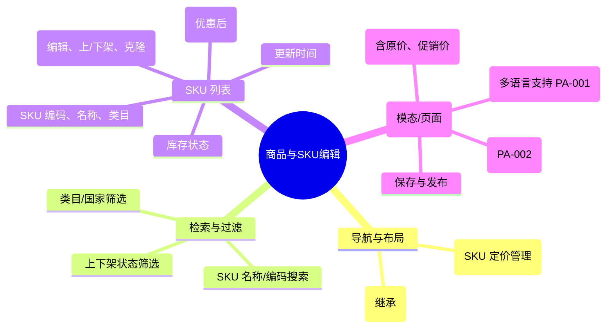

# 商品与SKU编辑

## 0. 页面文档状态

- 文档版本：Draft
- 生成日期：2026-05-13
- 来源文件：`product/release/product-sitemap-release.md`
- 来源 Sitemap 行：
  - 生成顺序：310
  - 页面ID：M-430
  - 父页面ID：M-400
  - 层级：L2
  - Surface：后台管理端
  - Layout 区域：内容区
  - 页面名称：商品与SKU编辑
  - 页面类型：列表与表单
  - Sitemap 页面级MD文件：product/development/pages/310-product-sku-editor.md
- 当前输出文件：product/development/pages/310-product-sku-editor/index.md

## 1. 页面目标与上下文

### 1.1 页面目标

- 页面目的：管理平台可售卖的最小服务单元（SKU），定义其价格、优惠规则、展示描述及库存状态。
- 用户目标：为特定的服务类目（如欧盟商标注册）配置不同规格的定价，并进行上架/下架操作。
- 业务目标：实现灵活的商品定价策略，支持多币种及多语言描述，支撑营销活动的落地。
- 页面成功标准：SKU 信息的准确性及调价操作的便捷性。

### 1.2 页面入口与出口

| 类型 | 来源 / 去向 | 触发条件 | 传入 / 传出数据 | 备注 |
|---|---|---|---|---|
| 入口 | 服务与商品中心 (M-400) | 点击“定价中心” | 无 |  |
| 出口 | SKU 编辑弹窗 | 点击“编辑” | SKU ID |  |

### 1.3 角色与权限

| 角色 | 是否可访问 | 权限条件 | 不满足时页面表现 | 相关 PA/PQ |
|---|---|---|---|---|
| 运营/财务管理员 | 是 | 商品定价权限 | 提示无权限 |  |

### 1.4 全局页面属性

| 属性 | 类型 | 来源 | 默认值 | 影响元素 / 状态 | 说明 |
|---|---|---|---|---|---|
| filter_catalog | string | select | - | 列表过滤 | 按服务类目筛选 |
| filter_status | enum | select | "all" | 列表过滤 | 已上架 / 已下架 |

## 2. 页面结构思维导图



## 3. 页面布局与内容区块

| 区块ID | 区块名称 | 区块类型 | 展示条件 | 包含元素ID | 布局 / 样式定义 | 数据来源 | 相关 PA/PQ |
|---|---|---|---|---|---|---|---|
| S-001 | SKU 搜索筛选 | header | 总是显示 | E-001, E-002 | 水平排列 | API-001 |  |
| S-002 | 数据列表区 | content | 总是显示 | E-003, E-004 | 标准中台表格 | API-002 |  |
| S-003 | SKU 编辑表单 | modal | 点击新增/编辑时 | E-005, E-006 | 垂直表单，多 Tab | API-003 | PA-001 |

## 4. 页面元素清单

| 元素ID | 元素名称 | 元素类型 | 所属区块 | 是否必需 | 展示条件 | 默认文案 / 内容 | 样式定义 | 数据绑定 | 相关 PA/PQ |
|---|---|---|---|---|---|---|---|---|---|
| E-001 | 类目筛选下拉 | select | S-001 | 是 | 总是显示 | 全部类目 | - | filter_catalog |  |
| E-002 | + 新增 SKU | button | S-001 | 是 | 总是显示 | 新增 SKU | 品牌色 | - |  |
| E-003 | SKU 数据表格 | table | S-002 | 是 | 有数据 | - | - | sku_list |  |
| E-004 | 上下架开关 | switch | S-002 | 是 | 总是显示 | - | - | item.status |  |
| E-005 | 价格配置组 | input | S-003 | 是 | 总是显示 | - | 数字输入，带前缀 | sku.price |  |
| E-006 | 多语言切换项 | tab | S-003 | 否 | 总是显示 | 中文 / 英文 | - | language | PA-001 |

## 5. 元素状态矩阵

| 元素ID | 状态 | 触发条件 | 状态来源 | 样式定义 | 可执行动作 | 禁止动作 | 提示文案 / 反馈 | 恢复条件 | 相关 PA/PQ |
|---|---|---|---|---|---|---|---|---|---|
| E-004 | 处理中 | 点击切换时 | - | loading | - | 重复点击 | 正在变更上架状态... | 接口成功 |  |
| E-005 | 异常价提醒 | 现价 > 原价 | sku.sale_price > sku.original_price | 红色警告 | - | - | 现价不可高于原价 | 修正数值 |  |

## 6. 交互 Action 与执行效果

| ActionID | 触发元素ID | 交互名称 | 用户动作 | 前置条件 | 校验规则 | 执行动作 | 成功结果 | 失败结果 | 页面跳转 / 状态变化 | 埋点事件ID | 埋点事件名称 | 不埋点原因 | 相关 PA/PQ |
|---|---|---|---|---|---|---|---|---|---|---|---|---|---|
| ACT-001 | E-002 | 开启创建 | 点击 | - | - | 弹出空白表单 | - | - | - | - | - | 基础操作 |  |
| ACT-002 | E-004 | 上下架切换 | 点击 | - | 二次确认 | 调用状态 API | 状态变更并提示 | - | - | EVT-003 | SKU 状态变更 | - |  |
| ACT-003 | E-006 | 保存 SKU | 点击确认 | 价格校验 | 价格 > 0 | 调用保存 API (API-003) | 列表刷新，提示成功 | 错误提示 | - | EVT-002 | SKU 配置保存 | - |  |

## 7. 埋点事件统计设计

### 7.1 埋点事件总表

| 埋点事件ID | 事件名称 | 事件类型 | 关联元素ID / ActionID | 触发时机 | 统计次数口径 | 去重规则 | 上报时机 | 关键属性 | 成功 / 失败归因 | 漏斗阶段 | 相关 PA/PQ |
|---|---|---|---|---|---|---|---|---|---|---|---|
| EVT-001 | SKU 列表页曝光 | page_view | - | 页面进入 | 每会话 1 次 | sessionId | 实时 | total_sku_count | - | - |  |
| EVT-002 | SKU 编辑成功 | action | ACT-003 | 接口成功 | 每次触发 1 次 | - | 实时 | sku_id, price | - | 系统更新 |  |
| EVT-003 | 上架/下架操作 | action | ACT-002 | 变更成功 | 每次触发 1 次 | - | 实时 | sku_id, status | - | 业务生效 |  |

## 8. 数据结构与接口定义

### 8.1 页面数据模型

| 数据对象 | 字段 | 类型 | 必填 | 来源 | 默认值 | 使用位置 | 说明 |
|---|---|---|---|---|---|---|---|
| SkuItem | id | string | 是 | API | - | - |  |
| SkuItem | code | string | 是 | API | - | E-003 |  |
| SkuItem | name | string | 是 | API | - | E-003 |  |
| SkuItem | price | number | 是 | API | 0.00 | E-003 |  |
| SkuItem | status | boolean | 是 | API | true | E-004 |  |

### 8.2 接口清单

| API ID | 接口名称 | 方法 | 路径 | 触发 ActionID | 请求数据结构 | 返回数据结构 | 成功处理 | 失败处理 | 相关 PA/PQ |
|---|---|---|---|---|---|---|---|---|---|
| API-001 | 获取类目树简表 | GET | /api/admin/catalog/list | 页面加载 | - | {list} | 渲染筛选器 | - |  |
| API-002 | 获取 SKU 列表 | GET | /api/admin/skus/list | 页面加载 | {catalog_id, search, page} | {list, total} | 渲染表格 | - |  |
| API-003 | 保存/更新 SKU | POST | /api/admin/skus/save | ACT-003 | {SkuDetail} | {success} | 刷新并提示 | 错误提示 | PA-001 |

## 9. 边界状态与错误处理

| 场景ID | 场景类型 | 触发条件 | 页面表现 | 元素表现 | 用户可执行操作 | 系统处理 | 兜底文案 | 相关 PA/PQ |
|---|---|---|---|---|---|---|---|---|
| EDGE-001 | 必填项缺失 | 未输入价格即保存 | 输入框红色提示 | - | 补全信息 | - | 请输入有效价格 |  |

## 10. 多媒体与资源

| 资源ID | 资源类型 | 使用位置 | 说明 |
|---|---|---|---|
| 无 | - | - | - |

## 11. 页面假设与待确认统一清单

### 11.1 页面假设清单

| 假设ID | 假设内容 | 首次出现位置 | 影响范围 | 影响元素 / Action / API / 埋点事件 | 置信度 | 用户确认状态 | Release 处理方式 |
|---|---|---|---|---|---|---|---|
| PA-001 | SKU 详情支持多语言版本（中/英），不同语言下可配置不同的名称与描述，但价格全局统一 | 2. 页面结构 | 国际化 | E-006 | 高 | 待用户确认 |  |
| PA-002 | 每个 SKU 可配置关联的“服务承诺”标签（如：最快 24 小时下证），通过勾选已有标签库实现 | 2. 页面结构 | 展示属性 | - | 中 | 待用户确认 |  |

### 11.2 页面待确认清单

| 待确认ID | 待确认问题 | 首次出现位置 | 影响范围 | 影响元素 / Action / API / 埋点事件 | 优先级 | 用户确认结果 | Release 处理方式 |
|---|---|---|---|---|---|---|---|
| PQ-001 | 是否需要支持“多币种”定价（如针对欧盟用户定欧元价格，美国用户定美金价格）？当前假设为本币折算。 | 1.4 全局页面属性 | 业务逻辑 | - | 中 | 待用户确认 |  |

## 12. 用户补充描述

```text
无
```
