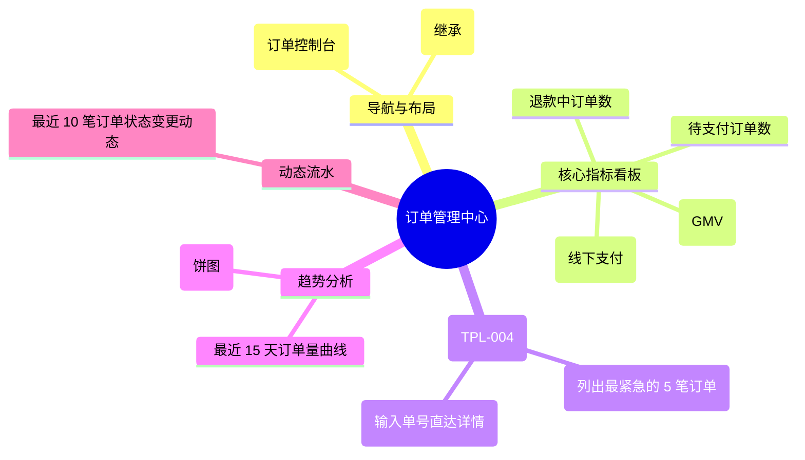

# 订单管理

## 0. 页面文档状态

- 文档版本：Draft
- 生成日期：2026-05-13
- 来源文件：`product/release/product-sitemap-release.md`
- 来源 Sitemap 行：
  - 生成顺序：320
  - 页面ID：M-500
  - 父页面ID：ROOT
  - 层级：L1
  - Surface：后台管理端
  - Layout 区域：侧边导航
  - 页面名称：订单管理
  - 页面类型：首页
  - Sitemap 页面级MD文件：product/development/pages/320-order-admin-center.md
- 当前输出文件：product/development/pages/320-order-admin-center/index.md

## 1. 页面目标与上下文

### 1.1 页面目标

- 页面目的：提供后台管理人员对全平台订单运行状况的监控看板，并作为订单审核、退款处理及支付确认的操作入口。
- 用户目标：快速定位待处理的异常订单（如支付待核销、退款待审），监控当日销售业绩。
- 业务目标：确保订单流转的及时性，降低退款处理的时滞，实现财务对账的初步监控。
- 页面成功标准：待处理订单的当日清减率。

### 1.2 页面入口与出口

| 类型 | 来源 / 去向 | 触发条件 | 传入 / 传出数据 | 备注 |
|---|---|---|---|---|
| 入口 | 侧边导航 | 点击“订单管理” | 无 |  |
| 出口 | 订单列表 (M-510) | 点击统计卡片 | 订单状态过滤 |  |
| 出口 | 订单详情 (M-520) | 点击异常订单 | 订单 ID |  |

### 1.3 角色与权限

| 角色 | 是否可访问 | 权限条件 | 不满足时页面表现 | 相关 PA/PQ |
|---|---|---|---|---|
| 运营主管 / 财务 | 是 | 订单管理权限 | 提示无权限 |  |

### 1.4 全局页面属性

| 属性 | 类型 | 来源 | 默认值 | 影响元素 / 状态 | 说明 |
|---|---|---|---|---|---|
| order_stats | object | API | - | 展示统计数字 |  |

## 2. 页面结构思维导图



## 3. 页面布局与内容区块

| 区块ID | 区块名称 | 区块类型 | 展示条件 | 包含元素ID | 布局 / 样式定义 | 数据来源 | 相关 PA/PQ |
|---|---|---|---|---|---|---|---|
| S-001 | 订单核心看板 | header | 总是显示 | E-001 | 4 列统计卡片 | API-001 |  |
| S-002 | 异常订单工作台 | content | 总是显示 | E-002, E-003 | 两列布局 (列表+快捷查询) | API-002 |  |
| S-003 | 销售趋势图表 | footer | 总是显示 | E-004 | 趋势图展示 | API-003 |  |

## 4. 页面元素清单

| 元素ID | 元素名称 | 元素类型 | 所属区块 | 是否必需 | 展示条件 | 默认文案 / 内容 | 样式定义 | 数据绑定 | 相关 PA/PQ |
|---|---|---|---|---|---|---|---|---|---|
| E-001 | 指标统计组 | list | S-001 | 是 | 总是显示 | 待核销: {n} ... | 橙色/红色强调 | order_stats |  |
| E-002 | 待办订单列表 | table | S-002 | 是 | 有待办时 | - | 紧凑型列表 | pending_orders |  |
| E-003 | 订单号直达 | input | S-002 | 是 | 总是显示 | 输入完整订单号 | 搜索框样式 | search_id |  |
| E-004 | 业务增长趋势 | image | S-003 | 是 | 总是显示 | [折线图占位] | - | chart_data | PA-001 |

## 5. 元素状态矩阵

| 元素ID | 状态 | 触发条件 | 状态来源 | 样式定义 | 可执行动作 | 禁止动作 | 提示文案 / 反馈 | 恢复条件 | 相关 PA/PQ |
|---|---|---|---|---|---|---|---|---|---|
| E-001 | 紧急提醒 | 待办数 > 20 | stats.pending > 20 | 闪烁或红色 | - | - | 待处理积压 | 处理后数值下降 |  |

## 6. 交互 Action 与执行效果

| ActionID | 触发元素ID | 交互名称 | 用户动作 | 前置条件 | 校验规则 | 执行动作 | 成功结果 | 失败结果 | 页面跳转 / 状态变化 | 埋点事件ID | 埋点事件名称 | 不埋点原因 | 相关 PA/PQ |
|---|---|---|---|---|---|---|---|---|---|---|---|---|---|
| ACT-001 | E-001 | 列表下钻 | 点击指标卡片 | - | - | 导航 | - | - | 跳转 M-510 | - | - | 基础跳转 |  |
| ACT-002 | E-003 | 订单直达 | 回车或点击搜索 | 输入不为空 | 格式校验 | 查询并跳转 | 进入 M-520 | 提示单号不存在 | 跳转 M-520 | EVT-002 | 订单快速检索 | - |  |

## 7. 埋点事件统计设计

### 7.1 埋点事件总表

| 埋点事件ID | 事件名称 | 事件类型 | 关联元素ID / ActionID | 触发时机 | 统计次数口径 | 去重规则 | 上报时机 | 关键属性 | 成功 / 失败归因 | 漏斗阶段 | 相关 PA/PQ |
|---|---|---|---|---|---|---|---|---|---|---|---|
| EVT-001 | 订单中心曝光 | page_view | - | 页面进入 | 每会话 1 次 | sessionId | 实时 | total_gmv | - | - |  |
| EVT-002 | 快速检索尝试 | action | ACT-002 | 触发搜索 | 每次触发 1 次 | - | 实时 | result_found | - | 转化 |  |

## 8. 数据结构与接口定义

### 8.1 页面数据模型

| 数据对象 | 字段 | 类型 | 必填 | 来源 | 默认值 | 使用位置 | 说明 |
|---|---|---|---|---|---|---|---|
| OrderStats | total_gmv | number | 是 | API | 0.00 | E-001 |  |
| OrderStats | pending_audit | number | 是 | API | 0 | E-001 | 线下支付待审 |
| OrderStats | refunding | number | 是 | API | 0 | E-001 | 退款中 |

### 8.2 接口清单

| API ID | 接口名称 | 方法 | 路径 | 触发 ActionID | 请求数据结构 | 返回数据结构 | 成功处理 | 失败处理 | 相关 PA/PQ |
|---|---|---|---|---|---|---|---|---|---|
| API-001 | 获取订单概览数据 | GET | /api/admin/orders/summary | 页面加载 | - | {OrderStats} | 渲染看板 | - |  |
| API-002 | 获取待办订单简表 | GET | /api/admin/orders/pending | 页面加载 | {limit} | {OrderList} | 渲染列表 | - |  |

## 9. 边界状态与错误处理

| 场景ID | 场景类型 | 触发条件 | 页面表现 | 元素表现 | 用户可执行操作 | 系统处理 | 兜底文案 | 相关 PA/PQ |
|---|---|---|---|---|---|---|---|---|
| EDGE-001 | 搜索无结果 | 输入错误单号 | 提示无此订单 | - | 重新输入 | - | 未查询到该订单信息，请确认单号 |  |

## 10. 多媒体与资源

| 资源ID | 资源类型 | 使用位置 | 说明 |
|---|---|---|---|
| M-001 | chart | S-003 | 订单趋势折线图 |

## 11. 页面假设与待确认统一清单

### 11.1 页面假设清单

| 假设ID | 假设内容 | 首次出现位置 | 影响范围 | 影响元素 / Action / API / 埋点事件 | 置信度 | 用户确认状态 | Release 处理方式 |
|---|---|---|---|---|---|---|---|
| PA-001 | 图表库采用 ECharts 或类似方案，后台仅下发 JSON 数据，前端完成渲染 | 2. 页面结构 | 图表展示 | E-004 | 高 | 待用户确认 |  |

### 11.2 页面待确认清单

| 待确认ID | 待确认问题 | 首次出现位置 | 影响范围 | 影响元素 / Action / API / 埋点事件 | 优先级 | 用户确认结果 | Release 处理方式 |
|---|---|---|---|---|---|---|---|
| PQ-001 | 是否需要展示“区域销售分布图”？当前 MVP 仅展示总体趋势。 | 2. 页面结构 | UI 深度 | - | 低 | 待用户确认 |  |

## 12. 用户补充描述

```text
无
```
