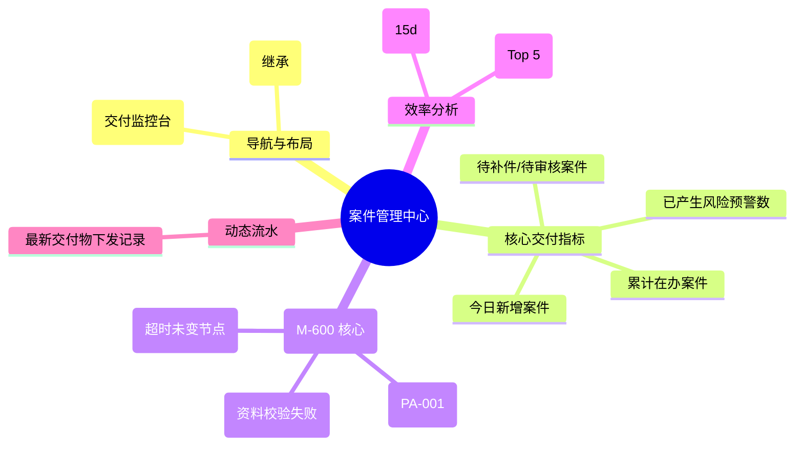

# 案件管理

## 0. 页面文档状态

- 文档版本：Draft
- 生成日期：2026-05-13
- 来源文件：`product/release/product-sitemap-release.md`
- 来源 Sitemap 行：
  - 生成顺序：350
  - 页面ID：M-600
  - 父页面ID：ROOT
  - 层级：L1
  - Surface：后台管理端
  - Layout 区域：侧边导航
  - 页面名称：案件管理
  - 页面类型：首页
  - Sitemap 页面级MD文件：product/development/pages/350-case-admin-center.md
- 当前输出文件：product/development/pages/350-case-admin-center/index.md

## 1. 页面目标与上下文

### 1.1 页面目标

- 页面目的：提供案件全生命周期的数字化运营看板，实时监控案件交付质量、响应效率及合规风险。
- 用户目标：查看全局及各服务专家的案件积压情况，快速处理风险预警案件。
- 业务目标：通过精细化管理缩短服务周期，降低案件超时率，提升客户满意度。
- 页面成功标准：风险案件的平均响应时长及各阶段转化率。

### 1.2 页面入口与出口

| 类型 | 来源 / 去向 | 触发条件 | 传入 / 传出数据 | 备注 |
|---|---|---|---|---|
| 入口 | 侧边导航 | 点击“案件管理” | 无 |  |
| 出口 | 案件列表 (M-610) | 点击统计卡片 | 案件状态过滤 |  |
| 出口 | 案件详情 (M-620) | 点击特定风险项 | 案件 ID |  |

### 1.3 角色与权限

| 角色 | 是否可访问 | 权限条件 | 不满足时页面表现 | 相关 PA/PQ |
|---|---|---|---|---|
| 交付经理 / 专家主管 | 是 | 案件监控权限 | 提示无权限 |  |

### 1.4 全局页面属性

| 属性 | 类型 | 来源 | 默认值 | 影响元素 / 状态 | 说明 |
|---|---|---|---|---|---|
| case_stats | object | API | - | 看板数据渲染 |  |

## 2. 页面结构思维导图



## 3. 页面布局与内容区块

| 区块ID | 区块名称 | 区块类型 | 展示条件 | 包含元素ID | 布局 / 样式定义 | 数据来源 | 相关 PA/PQ |
|---|---|---|---|---|---|---|---|
| S-001 | 交付核心看板 | header | 总是显示 | E-001 | 4 列数据卡片 | API-001 |  |
| S-002 | 风险监控工作台 | content | 总是显示 | E-002 | 异常状态列表 | API-002 |  |
| S-003 | 效能分析图表 | footer | 总是显示 | E-003, E-004 | 趋势图与排行榜 | API-003 |  |

## 4. 页面元素清单

| 元素ID | 元素名称 | 元素类型 | 所属区块 | 是否必需 | 展示条件 | 默认文案 / 内容 | 样式定义 | 数据绑定 | 相关 PA/PQ |
|---|---|---|---|---|---|---|---|---|---|
| E-001 | 交付指标汇总 | list | S-001 | 是 | 总是显示 | 风险案件: {n} ... | 红色强调风险 | case_stats |  |
| E-002 | 高风险案件流 | table | S-002 | 是 | 有风险时 | - | 紧凑型列表 | risk_cases |  |
| E-003 | 专家负荷排行 | image | S-003 | 是 | 总是显示 | [柱状图占位] | - | load_rank |  |
| E-004 | 周期分析曲线 | image | S-003 | 是 | 总是显示 | [趋势图占位] | - | cycle_chart |  |

## 5. 元素状态矩阵

| 元素ID | 状态 | 触发条件 | 状态来源 | 样式定义 | 可执行动作 | 禁止动作 | 提示文案 / 反馈 | 恢复条件 | 相关 PA/PQ |
|---|---|---|---|---|---|---|---|---|---|
| E-002 | 闪烁状态 | 严重停滞 > 7d | - | 呼吸灯效果 | 点击指派/催办 | - | 严重积压 | 状态更新 |  |

## 6. 交互 Action 与执行效果

| ActionID | 触发元素ID | 交互名称 | 用户动作 | 前置条件 | 校验规则 | 执行动作 | 成功结果 | 失败结果 | 页面跳转 / 状态变化 | 埋点事件ID | 埋点事件名称 | 不埋点原因 | 相关 PA/PQ |
|---|---|---|---|---|---|---|---|---|---|---|---|---|---|
| ACT-001 | E-001 | 下钻列表 | 点击统计项 | - | - | 导航 | - | - | 跳转 M-610 | - | - | 基础跳转 |  |
| ACT-002 | E-002 | 快速处理 | 点击风险行 | - | - | 导航至详情 | - | - | 跳转 M-620 | EVT-002 | 风险响应点击 | - |  |

## 7. 埋点事件统计设计

### 7.1 埋点事件总表

| 埋点事件ID | 事件名称 | 事件类型 | 关联元素ID / ActionID | 触发时机 | 统计次数口径 | 去重规则 | 上报时机 | 关键属性 | 成功 / 失败归因 | 漏斗阶段 | 相关 PA/PQ |
|---|---|---|---|---|---|---|---|---|---|---|---|
| EVT-001 | 案件中心曝光 | page_view | - | 页面进入 | 每会话 1 次 | sessionId | 实时 | total_cases | - | - |  |
| EVT-002 | 风险案件点击 | click | E-002 | 点击 | 每次触发 1 次 | - | 实时 | case_id, risk_type | - | 运营干预 |  |

## 8. 数据结构与接口定义

### 8.1 页面数据模型

| 数据对象 | 字段 | 类型 | 必填 | 来源 | 默认值 | 使用位置 | 说明 |
|---|---|---|---|---|---|---|---|
| CaseStats | online_total | number | 是 | API | 0 | E-001 |  |
| CaseStats | risk_total | number | 是 | API | 0 | E-001 |  |
| CaseStats | pending_review | number | 是 | API | 0 | E-001 |  |

### 8.2 接口清单

| API ID | 接口名称 | 方法 | 路径 | 触发 ActionID | 请求数据结构 | 返回数据结构 | 成功处理 | 失败处理 | 相关 PA/PQ |
|---|---|---|---|---|---|---|---|---|---|
| API-001 | 获取案件看板指标 | GET | /api/admin/cases/summary | 页面加载 | - | {CaseStats} | 渲染看板 | - |  |
| API-002 | 获取高风险预警列表 | GET | /api/admin/cases/risks | 页面加载 | {limit} | {RiskCase[]} | 渲染列表 | - |  |

## 9. 边界状态与错误处理

| 场景ID | 场景类型 | 触发条件 | 页面表现 | 元素表现 | 用户可执行操作 | 系统处理 | 兜底文案 | 相关 PA/PQ |
|---|---|---|---|---|---|---|---|---|
| EDGE-001 | 无风险数据 | 系统运行极度流畅 | 显示“暂无风险” | - | - | - | 暂无需要关注的风险案件 |  |

## 10. 多媒体与资源

| 资源ID | 资源类型 | 使用位置 | 说明 |
|---|---|---|---|
| M-001 | chart | S-003 | 负荷排行柱状图 |

## 11. 页面假设与待确认统一清单

### 11.1 页面假设清单

| 假设ID | 假设内容 | 首次出现位置 | 影响范围 | 影响元素 / Action / API / 埋点事件 | 置信度 | 用户确认状态 | Release 处理方式 |
|---|---|---|---|---|---|---|---|
| PA-001 | 官费欠费提醒依赖于专家手动标记或与官费对账系统对接，MVP 阶段假设为手动标记触发 | 2. 页面结构 | 功能逻辑 | - | 中 | 确认 | 更新到正式，手动触发 |

### 11.2 页面待确认清单

| 待确认ID | 待确认问题 | 首次出现位置 | 影响范围 | 影响元素 / Action / API / 埋点事件 | 优先级 | 用户确认结果 | Release 处理方式 |
|---|---|---|---|---|---|---|---|
| PQ-001 | 是否需要集成“交付大屏”模式？（即全屏展示自动刷新的看板）。 | 2. 页面结构 | UI 深度 | - | 低 | 确认 | 不需要 |

## 12. 用户补充描述

```text
无
```
