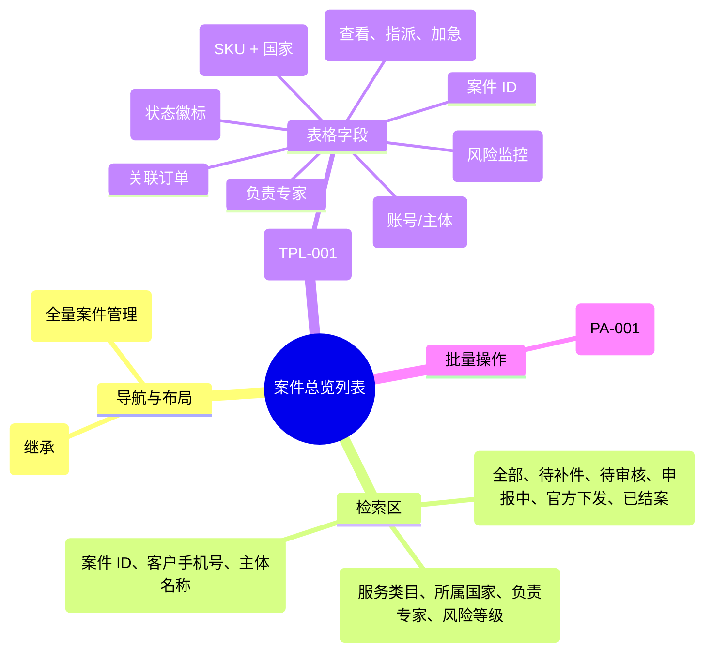

# 案件总览

## 0. 页面文档状态

- 文档版本：Draft
- 生成日期：2026-05-13
- 来源文件：`product/release/product-sitemap-release.md`
- 来源 Sitemap 行：
  - 生成顺序：360
  - 页面ID：M-610
  - 父页面ID：M-600
  - 层级：L2
  - Surface：后台管理端
  - Layout 区域：内容区
  - 页面名称：案件总览
  - 页面类型：列表
  - Sitemap 页面级MD文件：product/development/pages/360-case-admin-list.md
- 当前输出文件：product/development/pages/360-case-admin-list/index.md

## 1. 页面目标与上下文

### 1.1 页面目标

- 页面目的：提供全量服务案件的集中管理视图，支持交付经理、专家根据案件状态、所属国家、负责专家进行多维检索与指派。
- 用户目标：快速查找特定案件的进度，批量处理案件的专家分配变更。
- 业务目标：实现案件处理进度的透明化，支撑高负荷情况下的案件调拨。
- 页面成功标准：列表检索的覆盖率及指派操作的效率。

### 1.2 页面入口与出口

| 类型 | 来源 / 去向 | 触发条件 | 传入 / 传出数据 | 备注 |
|---|---|---|---|---|
| 入口 | 案件管理中心 (M-600) | 点击统计卡片 | 过滤条件 |  |
| 入口 | 侧边导航 | 点击“案件总览” | 无 |  |
| 出口 | 案件详情维护 (M-620) | 点击单号或详情 | 案件 ID |  |

### 1.3 角色与权限

| 角色 | 是否可访问 | 权限条件 | 不满足时页面表现 | 相关 PA/PQ |
|---|---|---|---|---|
| 交付经理 / 专家 | 是 | 案件查看/操作权限 | 提示无权限 |  |

### 1.4 全局页面属性

| 属性 | 类型 | 来源 | 默认值 | 影响元素 / 状态 | 说明 |
|---|---|---|---|---|---|
| filter_expert | string | select | "all" | 列表数据 | 按负责专家筛选 |
| filter_node | string | select | "all" | 列表数据 | 按当前节点筛选 |

## 2. 页面结构思维导图



## 3. 页面布局与内容区块

| 区块ID | 区块名称 | 区块类型 | 展示条件 | 包含元素ID | 布局 / 样式定义 | 数据来源 | 相关 PA/PQ |
|---|---|---|---|---|---|---|---|
| S-001 | 案件状态快速切换 | header | 总是显示 | E-001 | 水平 Tab | - |  |
| S-002 | 组合搜索与筛选栏 | header | 总是显示 | E-002 | 多行弹性布局 | - |  |
| S-003 | 案件数据表格 | content | 总是显示 | E-003, E-004 | 标准中台表格样式 | API-001 |  |

## 4. 页面元素清单

| 元素ID | 元素名称 | 元素类型 | 所属区块 | 是否必需 | 展示条件 | 默认文案 / 内容 | 样式定义 | 数据绑定 | 相关 PA/PQ |
|---|---|---|---|---|---|---|---|---|---|
| E-001 | 案件状态 Tab | tab | S-001 | 是 | 总是显示 | 全部 / 待补件 / ... | 品牌激活样式 | filter_status |  |
| E-002 | 关键词搜索框 | input | S-002 | 是 | 总是显示 | 搜索案件 ID/手机号 | - | search_key |  |
| E-003 | 案件列表表格 | table | S-003 | 是 | 有数据 | - | - | case_list |  |
| E-004 | 专家指派按钮 | button | S-003 | 否 | 有指派权限 | 指派 | 描边按钮 | - | PA-001 |
| E-005 | 批量指派入口 | button | S-002 | 否 | 选中多行时 | 批量指派专家 | 品牌色按钮 | - | PA-001 |

## 5. 元素状态矩阵

| 元素ID | 状态 | 触发条件 | 状态来源 | 样式定义 | 可执行动作 | 禁止动作 | 提示文案 / 反馈 | 恢复条件 | 相关 PA/PQ |
|---|---|---|---|---|---|---|---|---|---|
| E-003 | 风险行标记 | risk_level == 'high' | item.risk | 浅红色底色 | - | - | 该案件存在超时风险 | - |  |
| E-005 | 禁用态 | 未选中任何行 | selected_count == 0 | 置灰 | - | 点击 | 请先勾选案件 | 勾选后恢复 |  |

## 6. 交互 Action 与执行效果

| ActionID | 触发元素ID | 交互名称 | 用户动作 | 前置条件 | 校验规则 | 执行动作 | 成功结果 | 失败结果 | 页面跳转 / 状态变化 | 埋点事件ID | 埋点事件名称 | 不埋点原因 | 相关 PA/PQ |
|---|---|---|---|---|---|---|---|---|---|---|---|---|---|
| ACT-001 | E-001 | 状态过滤 | 点击 Tab | - | - | 刷新列表数据 | - | - | URL 参数同步 | - | - | 基础筛选 |  |
| ACT-002 | E-004 | 单个指派 | 点击“指派” | - | - | 弹出专家选择弹窗 | - | - | - | EVT-002 | 专家指派操作 | - |  |
| ACT-003 | E-005 | 批量指派 | 点击 | 已选中案件 | 专家在线 | 批量更新负责人 | 列表刷新并提示成功 | 提示指派失败 | - | EVT-002 | 专家指派操作 | - | PA-001 |

## 7. 埋点事件统计设计

### 7.1 埋点事件总表

| 埋点事件ID | 事件名称 | 事件类型 | 关联元素ID / ActionID | 触发时机 | 统计次数口径 | 去重规则 | 上报时机 | 关键属性 | 成功 / 失败归因 | 漏斗阶段 | 相关 PA/PQ |
|---|---|---|---|---|---|---|---|---|---|---|---|
| EVT-001 | 案件列表曝光 | page_view | - | 页面进入 | 每会话 1 次 | sessionId | 实时 | filter_status, expert_id | - | - |  |
| EVT-002 | 专家指派成功 | action | ACT-002/003 | 接口成功 | 每次触发 1 次 | - | 实时 | case_count, target_expert | - | 任务分配 |  |

## 8. 数据结构与接口定义

### 8.1 页面数据模型

| 数据对象 | 字段 | 类型 | 必填 | 来源 | 默认值 | 使用位置 | 说明 |
|---|---|---|---|---|---|---|---|
| CaseListItem | id | string | 是 | API | - | E-003 |  |
| CaseListItem | product_name | string | 是 | API | - | E-003 | SKU + 国家 |
| CaseListItem | current_node | string | 是 | API | - | E-003 | 节点显示名称 |
| CaseListItem | expert_name | string | 是 | API | - | E-003 | 负责专家姓名 |
| CaseListItem | stay_hours | number | 是 | API | 0 | E-003 | 当前节点停留时长 (h) |

### 8.2 接口清单

| API ID | 接口名称 | 方法 | 路径 | 触发 ActionID | 请求数据结构 | 返回数据结构 | 成功处理 | 失败处理 | 相关 PA/PQ |
|---|---|---|---|---|---|---|---|---|---|
| API-001 | 获取案件列表 | GET | /api/admin/cases/list | 页面加载 | {page, limit, filter_params} | {list, total} | 渲染表格 | - |  |
| API-002 | 批量指派专家 | POST | /api/admin/cases/assign | ACT-003 | {case_ids, target_expert_id} | {success} | 刷新并提示 | 报错提示 | PA-001 |

## 9. 边界状态与错误处理

| 场景ID | 场景类型 | 触发条件 | 页面表现 | 元素表现 | 用户可执行操作 | 系统处理 | 兜底文案 | 相关 PA/PQ |
|---|---|---|---|---|---|---|---|---|
| EDGE-001 | 检索无结果 | 搜索不存在的 ID | 显示空状态图 | - | 重置筛选 | - | 未找到匹配的案件信息 |  |

## 10. 多媒体与资源

| 资源ID | 资源类型 | 使用位置 | 说明 |
|---|---|---|---|
| 无 | - | - | - |

## 11. 页面假设与待确认统一清单

### 11.1 页面假设清单

| 假设ID | 假设内容 | 首次出现位置 | 影响范围 | 影响元素 / Action / API / 埋点事件 | 置信度 | 用户确认状态 | Release 处理方式 |
|---|---|---|---|---|---|---|---|
| PA-001 | 批量指派功能仅支持将选中的案件统一指派给“一个”选定的专家，不支持分配给多个不同专家 | 2. 页面结构 | 交互逻辑 | E-005, API-002 | 高 | 确认 | 不支持批量指派 |

### 11.2 页面待确认清单

| 待确认ID | 待确认问题 | 首次出现位置 | 影响范围 | 影响元素 / Action / API / 埋点事件 | 优先级 | 用户确认结果 | Release 处理方式 |
|---|---|---|---|---|---|---|---|
| PQ-001 | 是否需要记录“案件催办（Expedite）”的次数？当前仅支持展示加急标记。 | 4. 页面元素清单 | 数据统计 | - | 低 | 确认 | 不需要 |

## 12. 用户补充描述

```text
无
```
