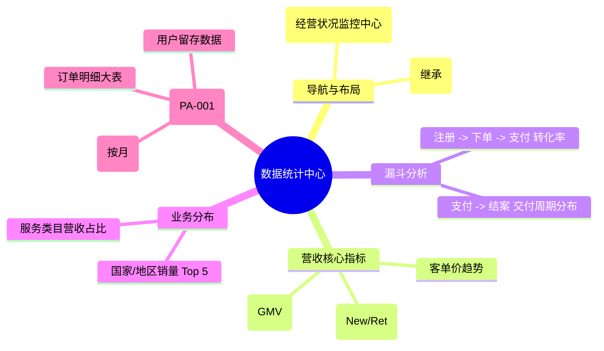

# 数据统计中心

## 0. 页面文档状态

- 文档版本：Draft
- 生成日期：2026-05-13
- 来源文件：`product/release/product-sitemap-release.md`
- 来源 Sitemap 行：
  - 生成顺序：430
  - 页面ID：M-800
  - 父页面ID：ROOT
  - 层级：L1
  - Surface：后台管理端
  - Layout 区域：侧边导航
  - 页面名称：数据统计
  - 页面类型：看板
  - Sitemap 页面级MD文件：product/development/pages/430-analytics-center.md
- 当前输出文件：product/development/pages/430-analytics-center/index.md

## 1. 页面目标与上下文

### 1.1 页面目标

- 页面目的：提供全平台的经营数据监控、漏斗转化分析及财务报表汇总，支持通过图形化界面发现业务增长点及交付瓶颈。
- 用户目标：查看本月 GMV 完成进度、各国家服务占比及销售转化率趋势。
- 业务目标：通过数据驱动决策，优化商品结构及专家排班，提升整体盈利能力。
- 页面成功标准：看板数据的实时性及报表导出的准确性。

### 1.2 页面入口与出口

| 类型 | 来源 / 去向 | 触发条件 | 传入 / 传出数据 | 备注 |
|---|---|---|---|---|
| 入口 | 侧边导航 | 点击“数据统计” | 无 |  |
| 出口 | 销售与服务统计 (M-810) | 点击详情 | 时间维度/维度 ID |  |

### 1.3 角色与权限

| 角色 | 是否可访问 | 权限条件 | 不满足时页面表现 | 相关 PA/PQ |
|---|---|---|---|---|
| CEO / 运营总监 / 财务主管 | 是 | 全量数据查看权限 | 提示无权限 |  |

### 1.4 全局页面属性

| 属性 | 类型 | 来源 | 默认值 | 影响元素 / 状态 | 说明 |
|---|---|---|---|---|---|
| date_range | array | daterange | [today-30, today] | 所有图表 |  |

## 2. 页面结构思维导图



## 3. 页面布局与内容区块

| 区块ID | 区块名称 | 区块类型 | 展示条件 | 包含元素ID | 布局 / 样式定义 | 数据来源 | 相关 PA/PQ |
|---|---|---|---|---|---|---|---|
| S-001 | 经营核心看板 | header | 总是显示 | E-001 | 4 列大数据卡片 | API-001 |  |
| S-002 | 趋势与分布图表 | content | 总是显示 | E-002, E-003 | 两列布局 (趋势图+饼图) | API-002 |  |
| S-003 | 数据导出任务 | footer | 总是显示 | E-004 | 任务列表样式 | API-003 | PA-001 |

## 4. 页面元素清单

| 元素ID | 元素名称 | 元素类型 | 所属区块 | 是否必需 | 展示条件 | 默认文案 / 内容 | 样式定义 | 数据绑定 | 相关 PA/PQ |
|---|---|---|---|---|---|---|---|---|---|
| E-001 | 指标汇总项 | list | S-001 | 是 | 总是显示 | GMV: {n} (↑5%) | 绿色/红色升降标 | main_stats |  |
| E-002 | 营收走势图 | image | S-002 | 是 | 总是显示 | [折线图] | - | sales_trend |  |
| E-003 | 地区分布饼图 | image | S-002 | 是 | 总是显示 | [饼图] | - | region_dist |  |
| E-004 | 导出任务列表 | table | S-003 | 否 | 有任务时 | - | 紧凑型 | export_tasks | PA-001 |

## 5. 元素状态矩阵

| 元素ID | 状态 | 触发条件 | 状态来源 | 样式定义 | 可执行动作 | 禁止动作 | 提示文案 / 反馈 | 恢复条件 | 相关 PA/PQ |
|---|---|---|---|---|---|---|---|---|---|
| E-004 | 下载中 | 任务正在生成 | - | 进度条 | - | - | 正在准备数据，预计耗时 1min | 任务完成 |  |

## 6. 交互 Action 与执行效果

| ActionID | 触发元素ID | 交互名称 | 用户动作 | 前置条件 | 校验规则 | 执行动作 | 成功结果 | 失败结果 | 页面跳转 / 状态变化 | 埋点事件ID | 埋点事件名称 | 不埋点原因 | 相关 PA/PQ |
|---|---|---|---|---|---|---|---|---|---|---|---|---|---|
| ACT-001 | E-001 | 查看趋势 | 点击卡片 | - | - | 导航 | - | - | 跳转 M-810 | - | - | 基础跳转 |  |
| ACT-002 | E-005 | 创建导出 | 点击“导出报表” | 选择时间 | - | 调用导出任务接口 | 列表中出现新任务 | 报错提示 | - | EVT-002 | 数据报表导出 | - | PA-001 |

## 7. 埋点事件统计设计

### 7.1 埋点事件总表

| 埋点事件ID | 事件名称 | 事件类型 | 关联元素ID / ActionID | 触发时机 | 统计次数口径 | 去重规则 | 上报时机 | 关键属性 | 成功 / 失败归因 | 漏斗阶段 | 相关 PA/PQ |
|---|---|---|---|---|---|---|---|---|---|---|---|
| EVT-001 | 数据中心曝光 | page_view | - | 页面进入 | 每会话 1 次 | sessionId | 实时 | date_range | - | - |  |
| EVT-002 | 报表导出行为 | action | ACT-002 | 任务创建成功 | 每次触发 1 次 | - | 实时 | report_type | - | 数据审计 |  |

## 8. 数据结构与接口定义

### 8.1 页面数据模型

| 数据对象 | 字段 | 类型 | 必填 | 来源 | 默认值 | 使用位置 | 说明 |
|---|---|---|---|---|---|---|---|
| MainStats | gmv | number | 是 | API | 0.00 | E-001 |  |
| MainStats | pay_users | number | 是 | API | 0 | E-001 |  |
| ExportTask | task_id | string | 是 | API | - | E-004 |  |
| ExportTask | status | enum | 是 | API | "pending" | E-004 | pending/doing/done/fail |

### 8.2 接口清单

| API ID | 接口名称 | 方法 | 路径 | 触发 ActionID | 请求数据结构 | 返回数据结构 | 成功处理 | 失败处理 | 相关 PA/PQ |
|---|---|---|---|---|---|---|---|---|---|
| API-001 | 获取核心指标 | GET | /api/admin/analytics/main | 页面加载 | {date_range} | {MainStats} | 渲染看板 | - |  |
| API-002 | 获取营收趋势图 | GET | /api/admin/analytics/trend | 页面加载 | {date_range} | {ChartData} | 渲染图表 | - |  |
| API-003 | 创建异步导出任务 | POST | /api/admin/analytics/export | ACT-002 | {type, date_range} | {task_id} | 刷新任务列表 | 报错提示 | PA-001 |

## 9. 边界状态与错误处理

| 场景ID | 场景类型 | 触发条件 | 页面表现 | 元素表现 | 用户可执行操作 | 系统处理 | 兜底文案 | 相关 PA/PQ |
|---|---|---|---|---|---|---|---|---|
| EDGE-001 | 无权限导出 | 敏感财务数据 | 导出按钮禁用 | - | - | - | 您无权导出详细财务报表 |  |

## 10. 多媒体与资源

| 资源ID | 资源类型 | 使用位置 | 说明 |
|---|---|---|---|
| M-001 | chart | S-002 | 营收走势折线图 |

## 11. 页面假设与待确认统一清单

### 11.1 页面假设清单

| 假设ID | 假设内容 | 首次出现位置 | 影响范围 | 影响元素 / Action / API / 埋点事件 | 置信度 | 用户确认状态 | Release 处理方式 |
|---|---|---|---|---|---|---|---|
| PA-001 | 数据导出采用“异步任务”模式，用户点击导出后可关闭页面，稍后在任务中心下载生成的 Excel 文件 | 2. 页面结构 | 功能逻辑 | E-004 | 高 | 确认 | 不需要导出功能 |

### 11.2 页面待确认清单

| 待确认ID | 待确认问题 | 首次出现位置 | 影响范围 | 影响元素 / Action / API / 埋点事件 | 优先级 | 用户确认结果 | Release 处理方式 |
|---|---|---|---|---|---|---|---|
| PQ-001 | 数据中心是否需要支持“实时大屏（Real-time Dashboard）”模式？当前假设为分钟级刷新。 | 1.1 页面目标 | UI 深度 | - | 低 | 确认 | 不需要 |

## 12. 用户补充描述

```text
无
```
