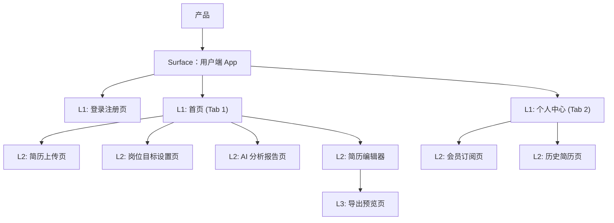

# 产品综述文档模板

> 使用方式：复制本结构生成 `product/development/product-overview-draft.md`。不确定内容必须标记为带 ID 的 `假设 A-xxx` 或 `待确认 Q-xxx`，并在文档末尾统一汇总。

## 0. 文档状态

- 文档版本：Draft
- 生成日期：2026-05-11
- 产品名称：AI 简历优化 App
- 输入来源：用户自然语言描述
- 当前结论可信度：中
- 假设 / 待确认编号规则：
  - 假设：`A-001` 起，按首次出现顺序递增。
  - 待确认：`Q-001` 起，按首次出现顺序递增。

## 1. 产品综合介绍

### 1.1 产品定位

- 产品类型：App
- 一句话定位：一款利用 AI 技术帮助求职者分析、优化并生成专业简历的移动端应用。
- 核心价值：通过 AI 自动分析简历与目标岗位的匹配度，提供针对性修改建议并一键优化排版，提升求职成功率。
- 目标用户：即将毕业的大学生、寻求转行的职场人、需要优化简历的求职者。
- 使用场景：求职准备阶段、面试前简历打磨阶段。

### 1.2 核心业务目标

- 业务目标 1：提供准确、有价值的 AI 简历分析与优化建议，提升用户求职效率。
- 业务目标 2：通过增值服务（高级模板、无限次 AI 优化等）实现会员订阅变现。
- 业务目标 3：沉淀用户简历与岗位数据，持续优化 AI 模型分析能力。
- 成功指标：注册转化率、简历分析完成率、会员订阅转化率（引用 A-004）。

### 1.3 核心用户路径

1. 路径名称：简历 AI 优化核心路径
   - 触发入口：App 首页 "开启优化"
   - 关键步骤：上传原简历 -> 设置目标岗位 -> 等待 AI 分析 -> 查看 AI 分析报告 -> 在线编辑/采纳建议 -> 生成最终简历 -> 导出 PDF。
   - 完成状态：成功保存并导出优化后的简历 PDF。
   - 失败 / 异常状态：文件格式不支持（引用 Q-001）、AI 分析超时、非会员超出免费额度提示（引用 Q-002）。

### 1.4 页面范围

- MVP 页面范围：登录注册页、首页、简历上传页、岗位目标设置页、AI 分析报告页、简历编辑器、导出预览页、个人中心、会员订阅页、历史简历页。
- 非 MVP / 后续页面范围：求职社区、面试辅导、职位投递。
- 不包含范围：PC 端 Web 求职者后台。

### 1.5 功能范围

- 核心功能：简历上传与解析、目标岗位匹配度分析、AI 优化建议生成、简历编辑与排版、导出 PDF。
- 支撑功能：手机号登录/注册（引用 A-001）、简历历史记录（引用 A-005）。
- 管理功能：个人资料管理、会员订单管理。
- 集成能力：第三方支付（引用 A-004）、文档解析服务。

### 1.6 角色与权限

| 角色 | 角色说明 | 可访问范围 | 关键权限 | 假设 / 待确认ID |
|---|---|---|---|---|
| 游客 | 未登录用户 | 首页、登录注册页 | 浏览功能介绍、注册/登录 | |
| 普通用户 | 已登录但未订阅会员 | App 所有基础页面 | 基础简历上传、受限次数的 AI 分析、基础模板导出 | Q-002 |
| VIP 会员 | 购买订阅的用户 | App 所有页面 | 无限次 AI 分析、高级编辑功能、无水印 PDF 导出、高级模板 | A-003 |
| 管理员 | 平台运营人员 | 后台管理系统（预留） | 用户管理、订单管理、系统设置 | Q-003 |

### 1.7 关键操作

| 操作 | 操作角色 | 所属页面 / 模块 | 输入 | 输出 | 规则 / 限制 |
|---|---|---|---|---|---|
| 上传简历 | 用户 | 简历上传页 | 本地文档文件 | 简历文本数据提取 | 仅支持 PDF, DOC/DOCX，大小限制 20MB（假设 A-002） |
| 设置岗位 | 用户 | 岗位设置页 | 岗位名称、行业、薪资要求 | 匹配分析参数 | |
| 生成分析 | 用户 | AI 分析报告页 | 简历数据 + 岗位参数 | 匹配度评分、修改建议卡片 | 非 VIP 用户可能受限（待确认 Q-002） |
| 应用建议 | 用户 | 简历编辑器 | 用户的采纳操作 | 更新的简历内容 | |
| 导出 PDF | 用户 | 导出/预览页 | 排版后简历 | PDF 文件下载 / 分享 | VIP 可使用无水印/高级模板（假设 A-003） |
| 开通会员 | 用户 | 会员订阅页 | 支付确认 | 会员权益激活 | 调用三方支付（假设 A-004） |

### 1.8 商业化与运营能力

- 商业化模式：连续包月/包年会员订阅、单次 AI 优化付费。
- 订阅 / 会员：提供 VIP 会员服务（假设 A-003）。
- 支付 / 退款：支持 Apple Pay、微信支付、支付宝（假设 A-004）。
- 通知渠道：App 内部 Push 通知。
- 审核机制：暂不需要人工审核内容。
- 管理后台：需要基础的用户、订单、反馈管理后台（待确认 Q-003）。
- 数据分析：基础的埋点分析（转化漏斗、活跃度）。
- 相关假设 / 待确认ID：A-003, A-004, Q-003。

## 2. Sitemap / 信息架构

### 2.1 主要布局形态 Layout

- Layout 类型：移动端 App (底部 Tab 导航 + 层级推入页面)
- 全局导航：底部 Tab（首页、个人中心）
- 全局操作区：各个页面的顶部 Navigation Bar
- 登录态 / 未登录态差异：所有核心功能强制要求登录态。
- 多端 / 多角色布局差异：无
- Surface 划分：用户端 App
- Sitemap 生成原则：
  - 表格为后续页面级 skill 的唯一清单来源。
  - 每一行对应一个需要生成或确认的页面 / 子页面 / 子视图。
  - `页面ID`、`父页面ID`、`层级`、`生成顺序` 必须稳定、完整、可机读。

### 2.2 Sitemap 可视化

> 使用 Mermaid 展示与下方表格一致的父子层级。不要在图中加入表格不存在的页面。

### 2.3 Sitemap 页面生成总表

> 这是后续页面级子 skill 的主输入。必须完整、具体、可执行。每行对应一个页面级 md 生成任务或一个明确的子视图任务。

| 生成顺序 | 页面ID | 父页面ID | 层级 | Surface | Layout 区域 | 页面名称 | 页面类型 | 页面级MD文件 | 面向角色 | 对应功能 | 功能说明 | 关键操作 | 关键数据 / 内容 | 状态与边界 | 权限 / 业务规则 | 依赖页面 / 对象 | 来源 / 假设ID / 待确认ID |
|---:|---|---|---|---|---|---|---|---|---|---|---|---|---|---|---|---|---|
| 10 | U-010 | ROOT | L1 | 用户端App | 独立页 | 登录注册页 | 登录注册 | product/development/pages/010-login.md | 游客 | 用户认证 | 手机号验证码登录与注册 | 发送验证码、登录 | 手机号、验证码、协议勾选 | 输入错误状态 | 需同意服务协议 | 无 | 来源：需求描述；A-001 |
| 20 | U-020 | ROOT | L1 | 用户端App | 底部Tab 1 | 首页 | 工作台 | product/development/pages/020-home.md | 用户/VIP | 核心入口 | 展示近期简历、新建优化入口 | 点击新建、点击历史 | 近期简历列表卡片 | 空状态 | 需登录态 | 依赖历史简历数据 | A-005 |
| 30 | U-020-010 | U-020 | L2 | 用户端App | 独立层级 | 简历上传页 | 表单/上传 | product/development/pages/030-upload.md | 用户/VIP | 简历输入 | 上传本地文档或在线导入 | 选择文件、确认上传 | 支持的文件格式说明 | 解析中加载态、格式错误 | 大小与格式限制 | 依赖设备文件选择 | A-002, Q-001 |
| 40 | U-020-020 | U-020 | L2 | 用户端App | 独立层级 | 岗位目标设置页 | 表单 | product/development/pages/040-target-job.md | 用户/VIP | 参数输入 | 填写目标求职意向以便 AI 分析 | 填写岗位名、行业、提交 | 目标岗位表单 | 必填项校验 | | 需先完成简历解析 | 来源：需求描述 |
| 50 | U-020-030 | U-020 | L2 | 用户端App | 独立层级 | AI 分析报告页 | 详情/展示 | product/development/pages/050-ai-report.md | 用户/VIP | 核心输出 | 展示匹配度与优化建议点 | 查看详情、去优化 | 综合评分、雷达图、具体建议列表 | 生成中状态、失败重试 | 非VIP限制次数 | 依赖简历与岗位数据 | 来源：需求描述；Q-002 |
| 60 | U-020-040 | U-020 | L2 | 用户端App | 独立层级 | 简历编辑器 | 编辑 | product/development/pages/060-editor.md | 用户/VIP | 核心编辑 | 手动或一键采纳 AI 建议修改简历 | 编辑模块、采纳建议、预览 | 简历各版块内容、排版样式 | 内容为空校验 | | 依赖 AI 分析报告 | 来源：需求描述 |
| 70 | U-020-040-010 | U-020-040 | L3 | 用户端App | 独立层级 | 导出预览页 | 功能/展示 | product/development/pages/070-export.md | 用户/VIP | 结果输出 | 预览最终效果并导出 PDF | 选择模板、导出 PDF、分享 | 简历预览图、模板列表 | 导出进度加载 | VIP 高级模板、非VIP带水印 | 依赖编辑器内容 | 来源：需求描述；A-003 |
| 80 | U-030 | ROOT | L1 | 用户端App | 底部Tab 2 | 个人中心 | 用户中心 | product/development/pages/080-profile.md | 用户/VIP | 用户管理 | 展示用户信息、入口聚合 | 退出登录、点击各入口 | 用户头像昵称、VIP 状态展示 | 未登录态 | | 无 | 来源：需求描述 |
| 90 | U-030-010 | U-030 | L2 | 用户端App | 独立层级 | 会员订阅页 | 支付 | product/development/pages/090-vip-subscription.md | 用户 | 商业化 | 购买或续费 VIP | 选择套餐、支付 | 套餐列表、权益说明 | 支付失败状态 | | 依赖三方支付SDK | 来源：需求描述；A-004 |
| 100 | U-030-020 | U-030 | L2 | 用户端App | 独立层级 | 历史简历页 | 列表 | product/development/pages/100-history.md | 用户/VIP | 数据管理 | 查看和管理过去生成的所有简历 | 查看、删除、重新编辑 | 简历列表项 (时间、岗位、状态) | 空状态 | | | A-005 |

### 2.4 分 Surface 层级清单

> 用嵌套列表辅助人工阅读，但不得替代表格。每个列表项必须带页面ID。

#### Surface 用户端 App：

- Layout：移动端底部 Tab 导航结构
- 页面树：
  - `[U-010] 登录注册页`
    - 对应功能：用户认证
    - 页面级MD文件：product/development/pages/010-login.md
  - `[U-020] 首页`
    - 对应功能：核心入口与工作台
    - 页面级MD文件：product/development/pages/020-home.md
    - 子页面：
      - `[U-020-010] 简历上传页`
        - 对应功能：简历输入
        - 页面级MD文件：product/development/pages/030-upload.md
      - `[U-020-020] 岗位目标设置页`
        - 对应功能：参数输入
        - 页面级MD文件：product/development/pages/040-target-job.md
      - `[U-020-030] AI 分析报告页`
        - 对应功能：核心输出与建议展示
        - 页面级MD文件：product/development/pages/050-ai-report.md
      - `[U-020-040] 简历编辑器`
        - 对应功能：内容编辑
        - 页面级MD文件：product/development/pages/060-editor.md
        - 子页面：
          - `[U-020-040-010] 导出预览页`
            - 对应功能：结果输出 (PDF)
            - 页面级MD文件：product/development/pages/070-export.md
  - `[U-030] 个人中心`
    - 对应功能：用户个人信息与入口管理
    - 页面级MD文件：product/development/pages/080-profile.md
    - 子页面：
      - `[U-030-010] 会员订阅页`
        - 对应功能：增值服务支付
        - 页面级MD文件：product/development/pages/090-vip-subscription.md
      - `[U-030-020] 历史简历页`
        - 对应功能：管理以往生成的简历
        - 页面级MD文件：product/development/pages/100-history.md

### 2.5 页面生成队列

> 按 `生成顺序` 列出，供后续自动化逐条调用页面级 skill。

| 生成顺序 | 页面ID | 页面名称 | 父页面ID | 页面级MD文件 | 生成该页面前需要确认 / 依赖ID |
|---:|---|---|---|---|---|
| 10 | U-010 | 登录注册页 | ROOT | product/development/pages/010-login.md | A-001 |
| 20 | U-020 | 首页 | ROOT | product/development/pages/020-home.md | A-005 |
| 30 | U-020-010 | 简历上传页 | U-020 | product/development/pages/030-upload.md | A-002, Q-001 |
| 40 | U-020-020 | 岗位目标设置页 | U-020 | product/development/pages/040-target-job.md | |
| 50 | U-020-030 | AI 分析报告页 | U-020 | product/development/pages/050-ai-report.md | Q-002 |
| 60 | U-020-040 | 简历编辑器 | U-020 | product/development/pages/060-editor.md | |
| 70 | U-020-040-010 | 导出预览页 | U-020-040 | product/development/pages/070-export.md | A-003 |
| 80 | U-030 | 个人中心 | ROOT | product/development/pages/080-profile.md | |
| 90 | U-030-010 | 会员订阅页 | U-030 | product/development/pages/090-vip-subscription.md | A-003, A-004 |
| 100 | U-030-020 | 历史简历页 | U-030 | product/development/pages/100-history.md | A-005 |

### 2.6 页面依赖与数据对象

| 页面 | 依赖对象 | 上游入口 | 下游页面 / 操作 | 权限依赖 | 假设 / 待确认ID |
|---|---|---|---|---|---|
| 简历上传页 | 用户实体 | 首页 | 岗位目标设置页 | 需登录 | |
| 岗位目标设置页 | 简历文件对象 | 简历上传页 | AI 分析报告页 | 需登录 | |
| AI 分析报告页 | AI 分析结果对象 | 岗位目标设置页 | 简历编辑器 | 需登录 | Q-002 |
| 简历编辑器 | 简历结构化对象 | AI 分析报告页 | 导出预览页 | 需登录 | |
| 导出预览页 | 渲染后的简历PDF对象 | 简历编辑器 | 触发系统分享/下载 | 需登录 | A-003 |
| 会员订阅页 | 订单对象、商品套餐对象 | 个人中心 | 支付SDK | 需登录 | A-004 |

### 2.7 Sitemap 完整性自检

| 检查项 | 结论 | 缺口 / 假设ID / 待确认ID |
|---|---|---|
| 每个核心功能是否至少有一个页面承载 | 是 |  |
| 每个角色是否有入口和权限边界 | 是 |  |
| 关键实体是否覆盖列表 / 详情 / 新建 / 编辑 / 删除或说明不需要 | 是 | 简历实体已包含列表(首页历史)、详情/新建/编辑。 |
| 支付 / 订阅 / 通知 / 审核 / 管理 / 数据分析是否覆盖或明确排除 | 是 | 会员订阅已包含，管理后台暂标注确认（Q-003）。 |
| 表格、分 Surface 清单、Mermaid 图是否页面一致 | 是 |  |
| 页面级MD文件路径是否唯一 | 是 |  |

## 3. 输入来源摘录

- 用户自然语言描述：我要做一个 AI 简历优化 移动端 App。用户可以上传简历，选择目标岗位，AI 会分析简历匹配度，给出修改建议，并支持生成优化后的简历。产品包含登录注册、简历上传、岗位目标设置、AI 分析报告、简历编辑器、导出 PDF、会员订阅、个人中心。
- 上传 / 引用文档：无
- 关键证据与摘录：明确指出了“移动端 App” 以及 8 大核心功能点。

## 4. 后续生成建议

- 推荐优先生成的页面级文档：`020-home.md` 和 `060-editor.md` 是最核心的使用路径。
- 需要先由用户确认的内容：免费额度策略 (Q-002)，格式支持限制 (Q-001)。
- Release 版生成条件：所有 `Q-*` 问题得到用户解答，所有 `A-*` 假设被用户确认可行。

## 5. 假设与待确认统一清单

> 本章节必须位于文档最后，用于用户统一确认。正文、表格、Sitemap 中出现的所有 `A-*` / `Q-*` 必须在这里逐条列出；这里没有列出的 ID 不能出现在正文中。

### 5.1 假设清单

| 假设ID | 假设内容 | 首次出现位置 | 影响范围 | 影响页面ID | 置信度 | 用户确认状态 | Release 处理方式 |
|---|---|---|---|---|---|---|---|
| A-001 | 用户端默认采用手机号验证码登录 | 1.5 功能范围 / 表格 U-010 | 登录机制 | U-010 | 高 | 手机号码登录+微信登录 | 确认为正式内容 |
| A-002 | 简历上传仅支持 PDF、DOC/DOCX 格式文本提取 | 1.7 关键操作 / 表格 U-020-010 | 文件处理逻辑 | U-020-010 | 中 | 确认 | 确认为正式内容 |
| A-003 | VIP 会员享有无限次优化、高级模板及无水印 PDF 导出权益 | 1.6 角色与权限 / 表格 U-020-040-010 | 商业化设计 | U-020-040-010, U-030-010 | 高 | 确认 | 确认为正式内容 |
| A-004 | 支付方式接入 Apple Pay (iOS) 和 微信/支付宝 (Android) | 1.8 商业化与运营能力 / 表格 U-030-010 | 支付集成 | U-030-010 | 高 | 支付方式接入 Apple Pay (仅iOS) 和 微信/支付宝 | 确认为正式内容 |
| A-005 | 系统会自动保存用户生成过的历史简历供后续查看或修改 | 1.5 功能范围 / 表格 U-030-020 | 数据结构与首页设计 | U-020, U-030-020 | 高 | 确认 | 确认为正式内容 |

### 5.2 待确认清单

| 待确认ID | 待确认问题 | 首次出现位置 | 影响范围 | 影响页面ID | 优先级 | 用户确认结果 | Release 处理方式 |
|---|---|---|---|---|---|---|---|
| Q-001 | 简历上传是否需要支持图片/照片格式（OCR 解析）？ | 1.3 核心用户路径 / 表格 U-020-010 | 文件解析与技术选型 | U-020-010 | 中 | 支持 | 写入正式内容 |
| Q-002 | 普通用户是否拥有免费分析额度（如每天1次），还是完全强制付费？ | 1.6 角色与权限 / 表格 U-020-030 | 增长与变现策略 | U-020-030 | 高 | 普通用户每天3次 | 写入正式内容 |
| Q-003 | 第一期 MVP 是否需要研发对应的 Web 管理后台供运营人员使用？ | 1.6 角色与权限 | 项目排期与总工作量 | 无(后台暂不画) | 高 | 不需要 | 明确排除 |

### 5.3 Release 生成前检查

| 检查项 | 结论 | 说明 |
|---|---|---|
| 正文中所有 `A-*` 是否已进入假设清单 | 是 | 全部对应 |
| 正文中所有 `Q-*` 是否已进入待确认清单 | 是 | 全部对应 |
| 所有高优先级 `Q-*` 是否已有用户确认结果 | 否 | 待收集用户反馈 |
| 被用户否定的假设是否已从正文和 Sitemap 中移除或替换 | 否 | Draft 阶段，暂无反馈 |
| Release 版是否不再保留 `待用户确认` 状态 | 否 | 目前是 Draft 版本 |
