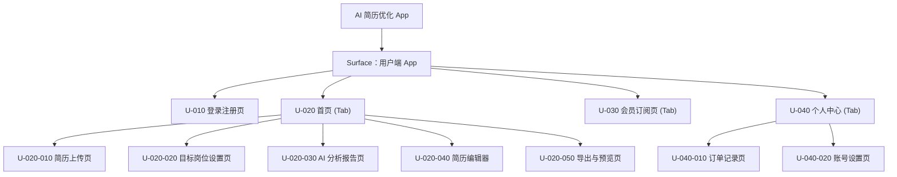

# 产品综述文档

> 使用方式：复制本结构生成 `product/development/product-overview-draft.md`。不确定内容必须标记为带 ID 的 `假设 A-xxx` 或 `待确认 Q-xxx`，并在文档末尾统一汇总。

## 0. 文档状态

- 文档版本：Draft
- 生成日期：2026-05-11
- 产品名称：AI 简历优化 App
- 输入来源：用户自然语言描述
- 当前结论可信度：中
- 假设 / 待确认编号规则：
  - 假设：`A-001` 起，按首次出现顺序递增。
  - 待确认：`Q-001` 起，按首次出现顺序递增。
  - 正文、表格、Sitemap 中出现的每个 `A-*` / `Q-*` 必须在文档末尾 `假设与待确认统一清单` 中出现。

## 1. 产品综合介绍

### 1.1 产品定位

- 产品类型：移动端 App
- 一句话定位：一款基于 AI 技术的移动端简历优化工具，帮助求职者快速提升简历与目标岗位的匹配度。
- 核心价值：利用 AI 自动分析简历与岗位的匹配度，提供针对性的修改建议，并一键生成优化后的简历，提高求职成功率。
- 目标用户：有求职需求的高校毕业生、职场跳槽人士等。
- 使用场景：求职前准备简历、针对特定岗位定制简历。

### 1.2 核心业务目标

- 业务目标 1：提供便捷的移动端简历制作与优化体验。
- 业务目标 2：通过高质量的 AI 建议提升用户的简历通过率。
- 业务目标 3：通过会员订阅模式实现商业化变现。
- 成功指标：用户注册转化率、付费会员转化率、AI 简历生成次数、用户留存率。

### 1.3 核心用户路径

1. 路径名称：简历优化主流程
   - 触发入口：App 首页
   - 关键步骤：登录/注册 -> 上传基础简历 -> 输入/选择目标岗位 -> 点击“AI 优化” -> 查看 AI 分析报告（匹配度及建议） -> 进入简历编辑器微调 -> 导出 PDF
   - 完成状态：成功下载或分享优化后的 PDF 简历。
   - 失败 / 异常状态：上传失败（文件格式不支持/过大）、AI 分析失败（网络问题/余额不足）、导出失败。

### 1.4 页面范围

- MVP 页面范围：登录注册、首页（上传入口与历史记录）、目标岗位设置、AI 分析报告、简历编辑器、导出与预览、会员订阅页、个人中心。
- 非 MVP / 后续页面范围：岗位推荐、面试模拟、职场社区。
- 不包含范围：企业端招聘系统。

### 1.5 功能范围

- 核心功能：简历上传解析、目标岗位输入/匹配、AI 简历分析与修改建议生成、简历智能编辑器、PDF 简历导出。
- 支撑功能：用户登录/注册（验证码/第三方等）、历史简历管理、个人信息管理。
- 管理功能：（假设 A-001：暂不涉及复杂的运营后台，初期仅需基础的用户数据和订单查看）
- 集成能力：第三方支付集成（微信/支付宝/Apple Pay等）、AI 大模型 API 接入。

### 1.6 角色与权限

| 角色 | 角色说明 | 可访问范围 | 关键权限 | 假设 / 待确认ID |
|---|---|---|---|---|
| 游客 | 未登录用户 | 首页介绍、登录注册页 | 仅可浏览基础介绍，无法使用核心功能 | （待确认 Q-001：是否允许游客试用部分功能？） |
| 普通用户 | 登录但未付费用户 | 核心功能页 | 可上传简历、设置目标，但可能限制 AI 分析深度或导出带水印、限制次数 | （假设 A-002：普通用户有使用次数限制或功能限制） |
| VIP 会员 | 已付费订阅用户 | 全部客户端页面 | 无限制使用 AI 优化功能，高清无水印导出等特权 | |

### 1.7 关键操作

| 操作 | 操作角色 | 所属页面 / 模块 | 输入 | 输出 | 规则 / 限制 |
|---|---|---|---|---|---|
| 账号注册/登录 | 游客 | 登录注册页 | 手机号+验证码 / 第三方授权 | 登录态 Token | |
| 上传简历 | 普通用户/VIP | 首页/简历上传页 | PDF/Word/图片等文件 | 简历解析结果 | 限制文件大小和格式 |
| 设置目标岗位 | 普通用户/VIP | 目标岗位设置页 | 文本描述或从库中选择 | 岗位分析维度 | |
| 运行 AI 分析 | 普通用户/VIP | AI 分析报告页 | 简历数据+岗位数据 | 匹配度得分、修改建议、优化后文本 | 依赖后台 AI 处理，可能消耗用户额度 |
| 简历编辑 | 普通用户/VIP | 简历编辑器 | 模块文本修改 | 更新后的简历内容 | 支持撤销/重做 |
| 导出简历 | 普通用户/VIP | 导出与预览页 | 导出格式（PDF） | 生成的 PDF 文件 | 普通用户可能有水印（假设 A-002） |
| 购买会员 | 普通用户 | 会员订阅页 | 支付信息 | 升级为 VIP 会员 | |

### 1.8 商业化与运营能力

- 商业化模式：会员订阅制（包月/包季/包年）或按次付费（假设 A-003：采用连续包月订阅制+单次购买加油包模式）。
- 订阅 / 会员：提供不同等级的 VIP 权益。
- 支付 / 退款：集成主流支付方式（微信/支付宝/Apple Pay）。
- 通知渠道：App 内消息、推送通知（Push）、短信（假设 A-004：包含基础的 Push 和短信通知）。
- 审核机制：机器审核简历中是否包含违规词汇（假设 A-005：接入第三方文本审核 API）。
- 管理后台：需基础运营后台管理用户、订单和 AI 使用量（待确认 Q-002：后台具体需求及优先级）。
- 数据分析：基础的用户行为埋点。
- 相关假设 / 待确认ID：A-003, A-004, A-005, Q-002。

## 2. Sitemap / 信息架构

### 2.1 主要布局形态 Layout

- Layout 类型：移动端 App (底部 Tab 导航)
- 全局导航：底部 Tab（例如：首页、会员、我的）
- 全局操作区：各个页面的顶部 Navigation Bar
- 登录态 / 未登录态差异：未登录访问核心功能会强制跳转登录页。
- 多端 / 多角色布局差异：暂无，仅 C 端。
- Surface 划分：目前仅聚焦 `用户端 App`。
- Sitemap 生成原则：
  - 表格为后续页面级 skill 的唯一清单来源。
  - 每一行对应一个需要生成或确认的页面 / 子页面 / 子视图。
  - `页面ID`、`父页面ID`、`层级`、`生成顺序` 必须稳定、完整、可机读。

### 2.2 Sitemap 可视化

> 使用 Mermaid 展示与下方表格一致的父子层级。不要在图中加入表格不存在的页面。

### 2.3 Sitemap 页面生成总表

> 这是后续页面级子 skill 的主输入。必须完整、具体、可执行。每行对应一个页面级 md 生成任务或一个明确的子视图任务。

| 生成顺序 | 页面ID | 父页面ID | 层级 | Surface | Layout 区域 | 页面名称 | 页面类型 | 页面级MD文件 | 面向角色 | 对应功能 | 功能说明 | 关键操作 | 关键数据 / 内容 | 状态与边界 | 权限 / 业务规则 | 依赖页面 / 对象 | 来源 / 假设ID / 待确认ID |
|---:|---|---|---|---|---|---|---|---|---|---|---|---|---|---|---|---|---|
| 10 | U-010 | ROOT | L1 | 用户端 App | 独立页 | 登录注册页 | 表单 | product/development/pages/010-auth.md | 游客 | 身份认证 | 提供手机验证码登录、第三方快捷登录 | 输入手机号、获取验证码、点击登录 | 手机号、验证码、同意协议状态 | 获取验证码冷却、手机号格式错误 | 需勾选用户协议和隐私政策 | | 用户描述；A-001 |
| 20 | U-020 | ROOT | L1 | 用户端 App | 主导航(Tab) | 首页 | 列表/操作入口 | product/development/pages/020-home.md | 所有用户 | 核心功能入口 | 展示近期简历列表、新建简历优化入口 | 点击新建优化、点击查看历史 | 历史简历列表（状态、时间） | 空白状态（无历史记录） | | 依赖用户登录态 | 用户描述 |
| 30 | U-020-010 | U-020 | L2 | 用户端 App | 独立页 | 简历上传页 | 表单/操作 | product/development/pages/030-resume-upload.md | 所有用户 | 简历数据接入 | 支持文件选择（PDF/Word等）或直接拍照识别（A-006） | 选择文件、确认上传 | 选中的文件信息、上传进度 | 文件过大、格式不支持、解析失败 | | 依赖本地文件或相册权限 | 用户描述；A-006 |
| 40 | U-020-020 | U-020 | L2 | 用户端 App | 独立页 | 目标岗位设置页 | 表单 | product/development/pages/040-target-role.md | 所有用户 | 匹配目标设置 | 输入期望的职位名称或详细JD | 输入文本、选择预设岗位、提交 | 岗位名称、JD 描述 | 文本超长限制 | | 依赖 U-020-010 成功解析的简历 | 用户描述 |
| 50 | U-020-030 | U-020 | L2 | 用户端 App | 独立页 | AI 分析报告页 | 详情/展示 | product/development/pages/050-ai-report.md | 所有用户 | AI 诊断与建议 | 展示简历与岗位的匹配度得分，指出不足，提供修改建议 | 查看各模块建议、一键应用建议 | 匹配度图表、雷达图、各项修改建议列表 | 分析中加载态、分析失败 | 非 VIP 用户可能只能看部分内容（A-002） | 依赖 U-020-020 提交的数据 | 用户描述；A-002 |
| 60 | U-020-040 | U-020 | L2 | 用户端 App | 独立页 | 简历编辑器 | 编辑器 | product/development/pages/060-resume-editor.md | 所有用户 | 内容编辑 | 支持对各个模块（教育、经历、技能等）进行文本微调，或接受 AI建议 | 文本编辑、排版模板选择、保存 | 结构化简历数据、所选排版模板 | 预览更新延迟 | | 依赖 U-020-030 结果 | 用户描述 |
| 70 | U-020-050 | U-020 | L2 | 用户端 App | 独立页 | 导出与预览页 | 操作/展示 | product/development/pages/070-export-preview.md | 所有用户 | 结果输出 | 预览最终效果并生成 PDF 导出到本地或分享 | 预览、点击导出、点击分享 | 简历渲染视图 | 导出中、导出成功、分享菜单 | 普通用户可能带水印（A-002） | 依赖 U-020-040 内容 | 用户描述；A-002 |
| 80 | U-030 | ROOT | L1 | 用户端 App | 主导航(Tab) | 会员订阅页 | 商业化展示 | product/development/pages/080-vip-subscription.md | 所有用户 | 会员购买 | 展示不同会员套餐、特权对比，发起支付 | 选择套餐、点击支付 | 会员特权列表、套餐价格 | 支付中、支付成功/失败、网络错误 | | 需集成支付 SDK | 用户描述；A-003 |
| 90 | U-040 | ROOT | L1 | 用户端 App | 主导航(Tab) | 个人中心 | 导航/展示 | product/development/pages/090-mine.md | 所有用户 | 个人信息管理 | 展示用户头像、昵称、会员状态，提供设置和订单入口 | 点击进入子页面 | 用户基础信息、VIP 到期时间 | | | 依赖用户登录态 | 用户描述 |
| 100 | U-040-010 | U-040 | L2 | 用户端 App | 独立页 | 订单记录页 | 列表 | product/development/pages/100-order-history.md | 所有用户 | 购买记录 | 展示历史订阅与购买订单 | 查看详情 | 订单列表（订单号、金额、时间、状态） | 空状态 | | 依赖 U-040 | A-007 |
| 110 | U-040-020 | U-040 | L2 | 用户端 App | 独立页 | 账号设置页 | 表单 | product/development/pages/110-settings.md | 所有用户 | 账号安全管理 | 包含修改密码、退出登录、注销账号、协议查看等 | 点击退出、点击注销 | 账号关联状态 | | 注销需要二次确认 | 依赖 U-040 | A-008 |

### 2.4 分 Surface 层级清单

> 用嵌套列表辅助人工阅读，但不得替代表格。每个列表项必须带页面ID。

#### Surface：用户端 App

- Layout：移动端底部 Tab 导航结构，各个功能页面通过导航栈推入（Push）。
- 页面树：
  - `[U-010] 登录注册页`
    - 对应功能：身份认证
    - 页面级MD文件：product/development/pages/010-auth.md
  - `[U-020] 首页 (Tab)`
    - 对应功能：核心功能入口
    - 页面级MD文件：product/development/pages/020-home.md
    - 子页面：
      - `[U-020-010] 简历上传页`
        - 对应功能：简历数据接入
        - 页面级MD文件：product/development/pages/030-resume-upload.md
      - `[U-020-020] 目标岗位设置页`
        - 对应功能：匹配目标设置
        - 页面级MD文件：product/development/pages/040-target-role.md
      - `[U-020-030] AI 分析报告页`
        - 对应功能：AI 诊断与建议
        - 页面级MD文件：product/development/pages/050-ai-report.md
      - `[U-020-040] 简历编辑器`
        - 对应功能：内容编辑
        - 页面级MD文件：product/development/pages/060-resume-editor.md
      - `[U-020-050] 导出与预览页`
        - 对应功能：结果输出
        - 页面级MD文件：product/development/pages/070-export-preview.md
  - `[U-030] 会员订阅页 (Tab)`
    - 对应功能：会员购买
    - 页面级MD文件：product/development/pages/080-vip-subscription.md
  - `[U-040] 个人中心 (Tab)`
    - 对应功能：个人信息管理
    - 页面级MD文件：product/development/pages/090-mine.md
    - 子页面：
      - `[U-040-010] 订单记录页`
        - 对应功能：购买记录
        - 页面级MD文件：product/development/pages/100-order-history.md
      - `[U-040-020] 账号设置页`
        - 对应功能：账号安全管理
        - 页面级MD文件：product/development/pages/110-settings.md

### 2.5 页面生成队列

> 按 `生成顺序` 列出，供后续自动化逐条调用页面级 skill。

| 生成顺序 | 页面ID | 页面名称 | 父页面ID | 页面级MD文件 | 生成该页面前需要确认 / 依赖ID |
|---:|---|---|---|---|---|
| 10 | U-010 | 登录注册页 | ROOT | product/development/pages/010-auth.md | A-001, Q-001 |
| 20 | U-020 | 首页 | ROOT | product/development/pages/020-home.md | |
| 30 | U-020-010 | 简历上传页 | U-020 | product/development/pages/030-resume-upload.md | A-006 |
| 40 | U-020-020 | 目标岗位设置页 | U-020 | product/development/pages/040-target-role.md | |
| 50 | U-020-030 | AI 分析报告页 | U-020 | product/development/pages/050-ai-report.md | A-002 |
| 60 | U-020-040 | 简历编辑器 | U-020 | product/development/pages/060-resume-editor.md | |
| 70 | U-020-050 | 导出与预览页 | U-020 | product/development/pages/070-export-preview.md | A-002 |
| 80 | U-030 | 会员订阅页 | ROOT | product/development/pages/080-vip-subscription.md | A-003 |
| 90 | U-040 | 个人中心 | ROOT | product/development/pages/090-mine.md | |
| 100 | U-040-010 | 订单记录页 | U-040 | product/development/pages/100-order-history.md | A-007 |
| 110 | U-040-020 | 账号设置页 | U-040 | product/development/pages/110-settings.md | A-008 |

### 2.6 页面依赖与数据对象

| 页面 | 依赖对象 | 上游入口 | 下游页面 / 操作 | 权限依赖 | 假设 / 待确认ID |
|---|---|---|---|---|---|
| AI 分析报告页 | 简历文件对象、岗位文本对象 | 目标岗位设置页 | 简历编辑器 | 需登录，判断 VIP 状态 | A-002 |
| 简历编辑器 | 结构化简历对象 | AI 分析报告页 | 导出与预览页 | 需登录 | |
| 导出与预览页 | 结构化简历对象、渲染模板 | 简历编辑器 | 调用系统分享 / 保存 PDF | 需登录，判断 VIP 状态 | A-002 |

### 2.7 Sitemap 完整性自检

| 检查项 | 结论 | 缺口 / 假设ID / 待确认ID |
|---|---|---|
| 每个核心功能是否至少有一个页面承载 | 是 |  |
| 每个角色是否有入口和权限边界 | 是 | Q-001 |
| 关键实体是否覆盖列表 / 详情 / 新建 / 编辑 / 删除或说明不需要 | 是 | 简历实体已覆盖（首页列表，后续流程为新建/详情/编辑） |
| 支付 / 订阅 / 通知 / 审核 / 管理 / 数据分析是否覆盖或明确排除 | 是 | 暂不规划独立后台，但包括用户端支付订阅。Q-002 |
| 表格、分 Surface 清单、Mermaid 图是否页面一致 | 是 |  |
| 页面级MD文件路径是否唯一 | 是 |  |

## 3. 输入来源摘录

- 用户自然语言描述：“我要做一个 AI 简历优化 移动端 App。用户可以上传简历，选择目标岗位，AI 会分析简历匹配度，给出修改建议，并支持生成优化后的简历。产品包含登录注册、简历上传、岗位目标设置、AI 分析报告、简历编辑器、导出 PDF、会员订阅、个人中心。”
- 上传 / 引用文档：无
- 关键证据与摘录：明确提及移动端、七大核心模块及主要用户心智流程。

## 4. 后续生成建议

- 推荐优先生成的页面级文档：`020-home.md`（明确核心流程起点），`050-ai-report.md`（定义产品核心 AI 价值呈现形式）。
- 需要先由用户确认的内容（列出 Q-xxx / A-xxx）：Q-001（游客模式）、Q-002（后台需求）、A-002（免费用户限制策略）、A-003（商业化计费方案）。
- Release 版生成条件：所有 Q 标识的问题得到解答，关键 A 标识假设得到用户认可。

## 5. 假设与待确认统一清单

> 本章节必须位于文档最后，用于用户统一确认。正文、表格、Sitemap 中出现的所有 `A-*` / `Q-*` 必须在这里逐条列出；这里没有列出的 ID 不能出现在正文中。

### 5.1 假设清单

| 假设ID | 假设内容 | 首次出现位置 | 影响范围 | 影响页面ID | 置信度 | 用户确认状态 | Release 处理方式 |
|---|---|---|---|---|---|---|---|
| A-001 | 暂不涉及复杂的运营后台，初期仅需基础的用户数据和订单查看（通过数据库或简单面板），因此未在 Sitemap 中列出后台页面。 | 1.5 功能范围 | 功能范围、Sitemap | 所有 | 中 | 待用户确认 | 确认为正式内容 / 删除 / 按用户修改替换 |
| A-002 | 普通用户（非 VIP）存在使用次数限制，或者 AI 分析报告深度受限，且导出 PDF 可能带有水印。 | 1.6 角色与权限 | 权限、商业化限制 | U-020-030, U-020-050 | 高 | 待用户确认 | 确认为正式内容 / 删除 / 按用户修改替换 |
| A-003 | 商业化采用连续包月/包季/包年订阅制，可能辅以单次优化的加油包模式。 | 1.8 商业化与运营能力 | 商业化模式 | U-030 | 高 | 待用户确认 | 确认为正式内容 / 删除 / 按用户修改替换 |
| A-004 | 包含基础的 Push 推送和短信通知（如验证码、会员到期提醒）。 | 1.8 商业化与运营能力 | 通知渠道 | U-040-020 | 高 | 待用户确认 | 确认为正式内容 / 删除 / 按用户修改替换 |
| A-005 | 包含自动接入第三方文本审核 API，过滤上传简历及 AI 生成内容中的违规词汇。 | 1.8 商业化与运营能力 | 审核机制 | U-020-030, U-020-040 | 中 | 待用户确认 | 确认为正式内容 / 删除 / 按用户修改替换 |
| A-006 | 简历上传支持从本地文件选择（PDF/Word），并且作为移动端 App，可能支持拍照识别解析简历。 | 2.3 Sitemap | Sitemap 页面功能 | U-020-010 | 中 | 待用户确认 | 确认为正式内容 / 删除 / 按用户修改替换 |
| A-007 | 个人中心需要包含订单记录页，用于用户查询购买历史和开发票等。 | 2.3 Sitemap | Sitemap 页面结构 | U-040-010 | 高 | 待用户确认 | 确认为正式内容 / 删除 / 按用户修改替换 |
| A-008 | 个人中心需要包含账号设置页，处理合规要求（如注销账号、隐私协议）。 | 2.3 Sitemap | Sitemap 页面结构 | U-040-020 | 高 | 待用户确认 | 确认为正式内容 / 删除 / 按用户修改替换 |

### 5.2 待确认清单

| 待确认ID | 待确认问题 | 首次出现位置 | 影响范围 | 影响页面ID | 优先级 | 用户确认结果 | Release 处理方式 |
|---|---|---|---|---|---|---|---|
| Q-001 | 是否允许游客（未登录）状态下试用部分功能？（例如先体验一次报告，导出前要求登录）。 | 1.6 角色与权限 | 登录注册逻辑 | U-010, U-020 | 高 | 待用户确认 | 写入正式内容 / 删除 / 保留为风险 |
| Q-002 | 是否需要在此次规划中加入配套的运营/管理后台系统界面？还是仅聚焦 App 端？ | 1.8 商业化与运营能力 | 后台功能范围 | 无 | 高 | 待用户确认 | 写入正式内容 / 删除 / 保留为风险 |

### 5.3 Release 生成前检查

| 检查项 | 结论 | 说明 |
|---|---|---|
| 正文中所有 `A-*` 是否已进入假设清单 | 是 | |
| 正文中所有 `Q-*` 是否已进入待确认清单 | 是 | |
| 所有高优先级 `Q-*` 是否已有用户确认结果 | 否 | 目前为 Draft 版本 |
| 被用户否定的假设是否已从正文和 Sitemap 中移除或替换 | 否 | 目前为 Draft 版本 |
| Release 版是否不再保留 `待用户确认` 状态 | 否 | 目前为 Draft 版本 |
