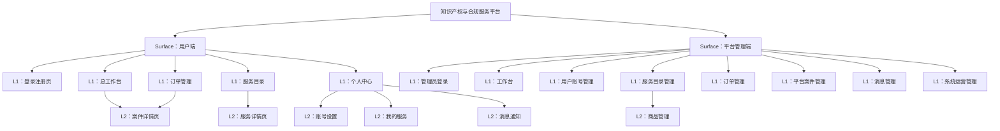

# 产品综述文档

> 本文档基于 docs/⭐️商务文档.md 和 docs/启动-产品需求初次沟通.md 生成，用于定义知识产权与合规服务平台的产品范围和站点地图。

## 0. 文档状态

- 文档版本：Draft
- 生成日期：2026-05-13
- 产品名称：知识产权与合规服务平台
- 输入来源：docs/⭐️商务文档.md, docs/启动-产品需求初次沟通.md
- 当前结论可信度：中
- 假设 / 待确认编号规则：
  - 假设：`A-001` 起，按首次出现顺序递增。
  - 待确认：`Q-001` 起，按首次出现顺序递增。
  - 正文、表格、Sitemap 中出现的每个 `A-*` / `Q-*` 必须在 `假设与待确认统一清单` 中出现。

## 1. 产品综合介绍

### 1.1 产品定位

- 产品类型：SaaS 平台（双域名部署）
- 一句话定位：面向全球的一站式知识产权与合规服务平台，实现服务在线成交与案件流程可视化交付
- 核心价值：帮助出海企业解决全链路合规痛点，降低成本、提升效率、防控风险
- 目标用户：有跨境合规服务需求的中国企业和个人
- 使用场景：商标注册、专利申请、版权登记、VAT税务申报、ERP服务等跨境业务场景

### 1.2 核心业务目标

- 业务目标 1：实现知识产权服务的在线化交易，提升转化率
- 业务目标 2：提供案件流程的实时可视化追踪，提升客户满意度
- 业务目标 3：通过标准化流程和自动化通知，降低人工运营成本
- 成功指标（引用 A-xxx / Q-xxx，如有）：订单转化率、案件处理时效、客户满意度（待确认 Q-001）

### 1.3 核心用户路径

1. 路径名称：服务购买与案件跟踪
   - 触发入口：用户注册登录 → 浏览服务目录
   - 关键步骤：选择服务 → 填写信息 → 确认订单 → 在线支付 → 提交材料 → 查看进度
   - 完成状态：案件下证/完成
   - 失败 / 异常状态：支付失败、材料驳回、案件被拒（假设 A-001：支持多种异常状态处理）

2. 路径名称：案件材料管理
   - 触发入口：案件详情页
   - 关键步骤：查看所需材料清单 → 上传材料 → 等待审核 → 接收反馈
   - 完成状态：材料审核通过
   - 失败 / 异常状态：材料被驳回需重新提交

### 1.4 页面范围

- MVP 页面范围：用户端（登录注册、工作台、服务目录、服务详情、下单流程、订单管理、案件详情、个人中心）、平台端（管理员登录、用户管理、服务管理、订单管理、案件管理、消息管理）
- 非 MVP / 后续页面范围：数据统计分析、高级权限配置、多语言支持（假设 A-002：MVP阶段仅支持中文）
- 不包含范围：移动端原生App（待确认 Q-002：是否需要开发H5或小程序）

### 1.5 功能范围

- 核心功能：
  - 用户端：手机号/微信登录、服务浏览与下单、在线支付、案件进度查询、材料上传下载、消息通知
  - 平台端：用户管理、服务配置、订单管理、案件流程管理、材料审核、消息模板配置
- 支撑功能：待办事项提醒、风险预警、操作历史记录、文件管理
- 管理功能：角色权限管理、服务上下架、流程模板配置、通知规则配置
- 集成能力（支付 / 通知 / 第三方服务 / AI / 数据导入导出等）：微信支付（假设 A-003：首期仅支持微信支付）、短信通知、系统站内信

### 1.6 角色与权限

| 角色 | 角色说明 | 可访问范围 | 关键权限 | 假设 / 待确认ID |
|---|---|---|---|---|
| 普通用户 | 购买和使用服务的客户 | 用户端全部功能 | 查看自己的案件、上传材料、支付订单 | - |
| 超级管理员 | 平台最高权限管理者 | 平台端全部功能 | 所有管理权限、权限分配 | - |
| 录入专员 | 负责案件信息录入和材料审核 | 平台端部分功能 | 案件信息管理、材料审核（待确认 Q-003：是否可修改案件状态） | Q-003 |

### 1.7 关键操作

| 操作 | 操作角色 | 所属页面 / 模块 | 输入 | 输出 | 规则 / 限制 |
|---|---|---|---|---|---|
| 服务下单 | 普通用户 | 服务详情页 | 联系人、公司、服务信息 | 待支付订单 | 必须完成支付才能进入处理流程 |
| 材料上传 | 普通用户 | 案件详情页 | 图片/文件 | 材料记录 | 支持的文件类型和大小受限（待确认 Q-004） |
| 材料审核 | 录入专员 | 平台案件管理 | 用户上传的材料 | 审核结果（通过/驳回） | 驳回需填写意见 |
| 案件状态更新 | 超级管理员/录入专员 | 案件详情页 | 新状态 | 状态变更记录 | 根据流程模板自动推进或手动更新 |
| 服务上下架 | 超级管理员 | 服务目录管理 | 服务配置 | 服务可见性变化 | 下架后新用户不可见，已购买用户不受影响 |

### 1.8 商业化与运营能力

- 商业化模式（引用 A-xxx / Q-xxx，如有）：按服务收费，支持不同服务类型的差异化定价（假设 A-004：不支持订阅制，仅单次购买）
- 订阅 / 会员：暂不支持（假设 A-004）
- 支付 / 退款：支持微信支付，退款流程待确认（待确认 Q-005：退款规则和流程）
- 通知渠道：系统站内信 + 短信通知（消息类型未完全定义，待确认 Q-006）
- 审核机制：材料审核、订单审核（假设 A-005：订单无需人工审核，支付后自动进入处理流程）
- 管理后台：完整的平台管理后台，支持双平台统一管理但账号不互通
- 数据分析：销售数据统计（订单金额、销售量），更详细的分析待后续版本（假设 A-006）
- 相关假设 / 待确认ID：A-004, A-005, A-006, Q-005, Q-006

## 2. Sitemap / 信息架构

### 2.1 主要布局形态 Layout

- Layout 类型：混合布局（用户端采用顶部导航+内容区，平台端采用侧边栏导航+内容区）
- 全局导航：用户端顶部导航栏（服务目录、进度查询、订单管理、个人中心），平台端左侧菜单栏
- 全局操作区：用户端右上角用户信息和消息图标，平台端顶部面包屑和操作按钮
- 登录态 / 未登录态差异：未登录仅可浏览服务目录和部分介绍，登录后解锁完整功能
- 多端 / 多角色布局差异：用户端和平台端完全不同的布局和导航结构
- Surface 划分：
  - Surface A：用户端（两个域名共享同一套功能和数据，但UI有简单区别，账号不互通）
  - Surface B：平台管理端（统一管理两个平台的用户和案件，通过"所属平台"字段区分）
- Sitemap 生成原则：
  - 表格为后续页面级 skill 的唯一清单来源。
  - 每一行对应一个需要生成或确认的页面 / 子页面 / 子视图。
  - `页面ID`、`父页面ID`、`层级`、`生成顺序` 必须稳定、完整、可机读。

### 2.2 Sitemap 可视化

> 使用 Mermaid 展示与下方表格一致的父子层级。不要在图中加入表格不存在的页面。



### 2.3 Sitemap 页面生成总表

> 这是后续页面级子 skill 的主输入。必须完整、具体、可执行。每行对应一个页面级 md 生成任务或一个明确的子视图任务。

| 生成顺序 | 页面ID | 父页面ID | 层级 | Surface | Layout 区域 | 页面名称 | 页面类型 | 页面级MD文件 | 面向角色 | 对应功能 | 功能说明 | 关键操作 | 关键数据 / 内容 | 状态与边界 | 权限 / 业务规则 | 依赖页面 / 对象 | 来源 / 假设ID / 待确认ID |
|---:|---|---|---|---|---|---|---|---|---|---|---|---|---|---|---|---|---|
| 10 | U-010 | ROOT | L1 | 用户端 | 全屏 | 登录注册页 | 表单页 | product/development/pages/U-010-login.md | 普通用户 | 登录与注册 | 支持手机号验证码登录和微信扫码登录 | 输入手机号获取验证码、微信扫码 | 手机号、验证码、微信授权信息 | 未登录状态、验证码发送成功/失败 | 无需登录即可访问 | 无 | 来源：商务文档功能列表 |
| 20 | U-020 | ROOT | L1 | 用户端 | 主导航+内容区 | 总工作台 | 工作台/仪表盘 | product/development/pages/U-020-workspace.md | 普通用户 | 总工作台 | 展示待办事项和案件进度概览 | 筛选待办、查看详情、忽略待办、筛选案件、进入案件详情 | 待办事项列表（按类型分类）、案件列表 | 空状态、加载中、无待办、无案件 | 需登录 | U-010 | 来源：商务文档功能列表 |
| 30 | U-020-010 | U-020 | L2 | 用户端 | 弹窗/抽屉 | 待办事项详情 | 详情页 | product/development/pages/U-020-010-todo-detail.md | 普通用户 | 待办事项详情 | 查看待办详细信息并处理 | 查看详情、忽略待办 | 待办标题、风险等级、公司、截止时间、详细说明 | 待办不存在、已处理 | 需登录、仅可查看自己的待办 | U-020 | 来源：商务文档；待确认 Q-007：待办风险的产生逻辑 |
| 40 | U-030 | ROOT | L1 | 用户端 | 主导航+内容区 | 服务目录 | 列表页 | product/development/pages/U-030-service-catalog.md | 普通用户 | 服务目录栏 | 展示所有可用的服务分类和具体服务 | 点击服务进入详情页、筛选服务 | 服务分类（商标/专利/版权/VAT+/ERP等）、服务列表 | 空状态、服务下架 | 未登录可浏览，登录后可下单 | 无 | 来源：商务文档功能列表 |
| 50 | U-030-010 | U-030 | L2 | 用户端 | 内容区 | 服务详情页 | 详情页 | product/development/pages/U-030-010-service-detail.md | 普通用户 | 服务详情页 | 展示服务详情并支持下单 | 查看服务内容/流程/价格、点击下单、切换案件状态tab | 服务介绍、服务流程、价格、服务说明、案件列表（按状态分组） | 服务下架、无案件 | 需登录才能下单 | U-030 | 来源：商务文档功能列表 |
| 60 | U-030-010-010 | U-030-010 | L3 | 用户端 | 独立页 | 服务下单页 | 表单页 | product/development/pages/U-030-010-010-place-order.md | 普通用户 | 服务下单 | 填写订单信息并支付 | 填写联系人/公司/服务信息、确认订单、微信支付 | 联系人信息、公司信息、服务选项、订单金额 | 表单验证失败、支付失败、库存不足 | 需登录、需完善公司和联系人信息 | U-030-010 | 来源：商务文档功能列表 |
| 70 | U-040 | ROOT | L1 | 用户端 | 主导航+内容区 | 订单管理 | 列表页 | product/development/pages/U-040-order-list.md | 普通用户 | 订单管理 | 查看所有订单并按状态筛选 | 筛选订单、查看订单详情、取消订单（待确认 Q-008） | 订单列表（待支付/已支付/处理中/已取消）、订单摘要 | 空状态、无订单 | 需登录、仅可查看自己的订单 | 无 | 来源：商务文档功能列表 |
| 80 | U-040-010 | U-040 | L2 | 用户端 | 独立页/抽屉 | 订单详情页 | 详情页 | product/development/pages/U-040-010-order-detail.md | 普通用户 | 订单详情 | 查看订单详细信息 | 查看订单信息、去支付（待支付状态）、联系客服 | 订单号、商品信息、金额、支付状态、下单时间 | 订单不存在、权限不足 | 需登录、仅可查看自己的订单 | U-040 | 来源：商务文档功能列表 |
| 90 | U-050 | U-020 | L2 | 用户端 | 内容区 | 进度查询列表 | 列表页 | product/development/pages/U-050-case-list.md | 普通用户 | 进度查询列表 | 展示所有案件并支持筛选 | 筛选案件、点击进入案件详情 | 案件列表（服务类型、国家/地区、状态、公司） | 空状态、无案件 | 需登录、仅可查看自己的案件 | U-020 | 来源：商务文档功能列表 |
| 100 | U-050-010 | U-050 | L3 | 用户端 | 独立页 | 案件详情页 | 详情页 | product/development/pages/U-050-010-case-detail.md | 普通用户 | 案件详情页 | 展示案件全流程信息和操作 | 查看流程时间轴、上传节点材料、下载文件、查看操作历史 | 流程节点时间轴、案件详情、材料上传区、文件下载、操作历史记录 | 案件不存在、权限不足、节点未开放 | 需登录、仅可查看和管理自己的案件 | U-050, U-040-010 | 来源：商务文档功能列表 |
| 110 | U-050-010-010 | U-050-010 | L4 | 用户端 | 弹窗 | 材料上传弹窗 | 表单页 | product/development/pages/U-050-010-010-upload-material.md | 普通用户 | 节点材料上传 | 上传节点所需材料 | 选择文件/图片、填写说明、提交上传 | 文件、图片、说明文字 | 文件格式不支持、文件大小超限、上传失败 | 需登录、仅可在指定节点上传 | U-050-010 | 来源：商务文档；待确认 Q-004：文件类型和大小限制 |
| 120 | U-060 | ROOT | L1 | 用户端 | 主导航+内容区 | 个人中心 | 设置页 | product/development/pages/U-060-profile.md | 普通用户 | 个人中心入口 | 个人中心和各项设置的入口页面 | 跳转到各设置子页面 | 用户基本信息、快捷入口 | 无 | 需登录 | 无 | 来源：商务文档功能列表 |
| 130 | U-060-010 | U-060 | L2 | 用户端 | 内容区 | 账号设置 | 设置页 | product/development/pages/U-060-010-account-settings.md | 普通用户 | 账号设置 | 管理个人信息、公司信息、登录方式、通知设置 | 编辑个人信息、管理公司信息、绑定手机/微信、设置通知方式、查看协议 | 个人资料、公司信息、登录方式绑定状态、通知偏好 | 保存失败、验证失败 | 需登录 | U-060 | 来源：商务文档功能列表 |
| 140 | U-060-020 | U-060 | L2 | 用户端 | 内容区 | 我的服务 | 列表页 | product/development/pages/U-060-020-my-services.md | 普通用户 | 我的服务 | 以列表展示用户所有的服务案件 | 查看案件、进入案件详情 | 案件列表（与U-050类似但入口不同） | 空状态、无服务 | 需登录 | U-060 | 来源：商务文档功能列表 |
| 150 | U-060-030 | U-060 | L2 | 用户端 | 内容区 | 消息通知 | 列表页 | product/development/pages/U-060-030-messages.md | 普通用户 | 消息通知 | 查看系统通知和短信通知记录 | 查看消息、标记已读、删除消息 | 消息列表（系统通知、短信通知）、消息详情 | 空状态、无消息 | 需登录、仅可查看自己的消息 | U-060 | 来源：商务文档功能列表；待确认 Q-006：消息类型定义 |
| 160 | A-010 | ROOT | L1 | 平台管理端 | 全屏 | 管理员登录 | 表单页 | product/development/pages/A-010-admin-login.md | 超级管理员/录入专员 | 管理端登录 | 选择角色并登录管理系统 | 选择角色、输入账号密码/验证码 | 角色选项、账号、密码/验证码 | 登录失败、账号禁用、验证码错误 | 无需登录即可访问 | 无 | 来源：商务文档功能列表 |
| 170 | A-020 | ROOT | L1 | 平台管理端 | 侧边栏+内容区 | 工作台 | 工作台/仪表盘 | product/development/pages/A-020-admin-dashboard.md | 超级管理员/录入专员 | 工作台管理 | 展示待办事项和关键数据概览 | 配置待办展示字段、查看待办列表、配置风险规则 | 待办事项列表、风险统计数据、配置入口 | 空状态、无权限 | 需登录、根据角色显示不同内容 | A-010 | 来源：商务文档功能列表 |
| 180 | A-030 | ROOT | L1 | 平台管理端 | 侧边栏+内容区 | 用户账号管理 | 列表页+详情页 | product/development/pages/A-030-user-management.md | 超级管理员 | 用户账号与认证管理 | 查看、启用/禁用、重置用户账号，管理登录方式和平台标注 | 查看用户列表、搜索用户、启用/禁用账号、重置密码、查看绑定状态、标记所属平台 | 用户列表、用户详情、登录方式绑定状态、所属平台标记 | 无权限、操作失败 | 仅超级管理员可访问 | 无 | 来源：商务文档功能列表 |
| 190 | A-040 | ROOT | L1 | 平台管理端 | 侧边栏+内容区 | 服务目录管理 | 列表页+配置页 | product/development/pages/A-040-service-management.md | 超级管理员 | 服务目录管理 | 管理服务分类、服务上下架、排序、关联流程模板 | 新增/编辑服务分类、上下架服务、调整排序、关联流程模板、配置列表字段和筛选条件 | 服务分类树、服务列表、流程模板选项、字段配置 | 无权限、配置冲突 | 仅超级管理员可访问 | 无 | 来源：商务文档功能列表 |
| 200 | A-040-010 | A-040 | L2 | 平台管理端 | 独立页 | 商品管理 | 列表页+表单页 | product/development/pages/A-040-010-product-management.md | 超级管理员 | 商品管理 | 管理服务商品信息和价格 | 新增/编辑商品、设置价格、分类管理、上下架商品 | 商品列表、商品详情、价格、分类 | 无权限、价格格式错误 | 仅超级管理员可访问 | A-040 | 来源：商务文档功能列表 |
| 210 | A-050 | ROOT | L1 | 平台管理端 | 侧边栏+内容区 | 订单管理 | 列表页+详情页 | product/development/pages/A-050-order-management.md | 超级管理员/录入专员 | 订单管理 | 查看所有订单并管理订单状态 | 查看订单列表、筛选订单、查看订单详情、修改订单状态、添加备注 | 订单列表、订单详情、状态选项、备注 | 无权限、状态转换不合法 | 需登录、录入专员可能仅有查看权限（待确认 Q-009） | 无 | 来源：商务文档功能列表 |
| 220 | A-060 | ROOT | L1 | 平台管理端 | 侧边栏+内容区 | 平台案件管理 | 列表页+详情页 | product/development/pages/A-060-case-management.md | 超级管理员/录入专员 | 平台案件管理 | 列表展示所有用户案件，支持多维筛选和进度跟踪 | 筛选案件、查看案件详情、查看材料、审核材料、上传官方文件、编辑案件信息 | 案件列表、案件详情、材料列表、审核操作、官方文件 | 无权限、案件不存在 | 需登录、录入专员权限待确认（Q-003, Q-009） | 无 | 来源：商务文档功能列表 |
| 230 | A-060-010 | A-060 | L2 | 平台管理端 | 独立页/抽屉 | 案件详情管理页 | 详情页+表单页 | product/development/pages/A-060-010-case-detail-admin.md | 超级管理员/录入专员 | 案件详情页管理 | 查看和编辑案件详情，配置流程节点，管理材料和文件 | 编辑案件基础信息、配置流程节点、查看用户上传材料、审核材料（通过/驳回）、上传官方文件、查看操作历史 | 案件基础信息、流程节点配置、材料列表、审核意见、官方文件列表 | 无权限、节点配置错误、审核操作失败 | 需登录、权限待确认 | A-060 | 来源：商务文档功能列表 |
| 240 | A-060-010-010 | A-060-010 | L3 | 平台管理端 | 弹窗 | 材料审核弹窗 | 表单页 | product/development/pages/A-060-010-010-material-review.md | 超级管理员/录入专员 | 审核材料操作 | 对用户上传的材料进行审核 | 查看材料、选择通过/驳回、填写审核意见 | 材料预览、审核结果选项、审核意见文本框 | 无权限、未填写审核意见（驳回时） | 需登录、仅可审核分配给自己的案件 | A-060-010 | 来源：商务文档功能列表 |
| 250 | A-070 | ROOT | L1 | 平台管理端 | 侧边栏+内容区 | 消息管理 | 列表页+配置页 | product/development/pages/A-070-message-management.md | 超级管理员 | 消息管理 | 配置通知模板、发送消息、设置触发条件 | 新增/编辑通知模板、手动发送消息、配置自动触发规则 | 通知模板列表、模板编辑器、消息发送记录、触发规则配置 | 无权限、模板配置错误 | 仅超级管理员可访问 | 无 | 来源：商务文档功能列表；待确认 Q-006：消息类型定义 |
| 260 | A-080 | ROOT | L1 | 平台管理端 | 侧边栏+内容区 | 数据统计 | 仪表盘 | product/development/pages/A-080-statistics.md | 超级管理员 | 数据统计 | 展示销售数据统计 | 查看订单金额统计、销售量统计、时间筛选 | 统计数据图表、数据表格、时间筛选器 | 无数据、权限不足 | 仅超级管理员可访问（假设 A-006） | 无 | 来源：商务文档功能列表 |
| 270 | A-090 | ROOT | L1 | 平台管理端 | 侧边栏+内容区 | 系统运营管理 | 配置页 | product/development/pages/A-090-system-management.md | 超级管理员 | 系统运营管理 | 管理用户协议和隐私协议 | 新增/编辑协议版本、发布协议 | 协议列表、协议编辑器、发布状态 | 无权限、发布失败 | 仅超级管理员可访问 | 无 | 来源：商务文档功能列表 |

### 2.4 分 Surface 层级清单

> 用嵌套列表辅助人工阅读，但不得替代表格。每个列表项必须带页面ID。

#### Surface A：用户端

- Layout：顶部导航栏（Logo、服务目录、进度查询、订单管理、个人中心、消息图标）+ 主内容区
- 页面树：
  - `[U-010] 登录注册页`
    - 对应功能：手机号验证码登录、微信扫码登录
    - 页面级MD文件：product/development/pages/U-010-login.md
    - 子页面：无
  - `[U-020] 总工作台`
    - 对应功能：待办事项列表、案件进度概览
    - 页面级MD文件：product/development/pages/U-020-workspace.md
    - 子页面：
      - `[U-020-010] 待办事项详情`
        - 对应功能：查看和处理待办事项
        - 页面级MD文件：product/development/pages/U-020-010-todo-detail.md
  - `[U-030] 服务目录`
    - 对应功能：展示所有服务分类和服务列表
    - 页面级MD文件：product/development/pages/U-030-service-catalog.md
    - 子页面：
      - `[U-030-010] 服务详情页`
        - 对应功能：服务详情展示和案件列表
        - 页面级MD文件：product/development/pages/U-030-010-service-detail.md
        - 子页面：
          - `[U-030-010-010] 服务下单页`
            - 对应功能：填写订单信息并支付
            - 页面级MD文件：product/development/pages/U-030-010-010-place-order.md
  - `[U-040] 订单管理`
    - 对应功能：订单列表和状态筛选
    - 页面级MD文件：product/development/pages/U-040-order-list.md
    - 子页面：
      - `[U-040-010] 订单详情页`
        - 对应功能：订单详细信息展示
        - 页面级MD文件：product/development/pages/U-040-010-order-detail.md
  - `[U-050] 进度查询列表`
    - 对应功能：案件列表和筛选
    - 页面级MD文件：product/development/pages/U-050-case-list.md
    - 子页面：
      - `[U-050-010] 案件详情页`
        - 对应功能：案件全流程信息展示和操作
        - 页面级MD文件：product/development/pages/U-050-010-case-detail.md
        - 子页面：
          - `[U-050-010-010] 材料上传弹窗`
            - 对应功能：上传节点所需材料
            - 页面级MD文件：product/development/pages/U-050-010-010-upload-material.md
  - `[U-060] 个人中心`
    - 对应功能：个人中心入口
    - 页面级MD文件：product/development/pages/U-060-profile.md
    - 子页面：
      - `[U-060-010] 账号设置`
        - 对应功能：个人信息、公司信息、登录方式、通知设置
        - 页面级MD文件：product/development/pages/U-060-010-account-settings.md
      - `[U-060-020] 我的服务`
        - 对应功能：用户所有服务案件列表
        - 页面级MD文件：product/development/pages/U-060-020-my-services.md
      - `[U-060-030] 消息通知`
        - 对应功能：系统通知和短信通知记录
        - 页面级MD文件：product/development/pages/U-060-030-messages.md

#### Surface B：平台管理端

- Layout：左侧菜单栏 + 顶部面包屑 + 主内容区
- 页面树：
  - `[A-010] 管理员登录`
    - 对应功能：角色选择和登录
    - 页面级MD文件：product/development/pages/A-010-admin-login.md
  - `[A-020] 工作台`
    - 对应功能：待办事项和关键数据概览
    - 页面级MD文件：product/development/pages/A-020-admin-dashboard.md
  - `[A-030] 用户账号管理`
    - 对应功能：用户管理和认证管理
    - 页面级MD文件：product/development/pages/A-030-user-management.md
  - `[A-040] 服务目录管理`
    - 对应功能：服务分类和配置管理
    - 页面级MD文件：product/development/pages/A-040-service-management.md
    - 子页面：
      - `[A-040-010] 商品管理`
        - 对应功能：服务商品信息和价格管理
        - 页面级MD文件：product/development/pages/A-040-010-product-management.md
  - `[A-050] 订单管理`
    - 对应功能：订单查看和状态管理
    - 页面级MD文件：product/development/pages/A-050-order-management.md
  - `[A-060] 平台案件管理`
    - 对应功能：所有案件的监控和管理
    - 页面级MD文件：product/development/pages/A-060-case-management.md
    - 子页面：
      - `[A-060-010] 案件详情管理页`
        - 对应功能：案件详情编辑和流程配置
        - 页面级MD文件：product/development/pages/A-060-010-case-detail-admin.md
        - 子页面：
          - `[A-060-010-010] 材料审核弹窗`
            - 对应功能：材料审核操作
            - 页面级MD文件：product/development/pages/A-060-010-010-material-review.md
  - `[A-070] 消息管理`
    - 对应功能：通知模板和消息发送
    - 页面级MD文件：product/development/pages/A-070-message-management.md
  - `[A-080] 数据统计`
    - 对应功能：销售数据统计
    - 页面级MD文件：product/development/pages/A-080-statistics.md
  - `[A-090] 系统运营管理`
    - 对应功能：协议管理
    - 页面级MD文件：product/development/pages/A-090-system-management.md

### 2.5 页面生成队列

> 按 `生成顺序` 列出，供后续自动化逐条调用页面级 skill。

| 生成顺序 | 页面ID | 页面名称 | 父页面ID | 页面级MD文件 | 生成该页面前需要确认 / 依赖ID |
|---:|---|---|---|---|---|
| 10 | U-010 | 登录注册页 | ROOT | product/development/pages/U-010-login.md | - |
| 20 | U-020 | 总工作台 | ROOT | product/development/pages/U-020-workspace.md | U-010 |
| 30 | U-020-010 | 待办事项详情 | U-020 | product/development/pages/U-020-010-todo-detail.md | Q-007 |
| 40 | U-030 | 服务目录 | ROOT | product/development/pages/U-030-service-catalog.md | - |
| 50 | U-030-010 | 服务详情页 | U-030 | product/development/pages/U-030-010-service-detail.md | U-030 |
| 60 | U-030-010-010 | 服务下单页 | U-030-010 | product/development/pages/U-030-010-010-place-order.md | U-030-010 |
| 70 | U-040 | 订单管理 | ROOT | product/development/pages/U-040-order-list.md | U-010 |
| 80 | U-040-010 | 订单详情页 | U-040 | product/development/pages/U-040-010-order-detail.md | U-040 |
| 90 | U-050 | 进度查询列表 | U-020 | product/development/pages/U-050-case-list.md | U-020 |
| 100 | U-050-010 | 案件详情页 | U-050 | product/development/pages/U-050-010-case-detail.md | U-050 |
| 110 | U-050-010-010 | 材料上传弹窗 | U-050-010 | product/development/pages/U-050-010-010-upload-material.md | Q-004 |
| 120 | U-060 | 个人中心 | ROOT | product/development/pages/U-060-profile.md | U-010 |
| 130 | U-060-010 | 账号设置 | U-060 | product/development/pages/U-060-010-account-settings.md | U-060 |
| 140 | U-060-020 | 我的服务 | U-060 | product/development/pages/U-060-020-my-services.md | U-060 |
| 150 | U-060-030 | 消息通知 | U-060 | product/development/pages/U-060-030-messages.md | Q-006 |
| 160 | A-010 | 管理员登录 | ROOT | product/development/pages/A-010-admin-login.md | - |
| 170 | A-020 | 工作台 | ROOT | product/development/pages/A-020-admin-dashboard.md | A-010 |
| 180 | A-030 | 用户账号管理 | ROOT | product/development/pages/A-030-user-management.md | A-010 |
| 190 | A-040 | 服务目录管理 | ROOT | product/development/pages/A-040-service-management.md | A-010 |
| 200 | A-040-010 | 商品管理 | A-040 | product/development/pages/A-040-010-product-management.md | A-040 |
| 210 | A-050 | 订单管理 | ROOT | product/development/pages/A-050-order-management.md | A-010, Q-009 |
| 220 | A-060 | 平台案件管理 | ROOT | product/development/pages/A-060-case-management.md | A-010, Q-003, Q-009 |
| 230 | A-060-010 | 案件详情管理页 | A-060 | product/development/pages/A-060-010-case-detail-admin.md | A-060 |
| 240 | A-060-010-010 | 材料审核弹窗 | A-060-010 | product/development/pages/A-060-010-010-material-review.md | A-060-010 |
| 250 | A-070 | 消息管理 | ROOT | product/development/pages/A-070-message-management.md | A-010, Q-006 |
| 260 | A-080 | 数据统计 | ROOT | product/development/pages/A-080-statistics.md | A-010, A-006 |
| 270 | A-090 | 系统运营管理 | ROOT | product/development/pages/A-090-system-management.md | A-010 |

### 2.6 页面依赖与数据对象

| 页面 | 依赖对象 | 上游入口 | 下游页面 / 操作 | 权限依赖 | 假设 / 待确认ID |
|---|---|---|---|---|---|
| U-020 总工作台 | 用户会话、待办数据、案件数据 | U-010 登录后跳转 | U-020-010 待办详情、U-050-010 案件详情 | 需登录 | - |
| U-030-010-010 服务下单页 | 服务信息、用户信息、公司信息 | U-030-010 服务详情页 | U-040 订单管理、支付流程 | 需登录、需完善信息 | - |
| U-050-010 案件详情页 | 案件数据、流程节点、材料数据 | U-020 工作台、U-040 订单详情、U-050 案件列表 | U-050-010-010 材料上传、文件下载 | 需登录、仅案件所有者 | - |
| A-060-010 案件详情管理页 | 案件数据、用户数据、流程模板 | A-060 案件列表 | A-060-010-010 材料审核、官方文件上传 | 需登录、管理员或录入专员 | Q-003, Q-009 |
| A-070 消息管理 | 通知模板、用户数据、触发规则 | A-010 登录后菜单 | 消息发送、自动通知触发 | 需登录、仅超级管理员 | Q-006 |

### 2.7 Sitemap 完整性自检

| 检查项 | 结论 | 缺口 / 假设ID / 待确认ID |
|---|---|---|
| 每个核心功能是否至少有一个页面承载 | 是 | - |
| 每个角色是否有入口和权限边界 | 是 | Q-003：录入专员的具体权限范围待确认 |
| 关键实体是否覆盖列表 / 详情 / 新建 / 编辑 / 删除或说明不需要 | 是 | 案件和用户的管理操作在平台端已覆盖 |
| 支付 / 订阅 / 通知 / 审核 / 管理 / 数据分析是否覆盖或明确排除 | 部分 | Q-005：退款流程待确认；Q-006：消息类型待定义；A-004：暂不支持订阅制 |
| 表格、分 Surface 清单、Mermaid 图是否页面一致 | 是 | - |
| 页面级MD文件路径是否唯一 | 是 | - |

## 3. 输入来源摘录

- 用户自然语言描述：
  - "做一个知识产权与合规服务平台，实现服务在线成交与案件流程可视化交付"
  - "把商标/专利这些案件流程，从原来靠微信、Excel记录的方式，变成一个可以实时看到进度、可追溯、客户也能参与查看的平台"
  - "面向全球一站式合规服务平台，实现服务在线成交与案件流程可视化交付。帮助解决出海全链路合规痛点，降低成本、提升效率、防控风险"
  
- 上传 / 引用文档：
  - docs/⭐️商务文档.md：包含详细的功能列表、合同要求、参考竞品、问题清单
  - docs/启动-产品需求初次沟通.md：包含产品定位、目标人群、服务项目列表
  
- 关键证据与摘录：
  - 特殊要求：同一套功能需要适配两个域名网站，并且后台同时管理，做简单的布局和UI区别
  - 数据统一在后台查看，需区分平台；但平台之间账号不互通
  - 参考竞品：麦德通 (https://user.ippmaster.com/patentService/designPatent)、欧税通 (https://user.evatmaster.com/purchaseGuideIndex/)
  - 服务项目包括：商标服务（注册/宣誓/转让/律师变更）、专利服务（外观专利）、版权服务（版权登记）、VAT+（税号/申报）、ERP服务（注册号/申报）、境外工商、产品合规

## 4. 后续生成建议

- 推荐优先生成的页面级文档：
  1. U-010 登录注册页（用户入口）
  2. U-030 服务目录（核心功能入口）
  3. U-050-010 案件详情页（核心价值体现）
  4. A-010 管理员登录（管理端入口）
  5. A-060 平台案件管理（核心管理功能）

- 需要先由用户确认的内容（列出 Q-xxx / A-xxx）：
  - Q-001：成功指标的具体定义
  - Q-002：是否需要开发H5或小程序
  - Q-003：录入专员是否可以操作案件状态
  - Q-004：文件上传的类型和大小限制
  - Q-005：退款规则和流程
  - Q-006：消息通知的具体类型定义
  - Q-007：待办风险的产生逻辑和判定规则
  - Q-008：用户是否可以取消订单及取消规则
  - Q-009：录入专员在订单管理和案件管理中的具体权限

- Release 版生成条件：
  - 所有 Q-xxx 待确认项需要用户明确回复
  - 所有 A-xxx 假设项需要用户确认或修正
  - 用户需要在"用户补充描述"章节提供额外的产品范围修改意见

## 5. 假设与待确认统一清单

> 本章节用于用户统一确认。正文、表格、Sitemap 中出现的所有 `A-*` / `Q-*` 必须在这里逐条列出；这里没有列出的 ID 不能出现在正文中。

### 5.1 假设清单

| 假设ID | 假设内容 | 首次出现位置 | 影响范围 | 影响页面ID | 置信度 | 用户确认状态 | Release 处理方式 |
|---|---|---|---|---|---|---|---|
| A-001 | 支持多种异常状态处理（支付失败、材料驳回、案件被拒等） | 1.3 核心用户路径 | 功能范围、页面状态设计 | U-040, U-050-010 | 高 | 确认 | 确认为正式内容 |
| A-002 | MVP阶段仅支持中文，暂不支持多语言 | 1.4 页面范围 | 页面范围、国际化设计 | 全部页面 | 中 | 确认 | 确认为正式内容 |
| A-003 | 首期仅支持微信支付，暂不支持其他支付方式 | 1.5 功能范围 | 支付功能、集成能力 | U-030-010-010, U-040-010 | 高 | 确认 | 确认为正式内容 |
| A-004 | 不支持订阅制，仅支持单次服务购买 | 1.8 商业化与运营能力 | 商业化模式、订单逻辑 | U-030-010-010, U-040 | 中 | 确认 | 确认为正式内容 |
| A-005 | 订单无需人工审核，支付后自动进入处理流程 | 1.8 商业化与运营能力 | 订单流程、审核机制 | U-040, A-050 | 中 | 确认 | 需要管理端查看订单并接受业务后才能进入处理流程 |
| A-006 | 数据统计功能在MVP阶段仅提供基础的订单金额和销售量统计 | 1.8 商业化与运营能力 | 数据分析功能范围 | A-080 | 低 | 确认 | 确认为正式内容 |

### 5.2 待确认清单

| 待确认ID | 待确认问题 | 首次出现位置 | 影响范围 | 影响页面ID | 优先级 | 用户确认结果 | Release 处理方式 |
|---|---|---|---|---|---|---|---|
| Q-001 | 成功指标的具体定义（订单转化率、案件处理时效、客户满意度的具体目标值） | 1.2 核心业务目标 | 业务目标、数据埋点 | 全部页面 | 低 | 确认 | 线下业务成功转型线上 |
| Q-002 | 是否需要开发H5或小程序版本 | 1.4 页面范围 | 页面范围、技术选型 | 全部页面 | 中 | 确认 | 仅开发pc web端 |
| Q-003 | 录入专员是否可以操作案件状态，具体权限范围是什么 | 1.6 角色与权限 | 角色权限、业务流程 | A-020, A-050, A-060, A-060-010 | 高 | 确认 | MVP阶段不区分管理端的角色和权限，只需admin管理员 |
| Q-004 | 文件上传的类型限制（支持哪些格式）和大小限制（最大多少MB） | 1.7 关键操作, 2.3 Sitemap表格 | 材料上传功能、前端验证 | U-050-010-010, A-060-010-010 | 高 | 确认 | 文件类型不限，大小不超过10MB |
| Q-005 | 退款规则和流程（什么情况下可以退款、退款申请流程、退款时效） | 1.8 商业化与运营能力 | 订单管理、售后服务 | U-040-010, A-050 | 中 | 确认 | 管理端未接受业务，即业务还未开始正式办理时，用户可以申请退款 |
| Q-006 | 消息通知的具体类型定义（系统通知包括哪些类型、短信通知的触发场景） | 1.8 商业化与运营能力, 2.3 Sitemap表格 | 消息管理、通知模板 | U-060-030, A-070 | 高 | 确认 | 系统通知包括账户状态类、订单状态类、待办事项类、待办风险类、办理进度类 |
| Q-007 | 待办风险的产生逻辑和判定规则（如何定义风险等级、基于什么条件生成待办风险） | 2.3 Sitemap表格 | 待办事项逻辑、风险规则 | U-020, U-020-010, A-020 | 高 | 确认 | 根据当前客户的业务进度是否延期、办理过的具有时效性的任务即将到期需要重新购买或续费等会影响用户业务的为高风险，其他内容自行补充 |
| Q-008 | 用户是否可以取消订单，取消的规则和限制是什么 | 2.3 Sitemap表格 | 订单管理、业务流程 | U-040, U-040-010 | 中 | 确认 | 管理端还未接受业务时，用户可以取消订单 |
| Q-009 | 录入专员在订单管理和案件管理中的具体权限（是否可以查看、编辑、审核） | 2.3 Sitemap表格 | 角色权限、业务流程 | A-050, A-060, A-060-010 | 高 | 确认 | MVP阶段不区分管理端的角色和权限，只需admin管理员 |

### 5.3 Release 生成前检查

| 检查项 | 结论 | 说明 |
|---|---|---|
| 正文中所有 `A-*` 是否已进入假设清单 | 是 | A-001 至 A-006 已全部列入 |
| 正文中所有 `Q-*` 是否已进入待确认清单 | 是 | Q-001 至 Q-009 已全部列入 |
| 所有高优先级 `Q-*` 是否已有用户确认结果 | 否 | Q-003, Q-004, Q-006, Q-007, Q-009 待确认 |
| 被用户否定的假设是否已从正文和 Sitemap 中移除或替换 | 是 | 暂无被否定的假设 |
| Release 版是否不再保留 `待用户确认` 状态 | 否 | 当前为 Draft 版本，需用户确认后再生成 Release 版 |

## 6. 用户补充描述

> 本章节必须保留在产品综述 Draft 文档末尾，供用户用自然语言补充或修改产品范围、Sitemap、角色权限、商业化、支付、通知、审核、后台管理、页面层级或页面生成路径。`product-sitemap-release` 生成 release 版本时必须读取、分析并应用这里的内容。
> 如果没有补充，请保留"无"。

```text
无
```
