# 产品综述文档

## 0. 文档状态

- 文档版本：Draft
- 生成日期：2026-05-12
- 产品名称：全球一站式知识产权与合规服务平台
- 输入来源：
  - `docs/⭐️商务文档.md`
  - `docs/启动-产品需求初次沟通.md`
- 当前结论可信度：中
- 假设 / 待确认编号规则：
  - 假设：`A-001` 起，按首次出现顺序递增。
  - 待确认：`Q-001` 起，按首次出现顺序递增。
  - 正文、表格、Sitemap 中出现的每个 `A-*` / `Q-*` 均已在 `假设与待确认统一清单` 中汇总。

## 1. 产品综合介绍

### 1.1 产品定位

- 产品类型：双域名 Web 服务平台 + 用户端门户 + 平台管理后台（假设 A-001：首期以 PC Web / 响应式 Web 为主，不单独建设原生 App）。
- 一句话定位：面向有跨境合规、知识产权、税务与产品合规服务需求的客户，提供服务在线购买、订单管理、案件进度可视化、材料提交与官方文件交付的一站式平台。
- 核心价值：
  - 将原本依赖微信、Excel 和人工跟进的案件交付流程线上化、可追溯、可配置。
  - 让客户实时查看商标、专利、版权、VAT、ERP 等服务案件的进度、待办、风险和资料要求。
  - 让平台运营人员统一管理双域名服务目录、商品、订单、案件流程、材料审核、通知和统计数据。
- 目标用户：
  - 有出海知识产权、税务、合规服务需求的企业客户与个人客户。
  - 平台超级管理员、录入专员 / 案件运营人员。
- 使用场景：
  - 用户浏览服务并在线下单支付。
  - 用户进入工作台处理资料待办、风险提醒、案件进度查询。
  - 用户在案件节点上传资料、下载官方文件、查看操作历史。
  - 平台人员配置服务商品与流程模板、审核材料、维护案件状态、发送通知。

### 1.2 核心业务目标

- 业务目标 1：实现服务在线成交，覆盖商品展示、下单、订单确认与微信支付。
- 业务目标 2：实现案件流程可视化交付，覆盖流程节点、节点材料、截止日期、状态更新、历史记录与文件下载。
- 业务目标 3：通过统一后台支撑双域名运营，后台数据统一查看，但账号体系按平台隔离。
- 成功指标（引用 A-xxx / Q-xxx，如有）：
  - 在线订单转化率、支付成功率、服务商品上下架效率（假设 A-002：首期商业模式为按服务商品一次性购买，不包含会员订阅）。
  - 案件节点按期提交率、材料驳回率、逾期风险数、客户自助查询占比。
  - 后台案件录入 / 状态更新 / 材料审核耗时下降。

### 1.3 核心用户路径

1. 服务购买路径
   - 触发入口：双域名官网 / 用户端服务目录、服务商品列表。
   - 关键步骤：浏览服务分类与商品 → 查看商品详情、价格、流程和说明 → 填写联系人、公司、服务信息 → 确认订单金额 → 微信支付 → 生成订单与案件。
   - 完成状态：订单为已支付 / 处理中，用户可在订单管理和案件列表查看。
   - 失败 / 异常状态：未登录、验证码失败、支付失败、订单取消、商品下架、服务信息不完整、微信支付回调异常（待确认 Q-005：退款、发票、支付回调失败重试规则是否纳入首期）。
2. 案件交付路径
   - 触发入口：总工作台待办事项、进度查询列表、服务详情页的案件列表、个人中心我的服务。
   - 关键步骤：进入案件详情 → 查看流程节点时间轴 → 查看节点材料要求和截止日期 → 上传图片 / 文件 → 查看审核结果 → 下载官方回执 / 证书 / 通知函 → 查看历史记录。
   - 完成状态：案件达到已下证 / 完成状态，相关文件可下载。
   - 失败 / 异常状态：材料缺失、材料驳回、节点逾期、文件格式或大小不符合规则、用户无下载权限。
3. 平台运营路径
   - 触发入口：平台管理后台登录与角色选择。
   - 关键步骤：配置服务分类和商品 → 绑定流程模板 → 管理订单 → 维护案件 → 审核用户材料 → 上传官方文件 → 配置通知模板和风险规则 → 查看销售数据。
   - 完成状态：商品可售、订单和案件状态同步、用户收到通知。
   - 失败 / 异常状态：权限不足、配置冲突、流程模板缺失、通知发送失败、案件关联客户 / 公司错误。

### 1.4 页面范围

- MVP 页面范围：
  - 用户端：登录注册、服务目录、商品详情、下单确认、微信支付、订单列表 / 详情、总工作台、待办列表、进度查询、服务案件列表、案件详情、材料上传、文件下载、操作历史、消息通知、我的服务、账号设置、公司信息、通知设置、协议查看。
  - 平台端：后台登录 / 角色选择、权限设置、用户账号管理、双平台用户标注、工作台配置、风险规则配置、进度展示字段配置、服务目录配置、商品管理、订单管理、销售数据、流程模板管理、案件管理、材料审核、官方文件管理、通知模板、消息发送、协议管理。
- 非 MVP / 后续页面范围：
  - 独立营销官网、SEO 内容中心、在线客服、批量导入 / 导出、复杂 BI 看板、发票 / 退款工作流、移动端专项 H5（待确认 Q-004：是否需要单独设计 H5 或移动端页面）。
- 不包含范围：
  - 原生 iOS / Android App（假设 A-001）。
  - 与官方商标 / 专利 / 税务系统的自动化申报接口（假设 A-003：首期官方办理进度由后台人工维护或导入）。

### 1.5 功能范围

- 核心功能：
  - 手机号验证码登录 / 注册、微信扫码登录。
  - 双域名服务目录展示、服务商品详情、在线下单、微信支付。
  - 订单管理、案件进度查询、案件详情、流程节点时间轴、节点材料上传、文件下载、操作历史。
  - 总工作台待办与风险提醒。
- 支撑功能：
  - 消息通知、短信通知、个人信息、公司信息、登录方式绑定、通知偏好、协议查看。
  - 双平台账户隔离与后台统一查看。
- 管理功能：
  - 后台角色与权限、用户账号与登录方式、服务分类、服务商品、服务流程模板、列表字段和筛选项、订单、案件、材料审核、官方文件、通知模板、风险规则、协议、销售统计。
- 集成能力（支付 / 通知 / 第三方服务 / AI / 数据导入导出等）：
  - 微信支付、微信扫码登录、短信服务、站内信。
  - CDN、SSL、安全防护、备份恢复作为部署与运维能力。
  - AI 能力未在输入中出现，首期不纳入（假设 A-004：不包含 AI 自动生成材料、自动审查或智能客服）。

### 1.6 角色与权限

| 角色 | 角色说明 | 可访问范围 | 关键权限 | 假设 / 待确认ID |
|---|---|---|---|---|
| 未登录访客 | 访问双域名服务展示与登录入口的用户 | 服务目录、商品详情、登录注册、协议 | 浏览公开服务信息，发起登录 / 注册 | A-001、Q-001 |
| 注册用户 | 有跨境合规服务需求的客户 | 用户端工作台、服务目录、订单、案件、个人中心 | 下单支付、查看订单、查看案件、上传材料、下载授权文件、设置账号与通知 | A-002、Q-005 |
| 超级管理员 | 平台最高权限角色 | 平台管理后台全部模块 | 配置权限、管理用户、服务、商品、订单、案件、模板、通知、协议与统计 | 文档已明确 |
| 录入专员 | 后台案件与资料录入 / 维护人员 | 被授权的后台模块 | 维护案件、查看材料、更新状态；是否可操作案件状态由超级管理员配置 | Q-006 |
| 案件审核人员 | 材料审核与官方文件维护角色（假设 A-005：首期可由录入专员承担，也可拆成独立角色） | 案件管理、材料审核、官方文件 | 审核通过 / 驳回材料，上传回执、证书、通知函 | A-005 |

### 1.7 关键操作

| 操作 | 操作角色 | 所属页面 / 模块 | 输入 | 输出 | 规则 / 限制 |
|---|---|---|---|---|---|
| 手机号验证码注册 / 登录 | 访客 / 注册用户 | 登录注册 | 手机号、验证码 | 登录态、用户账号 | 短信验证码频率和有效期待确认 Q-003 |
| 微信扫码登录 | 访客 / 注册用户 | 登录注册 | 微信扫码授权 | 登录态或账号绑定 | 是否强制绑定手机号待确认 Q-003 |
| 下单支付 | 注册用户 | 服务商品 / 下单 / 支付 | 联系人、公司、服务信息、订单金额 | 订单、支付结果、案件 | 仅明确微信支付；退款 / 发票待确认 Q-005 |
| 查看待办并忽略 | 注册用户 | 总工作台 / 待办列表 | 待办类型、筛选条件、忽略动作 | 待办状态变化 | 哪些待办可忽略待确认 Q-002 |
| 上传节点材料 | 注册用户 | 案件详情 | 图片 / 文件、节点ID | 材料记录、待审核状态 | 文件类型、大小、数量由后台配置 |
| 审核材料 | 录入专员 / 审核人员 | 平台案件管理 | 通过 / 驳回、审核意见 | 材料审核结果、通知 | 驳回后是否重开待办待确认 Q-002 |
| 配置流程模板 | 超级管理员 | 案件流程配置 | 服务类型、节点、材料清单、时限、责任角色 | 标准流程模板 | 商标 / 专利 / VAT 等是否共用状态口径已明确为一致，但节点细节待配置 |
| 发送通知 | 超级管理员 / 授权后台人员 | 消息管理 | 模板、目标用户、触发规则 | 站内信 / 短信 | 通知类型和短信供应商待确认 Q-003 |

### 1.8 商业化与运营能力

- 商业化模式（引用 A-xxx / Q-xxx，如有）：按服务商品在线购买，商品有分类、价格、上下架和排序（假设 A-002）。
- 订阅 / 会员：输入未提及，首期不纳入（假设 A-002）。
- 支付 / 退款：支持微信支付；退款、发票、优惠券、对账未明确（待确认 Q-005）。
- 通知渠道：系统通知 / 站内信与短信通知；消息类型、模板变量、触发规则和供应商待确认（待确认 Q-003）。
- 审核机制：用户上传节点材料后，后台查看并执行通过 / 驳回，填写审核意见。
- 管理后台：统一后台管理双域名数据，区分所属平台；平台间账号不互通。
- 数据分析：销售数据统计包含订单金额、销售量；是否需要案件交付效率、风险、客服等扩展指标待确认（待确认 Q-007）。
- 相关假设 / 待确认ID：A-002、A-003、Q-003、Q-005、Q-007。

## 2. Sitemap / 信息架构

### 2.1 主要布局形态 Layout

- Layout 类型：
  - 用户端：双域名 Web 用户门户，未登录态为服务目录 / 商品展示与登录入口，登录态为顶部导航 + 工作台 / 服务 / 订单 / 个人中心的业务门户（假设 A-001）。
  - 平台端：后台管理系统，侧边栏导航 + 顶部角色 / 平台筛选 / 用户信息区域。
- 全局导航：
  - 用户端：总工作台、服务目录、订单管理、消息通知、个人中心。
  - 平台端：工作台配置、用户管理、服务目录管理、商品管理、订单管理、案件管理、消息管理、系统运营、数据统计、权限设置。
- 全局操作区：
  - 用户端：搜索、筛选、消息入口、账号入口、当前平台标识。
  - 平台端：平台筛选、全局搜索、角色切换 / 权限提示、批量操作入口（假设 A-006：后台支持按所属平台筛选多数列表）。
- 登录态 / 未登录态差异：
  - 未登录可浏览服务与商品详情，进入下单、订单、案件、个人中心时要求登录。
  - 登录用户仅可访问所属平台账号下的订单和案件。
- 多端 / 多角色布局差异：
  - 双域名有简单布局和 UI 区别，后台统一管理（待确认 Q-001：两个域名的品牌、菜单命名、首页内容和服务范围差异）。
  - 超级管理员拥有全部后台模块；录入专员按权限可见部分模块。
- Surface 划分：
  - Surface A：用户端 Web 门户。
  - Surface B：平台管理后台。
- Sitemap 生成原则：
  - 表格为后续页面级 skill 的唯一清单来源。
  - 每一行对应一个需要生成或确认的页面 / 子页面 / 子视图。
  - `页面ID`、`父页面ID`、`层级`、`生成顺序` 稳定、完整、可机读。

### 2.2 Sitemap 可视化

```mermaid
flowchart TD
  ROOT["全球一站式知识产权与合规服务平台"]
  U["Surface：用户端 Web 门户"]
  A["Surface：平台管理后台"]
  ROOT --> U
  ROOT --> A
  U --> U010["U-010 登录与注册"]
  U010 --> U011["U-010-010 手机号验证码登录"]
  U010 --> U012["U-010-020 微信扫码登录"]
  U --> U020["U-020 总工作台"]
  U020 --> U021["U-020-010 待办事项列表"]
  U020 --> U022["U-020-020 进度查询列表"]
  U --> U030["U-030 服务目录"]
  U030 --> U031["U-030-010 服务分类与列表"]
  U031 --> U032["U-030-010-010 服务案件列表"]
  U032 --> U033["U-030-010-020 案件详情"]
  U033 --> U034["U-030-010-020-010 节点材料上传"]
  U033 --> U035["U-030-010-020-020 官方文件下载"]
  U033 --> U036["U-030-010-020-030 操作历史"]
  U --> U040["U-040 服务下单"]
  U040 --> U041["U-040-010 服务商品详情"]
  U040 --> U042["U-040-020 下单信息填写"]
  U040 --> U043["U-040-030 订单确认"]
  U040 --> U044["U-040-040 微信支付结果"]
  U --> U050["U-050 订单管理"]
  U050 --> U051["U-050-010 订单详情"]
  U --> U060["U-060 个人中心"]
  U060 --> U061["U-060-010 消息通知"]
  U060 --> U062["U-060-020 我的服务"]
  U060 --> U063["U-060-030 账号设置"]
  U063 --> U064["U-060-030-010 公司信息管理"]
  U063 --> U065["U-060-030-020 登录方式设置"]
  U063 --> U066["U-060-030-030 通知偏好设置"]
  U063 --> U067["U-060-030-040 协议查看"]
  A --> A010["ADM-010 管理端登录"]
  A010 --> A011["ADM-010-010 角色选择"]
  A --> A020["ADM-020 权限设置"]
  A --> A030["ADM-030 用户账号与认证管理"]
  A030 --> A031["ADM-030-010 用户账号详情"]
  A030 --> A032["ADM-030-020 登录方式管理"]
  A --> A040["ADM-040 工作台管理"]
  A040 --> A041["ADM-040-010 待办分类与字段配置"]
  A040 --> A042["ADM-040-020 风险规则配置"]
  A040 --> A043["ADM-040-030 进度查询字段配置"]
  A --> A050["ADM-050 服务目录管理"]
  A050 --> A051["ADM-050-010 服务分类配置"]
  A050 --> A052["ADM-050-020 服务上下架与排序"]
  A050 --> A053["ADM-050-030 服务流程模板关联"]
  A --> A060["ADM-060 商品管理"]
  A060 --> A061["ADM-060-010 服务商品编辑"]
  A060 --> A062["ADM-060-020 商品分类管理"]
  A --> A070["ADM-070 订单管理"]
  A070 --> A071["ADM-070-010 订单详情"]
  A --> A080["ADM-080 数据统计"]
  A --> A090["ADM-090 案件流程配置"]
  A090 --> A091["ADM-090-010 流程节点编辑"]
  A090 --> A092["ADM-090-020 材料上传规则"]
  A --> A100["ADM-100 平台案件管理"]
  A100 --> A101["ADM-100-010 案件详情维护"]
  A100 --> A102["ADM-100-020 材料审核"]
  A100 --> A103["ADM-100-030 官方文件管理"]
  A --> A110["ADM-110 消息管理"]
  A110 --> A111["ADM-110-010 通知模板管理"]
  A110 --> A112["ADM-110-020 消息发送"]
  A110 --> A113["ADM-110-030 消息触发配置"]
  A --> A120["ADM-120 系统运营管理"]
  A120 --> A121["ADM-120-010 协议版本管理"]
  A120 --> A122["ADM-120-020 安全与备份配置"]
```



### 2.3 Sitemap 页面生成总表

| 生成顺序 | 页面ID | 父页面ID | 层级 | Surface | Layout 区域 | 页面名称 | 页面类型 | 页面级MD文件 | 面向角色 | 对应功能 | 功能说明 | 关键操作 | 关键数据 / 内容 | 状态与边界 | 权限 / 业务规则 | 依赖页面 / 对象 | 来源 / 假设ID / 待确认ID |
|---:|---|---|---|---|---|---|---|---|---|---|---|---|---|---|---|---|---|
| 10 | U-010 | ROOT | L1 | 用户端 | 登录态入口 | 登录与注册 | 认证页 | product/development/pages/010-user-auth.md | 访客 | 登录注册 | 汇总手机号验证码和微信扫码登录入口 | 选择登录方式、阅读协议 | 手机号、验证码、微信二维码、协议链接 | 验证码错误、二维码过期、账号被禁用 | 登录后进入工作台或原目标页 | 用户账号、协议 | 来源：商务文档 |
| 20 | U-010-010 | U-010 | L2 | 用户端 | 登录表单 | 手机号验证码登录 | 表单 | product/development/pages/020-user-phone-login.md | 访客 | 手机号注册登录 | 输入手机号接收验证码并快速登录 / 注册 | 获取验证码、提交登录 | 手机号、验证码、倒计时 | 频率限制、验证码过期 | 验证码规则待确认 | 用户账号、短信服务 | 来源：商务文档；Q-003 |
| 30 | U-010-020 | U-010 | L2 | 用户端 | 登录表单 | 微信扫码登录 | 二维码页 | product/development/pages/030-user-wechat-login.md | 访客 | 微信扫码登录 | 展示微信登录二维码并处理扫码授权 | 刷新二维码、扫码确认 | 微信二维码、授权状态 | 二维码过期、未绑定手机号 | 是否强制绑定手机号待确认 | 微信开放平台、用户账号 | 来源：商务文档；Q-003 |
| 40 | U-020 | ROOT | L1 | 用户端 | 主导航 | 总工作台 | 工作台 | product/development/pages/040-user-dashboard.md | 注册用户 | 待办与进度总览 | 展示待办事项总计、风险、待提交资料和进度快捷入口 | 查看统计、跳转列表 | 待办类型、数量、风险等级、公司 | 空数据、加载失败 | 仅查看本人所属平台账号数据 | 待办、案件、公司 | 来源：商务文档 |
| 50 | U-020-010 | U-020 | L2 | 用户端 | 内容区 | 待办事项列表 | 列表 | product/development/pages/050-user-todo-list.md | 注册用户 | 待办管理 | 按待办类型、风险等级、风险标题、公司筛选并查看 / 忽略待办 | 筛选、查看详情、忽略 | 待办标题、类型、风险等级、公司、截止日期 | 可忽略 / 不可忽略、已处理、逾期 | 风险产生规则和忽略规则待确认 | 待办、风险规则、案件 | 来源：商务文档；Q-002 |
| 60 | U-020-020 | U-020 | L2 | 用户端 | 内容区 | 进度查询列表 | 列表 | product/development/pages/060-user-progress-list.md | 注册用户 | 进度查询 | 按服务类型、国家 / 地区、状态、公司筛选案件 | 筛选、搜索、进入案件详情 | 案件号、服务类型、国家、状态、公司、当前节点 | 无案件、状态异常 | 状态口径在服务间一致 | 案件、服务 | 来源：商务文档 |
| 70 | U-030 | ROOT | L1 | 用户端 | 主导航 | 服务目录 | 目录页 | product/development/pages/070-user-service-directory.md | 访客 / 注册用户 | 服务列表 | 展示商标、专利、版权、VAT、ERP、境外工商、产品合规等服务分类 | 浏览分类、进入商品或服务列表 | 一级服务、二级服务、平台标识 | 商品下架、分类为空 | 双域名展示差异待确认 | 服务分类、商品 | 来源：两份 docs；Q-001、Q-006 |
| 80 | U-030-010 | U-030 | L2 | 用户端 | 内容区 | 服务分类与列表 | 列表 | product/development/pages/080-user-service-list.md | 访客 / 注册用户 | 服务详情页 | 基于服务分类展示案件状态 Tab 和筛选项 | 切换全部 / 待提交资料 / 处理中 / 已下证，筛选搜索 | 国家、截止期限、服务内容、案件号、状态 | 未登录提示、无案件 | 未购买用户看到商品导购，已购买用户看到案件 | 服务、案件 | 来源：商务文档 |
| 90 | U-030-010-010 | U-030-010 | L3 | 用户端 | 内容区 | 服务案件列表 | 列表 | product/development/pages/090-user-service-case-list.md | 注册用户 | 案件列表 | 展示某服务下的案件列表并进入详情 | 筛选、搜索、查看详情 | 案件号、公司、国家、状态、当前节点、截止日期 | 无权限、无结果、逾期风险 | 仅本人所属平台账号案件 | 服务、案件 | 来源：商务文档 |
| 100 | U-030-010-020 | U-030-010-010 | L3 | 用户端 | 独立页 | 案件详情 | 详情页 | product/development/pages/100-user-case-detail.md | 注册用户 | 案件详情页 | 展示案件基础信息、流程节点时间轴、材料、文件和历史 | 查看节点、上传材料、下载文件 | 案件号、服务类型、申请人、公司、国家、节点、材料、官方文件 | 材料待提交、审核中、驳回、已通过、已下证 | 下载权限由后台控制 | 案件、流程模板、材料、文件 | 来源：商务文档；A-003 |
| 110 | U-030-010-020-010 | U-030-010-020 | L4 | 用户端 | 弹窗 / 抽屉 | 节点材料上传 | 表单 | product/development/pages/110-user-material-upload.md | 注册用户 | 节点材料上传 | 按节点材料清单上传图片或文件 | 选择文件、提交、重新上传 | 材料名称、格式、大小、说明、审核状态 | 格式错误、超限、驳回重传 | 上传规则后台配置 | 材料规则、案件节点 | 来源：商务文档 |
| 120 | U-030-010-020-020 | U-030-010-020 | L4 | 用户端 | 子视图 | 官方文件下载 | 文件列表 | product/development/pages/120-user-case-file-download.md | 注册用户 | 文件下载 | 下载案件相关官方回执、证书、通知函 | 预览、下载 | 文件名称、类型、上传时间、节点 | 无文件、无权限 | 文件下载权限由后台控制 | 官方文件、案件 | 来源：商务文档 |
| 130 | U-030-010-020-030 | U-030-010-020 | L4 | 用户端 | 子视图 | 操作历史 | 时间轴 | product/development/pages/130-user-case-history.md | 注册用户 | 操作历史记录 | 以时间轴展示案件操作和节点变更记录 | 查看历史详情 | 时间点、操作者、操作详情 | 无记录、系统操作 | 用户仅可查看本人案件历史 | 操作日志、案件 | 来源：商务文档 |
| 140 | U-040 | ROOT | L1 | 用户端 | 主流程 | 服务下单 | 下单流程 | product/development/pages/140-user-order-flow.md | 注册用户 | 服务下单 | 组织商品详情、信息填写、订单确认、支付结果的下单链路 | 发起购买 | 商品、价格、服务说明 | 未登录、商品下架 | 下单前需登录 | 商品、订单、支付 | 来源：商务文档；A-002 |
| 150 | U-040-010 | U-040 | L2 | 用户端 | 内容区 | 服务商品详情 | 详情页 | product/development/pages/150-user-product-detail.md | 访客 / 注册用户 | 服务商品 | 展示服务内容、流程、价格、服务说明 | 查看详情、立即购买 | 商品名称、分类、价格、流程、说明 | 下架、价格变更 | 购买需登录 | 商品、服务分类 | 来源：商务文档 |
| 160 | U-040-020 | U-040 | L2 | 用户端 | 表单 | 下单信息填写 | 表单 | product/development/pages/160-user-order-create.md | 注册用户 | 下单流程 | 填写联系人、公司、服务信息 | 保存、下一步 | 联系人、公司、服务国家、服务内容 | 必填缺失、公司未创建 | 公司和服务信息字段待确认 | 公司、商品、订单草稿 | 来源：商务文档；Q-008 |
| 170 | U-040-030 | U-040 | L2 | 用户端 | 确认页 | 订单确认 | 确认页 | product/development/pages/170-user-order-confirm.md | 注册用户 | 订单确认 | 确认订单信息及金额 | 提交订单、去支付 | 商品、服务信息、金额、联系人 | 金额变更、重复提交 | 价格以后台商品为准 | 订单、商品 | 来源：商务文档 |
| 180 | U-040-040 | U-040 | L2 | 用户端 | 支付页 | 微信支付结果 | 支付页 | product/development/pages/180-user-wechat-pay-result.md | 注册用户 | 在线支付 | 展示微信支付二维码 / 支付结果并处理回调 | 支付、刷新状态、查看订单 | 支付金额、订单号、支付状态 | 支付失败、超时、取消 | 退款 / 发票待确认 | 微信支付、订单 | 来源：商务文档；Q-005 |
| 190 | U-050 | ROOT | L1 | 用户端 | 主导航 | 订单管理 | 列表 | product/development/pages/190-user-order-list.md | 注册用户 | 订单列表 | 查看所有订单并按待支付 / 已支付 / 处理中 / 已取消筛选 | 筛选、查看详情、继续支付 | 订单号、商品、金额、状态、时间 | 无订单、支付超时 | 仅本人所属平台账号订单 | 订单、支付 | 来源：商务文档 |
| 200 | U-050-010 | U-050 | L2 | 用户端 | 独立页 | 订单详情 | 详情页 | product/development/pages/200-user-order-detail.md | 注册用户 | 订单详情 | 展示订单信息、服务信息、支付状态和关联案件 | 查看案件、继续支付 | 订单、商品、金额、联系人、公司、案件 | 待支付、已取消、已支付 | 订单可见性按账号和平台隔离 | 订单、案件 | 来源：商务文档 |
| 210 | U-060 | ROOT | L1 | 用户端 | 主导航 | 个人中心 | 设置首页 | product/development/pages/210-user-profile.md | 注册用户 | 个人中心 | 汇总消息、我的服务、账号和公司设置 | 进入子页 | 用户信息、公司、通知状态 | 未绑定微信、资料不完整 | 仅本人账号 | 用户、公司、通知 | 来源：商务文档 |
| 220 | U-060-010 | U-060 | L2 | 用户端 | 内容区 | 消息通知 | 列表 | product/development/pages/220-user-notification-list.md | 注册用户 | 消息通知 | 接收系统通知和短信相关站内记录 | 查看、标记已读 | 通知标题、类型、内容、时间、状态 | 空消息、发送失败记录 | 通知类型待确认 | 消息、通知模板 | 来源：商务文档；Q-003 |
| 230 | U-060-020 | U-060 | L2 | 用户端 | 内容区 | 我的服务 | 列表 | product/development/pages/230-user-my-services.md | 注册用户 | 我的服务 | 以列表展示用户所有服务案件 | 筛选、查看案件 | 服务名称、案件数、状态 | 无服务 | 可跳转案件详情 | 服务、案件 | 来源：商务文档 |
| 240 | U-060-030 | U-060 | L2 | 用户端 | 设置区 | 账号设置 | 设置页 | product/development/pages/240-user-account-settings.md | 注册用户 | 账号设置 | 管理个人信息、公司信息、登录方式、通知偏好和协议入口 | 编辑信息、进入子设置 | 姓名、手机号、微信、公司、通知偏好 | 手机号占用、解绑失败 | 关键登录方式变更需验证 | 用户账号、公司 | 来源：商务文档 |
| 250 | U-060-030-010 | U-060-030 | L3 | 用户端 | 表单 | 公司信息管理 | 表单 / 列表 | product/development/pages/250-user-company-settings.md | 注册用户 | 公司信息管理 | 管理用户关联公司信息 | 新增、编辑、设为默认 | 公司名称、联系人、地址、税号等 | 重复公司、信息缺失 | 字段待确认 | 公司 | 来源：商务文档；Q-008 |
| 260 | U-060-030-020 | U-060-030 | L3 | 用户端 | 设置区 | 登录方式设置 | 设置页 | product/development/pages/260-user-login-binding.md | 注册用户 | 登录方式管理 | 管理手机号与微信绑定状态 | 绑定、换绑、解绑 | 手机号、微信昵称、绑定状态 | 解绑最后一种登录方式 | 至少保留一种登录方式 | 用户账号、微信 | 来源：商务文档 |
| 270 | U-060-030-030 | U-060-030 | L3 | 用户端 | 设置区 | 通知偏好设置 | 设置页 | product/development/pages/270-user-notification-settings.md | 注册用户 | 接收消息通知方式设置 | 设置系统通知与短信通知接收方式 | 开关通知、保存 | 通知渠道、触发类型 | 关闭后仍可能保留必要服务通知 | 必要通知范围待确认 | 用户、通知模板 | 来源：商务文档；Q-003 |
| 280 | U-060-030-040 | U-060-030 | L3 | 用户端 | 内容页 | 协议查看 | 内容页 | product/development/pages/280-user-agreements.md | 访客 / 注册用户 | 用户协议与隐私协议 | 展示用户协议、隐私协议版本内容 | 查看、切换协议 | 协议标题、版本、发布时间、正文 | 版本不存在 | 后台发布后生效 | 协议 | 来源：商务文档 |
| 290 | ADM-010 | ROOT | L1 | 平台管理后台 | 登录入口 | 管理端登录 | 认证页 | product/development/pages/290-admin-login.md | 超级管理员 / 录入专员 | 管理端登录 | 后台账号登录并进入角色选择 | 登录、退出 | 账号、密码 / 验证码、角色 | 账号禁用、权限不足 | 后台账号由管理员维护 | 后台账号、角色 | 来源：商务文档 |
| 300 | ADM-010-010 | ADM-010 | L2 | 平台管理后台 | 登录后 | 角色选择 | 选择页 | product/development/pages/300-admin-role-select.md | 后台用户 | 角色选择 | 登录管理系统时选择角色以获得权限 | 选择角色、进入后台 | 角色列表、权限摘要 | 单角色自动进入 | 角色权限决定模块可见性 | 角色、权限 | 来源：商务文档 |
| 310 | ADM-020 | ROOT | L1 | 平台管理后台 | 侧边栏 | 权限设置 | 管理页 | product/development/pages/310-admin-permission-settings.md | 超级管理员 | 权限设置 | 定义录入专员等角色可操作范围 | 新增角色、配置权限、保存 | 角色、菜单、操作权限 | 权限冲突、保存失败 | 超级管理员默认全部权限 | 角色、权限 | 来源：商务文档；Q-006 |
| 320 | ADM-030 | ROOT | L1 | 平台管理后台 | 侧边栏 | 用户账号与认证管理 | 列表 | product/development/pages/320-admin-user-list.md | 超级管理员 / 授权人员 | 用户账号管理 | 查看、启用 / 禁用、重置用户账号、处理异常登录 | 搜索、筛选、启禁用、重置 | 用户、手机号、微信、平台、状态 | 账号异常、平台筛选 | 后台统一查看但账号按平台隔离 | 用户账号、平台 | 来源：商务文档；A-006 |
| 330 | ADM-030-010 | ADM-030 | L2 | 平台管理后台 | 独立页 | 用户账号详情 | 详情页 | product/development/pages/330-admin-user-detail.md | 超级管理员 / 授权人员 | 用户账号详情 | 查看用户资料、公司、订单、案件与平台归属 | 查看、标注平台、重置 | 用户信息、公司、订单、案件 | 数据缺失、异常登录 | 跨平台数据需区分展示 | 用户、订单、案件 | 来源：商务文档；A-006 |
| 340 | ADM-030-020 | ADM-030 | L2 | 平台管理后台 | 子视图 | 登录方式管理 | 管理页 | product/development/pages/340-admin-user-auth-binding.md | 超级管理员 / 授权人员 | 登录方式管理 | 查看并管理手机号或微信绑定状态 | 查看、解绑 / 重置 | 手机号、微信绑定、状态 | 解绑风险 | 是否允许后台解绑待确认 | 用户账号、微信 | 来源：商务文档；Q-003 |
| 350 | ADM-040 | ROOT | L1 | 平台管理后台 | 侧边栏 | 工作台管理 | 管理首页 | product/development/pages/350-admin-workbench-config.md | 超级管理员 | 工作台管理 | 管理用户端待办、风险和进度查询展示规则 | 进入配置项 | 待办分类、字段、风险规则、进度字段 | 配置缺失 | 配置影响用户端工作台 | 待办、案件、规则 | 来源：商务文档 |
| 360 | ADM-040-010 | ADM-040 | L2 | 平台管理后台 | 配置页 | 待办分类与字段配置 | 配置页 | product/development/pages/360-admin-todo-config.md | 超级管理员 | 待办事项管理 | 配置待办分类、展示字段和显示规则 | 新增分类、排序、配置字段 | 待提交资料、待办风险、字段、显示规则 | 分类重复、字段无效 | 是否可忽略待办待确认 | 待办、字段 | 来源：商务文档；Q-002 |
| 370 | ADM-040-020 | ADM-040 | L2 | 平台管理后台 | 配置页 | 风险规则配置 | 规则配置 | product/development/pages/370-admin-risk-rule-config.md | 超级管理员 | 风险规则 | 基于截止日期、服务类型等定义风险等级判定逻辑 | 新增规则、启停、测试 | 风险等级、条件、阈值、服务类型 | 规则冲突、无匹配 | 客户后台自行配置规则 | 风险规则、案件 | 来源：商务文档；Q-002 |
| 380 | ADM-040-030 | ADM-040 | L2 | 平台管理后台 | 配置页 | 进度查询字段配置 | 配置页 | product/development/pages/380-admin-progress-field-config.md | 超级管理员 | 进度查询配置 | 配置案件进度列表展示字段 | 选择字段、排序、保存 | 案件字段、服务类型、状态 | 字段缺失 | 配置影响用户端进度查询 | 案件字段 | 来源：商务文档 |
| 390 | ADM-050 | ROOT | L1 | 平台管理后台 | 侧边栏 | 服务目录管理 | 管理页 | product/development/pages/390-admin-service-directory.md | 超级管理员 | 服务目录管理 | 管理服务分类、上下架、排序、模板关联 | 查看目录、进入配置 | 一级服务、二级服务、状态、排序 | 分类为空、引用冲突 | 双域名展示差异待确认 | 服务分类、流程模板 | 来源：两份 docs；Q-001、Q-006 |
| 400 | ADM-050-010 | ADM-050 | L2 | 平台管理后台 | 配置页 | 服务分类配置 | 配置页 | product/development/pages/400-admin-service-category-config.md | 超级管理员 | 服务分类配置 | 管理一级服务与二级子项 | 新增、编辑、删除、排序 | 商标、专利、版权、VAT、ERP、境外工商、产品合规 | 被商品 / 案件引用不可直接删除 | 服务名称最终口径待确认 | 服务分类 | 来源：两份 docs；Q-006 |
| 410 | ADM-050-020 | ADM-050 | L2 | 平台管理后台 | 配置页 | 服务上下架与排序 | 配置页 | product/development/pages/410-admin-service-visibility-sort.md | 超级管理员 | 服务上下架与排序 | 控制服务是否对用户可见并调整展示顺序 | 上架、下架、拖拽排序 | 服务、展示状态、排序 | 下架后用户端隐藏 | 已有关联订单不删除 | 服务分类、商品 | 来源：商务文档 |
| 420 | ADM-050-030 | ADM-050 | L2 | 平台管理后台 | 配置页 | 服务流程模板关联 | 配置页 | product/development/pages/420-admin-service-template-binding.md | 超级管理员 | 服务流程模板关联 | 为每项服务绑定标准化案件流程模板 | 选择模板、保存 | 服务、流程模板、适用平台 | 未绑定模板无法生成案件 | 首期流程由后台配置 | 服务、流程模板 | 来源：商务文档；A-003 |
| 430 | ADM-060 | ROOT | L1 | 平台管理后台 | 侧边栏 | 商品管理 | 列表 | product/development/pages/430-admin-product-list.md | 超级管理员 | 服务商品管理 | 管理服务商品信息、价格、分类、上下架 | 新增、编辑、上下架、筛选 | 商品名称、分类、价格、状态、平台 | 价格缺失、商品下架 | 商品对应服务分类 | 商品、服务分类 | 来源：商务文档；A-002 |
| 440 | ADM-060-010 | ADM-060 | L2 | 平台管理后台 | 表单 | 服务商品编辑 | 表单 | product/development/pages/440-admin-product-edit.md | 超级管理员 | 商品编辑 | 新增 / 编辑商品内容、流程、价格、服务说明 | 保存、预览、发布 | 商品说明、价格、流程、适用国家 | 必填缺失、价格变更 | 发布后影响用户端购买 | 商品 | 来源：商务文档 |
| 450 | ADM-060-020 | ADM-060 | L2 | 平台管理后台 | 配置页 | 商品分类管理 | 配置页 | product/development/pages/450-admin-product-category.md | 超级管理员 | 商品分类管理 | 管理商品分类，如商标 / 专利 / 版权 | 新增、编辑、排序 | 分类名称、排序、状态 | 被商品引用不可删除 | 商品分类和服务分类关系待确认 | 商品分类、服务分类 | 来源：商务文档；Q-006 |
| 460 | ADM-070 | ROOT | L1 | 平台管理后台 | 侧边栏 | 订单管理 | 列表 | product/development/pages/460-admin-order-list.md | 超级管理员 / 授权人员 | 订单列表 | 查看所有订单并管理订单状态 | 筛选、查看详情、改状态、备注 | 订单号、用户、平台、金额、状态 | 支付异常、取消 | 状态包含待支付 / 已支付 / 处理中 / 完成 | 订单、支付 | 来源：商务文档 |
| 470 | ADM-070-010 | ADM-070 | L2 | 平台管理后台 | 独立页 | 订单详情 | 详情页 | product/development/pages/470-admin-order-detail.md | 超级管理员 / 授权人员 | 订单详情 | 查看订单信息、备注、支付状态和关联案件 | 查看、备注、状态管理 | 订单、商品、用户、公司、支付、案件 | 支付回调异常、退款待确认 | 退款 / 发票待确认 | 订单、案件、支付 | 来源：商务文档；Q-005 |
| 480 | ADM-080 | ROOT | L1 | 平台管理后台 | 侧边栏 | 数据统计 | 看板 | product/development/pages/480-admin-sales-analytics.md | 超级管理员 | 销售数据统计 | 展示订单金额、销售量等经营数据 | 筛选日期、平台、服务类型 | 订单金额、销售量、趋势 | 无数据、权限不足 | 指标范围待确认 | 订单、商品、平台 | 来源：商务文档；Q-007 |
| 490 | ADM-090 | ROOT | L1 | 平台管理后台 | 侧边栏 | 案件流程配置 | 管理页 | product/development/pages/490-admin-case-template-list.md | 超级管理员 | 案件流程配置 | 管理不同服务的标准流程模板 | 新增模板、复制、启停 | 模板名称、服务类型、节点数、状态 | 模板被引用不可随意删除 | 首期官方进度人工维护 | 流程模板、服务 | 来源：商务文档；A-003 |
| 500 | ADM-090-010 | ADM-090 | L2 | 平台管理后台 | 表单 | 流程节点编辑 | 配置页 | product/development/pages/500-admin-case-node-edit.md | 超级管理员 | 节点属性设置 | 配置节点名称、材料清单、默认时限、责任人角色 | 新增节点、排序、配置材料 | 节点、材料、时限、责任角色 | 节点顺序冲突 | 状态口径跨服务一致 | 流程模板、材料规则 | 来源：商务文档 |
| 510 | ADM-090-020 | ADM-090 | L2 | 平台管理后台 | 配置页 | 材料上传规则 | 配置页 | product/development/pages/510-admin-material-rule-config.md | 超级管理员 | 节点材料管理 | 配置材料上传类型、大小和下载权限 | 设置类型、大小、权限 | 文件类型、大小、材料说明、下载权限 | 文件超限、权限冲突 | 规则影响用户端上传 / 下载 | 材料、文件权限 | 来源：商务文档 |
| 520 | ADM-100 | ROOT | L1 | 平台管理后台 | 侧边栏 | 平台案件管理 | 列表 | product/development/pages/520-admin-case-list.md | 超级管理员 / 录入专员 | 案件总览与监控 | 多维筛选所有用户案件并查看当前节点和进度 | 筛选、查看、更新状态 | 平台、用户、公司、服务、国家、状态、节点 | 无数据、权限不足 | 按角色限制状态操作 | 案件、用户、公司、服务 | 来源：商务文档；A-006 |
| 530 | ADM-100-010 | ADM-100 | L2 | 平台管理后台 | 独立页 | 案件详情维护 | 详情 / 表单 | product/development/pages/530-admin-case-detail-edit.md | 超级管理员 / 录入专员 | 案件详情维护 | 编辑案件基础信息、关联公司、客户、服务单号、国家和字段 | 查看、编辑、保存、更新节点 | 案号、服务类型、申请人、客户、公司、国家 | 字段缺失、关联错误 | 可编辑字段由权限控制 | 案件、客户、公司 | 来源：商务文档 |
| 540 | ADM-100-020 | ADM-100 | L2 | 平台管理后台 | 审核页 | 材料审核 | 审核页 | product/development/pages/540-admin-material-review.md | 超级管理员 / 录入专员 / 审核人员 | 审核材料查看与操作 | 查看用户上传资料并执行通过或驳回，填写审核意见 | 预览、下载、通过、驳回 | 材料文件、节点、上传人、审核意见 | 文件无法预览、重复提交 | 驳回后通知用户补交 | 材料、案件节点、通知 | 来源：商务文档；A-005、Q-003 |
| 550 | ADM-100-030 | ADM-100 | L2 | 平台管理后台 | 文件管理 | 官方文件管理 | 文件管理页 | product/development/pages/550-admin-official-file-management.md | 超级管理员 / 录入专员 | 官方文件管理 | 上传和管理官方回执、证书、通知函文件 | 上传、替换、删除、设置权限 | 文件、类型、节点、可下载范围 | 文件过期、权限错误 | 用户下载权限由后台控制 | 官方文件、案件 | 来源：商务文档 |
| 560 | ADM-110 | ROOT | L1 | 平台管理后台 | 侧边栏 | 消息管理 | 管理首页 | product/development/pages/560-admin-message-management.md | 超级管理员 / 授权人员 | 消息管理 | 管理通知模板、手动消息发送和触发配置 | 进入模板、发送、配置 | 模板数、发送记录、触发规则 | 发送失败 | 通知类型待确认 | 消息、模板、用户 | 来源：商务文档；Q-003 |
| 570 | ADM-110-010 | ADM-110 | L2 | 平台管理后台 | 配置页 | 通知模板管理 | 配置页 | product/development/pages/570-admin-notification-template.md | 超级管理员 | 通知模板管理 | 配置系统通知和短信模板，如资料逾期、案件状态变更 | 新增、编辑、预览、启停 | 模板标题、渠道、变量、内容 | 变量缺失、审核失败 | 短信模板可能需供应商审核 | 通知模板、短信服务 | 来源：商务文档；Q-003 |
| 580 | ADM-110-020 | ADM-110 | L2 | 平台管理后台 | 表单 | 消息发送 | 表单 | product/development/pages/580-admin-message-send.md | 超级管理员 / 授权人员 | 消息发送 | 手动或按规则向指定用户群发送站内信或短信 | 选择目标、编辑内容、发送 | 用户群、平台、消息内容、渠道 | 发送失败、用户退订 | 手动发送权限需限制 | 用户、消息模板 | 来源：商务文档；Q-003 |
| 590 | ADM-110-030 | ADM-110 | L2 | 平台管理后台 | 配置页 | 消息触发配置 | 规则配置 | product/development/pages/590-admin-message-trigger-config.md | 超级管理员 | 消息接收配置 | 设置节点超期、资料驳回、状态变更等触发条件 | 新增规则、启停、测试 | 触发条件、渠道、模板、目标 | 规则冲突、重复发送 | 必要通知范围待确认 | 通知模板、案件、待办 | 来源：商务文档；Q-003 |
| 600 | ADM-120 | ROOT | L1 | 平台管理后台 | 侧边栏 | 系统运营管理 | 管理首页 | product/development/pages/600-admin-operations.md | 超级管理员 | 系统运营管理 | 管理协议版本、安全、备份等运营配置入口 | 进入子模块 | 协议、安全、备份状态 | 权限不足 | 运维能力范围待确认 | 协议、安全配置 | 来源：商务文档；Q-009 |
| 610 | ADM-120-010 | ADM-120 | L2 | 平台管理后台 | 内容管理 | 协议版本管理 | 内容管理页 | product/development/pages/610-admin-agreement-management.md | 超级管理员 | 服务协议管理 | 更新与发布用户协议、隐私协议版本 | 新增版本、预览、发布 | 协议类型、版本、正文、生效时间 | 未发布、回滚 | 用户端展示最新发布版 | 协议 | 来源：商务文档 |
| 620 | ADM-120-020 | ADM-120 | L2 | 平台管理后台 | 配置 / 说明页 | 安全与备份配置 | 运维配置页 | product/development/pages/620-admin-security-backup.md | 超级管理员 / 运维 | 安全与优化 | 展示 SSL、性能优化、安全防护、备份恢复、CDN 等配置状态 | 查看状态、配置入口 | SSL、CDN、备份策略、防护状态 | 配置失效、备份失败 | 具体云架构和备份指标待确认 | 云资源、备份、安全策略 | 来源：商务文档；Q-009 |

### 2.4 分 Surface 层级清单

#### Surface A：用户端 Web 门户

- Layout：双域名用户门户，未登录可浏览服务，登录后进入工作台和业务操作。
- 页面树：
  - `[U-010] 登录与注册`
    - 对应功能：手机号验证码登录、微信扫码登录。
    - 页面级MD文件：`product/development/pages/010-user-auth.md`
    - 子页面：`[U-010-010] 手机号验证码登录`、`[U-010-020] 微信扫码登录`
  - `[U-020] 总工作台`
    - 对应功能：待办统计、风险提醒、进度查询入口。
    - 页面级MD文件：`product/development/pages/040-user-dashboard.md`
    - 子页面：`[U-020-010] 待办事项列表`、`[U-020-020] 进度查询列表`
  - `[U-030] 服务目录`
    - 对应功能：服务分类、服务案件列表、案件详情。
    - 页面级MD文件：`product/development/pages/070-user-service-directory.md`
    - 子页面：`[U-030-010] 服务分类与列表`、`[U-030-010-010] 服务案件列表`、`[U-030-010-020] 案件详情`
  - `[U-040] 服务下单`
    - 对应功能：商品详情、填写信息、订单确认、微信支付。
    - 页面级MD文件：`product/development/pages/140-user-order-flow.md`
  - `[U-050] 订单管理`
    - 对应功能：订单列表和订单详情。
    - 页面级MD文件：`product/development/pages/190-user-order-list.md`
  - `[U-060] 个人中心`
    - 对应功能：消息、我的服务、账号、公司、登录方式、通知偏好、协议。
    - 页面级MD文件：`product/development/pages/210-user-profile.md`

#### Surface B：平台管理后台

- Layout：后台管理系统，侧边栏模块导航，顶部支持平台筛选与账号信息。
- 页面树：
  - `[ADM-010] 管理端登录`
    - 对应功能：后台登录和角色选择。
    - 页面级MD文件：`product/development/pages/290-admin-login.md`
  - `[ADM-020] 权限设置`
    - 对应功能：角色权限管理。
    - 页面级MD文件：`product/development/pages/310-admin-permission-settings.md`
  - `[ADM-030] 用户账号与认证管理`
    - 对应功能：用户账号、登录方式、平台标注。
    - 页面级MD文件：`product/development/pages/320-admin-user-list.md`
  - `[ADM-040] 工作台管理`
    - 对应功能：待办分类、风险规则、进度字段配置。
    - 页面级MD文件：`product/development/pages/350-admin-workbench-config.md`
  - `[ADM-050] 服务目录管理`
    - 对应功能：服务分类、上下架排序、流程模板关联。
    - 页面级MD文件：`product/development/pages/390-admin-service-directory.md`
  - `[ADM-060] 商品管理`
    - 对应功能：商品列表、商品编辑、分类管理。
    - 页面级MD文件：`product/development/pages/430-admin-product-list.md`
  - `[ADM-070] 订单管理`
    - 对应功能：订单列表、状态管理、订单详情。
    - 页面级MD文件：`product/development/pages/460-admin-order-list.md`
  - `[ADM-080] 数据统计`
    - 对应功能：销售金额、销售量统计。
    - 页面级MD文件：`product/development/pages/480-admin-sales-analytics.md`
  - `[ADM-090] 案件流程配置`
    - 对应功能：流程模板、节点、材料规则。
    - 页面级MD文件：`product/development/pages/490-admin-case-template-list.md`
  - `[ADM-100] 平台案件管理`
    - 对应功能：案件总览、详情维护、材料审核、官方文件。
    - 页面级MD文件：`product/development/pages/520-admin-case-list.md`
  - `[ADM-110] 消息管理`
    - 对应功能：通知模板、消息发送、触发配置。
    - 页面级MD文件：`product/development/pages/560-admin-message-management.md`
  - `[ADM-120] 系统运营管理`
    - 对应功能：协议版本、安全与备份。
    - 页面级MD文件：`product/development/pages/600-admin-operations.md`

### 2.5 页面生成队列

| 生成顺序 | 页面ID | 页面名称 | 父页面ID | 页面级MD文件 | 生成该页面前需要确认 / 依赖ID |
|---:|---|---|---|---|---|
| 10 | U-010 | 登录与注册 | ROOT | product/development/pages/010-user-auth.md | Q-003 |
| 20 | U-010-010 | 手机号验证码登录 | U-010 | product/development/pages/020-user-phone-login.md | Q-003 |
| 30 | U-010-020 | 微信扫码登录 | U-010 | product/development/pages/030-user-wechat-login.md | Q-003 |
| 40 | U-020 | 总工作台 | ROOT | product/development/pages/040-user-dashboard.md | Q-002 |
| 50 | U-020-010 | 待办事项列表 | U-020 | product/development/pages/050-user-todo-list.md | Q-002 |
| 60 | U-020-020 | 进度查询列表 | U-020 | product/development/pages/060-user-progress-list.md | 无 |
| 70 | U-030 | 服务目录 | ROOT | product/development/pages/070-user-service-directory.md | Q-001、Q-006 |
| 80 | U-030-010 | 服务分类与列表 | U-030 | product/development/pages/080-user-service-list.md | Q-001、Q-006 |
| 90 | U-030-010-010 | 服务案件列表 | U-030-010 | product/development/pages/090-user-service-case-list.md | 无 |
| 100 | U-030-010-020 | 案件详情 | U-030-010-010 | product/development/pages/100-user-case-detail.md | A-003 |
| 110 | U-030-010-020-010 | 节点材料上传 | U-030-010-020 | product/development/pages/110-user-material-upload.md | 无 |
| 120 | U-030-010-020-020 | 官方文件下载 | U-030-010-020 | product/development/pages/120-user-case-file-download.md | 无 |
| 130 | U-030-010-020-030 | 操作历史 | U-030-010-020 | product/development/pages/130-user-case-history.md | 无 |
| 140 | U-040 | 服务下单 | ROOT | product/development/pages/140-user-order-flow.md | A-002、Q-005 |
| 150 | U-040-010 | 服务商品详情 | U-040 | product/development/pages/150-user-product-detail.md | A-002 |
| 160 | U-040-020 | 下单信息填写 | U-040 | product/development/pages/160-user-order-create.md | Q-008 |
| 170 | U-040-030 | 订单确认 | U-040 | product/development/pages/170-user-order-confirm.md | Q-005 |
| 180 | U-040-040 | 微信支付结果 | U-040 | product/development/pages/180-user-wechat-pay-result.md | Q-005 |
| 190 | U-050 | 订单管理 | ROOT | product/development/pages/190-user-order-list.md | Q-005 |
| 200 | U-050-010 | 订单详情 | U-050 | product/development/pages/200-user-order-detail.md | Q-005 |
| 210 | U-060 | 个人中心 | ROOT | product/development/pages/210-user-profile.md | 无 |
| 220 | U-060-010 | 消息通知 | U-060 | product/development/pages/220-user-notification-list.md | Q-003 |
| 230 | U-060-020 | 我的服务 | U-060 | product/development/pages/230-user-my-services.md | 无 |
| 240 | U-060-030 | 账号设置 | U-060 | product/development/pages/240-user-account-settings.md | Q-003、Q-008 |
| 250 | U-060-030-010 | 公司信息管理 | U-060-030 | product/development/pages/250-user-company-settings.md | Q-008 |
| 260 | U-060-030-020 | 登录方式设置 | U-060-030 | product/development/pages/260-user-login-binding.md | Q-003 |
| 270 | U-060-030-030 | 通知偏好设置 | U-060-030 | product/development/pages/270-user-notification-settings.md | Q-003 |
| 280 | U-060-030-040 | 协议查看 | U-060-030 | product/development/pages/280-user-agreements.md | 无 |
| 290 | ADM-010 | 管理端登录 | ROOT | product/development/pages/290-admin-login.md | 无 |
| 300 | ADM-010-010 | 角色选择 | ADM-010 | product/development/pages/300-admin-role-select.md | Q-006 |
| 310 | ADM-020 | 权限设置 | ROOT | product/development/pages/310-admin-permission-settings.md | Q-006 |
| 320 | ADM-030 | 用户账号与认证管理 | ROOT | product/development/pages/320-admin-user-list.md | A-006 |
| 330 | ADM-030-010 | 用户账号详情 | ADM-030 | product/development/pages/330-admin-user-detail.md | A-006 |
| 340 | ADM-030-020 | 登录方式管理 | ADM-030 | product/development/pages/340-admin-user-auth-binding.md | Q-003 |
| 350 | ADM-040 | 工作台管理 | ROOT | product/development/pages/350-admin-workbench-config.md | Q-002 |
| 360 | ADM-040-010 | 待办分类与字段配置 | ADM-040 | product/development/pages/360-admin-todo-config.md | Q-002 |
| 370 | ADM-040-020 | 风险规则配置 | ADM-040 | product/development/pages/370-admin-risk-rule-config.md | Q-002 |
| 380 | ADM-040-030 | 进度查询字段配置 | ADM-040 | product/development/pages/380-admin-progress-field-config.md | 无 |
| 390 | ADM-050 | 服务目录管理 | ROOT | product/development/pages/390-admin-service-directory.md | Q-001、Q-006 |
| 400 | ADM-050-010 | 服务分类配置 | ADM-050 | product/development/pages/400-admin-service-category-config.md | Q-006 |
| 410 | ADM-050-020 | 服务上下架与排序 | ADM-050 | product/development/pages/410-admin-service-visibility-sort.md | Q-001 |
| 420 | ADM-050-030 | 服务流程模板关联 | ADM-050 | product/development/pages/420-admin-service-template-binding.md | A-003 |
| 430 | ADM-060 | 商品管理 | ROOT | product/development/pages/430-admin-product-list.md | A-002 |
| 440 | ADM-060-010 | 服务商品编辑 | ADM-060 | product/development/pages/440-admin-product-edit.md | A-002 |
| 450 | ADM-060-020 | 商品分类管理 | ADM-060 | product/development/pages/450-admin-product-category.md | Q-006 |
| 460 | ADM-070 | 订单管理 | ROOT | product/development/pages/460-admin-order-list.md | Q-005 |
| 470 | ADM-070-010 | 订单详情 | ADM-070 | product/development/pages/470-admin-order-detail.md | Q-005 |
| 480 | ADM-080 | 数据统计 | ROOT | product/development/pages/480-admin-sales-analytics.md | Q-007 |
| 490 | ADM-090 | 案件流程配置 | ROOT | product/development/pages/490-admin-case-template-list.md | A-003 |
| 500 | ADM-090-010 | 流程节点编辑 | ADM-090 | product/development/pages/500-admin-case-node-edit.md | A-003 |
| 510 | ADM-090-020 | 材料上传规则 | ADM-090 | product/development/pages/510-admin-material-rule-config.md | 无 |
| 520 | ADM-100 | 平台案件管理 | ROOT | product/development/pages/520-admin-case-list.md | A-006 |
| 530 | ADM-100-010 | 案件详情维护 | ADM-100 | product/development/pages/530-admin-case-detail-edit.md | 无 |
| 540 | ADM-100-020 | 材料审核 | ADM-100 | product/development/pages/540-admin-material-review.md | A-005、Q-003 |
| 550 | ADM-100-030 | 官方文件管理 | ADM-100 | product/development/pages/550-admin-official-file-management.md | 无 |
| 560 | ADM-110 | 消息管理 | ROOT | product/development/pages/560-admin-message-management.md | Q-003 |
| 570 | ADM-110-010 | 通知模板管理 | ADM-110 | product/development/pages/570-admin-notification-template.md | Q-003 |
| 580 | ADM-110-020 | 消息发送 | ADM-110 | product/development/pages/580-admin-message-send.md | Q-003 |
| 590 | ADM-110-030 | 消息触发配置 | ADM-110 | product/development/pages/590-admin-message-trigger-config.md | Q-003 |
| 600 | ADM-120 | 系统运营管理 | ROOT | product/development/pages/600-admin-operations.md | Q-009 |
| 610 | ADM-120-010 | 协议版本管理 | ADM-120 | product/development/pages/610-admin-agreement-management.md | 无 |
| 620 | ADM-120-020 | 安全与备份配置 | ADM-120 | product/development/pages/620-admin-security-backup.md | Q-009 |

### 2.6 页面依赖与数据对象

| 页面 | 依赖对象 | 上游入口 | 下游页面 / 操作 | 权限依赖 | 假设 / 待确认ID |
|---|---|---|---|---|---|
| 登录与注册 | 用户账号、短信验证码、微信授权、协议 | 公开入口、下单拦截 | 工作台、原目标页、账号绑定 | 访客可访问 | Q-003 |
| 服务目录 / 商品详情 | 服务分类、商品、平台配置、流程说明 | 顶部导航、双域名首页 | 下单信息填写、服务案件列表 | 公开浏览，购买需登录 | Q-001、Q-006 |
| 下单 / 支付 / 订单 | 商品、公司、联系人、订单、微信支付 | 商品详情 | 订单详情、案件详情 | 注册用户 | A-002、Q-005、Q-008 |
| 工作台 / 待办 / 风险 | 案件、待办、风险规则、公司 | 登录后首页 | 案件详情、材料上传 | 注册用户仅看本人数据 | Q-002 |
| 案件详情 | 案件、流程模板、节点、材料、官方文件、历史日志 | 进度查询、我的服务、订单详情 | 上传材料、下载文件、查看历史 | 注册用户仅看本人案件 | A-003 |
| 平台用户管理 | 用户账号、平台、登录方式、公司 | 后台侧边栏 | 用户详情、账号状态管理 | 超级管理员 / 授权人员 | A-006、Q-003 |
| 服务 / 商品配置 | 服务分类、商品、流程模板、平台 | 后台侧边栏 | 用户端服务目录、下单 | 超级管理员 | A-002、A-003、Q-001、Q-006 |
| 案件流程配置 | 服务、流程模板、节点、材料规则 | 后台侧边栏 | 案件详情、材料上传、材料审核 | 超级管理员 | A-003 |
| 平台案件管理 | 案件、用户、公司、材料、官方文件、操作日志 | 后台侧边栏、订单详情 | 案件详情维护、材料审核、官方文件管理 | 按角色权限控制 | A-005、A-006 |
| 消息管理 | 通知模板、触发规则、用户、短信服务、站内信 | 后台侧边栏、案件状态变更 | 用户消息通知、短信发送 | 超级管理员 / 授权人员 | Q-003 |

### 2.7 Sitemap 完整性自检

| 检查项 | 结论 | 缺口 / 假设ID / 待确认ID |
|---|---|---|
| 每个核心功能是否至少有一个页面承载 | 是 | 服务购买、订单、案件、材料、通知、后台配置均已覆盖 |
| 每个角色是否有入口和权限边界 | 是 | 后台细分角色权限粒度待确认 Q-006 |
| 关键实体是否覆盖列表 / 详情 / 新建 / 编辑 / 删除或说明不需要 | 是 | 服务、商品、订单、案件、材料、通知、协议均覆盖；部分删除受引用限制 |
| 支付 / 订阅 / 通知 / 审核 / 管理 / 数据分析是否覆盖或明确排除 | 是 | 订阅排除为假设 A-002；支付扩展待确认 Q-005；通知待确认 Q-003；统计扩展待确认 Q-007 |
| 表格、分 Surface 清单、Mermaid 图是否页面一致 | 是 | 以 2.3 表格为准 |
| 页面级MD文件路径是否唯一 | 是 | 当前每个页面ID均对应唯一路径 |

## 3. 输入来源摘录

- 用户自然语言描述：
  - “分析docs目录下的md产品需求文件，使用product-sitemap-draft skill创建产品概述”
- 上传 / 引用文档：
  - `docs/⭐️商务文档.md`
  - `docs/启动-产品需求初次沟通.md`
- 关键证据与摘录：
  - 客户背景：深圳市昭合海外企业服务有限公司，客户时区为中国深圳。
  - 项目简介：做一个知识产权与合规服务平台，实现服务在线成交与案件流程可视化交付。
  - 项目背景：将商标 / 专利等案件流程从微信、Excel 记录变为实时可见、可追溯、客户可参与查看的平台。
  - 参考竞品：麦德通、欧税通，同家公司将知识产权和集团服务拆成两个网站。
  - 特殊要求：同一套功能适配两个域名网站，后台同时管理，做简单布局和 UI 区别。
  - 已确认问题：数据统一后台查看，需区分平台；平台之间账号不互通。服务状态口径一致。风险规则由用户后台自行配置。
  - 服务项目：商标注册、商标宣誓、商标转让、代理律师变更、境外工商、产品合规、外观专利、版权登记、VAT 税号、VAT 申报、ERP 注册号、ERP 申报。

## 4. 后续生成建议

- 推荐优先生成的页面级文档：
  - `product/development/pages/070-user-service-directory.md`：先确定双域名服务目录和分类口径。
  - `product/development/pages/140-user-order-flow.md`：串联商品、下单、订单确认和支付。
  - `product/development/pages/100-user-case-detail.md`：案件交付体验核心页。
  - `product/development/pages/520-admin-case-list.md`：后台案件管理主入口。
  - `product/development/pages/490-admin-case-template-list.md`：流程模板决定案件详情和材料上传。
  - `product/development/pages/560-admin-message-management.md`：通知规则与模板影响待办、风险和交付提醒。
- 需要先由用户确认的内容（列出 Q-xxx / A-xxx）：
  - 高优先级：Q-001、Q-002、Q-003、Q-005、Q-006、Q-008。
  - 中优先级：Q-004、Q-007、Q-009。
  - 建议确认：A-001、A-002、A-003、A-005、A-006。
- Release 版生成条件：
  - 用户在 `## 6. 用户补充描述` 中补充或确认关键问题。
  - 明确双域名品牌 / 服务范围差异、支付扩展范围、通知类型、后台角色权限、服务分类最终命名、公司与服务信息字段。

## 5. 假设与待确认统一清单

### 5.1 假设清单

| 假设ID | 假设内容 | 首次出现位置 | 影响范围 | 影响页面ID | 置信度 | 用户确认状态 | Release 处理方式 |
|---|---|---|---|---|---|---|---|
| A-001 | 首期以 PC Web / 响应式 Web 为主，不单独建设原生 App。 | 1.1 产品定位 | 产品形态 / Sitemap / 设计范围 | U-010 至 U-060、ADM-010 至 ADM-120 | 中 | 待用户确认 | 确认后作为首期端范围；如需 H5 单独设计则补充移动端 Sitemap |
| A-002 | 首期商业模式为按服务商品一次性购买，不包含会员订阅。 | 1.2 核心业务目标 | 商业化 / 支付 / 订单 / 商品 | U-040、U-050、ADM-060、ADM-070 | 高 | 待用户确认 | 确认为正式商业化范围或加入订阅 / 会员模块 |
| A-003 | 首期官方办理进度由后台人工维护或导入，不对接官方商标 / 专利 / 税务系统自动申报接口。 | 1.4 页面范围 | 案件流程 / 集成范围 / 后台配置 | U-030-010-020、ADM-090、ADM-100 | 中 | 待用户确认 | 确认后保留人工维护；如需接口对接则新增集成配置与同步异常页面 |
| A-004 | 不包含 AI 自动生成材料、自动审查或智能客服。 | 1.5 功能范围 | 功能范围 / 集成能力 | 全局 | 高 | 待用户确认 | 确认后排除；如需 AI 能力则新增 AI 资料辅助和审核辅助模块 |
| A-005 | 材料审核人员首期可由录入专员承担，也可拆成独立角色。 | 1.6 角色与权限 | 权限 / 材料审核 / 后台角色 | ADM-100-020、ADM-020 | 中 | 待用户确认 | 根据用户确认合并或拆分角色 |
| A-006 | 后台多数列表支持按所属平台筛选，用于统一管理但区分双平台数据。 | 2.1 主要布局形态 | 双域名后台 / 用户管理 / 订单 / 案件 | ADM-030、ADM-070、ADM-100、ADM-080 | 高 | 待用户确认 | 确认为后台通用筛选规则 |

### 5.2 待确认清单

| 待确认ID | 待确认问题 | 首次出现位置 | 影响范围 | 影响页面ID | 优先级 | 用户确认结果 | Release 处理方式 |
|---|---|---|---|---|---|---|---|
| Q-001 | 两个域名的品牌、菜单命名、首页内容、服务范围和 UI 差异具体是什么？是否只做主题和布局区分？ | 2.1 主要布局形态 | 双域名信息架构 / 服务目录 / 后台平台标注 | U-030、ADM-050、ADM-030、ADM-100 | 高 | 待用户确认 | 明确双域名差异后拆分或标注对应页面 |
| Q-002 | 待办风险如何产生、风险等级如何判定、哪些待办允许用户忽略、材料驳回是否自动重开待办？ | 1.7 关键操作 | 工作台 / 风险 / 待办 / 材料审核 | U-020、U-020-010、ADM-040、ADM-100-020 | 高 | 待用户确认 | 写入待办与风险规则，并影响后台配置页 |
| Q-003 | 通知类型、短信供应商、验证码规则、微信绑定规则、站内信 / 短信模板变量和必要通知范围是什么？ | 1.7 关键操作 | 登录认证 / 通知 / 消息 / 材料审核 | U-010、U-060-010、U-060-030-030、ADM-110 | 高 | 待用户确认 | 明确通知触发、模板、渠道和用户偏好规则 |
| Q-004 | 是否需要单独设计 H5 / 移动端页面，还是 PC Web 响应式适配即可？ | 1.4 页面范围 | 端范围 / 页面设计 / 验收 | 用户端全部页面 | 中 | 待用户确认 | 如需要 H5，新增移动端 Surface 或页面适配要求 |
| Q-005 | 微信支付之外，是否需要退款、发票、优惠券、对账、支付回调失败重试和支付超时规则？ | 1.3 核心用户路径 | 支付 / 订单 / 财务 | U-040、U-050、ADM-070 | 高 | 待用户确认 | 确认后新增或排除退款、发票、对账页面 |
| Q-006 | 服务分类最终口径如何统一：商务文档中的“集团业务”与沟通文档中的“境外工商 / 产品合规”是否同级展示？后台录入专员权限粒度如何定义？ | 1.6 角色与权限 | 服务目录 / 商品分类 / 权限 | U-030、ADM-020、ADM-050、ADM-060 | 高 | 待用户确认 | 更新服务分类树和权限矩阵 |
| Q-007 | 数据统计是否只包含销售金额和销售量，是否需要案件交付效率、风险、材料驳回、用户增长等运营指标？ | 1.8 商业化与运营能力 | 数据统计 / 后台看板 | ADM-080 | 中 | 待用户确认 | 确认统计指标和维度 |
| Q-008 | 下单服务信息与公司信息字段具体包含哪些：公司名称、联系人、国家、申请人、税号、地址、文件等是否按服务类型变化？ | 2.3 Sitemap 页面生成总表 | 下单 / 公司 / 案件基础信息 | U-040-020、U-060-030-010、ADM-100-010 | 高 | 待用户确认 | 明确表单字段和服务类型差异 |
| Q-009 | SSL、CDN、安全防护、备份恢复、云资源选型的验收指标、RPO/RTO、监控告警和责任边界是什么？ | 2.3 Sitemap 页面生成总表 | 运维 / 安全 / 云架构 | ADM-120-020 | 中 | 待用户确认 | 明确是否仅作为交付清单，还是后台可配置页面 |

### 5.3 Release 生成前检查

| 检查项 | 结论 | 说明 |
|---|---|---|
| 正文中所有 `A-*` 是否已进入假设清单 | 是 | A-001 至 A-006 已列出 |
| 正文中所有 `Q-*` 是否已进入待确认清单 | 是 | Q-001 至 Q-009 已列出 |
| 所有高优先级 `Q-*` 是否已有用户确认结果 | 否 | Draft 阶段待用户补充 |
| 被用户否定的假设是否已从正文和 Sitemap 中移除或替换 | 否 | 尚未进入 Release |
| Release 版是否不再保留 `待用户确认` 状态 | 否 | Draft 阶段允许保留 |

## 6. 用户补充描述

> 本章节必须保留在产品综述 Draft 文档末尾，供用户用自然语言补充或修改产品范围、Sitemap、角色权限、商业化、支付、通知、审核、后台管理、页面层级或页面生成路径。`product-sitemap-release` 生成 release 版本时必须读取、分析并应用这里的内容。
> 如果没有补充，请保留“无”。

```text
无
```
