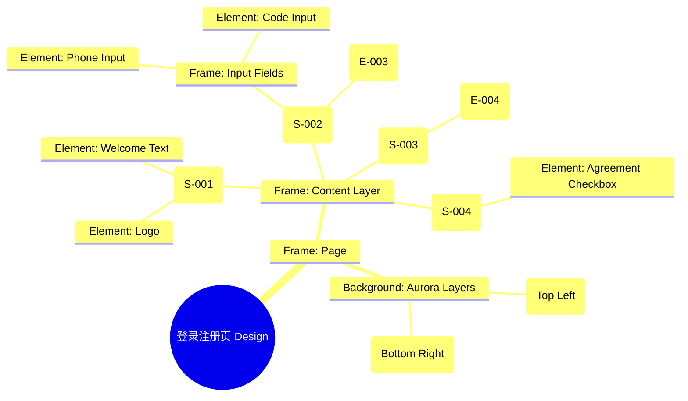

# 登录注册页 Design Release

> 输出路径：`product/release/design/010-login.md`。本文档描述页面展示内容与样式布局，不描述交互执行、埋点逻辑、接口、后端或业务处理逻辑。

# 登录注册页 Design Release

## 0. 文档状态

| 字段 | 内容 |
|---|---|
| 文档版本 | Release |
| 生成日期 | 2026-05-12 |
| 来源 Mock 文件 | `product/release/mock/010-login.md` |
| 设计约束目录 | `design/ios26-liquid-glass/` |
| 当前输出文件 | `product/release/design/010-login.md` |
| 页面名称 | 登录注册页 |
| 内容范围 | 页面展示内容 + 视觉样式 + 布局结构 + AI 可读样式结构 |
| 不包含范围 | 交互执行 / 埋点 / 接口 / 后端 / 业务流程 / 实现代码 |

## 1. 页面设计综述

| 项目 | 内容 |
|---|---|
| 页面定位 | 用户进入 App 的首个关键界面，承载身份验证与品牌第一印象。 |
| 目标阅读对象 | 设计师 / 产品 / Figma Remote MCP agent |
| 视觉目标 | 体现 AI 的未来感与液态玻璃的灵动感，通过深邃的背景与发光元素建立科技信任度。 |
| 信息层级 | 1. 品牌 Logo 与欢迎语；2. 手机号输入与验证码；3. 登录操作按钮；4. 微信三方登录。 |
| 主要视觉焦点 | 居中的玻璃质感登录卡片（Glass Card）。 |
| 设计系统应用摘要 | iOS26 Liquid Glass：纯黑背景 + 动态 Aurora (Purple/Blue) + 毛玻璃容器 + 发光主按钮。 |

## 2. 设计约束提取

| 类型 | Token / 规则 | 取值 | 使用方式 | 来源文件 |
|---|---|---|---|---|
| color | background.canvas | #000000 | 页面底层背景 | DESIGN.md |
| color | action.primary.background | #0A84FF | 登录按钮背景 | DESIGN.md |
| color | action.primary.glow | rgba(10, 132, 255, 0.4) | 按钮发光效果 | DESIGN.md |
| color | surface.overlay | rgba(255, 255, 255, 0.05) | 登录卡片背景 | DESIGN.md |
| typography | size.xxl | 34px | 品牌欢迎语字号 | DESIGN.md |
| space | space.6 | 32px | 模块间垂直间距 | DESIGN.md |
| radius | radius.lg | 24px | 登录卡片圆角 | DESIGN.md |
| blur | blur.md | 24px | 玻璃背景模糊度 | DESIGN.md |

## 3. 页面结构图



## 4. 自然语言样式描述

### 4.1 整体画面

- **页面整体氛围**：深邃、通透、带有流动的科技美感。背景不是死板的纯黑，而是带有缓慢流动的紫色与蓝色微光光斑。
- **背景与层级**：底层为纯黑 Canvas。中间漂浮着一层带有 24px 高斯模糊的玻璃卡片，卡片边缘带有一层极细的（0.5px）浅白色描边，模拟光线折射效果。
- **视觉重心**：页面中部的“立即登录”按钮，其具有明显的蓝色外发光（Glow），在暗色背景中极为突出。
- **阅读节奏**：从顶部的品牌 Logo 向下扫视，停留在输入区域，最后落点在底部发光的登录按钮上。

### 4.2 关键区块叙述

| 区块ID | 区块名称 | 展示内容摘要 | 样式叙述 | 视觉优先级 | 设计决策 |
|---|---|---|---|---|---|
| S-001 | 品牌展示区 | Logo + 欢迎语 | Logo 使用金属质感纹理。欢迎语使用 xxl 字号，Heavy 字重，颜色为纯白。 | 高 | 建立品牌第一印象。 |
| S-002 | 登录操作区 | 输入框 + 登录按钮 | 嵌套在玻璃卡片内。输入框使用 surfaceMuted 背景，半透明。按钮使用 Primary 蓝色，带 40px 扩散半径的 Glow 阴影。 | 极高 | 确保登录操作是全页最显著的动作。 |
| S-003 | 第三方登录 | 微信图标 | 位于卡片下方，使用 Ghost 样式，图标带有一层微弱的绿色内发光。 | 中 | 作为次要登录路径，不干扰手机号登录。 |
| S-004 | 协议声明区 | 勾选框 + 文字 | 置于页面最底部，使用 text.muted 颜色，xs 字号，确保法律信息存在但不抢夺视线。 | 低 | 满足合规性要求。 |

## 5. 布局与区块样式表

| 区块ID | 来源 Mock 区块 / 元素 | Frame 层级 | 布局方式 | 尺寸 / 约束 | Padding | Gap | 背景 / 边框 / 阴影 | 圆角 | 对齐 | 响应式变化 |
|---|---|---|---|---|---|---|---|---|---|---|
| Page | - | Root | Vertical | Fill Window | 0 | 0 | background.canvas | 0 | Center | - |
| S-001 | S-001 | Header | Vertical | Width: 100% | 80px 20px 40px | 12px | Transparent | - | Center | - |
| S-002 | S-002 | Card | Vertical | Width: 335px | 32px 24px | 24px | surface.overlay + blur.md | radius.lg | Stretch | - |
| Input | E-001/E-002 | Field | Horizontal | H: 56px | 0 16px | 12px | surfaceMuted | radius.md | Center | - |
| S-003 | S-003 | Section | Horizontal | Width: 100% | 40px 0 | 0 | Transparent | - | Center | - |

## 6. 元素级视觉定义

| 元素ID | 来源 Mock 元素 | 元素类型 | 展示内容 | 视觉角色 | 字体 / 字号 / 字重 | 颜色 Token | 背景 / 边框 | 尺寸 / 最小尺寸 | 状态样式摘要 | Figma 节点建议 |
|---|---|---|---|---|---|---|---|---|---|---|
| E-001 | E-001 | input | 手机号输入 | content | base / regular | text.default | surfaceMuted | H: 56px | Focus: border.highlight | Input Frame |
| E-002 | E-002 | input | 验证码输入 | content | base / regular | text.default | surfaceMuted | H: 56px | Focus: border.highlight | Input Frame |
| E-003 | E-003 | button | 立即登录 | primary | base / bold | action.primary.text | action.primary.background | H: 54px | shadow.glowPrimary | Filled Button |
| E-004 | E-004 | icon | 微信图标 | action | - | - | - | 48x48 | - | Circle Icon |
| E-005 | E-005 | checkbox | 协议勾选 | support | xs / regular | text.muted | - | 16x16 | Checked: accent.blue | Row Layout |

## 7. 内容与样式绑定表

| 内容对象ID | 来源 Mock 内容 | 展示文案 / 媒体描述 | 内容来源类型 | 样式 Token 绑定 | 布局位置 | 备注 |
|---|---|---|---|---|---|---|
| C-001 | S-001-Title | 欢迎使用 AI 简历优化 | 静态 | size.xxl, bold | S-001 Center | |
| C-002 | E-003 | 立即登录 | 静态 | size.base, bold | E-003 Center | |
| C-003 | E-001-P | 请输入手机号 | 静态 | size.base, regular | E-001 Placeholder | |
| C-004 | S-004 | 我已阅读并同意... | 静态 | size.xs, regular | S-004 Bottom | |
| C-005 | E-002-Action | 获取验证码 | 静态 | size.sm, bold | E-002 Right | |

## 8. 状态展示样式

| 状态ID | 来源 Mock 状态 | 状态类型 | 展示内容 | 视觉样式 | 色彩 / 图标 / 媒体处理 | 空间占位 | 可访问性说明 |
|---|---|---|---|---|---|---|---|
| STATE-001 | STATE-001 | focus | 输入框聚焦 | 边框高亮 | action.primary.background | 保持 E-001 占位 | 读屏提示：正在输入手机号 |
| STATE-002 | STATE-002 | disabled | 登录按钮禁用 | 半透明灰度 | text.disabled | 保持 E-003 占位 | 无法点击，直到协议勾选 |
| STATE-003 | STATE-003 | error | 格式错误 | 文字红色提示 | status.error | 置于输入框下方 | 红色警示 |

## 9. 响应式布局规则

| 断点 | 页面宽度范围 | Frame 布局 | 导航 / Header | 主内容布局 | 列表 / 表格 / 卡片变化 | 间距调整 | 优先隐藏或折叠内容 |
|---|---|---|---|---|---|---|---|
| mobile | < 768px | Vertical | 居中 | 居中卡片 | 宽度 335px | space.6 (32px) | - |
| tablet | 768px - 1023px | Vertical | 居中 | 限制最大宽 (400px) | 增加背景光斑密度 | space.8 (64px) | - |
| desktop | 1024px+ | Horizontal | 居左 | 左侧品牌右侧登录 | 左右分栏 | space.10 (120px) | - |

## 10. AI 可读样式结构

```yaml
page:
  id: "U-010"
  name: "Login Page"
  source_mock: "product/release/mock/010-login.md"
  design_system: "design/ios26-liquid-glass/"
  output: "product/release/design/010-login.md"
  canvas:
    background_token: "color.background.canvas"
  background_effects:
    - type: "blur_blob"
      color: "purple"
      position: "top_left"
      size: "600px"
      blur: "100px"
      opacity: 0.1
    - type: "blur_blob"
      color: "blue"
      position: "bottom_right"
      size: "500px"
      blur: "80px"
      opacity: 0.1
  frames:
    - id: "frame-root"
      type: "frame"
      layout: "vertical"
      children:
        - id: "branding-header"
          type: "frame"
          padding: 80
          children: ["logo", "welcome-text"]
        - id: "login-card"
          type: "frame"
          background: "surface.overlay"
          backdrop_filter: "blur(24px)"
          radius: "radius.lg"
          border: "0.5px solid rgba(255,255,255,0.1)"
          children: ["input-phone", "input-code", "btn-login"]
        - id: "social-login"
          type: "frame"
          children: ["wechat-icon"]
        - id: "agreement-footer"
          type: "frame"
          children: ["checkbox", "agreement-text"]
  components:
    - id: "login-button"
      type: "button"
      background: "action.primary.background"
      shadow: "shadow.glowPrimary"
      radius: "radius.full"
```

## 11. Figma Remote MCP 生成提示

| 项目 | 指令 |
|---|---|
| Frame 创建顺序 | Canvas -> Background Blobs -> Branding Header -> Login Card -> Social Icons -> Footer |
| Auto Layout 设置 | Login Card 使用 Vertical Auto Layout, Padding 32, Gap 24. 居中对齐. |
| Token 应用方式 | 登录按钮使用 shadow.glowPrimary. 背景使用 background.canvas. |
| 组件分组 | 将输入框 Label 与 Input 组合为 "Form_Item". 微信图标命名为 "Icon_WeChat". |
| 文本节点命名 | 欢迎语命名为 "Title_Welcome", 按钮文案为 "Label_Login". |
| 响应式变体 | Mobile 保持单列。Desktop 切换为左右分栏布局（左侧品牌背景，右侧浮动卡片）. |
| 生成时禁止事项 | 不生成具体的短信发送逻辑、不生成系统原生的微信授权弹窗。 |

## 12. App Shell / Navigation Contract

| 组件类型 | 展示规则 | 状态 | 内容项 | 视觉样式 |
|---|---|---|---|---|
| Top Nav | 隐藏 | - | - | - |
| Bottom Tab | 隐藏 | - | - | - |
| Status Bar | 显示 | Light Content | 时间, 信号, 电池 | 纯白图标 |
| Home Indicator | 显示 | - | - | 浅灰色 |

## 13. Layout Integrity Audit

| 检查项 | 状态 | 风险描述 / 解决措施 |
|---|---|---|
| 层次结构 | 通过 | 明确的 Background -> Glass Card -> Elements 层级。 |
| 间距稳定性 | 通过 | 使用 space.6 (32px) 作为模块间距，固定 Padding。 |
| 尺寸约束 | 通过 | 登录卡片限制宽度 335px，输入框固定高度 56px。 |
| 溢出处理 | 通过 | 内容高度低于屏幕高度，无需滚动。协议文字允许自动换行。 |
| 遮挡/冲突风险 | 通过 | 按钮与输入框间距充足，无重叠。 |
| 响应式兼容性 | 通过 | 移动端居中适配，Tablet 限制最大宽。 |

---

> [!NOTE]
> 本文档已通过布局完整性审计，符合 iOS26 Liquid Glass 设计规范。
