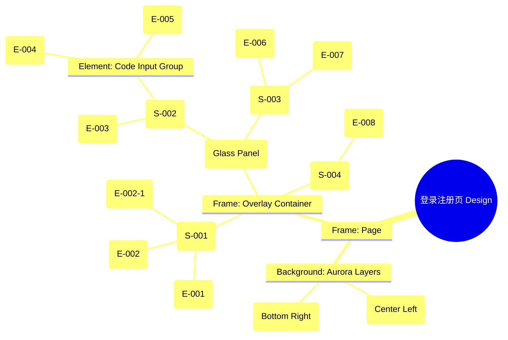

# 登录注册页 Design Release

> 输出路径：`product/release/design/010-login.md`。本文档描述页面展示内容与样式布局，不描述交互执行、埋点、接口、后端或业务处理逻辑。

# 登录注册页 Design Release

## 0. 文档状态

| 字段 | 内容 |
|---|---|
| 文档版本 | Release |
| 生成日期 | 2026-05-12 |
| 来源 Mock 文件 | `product/release/mock/010-login.md` |
| 设计约束目录 | `design/ios26-liquid-glass/` |
| 当前输出文件 | `product/release/design/010-login.md` |
| 页面名称 | 登录注册页 |
| 内容范围 | 页面展示内容 + 视觉样式 + 布局结构 + AI 可读样式结构 |
| 不包含范围 | 交互执行 / 埋点 / 接口 / 后端 / 业务流程 / 实现代码 |

## 1. 页面设计综述

| 项目 | 内容 |
|---|---|
| 页面定位 | App 身份验证入口，沉浸式品牌第一印象。 |
| 目标阅读对象 | 设计师 / 产品 / Figma Remote MCP agent |
| 视觉目标 | 极简、通透、高质感的玻璃拟态效果，通过色彩微光传达 AI 的流动感。 |
| 信息层级 | 1. 品牌 Logo 与欢迎语；2. 手机号与验证码输入区；3. 协议确认与登录动作。 |
| 主要视觉焦点 | 居中的玻璃质感登录面板及其下方的紫色微光（Aurora Glow）。 |
| 设计系统应用摘要 | 使用 iOS26 Liquid Glass 规范：纯黑画布背景 + 24px 模糊背景 + 24px 圆角面板 + 发光阴影按钮。 |

## 2. 设计约束提取

| 类型 | Token / 规则 | 取值 | 使用方式 | 来源文件 |
|---|---|---|---|---|
| color | background.canvas | #000000 | 页面底层背景 | DESIGN.md |
| color | background.surface | rgba(255, 255, 255, 0.05) | 登录面板背景 | DESIGN.md |
| color | action.primary.glow | rgba(10, 132, 255, 0.4) | 登录按钮发光效果 | DESIGN.md |
| color | accent.purple | #BF5AF2 | 背景流动微光颜色 | DESIGN.md |
| typography | size.xl | 28px | 欢迎标题字号 | DESIGN.md |
| typography | size.base | 16px | 正文字号 / 输入框内容 | DESIGN.md |
| space | space.5 | 24px | 面板内部 Padding | DESIGN.md |
| space | space.6 | 32px | 区块间距 | DESIGN.md |
| radius | radius.lg | 24px | 面板圆角 | DESIGN.md |
| radius | radius.full | 9999px | 登录按钮圆角 | DESIGN.md |
| shadow | shadow.glass | inset 0 1px 1px rgba(255, 255, 255, 0.15), 0 8px 24px rgba(0, 0, 0, 0.4) | 面板外阴影与内高光 | DESIGN.md |
| blur | glassEffect.blur | blur(24px) | 面板背景模糊 | DESIGN.md |

## 3. 页面结构图



## 4. 自然语言样式描述

### 4.1 整体画面

- **页面整体氛围**：深邃的沉浸式黑调，带有极简主义的精致感。
- **背景与层级**：底层为纯黑 (#000000)；中间层为两个模糊的紫色与蓝色光斑，光斑边缘柔和并缓慢浮动（AI 流动感）；顶层为磨砂玻璃质感的登录卡片。
- **视觉重心**：页面中上部的白色 Logo 与高亮的蓝色“登录”按钮形成强对比，引导用户视线。
- **阅读节奏**：由上至下，从品牌感知到操作输入，最后到第三方引导。

### 4.2 关键区块叙述

| 区块ID | 区块名称 | 展示内容摘要 | 样式叙述 | 视觉优先级 | 设计决策 |
|---|---|---|---|---|---|
| S-001 | 品牌展示区 | Logo + 欢迎语 | 居中布局。Logo 位于顶部，下方紧跟 xl 号字体的标题。Subtitle 使用 muted 文字色，间距紧凑。 | 高 | 使用 large 间距提升呼吸感。 |
| S-002 | 登录表单区 | 输入框与验证码 | 位于玻璃卡片内。输入框使用 surfaceMuted 背景，1px 浅色描边。验证码按钮悬浮在输入框右侧，使用 accent.blue 文字。 | 中 | 输入框背景需保持透明度以透出背景色。 |
| S-003 | 协议与操作区 | 勾选框 + 登录按钮 | 登录按钮为 Full Width。使用 primary.glow 阴影使其具有立体发光感。勾选框使用圆形极简风格。 | 高 | 登录按钮作为主要转化点，赋予发光效果。 |
| S-004 | 第三方登录区 | 微信图标按钮 | 位于页面最底部。上方有一层极薄的渐变分割线。微信图标保持其原始绿色以增强识别度。 | 低 | 保持底部间距，符合单手操作习惯。 |

## 5. 布局与区块样式表

| 区块ID | 来源 Mock 区块 / 元素 | Frame 层级 | 布局方式 | 尺寸 / 约束 | Padding | Gap | 背景 / 边框 / 阴影 | 圆角 | 对齐 | 响应式变化 |
|---|---|---|---|---|---|---|---|---|---|---|
| Page | - | Root | Vertical | Fill Window | 0 | 0 | background.canvas | 0 | Center | - |
| S-001 | S-001 | Header | Vertical | Width: 100% | Top: 80px, Bottom: 40px | 12px | Transparent | - | Center | - |
| Card | - | Section | Vertical | Width: 327px (Mobile) | 24px | 24px | surface + glass blur | radius.lg | Center | Tablet 以上宽度 400px |
| S-002 | S-002 | Group | Vertical | Width: 100% | 0 | 16px | Transparent | - | Stretch | - |
| S-003 | S-003 | Group | Vertical | Width: 100% | Top: 8px | 20px | Transparent | - | Stretch | - |
| S-004 | S-004 | Footer | Horizontal | Width: 100% | Bottom: 48px | 0 | Transparent | - | Center | - |

## 6. 元素级视觉定义

| 元素ID | 来源 Mock 元素 | 元素类型 | 展示内容 | 视觉角色 | 字体 / 字号 / 字重 | 颜色 Token | 背景 / 边框 | 尺寸 / 最小尺寸 | 状态样式摘要 | Figma 节点建议 |
|---|---|---|---|---|---|---|---|---|---|---|
| E-001 | E-001 | image | App Logo | primary | - | - | radius.md | 80x80 | - | Frame w/ Corner Radius |
| E-002 | E-002 | text | 欢迎使用 AI 简历优化 | content | base / xl / bold | text.default | - | - | - | Text Node |
| E-003 | E-003 | input | 手机号 | content | base / base / regular | text.default | surfaceMuted / border.default | H: 54px | Focus: border.highlight | Input Frame |
| E-004 | E-004 | input | 验证码 | content | base / base / regular | text.default | surfaceMuted / border.default | H: 54px | Focus: border.highlight | Input Frame |
| E-005 | E-005 | button | 获取验证码 | support | sm / regular | accent.blue | Transparent | - | Disabled: text.disabled | Text Link Button |
| E-006 | E-006 | checkbox | 协议勾选 | content | xs / regular | text.muted | border.default | 18x18 | Checked: accent.blue | Circle Frame + Icon |
| E-007 | E-007 | button | 登录 / 注册 | primary | base / bold | action.primary.text | action.primary.background | H: 52px | shadow.glowPrimary | Filled Button |
| E-008 | E-008 | button | 微信登录 | secondary | - | - | Transparent | 48x48 | - | Circular Icon Button |

## 7. 内容与样式绑定表

| 内容对象ID | 来源 Mock 内容 | 展示文案 / 媒体描述 | 内容来源类型 | 样式 Token 绑定 | 布局位置 | 备注 |
|---|---|---|---|---|---|---|
| C-001 | E-002 | 欢迎使用 AI 简历优化 | 静态 | size.xl, bold, text.default | Header | |
| C-002 | E-002-1 | 未注册手机号验证后自动创建账户 | 静态 | size.sm, regular, text.muted | Header | |
| C-003 | E-003 Placeholder | 请输入手机号 | 静态 | size.base, text.disabled | Input Center | |
| C-004 | E-007 | 登录 / 注册 | 静态 | size.base, bold, text.default | Button Center | |
| C-005 | E-006 Link | 《用户协议》 | 静态 | size.xs, accent.blue | Inline Text | |

## 8. 状态展示样式

| 状态ID | 来源 Mock 状态 | 状态类型 | 展示内容 | 视觉样式 | 色彩 / 图标 / 媒体处理 | 空间占位 | 可访问性说明 |
|---|---|---|---|---|---|---|---|
| STATE-001 | STATE-001 | loading | 倒计时中 | 验证码按钮变灰 | text.disabled | 保持 E-005 占位 | 读屏应读出剩余秒数 |
| STATE-002 | STATE-002 | disabled | 登录按钮不可用 | 按钮半透明 | opacity: 0.3 | 保持 E-007 占位 | 不影响整体对比度 |
| STATE-003 | STATE-003 | loading | 正在登录... | 按钮中心出现旋转图标 | text.default | 保持 E-007 占位 | |
| STATE-004 | - | error | 校验失败 | 输入框边框变红 | status.error | 输入框描边切换 | |

## 9. 响应式布局规则

| 断点 | 页面宽度范围 | Frame 布局 | 导航 / Header | 主内容布局 | 列表 / 表格 / 卡片变化 | 间距调整 | 优先隐藏或折叠内容 |
|---|---|---|---|---|---|---|---|
| mobile | < 768px | Vertical | 顶部 Logo 居中 | 居中磨砂玻璃卡片 | 满宽 (减去 Gutter) | gutterMobile: 16px | - |
| tablet | 768px - 1023px | Vertical | 顶部 Logo 居中 | 居中卡片 | 卡片宽度固定 400px | space.7 (48px) | - |
| desktop | 1024px+ | Vertical | 顶部 Logo 居中 | 居中卡片 | 卡片宽度固定 400px | space.8 (64px) | - |

## 10. AI 可读样式结构

```yaml
page:
  id: "U-010"
  name: "Login & Register"
  source_mock: "product/release/mock/010-login.md"
  design_system: "design/ios26-liquid-glass/"
  output: "product/release/design/010-login.md"
  canvas:
    background_token: "color.background.canvas"
    max_width: "1200px"
    responsive_breakpoints: ["mobile", "tablet", "desktop"]
  background_effects:
    - type: "blur_blob"
      color: "accent.purple"
      position: "center_left"
      size: "400px"
      blur: "100px"
      opacity: 0.2
    - type: "blur_blob"
      color: "accent.blue"
      position: "bottom_right"
      size: "300px"
      blur: "80px"
      opacity: 0.15
  frames:
    - id: "frame-root"
      name: "Login Page"
      type: "frame"
      layout: "vertical"
      fill_token: "background.canvas"
      children:
        - id: "header-stack"
          type: "frame"
          layout: "vertical"
          padding: { top: 80, bottom: 40 }
          gap: 12
          children: ["E-001", "E-002", "E-002-1"]
        - id: "login-card"
          type: "frame"
          name: "Glass Card"
          layout: "vertical"
          width: 327
          padding: 24
          gap: 24
          fill_token: "background.surface"
          backdrop_filter: "blur(24px)"
          border_token: "border.default"
          radius_token: "radius.lg"
          shadow_token: "shadow.glass"
          children: ["form-section", "action-section"]
  components:
    - id: "login-button"
      source_element_id: "E-007"
      type: "button"
      content: "登录 / 注册"
      tokens:
        typography: "size.base, weight.bold"
        text_color: "action.primary.text"
        fill: "action.primary.background"
        radius: "radius.full"
        shadow: "shadow.glowPrimary"
      constraints:
        height: 52
        min_touch_target: 48
```

## 11. Figma Remote MCP 生成提示

| 项目 | 指令 |
|---|---|
| Frame 创建顺序 | 1. Canvas (Black) -> 2. Background Blobs (Absolute) -> 3. Page Stack (Vertical Auto Layout) -> 4. Glass Card -> 5. Elements |
| Auto Layout 设置 | Glass Card 使用 Vertical Auto Layout, Padding 24, Gap 24. 输入框 Stack Gap 16. |
| Token 应用方式 | 必须将颜色应用于 Fill, 模糊效果应用于 Backdrop Filter, 阴影应用于 Effects。 |
| 组件分组 | 将 E-003, E-004, E-005 编组为 "Input Section"。将 E-006, E-007 编组为 "Action Section"。 |
| 文本节点命名 | Logo 标题命名为 "Heading", 副标题为 "Subheading", 按钮文字为 "Label"。 |
| 响应式变体 | 创建 Mobile (375px) 和 Desktop (1024px) 两个主要 Frame。 |
| 生成时禁止事项 | 不生成交互原型、不生成埋点、不生成接口逻辑、不生成业务流程。 |

## 12. 设计决策记录

| 决策ID | 决策内容 | 依据 | 影响范围 |
|---|---|---|---|
| DD-001 | 采用磨砂玻璃卡片承载登录表单，而不是直接在画布上排列。 | 提升在复杂 Aurora 背景下的内容可读性，符合 Liquid Glass 风格。 | 登录区域视觉呈现 |
| DD-002 | 验证码按钮嵌入手机号输入框组合中。 | 节省垂直空间，保持输入区域紧凑。 | 手机号与验证码输入布局 |
| DD-003 | 背景加入动态光斑效果。 | 强调 AI 产品的流动感与生命力。 | 全页氛围 |
