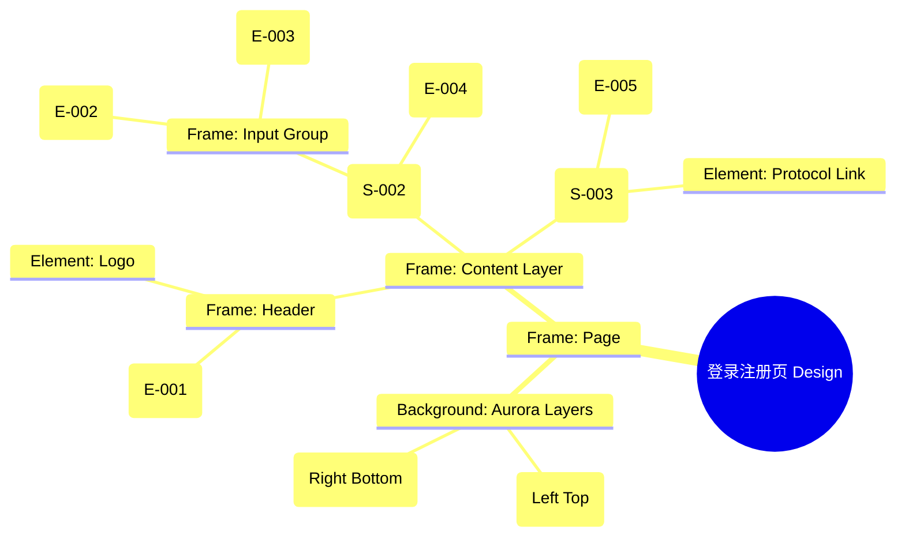

# 登录注册页 Design Release

> 输出路径：`product/release/design/010-login.md`。本文档描述页面展示内容与样式布局，不描述交互执行、埋点、接口、后端或业务处理逻辑。

# 登录注册页 Design Release

## 0. 文档状态

| 字段 | 内容 |
|---|---|
| 文档版本 | Release |
| 生成日期 | 2026-05-12 |
| 来源 Mock 文件 | `product/release/mock/010-login.md` |
| 设计约束目录 | `design/ios26-liquid-glass/` |
| 当前输出文件 | `product/release/design/010-login.md` |
| 页面名称 | 登录注册页 |
| 内容范围 | 页面展示内容 + 视觉样式 + 布局结构 + AI 可读样式结构 |
| 不包含范围 | 交互执行 / 埋点 / 接口 / 后端 / 业务流程 / 实现代码 |

## 1. 页面设计综述

| 项目 | 内容 |
|---|---|
| 页面定位 | 用户进入 App 的第一站，建立第一眼“智能、高端”的品牌印象。 |
| 目标阅读对象 | 设计师 / 产品 / Figma Remote MCP agent |
| 视觉目标 | 利用极简的玻璃材质与流动的背景光影，营造出轻盈、纯净且具有未来感的登录体验。 |
| 信息层级 | 1. 品牌 Slogan；2. 手机号/验证码输入（核心操作）；3. 登录按钮（主 Action）；4. 协议勾选。 |
| 主要视觉焦点 | 中心悬浮的玻璃登录卡片。 |
| 设计系统应用摘要 | iOS26 Liquid Glass：背景 #000000 + 动态 Aurora (Blue/Purple) + 磨砂玻璃容器。 |

## 2. 设计约束提取

| 类型 | Token / 规则 | 取值 | 使用方式 | 来源文件 |
|---|---|---|---|---|
| color | background.canvas | #000000 | 页面底层背景 | DESIGN.md |
| color | accent.blue | #0A84FF | 背景流动光斑 / 活跃状态 | DESIGN.md |
| color | accent.purple | #BF5AF2 | 背景流动光斑 | DESIGN.md |
| color | background.surface | rgba(255, 255, 255, 0.05) | 登录卡片背景 | DESIGN.md |
| typography | size.xl | 28px | 品牌 Slogan 字号 | DESIGN.md |
| typography | size.base | 16px | 表单文本字号 | DESIGN.md |
| space | space.6 | 32px | 页面主体间距 | DESIGN.md |
| radius | radius.lg | 24px | 登录卡片圆角 | DESIGN.md |
| shadow | glowPrimary | 0 0 24px rgba(10, 132, 255, 0.3) | 登录按钮发光 | DESIGN.md |

## 3. 页面结构图



## 4. 自然语言样式描述

### 4.1 整体画面

- **页面整体氛围**：深邃、通透、带有呼吸感。背景不是死黑，而是通过两个极低透明度的彩色 Aurora（青蓝与丁香紫）缓慢流动形成的动态基调。
- **背景与层级**：底层为纯黑 Canvas。背景中带有一个位于左上方的青蓝色光斑和一个位于右下方的紫色光斑。登录卡片通过 `blur(24px)` 与背景产生虚实结合的层次感。
- **视觉重心**：中心的玻璃登录卡片，其边缘带有 1px 的半透明白边。
- **阅读节奏**：Logo -> Slogan -> 登录表单 -> 底部协议。

### 4.2 关键区块叙述

| 区块ID | 区块名称 | 展示内容摘要 | 样式叙述 | 视觉优先级 | 设计决策 |
|---|---|---|---|---|---|
| S-001 | 品牌展示区 | Logo + Slogan | 位于页面上方 25% 处。Slogan 文字使用 `size.xl` + `bold`，颜色为 `text.default`。 | 高 | 建立品牌认知。 |
| S-002 | 登录表单区 | 输入框 + 登录按钮 | 位于页面中心。卡片使用 `radius.lg`，背景 `surface`。输入框背景使用 `surfaceMuted`，不带边框。 | 极高 | 核心交互区域，需极致简洁。 |
| S-003 | 协议勾选区 | 协议及三方登录 | 位于页面底部。文字使用 `size.sm`，颜色 `text.muted`。三方登录图标采用单色扁平化处理。 | 低 | 降低法律条款的视觉噪音。 |

## 5. 布局与区块样式表

| 区块ID | 来源 Mock 区块 / 元素 | Frame 层级 | 布局方式 | 尺寸 / 约束 | Padding | Gap | 背景 / 边框 / 阴影 | 圆角 | 对齐 | 响应式变化 |
|---|---|---|---|---|---|---|---|---|---|---|
| Page | - | Root | Vertical | Fill Window | 0 | 0 | background.canvas | 0 | Center | - |
| S-001 | S-001 | Section | Vertical | Width: 100% | 64px 0 | 16px | Transparent | - | Center | - |
| S-002 | S-002 | Card | Vertical | Width: 335px | 32px 24px | 24px | surface + blur | radius.lg | Top | - |
| S-003 | S-003 | Section | Vertical | Width: 100% | 40px 0 | 12px | Transparent | - | Center | Fixed Bottom |

## 6. 元素级视觉定义

| 元素ID | 来源 Mock 元素 | 元素类型 | 展示内容 | 视觉角色 | 字体 / 字号 / 字重 | 颜色 Token | 背景 / 边框 | 尺寸 / 最小尺寸 | 状态样式摘要 | Figma 节点建议 |
|---|---|---|---|---|---|---|---|---|---|---|
| E-001 | E-001 | text | AI 赋能求职... | headline | xl / bold | text.default | - | - | - | Text Layer |
| E-002 | E-002 | input | 手机号输入 | field | base / regular | text.default | surfaceMuted | H: 54px | Focus: border.highlight | Form Input |
| E-003 | E-003 | input | 验证码 | field | base / regular | text.default | surfaceMuted | H: 54px | - | Form Input |
| E-004 | E-004 | button | 登录 / 注册 | primary | base / bold | action.primary.text | action.primary.background | H: 54px | shadow.glowPrimary | Filled Button |
| E-005 | E-005 | checkbox | 协议勾选 | support | sm / regular | text.muted | - | 18x18 | - | Checkbox Group |

## 7. 内容与样式绑定表

| 内容对象ID | 来源 Mock 内容 | 展示文案 / 媒体描述 | 内容来源类型 | 样式 Token 绑定 | 布局位置 | 备注 |
|---|---|---|---|---|---|---|
| C-001 | E-001 | AI 赋能求职，一键优化简历 | 静态 | xl, bold | S-001 | |
| C-002 | E-002 | 请输入手机号 | 静态 | base, regular | E-002 Placeholder | |
| C-003 | E-004 | 登录 / 注册 | 静态 | base, bold | E-004 Text | |
| C-004 | S-003 | 我已阅读并同意“服务协议” | 静态 | sm, regular | S-003 | |

## 8. 状态展示样式

| 状态ID | 来源 Mock 状态 | 状态类型 | 展示内容 | 视觉样式 | 色彩 / 图标 / 媒体处理 | 空间占位 | 可访问性说明 |
|---|---|---|---|---|---|---|---|
| STATE-001 | STATE-001 | error | 验证码错误 | 输入框下方红色文字 | status.error | 不占位 (Absolute) | |
| STATE-002 | STATE-002 | loading | 登录中... | 按钮内 Spinner | #FFFFFF | 保持 E-004 占位 | |
| STATE-003 | - | focus | 焦点状态 | 边框变亮 | border.highlight | - | |

## 9. 响应式布局规则

| 断点 | 页面宽度范围 | Frame 布局 | 导航 / Header | 主内容布局 | 列表 / 表格 / 卡片变化 | 间距调整 | 优先隐藏或折叠内容 |
|---|---|---|---|---|---|---|---|
| mobile | < 768px | Vertical | 居中 | 卡片全宽(带 Margin) | - | space.4 (16px) | - |
| tablet | 768px - 1023px | Vertical | 居中 | 限制卡片最大宽 | - | space.6 (32px) | - |
| desktop | 1024px+ | Horizontal | 居左 | 左右分栏 (插画+登录) | - | space.8 (64px) | - |

## 10. AI 可读样式结构

```yaml
page:
  id: "U-010"
  name: "Login Page"
  source_mock: "product/release/mock/010-login.md"
  design_system: "design/ios26-liquid-glass/"
  output: "product/release/design/010-login.md"
  canvas:
    background_token: "color.background.canvas"
  background_effects:
    - type: "blur_blob"
      color: "accent.blue"
      position: "top_left"
      size: "600px"
      blur: "120px"
      opacity: 0.1
    - type: "blur_blob"
      color: "accent.purple"
      position: "bottom_right"
      size: "500px"
      blur: "100px"
      opacity: 0.08
  frames:
    - id: "frame-root"
      type: "frame"
      layout: "vertical"
      children:
        - id: "header-branding"
          type: "frame"
          layout: "vertical"
          padding: 64
          children: ["logo", "E-001"]
        - id: "login-card"
          type: "frame"
          background: "background.surface"
          backdrop_filter: "blur(24px)"
          border: "1px solid border.default"
          radius: "radius.lg"
          padding: 32
          children: ["E-002", "E-003", "E-004"]
        - id: "agreement-footer"
          type: "frame"
          layout: "horizontal"
          children: ["E-005", "links"]
```

## 11. Figma Remote MCP 生成提示

| 项目 | 指令 |
|---|---|
| Frame 创建顺序 | Canvas -> Background Blobs -> Header Section -> Login Card -> Footer Section |
| Auto Layout 设置 | Login Card 使用 Vertical Auto Layout, Padding 32, Gap 24. |
| Token 应用方式 | 登录按钮背景使用 action.primary.background, 外部投影 shadow.glowPrimary. |
| 组件分组 | 将输入框和标签编组为 "Form_Field". |
| 文本节点命名 | Slogan 命名为 "Headline", 按钮文字为 "Button_Text". |
| 响应式变体 | 在 Mobile 下将 Login Card 的宽度设置为 "Fill Container" 并设置左右 Margin 20. |
| 生成时禁止事项 | 不生成真实的交互动画、不生成系统级通知栏。 |

## 12. 设计决策记录

| 决策ID | 决策内容 | 依据 | 影响范围 |
|---|---|---|---|
| DD-001 | 使用深色玻璃卡片作为主体容器。 | 符合 Liquid Glass 核心美学，突出通透感。 | 全局视觉 |
| DD-002 | 背景应用蓝紫 Aurora 微光。 | 增加色彩流动感，避免纯黑背景的压抑感。 | 页面背景 |
| DD-003 | 登录按钮使用强烈的主色外发光。 | 引导用户视觉流向主转化动作。 | 核心交互 |
