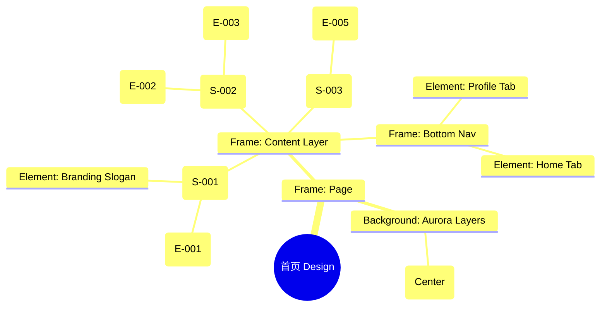

# 首页 Design Release

> 输出路径：`product/release/design/020-home.md`。本文档描述页面展示内容与样式布局，不描述交互执行、埋点、接口、后端或业务处理逻辑。

# 首页 Design Release

## 0. 文档状态

| 字段 | 内容 |
|---|---|
| 文档版本 | Release |
| 生成日期 | 2026-05-12 |
| 来源 Mock 文件 | `product/release/mock/020-home.md` |
| 设计约束目录 | `design/ios26-liquid-glass/` |
| 当前输出文件 | `product/release/design/020-home.md` |
| 页面名称 | 首页 |
| 内容范围 | 页面展示内容 + 视觉样式 + 布局结构 + AI 可读样式结构 |
| 不包含范围 | 交互执行 / 埋点 / 接口 / 后端 / 业务流程 / 实现代码 |

## 1. 页面设计综述

| 项目 | 内容 |
|---|---|
| 页面定位 | App 的核心工作台，展示近期记录并提供优化的总入口。 |
| 目标阅读对象 | 设计师 / 产品 / Figma Remote MCP agent |
| 视觉目标 | 营造一种“个人数字资产实验室”的氛围，通过深色画布与高亮卡片的对比，突出简历管理的高效性。 |
| 信息层级 | 1. 核心操作区（开启优化按钮）；2. 近期简历列表（快速回溯）；3. VIP 权益入口（转化引导）。 |
| 主要视觉焦点 | 右下角带强烈 GLO 效果的“开启优化”悬浮按钮。 |
| 设计系统应用摘要 | iOS26 Liquid Glass：背景 #000000 + 动态 Aurora (Cyan/Blue) + 列表卡片玻璃材质。 |

## 2. 设计约束提取

| 类型 | Token / 规则 | 取值 | 使用方式 | 来源文件 |
|---|---|---|---|---|
| color | background.canvas | #000000 | 页面底层背景 | DESIGN.md |
| color | accent.cyan | #32ADE6 | 顶部光斑 / 选中态 | DESIGN.md |
| color | background.surface | rgba(255, 255, 255, 0.05) | 简历项卡片背景 | DESIGN.md |
| typography | size.xl | 28px | 页面大标题字号 | DESIGN.md |
| typography | size.sm | 14px | 卡片辅助文字字号 | DESIGN.md |
| space | space.5 | 24px | 列表项垂直间距 | DESIGN.md |
| radius | radius.md | 14px | 列表项卡片圆角 | DESIGN.md |
| shadow | glowPrimary | 0 0 24px rgba(10, 132, 255, 0.3) | 悬浮按钮发光 | DESIGN.md |

## 3. 页面结构图



## 4. 自然语言样式描述

### 4.1 整体画面

- **页面整体氛围**：专业、专注且充满动态。背景呈现出深邃的暗室感，中心的 Cyan Aurora 缓慢律动，仿佛光源在玻璃板下方移动。
- **背景与层级**：底层为纯黑 Canvas。正中心带有一个扩散直径约 500px 的极弱青色光斑。简历卡片堆叠在光斑上方，通过 `blur(24px)` 产生微妙的漫反射效果。
- **视觉重心**：右下角蓝色的悬浮球（FAB），它不仅是页面的色彩最亮点，还带有持续的呼吸灯光效（glowPrimary）。
- **阅读节奏**：欢迎语 -> 查看最近编辑的简历 -> 决定是否开启新的优化。

### 4.2 关键区块叙述

| 区块ID | 区块名称 | 展示内容摘要 | 样式叙述 | 视觉优先级 | 设计决策 |
|---|---|---|---|---|---|
| S-001 | 工作台标题 | 用户名 + 欢迎语 | 位于页面顶部。字体使用 `size.xl` + `semibold`，文字通过微弱的 `shadow.glass` 浮现在背景上。 | 高 | 建立个人化空间感。 |
| S-002 | 历史列表区 | 简历卡片流 | 纵向排列。每张卡片背景为 `surface`，带 1px `border.default`。右侧显示匹配分值或状态标签。 | 极高 | 核心数据展示，需极佳的阅读舒适度。 |
| S-003 | 快捷操作区 | 开启优化 FAB | 悬浮于右下角。球体使用 `action.primary.background` 加强版（saturate 200%），圆角为 `radius.full`。 | 极高 | 引导核心业务路径。 |

## 5. 布局与区块样式表

| 区块ID | 来源 Mock 区块 / 元素 | Frame 层级 | 布局方式 | 尺寸 / 约束 | Padding | Gap | 背景 / 边框 / 阴影 | 圆角 | 对齐 | 响应式变化 |
|---|---|---|---|---|---|---|---|---|---|---|
| Page | - | Root | Vertical | Fill Window | 0 | 0 | background.canvas | 0 | Center | - |
| S-001 | S-001 | Section | Vertical | Width: 100% | 48px 20px | 8px | Transparent | - | Left | - |
| S-002 | S-002 | List | Vertical | Width: 100% | 0 20px | 12px | Transparent | - | Top | Scrollable |
| FAB | E-005 | Floating | Horizontal | 64x64 | - | - | action.primary + glow | radius.full | Center | Bottom Right |

## 6. 元素级视觉定义

| 元素ID | 来源 Mock 元素 | 元素类型 | 展示内容 | 视觉角色 | 字体 / 字号 / 字重 | 颜色 Token | 背景 / 边框 | 尺寸 / 最小尺寸 | 状态样式摘要 | Figma 节点建议 |
|---|---|---|---|---|---|---|---|---|---|---|
| E-001 | E-001 | text | 你好，[用户名] | title | xl / semibold | text.default | - | - | - | Text Layer |
| E-002 | E-002 | card | 简历卡片 | entry | base / medium | text.default | surface | H: 80px | Hover: surfaceOverlay | List Item Card |
| E-003 | E-003 | badge | 匹配分：88 | support | xs / medium | accent.cyan | surfaceMuted | - | - | Badge Frame |
| E-005 | E-005 | button | 开启优化 (Icon) | primary | - | - | action.primary | 64x64 | Pulse Animation | Floating Circle |

## 7. 内容与样式绑定表

| 内容对象ID | 来源 Mock 内容 | 展示文案 / 媒体描述 | 内容来源类型 | 样式 Token 绑定 | 布局位置 | 备注 |
|---|---|---|---|---|---|---|
| C-001 | E-001 | 你好，求职者 | 动态 | xl, semibold | S-001 | |
| C-002 | E-002-1 | 互联网大厂产品经理 | 动态 | base, medium | Card 1 | |
| C-003 | E-003 | 匹配分：88 | 动态 | xs, cyan | Card 1 Badge | |
| C-004 | S-003 | 开启优化 | 静态 | - | FAB Tooltip | |

## 8. 状态展示样式

| 状态ID | 来源 Mock 状态 | 状态类型 | 展示内容 | 视觉样式 | 色彩 / 图标 / 媒体处理 | 空间占位 | 可访问性说明 |
|---|---|---|---|---|---|---|---|
| STATE-001 | STATE-001 | empty | 暂无简历插画 | 居中半透明图标 | text.disabled | 占据列表区 | 引导点击 FAB |
| STATE-002 | STATE-002 | loading | 骨架屏 | 灰色脉冲块 | surfaceMuted | 保持 E-002 占位 | |
| FAB_Active| - | active | 悬浮球按压 | 缩放 0.9 + 发光增强 | shadow.glowPrimary | - | |

## 9. 响应式布局规则

| 断点 | 页面宽度范围 | Frame 布局 | 导航 / Header | 主内容布局 | 列表 / 表格 / 卡片变化 | 间距调整 | 优先隐藏或折叠内容 |
|---|---|---|---|---|---|---|---|
| mobile | < 768px | Vertical | 顶部 Tab | 单列列表 | 卡片 100% 宽 | space.4 (16px) | - |
| tablet | 768px - 1023px | Vertical | 顶部 Tab | 网格列表 (2列) | 卡片固定宽 | space.5 (24px) | - |
| desktop | 1024px+ | Horizontal | 侧边 Tab | 网格列表 (3-4列) | 卡片带更多详表 | space.6 (32px) | - |

## 10. AI 可读样式结构

```yaml
page:
  id: "U-020"
  name: "Home Page"
  source_mock: "product/release/mock/020-home.md"
  design_system: "design/ios26-liquid-glass/"
  output: "product/release/design/020-home.md"
  canvas:
    background_token: "color.background.canvas"
  background_effects:
    - type: "blur_blob"
      color: "accent.cyan"
      position: "center"
      size: "500px"
      blur: "150px"
      opacity: 0.12
  frames:
    - id: "frame-root"
      type: "frame"
      layout: "vertical"
      children:
        - id: "hero-header"
          type: "frame"
          layout: "vertical"
          padding: 48
          children: ["E-001", "subtitle"]
        - id: "resume-list-container"
          type: "frame"
          layout: "vertical"
          padding: 20
          gap: 12
          children: ["E-002-items"]
        - id: "fab-container"
          type: "overlay"
          position: "bottom_right"
          children: ["E-005"]
  components:
    - id: "resume-card"
      type: "frame"
      background: "background.surface"
      backdrop_filter: "blur(24px)"
      radius: "radius.md"
      padding: 16
      layout: "horizontal"
```

## 11. Figma Remote MCP 生成提示

| 项目 | 指令 |
|---|---|
| Frame 创建顺序 | Canvas -> Background Blob -> Hero Section -> Resume List -> FAB (Overlay) |
| Auto Layout 设置 | Resume List 使用 Vertical Auto Layout, Padding 20, Gap 12. |
| Token 应用方式 | FAB 使用 action.primary.background, 并应用 shadow.glowPrimary. |
| 组件分组 | 将单张简历卡片定义为 "List_Item_Card". |
| 文本节点命名 | 欢迎语命名为 "User_Welcome", 简历标题为 "Resume_Name". |
| 响应式变体 | 在 Desktop 下将 Resume List 切换为 Grid 布局. |
| 生成时禁止事项 | 不生成复杂的列表下拉刷新交互。 |

## 12. 设计决策记录

| 决策ID | 决策内容 | 依据 | 影响范围 |
|---|---|---|---|
| DD-001 | 首页采用中心 Cyan 光斑布局。 | 引导视觉聚焦于页面核心数据区，营造纯净的数字氛围。 | 页面背景 |
| DD-002 | 简历卡片使用中等圆角 radius.md。 | 保持列表密集度的同时确保现代感。 | 列表组件 |
| DD-003 | 开启优化功能作为全局悬浮球（FAB）。 | 核心功能的高频性要求其随时随地可触达。 | 页面交互结构 |
 Riverside, CA
