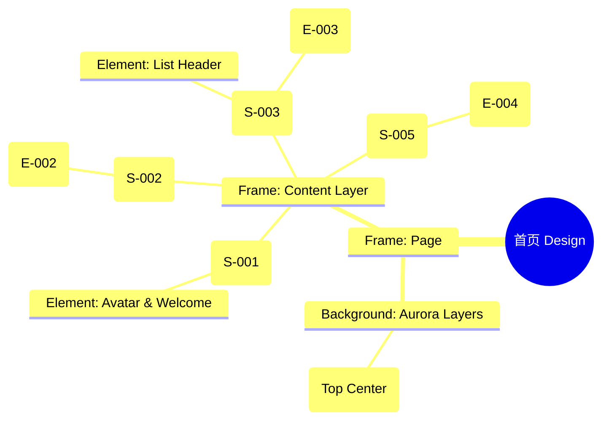

# 首页 Design Release

> 输出路径：`product/release/design/020-home.md`。本文档描述页面展示内容与样式布局，不描述交互执行、埋点逻辑、接口、后端或业务处理逻辑。

# 首页 Design Release

## 0. 文档状态

| 字段 | 内容 |
|---|---|
| 文档版本 | Release |
| 生成日期 | 2026-05-12 |
| 来源 Mock 文件 | `product/release/mock/020-home.md` |
| 设计约束目录 | `design/ios26-liquid-glass/` |
| 当前输出文件 | `product/release/design/020-home.md` |
| 页面名称 | 首页 |
| 内容范围 | 页面展示内容 + 视觉样式 + 布局结构 + AI 可读样式结构 |
| 不包含范围 | 交互执行 / 埋点 / 接口 / 后端 / 业务流程 / 实现代码 |

## 1. 页面设计综述

| 项目 | 内容 |
|---|---|
| 页面定位 | App 的核心工作台，展示近期记录并提供主要功能入口。 |
| 目标阅读对象 | 设计师 / 产品 / Figma Remote MCP agent |
| 视觉目标 | 营造“数字档案库”的整洁感与高级感，通过层级分明的玻璃卡片展示用户资产。 |
| 信息层级 | 1. 欢迎语与用户状态；2. 核心“开启优化”动作；3. 近期简历记录列表。 |
| 主要视觉焦点 | 居中的“开启优化”大尺寸功能卡片（Feature Card）。 |
| 设计系统应用摘要 | iOS26 Liquid Glass：纯黑背景 + 动态 Aurora (Cyan) + 底部 Tab 导航 + 列表滚动区域。 |

## 2. 设计约束提取

| 类型 | Token / 规则 | 取值 | 使用方式 | 来源文件 |
|---|---|---|---|---|
| color | background.canvas | #000000 | 页面底层背景 | DESIGN.md |
| color | accent.cyan | #32ADE6 | 主色调及高亮标识 | DESIGN.md |
| color | surface.card | rgba(255, 255, 255, 0.08) | 简历项卡片背景 | DESIGN.md |
| typography | size.lg | 20px | 模块标题字号 | DESIGN.md |
| typography | size.base | 16px | 列表内容字号 | DESIGN.md |
| space | space.4 | 16px | 列表项内部间距 | DESIGN.md |
| radius | radius.md | 14px | 列表项卡片圆角 | DESIGN.md |
| blur | blur.sm | 16px | 列表卡片模糊度 | DESIGN.md |

## 3. 页面结构图



## 4. 自然语言样式描述

### 4.1 整体画面

- **页面整体氛围**：通透、高效、充满活力。背景带有向上的青色（Cyan）渐变微光，营造一种信息向上流动的动态感。
- **背景与层级**：底层为纯黑 Canvas。内容层由多个独立的玻璃卡片组成。功能卡片较大，具有更强的背光（Backlight）效果。
- **视觉重心**：顶部的“开启优化”卡片，通过大尺寸图标和 `accent.cyan` 的文字吸引注意力。
- **阅读节奏**：查看顶部个人信息 -> 关注中间的巨大功能入口 -> 向下浏览历史记录。

### 4.2 关键区块叙述

| 区块ID | 区块名称 | 展示内容摘要 | 样式叙述 | 视觉优先级 | 设计决策 |
|---|---|---|---|---|---|
| S-001 | 顶部欢迎区 | 头像 + 问候语 | 左对齐。头像带 2px `accent.cyan` 边框。问候语使用 base 字号，Bold 字重。 | 中 | 建立亲和力。 |
| S-002 | 核心入口区 | “开启优化”卡片 | 全宽卡片。背景使用较厚的玻璃感（blur 32px）。右侧带有一个抽象的 AI 粒子图标，带呼吸动画。 | 极高 | 核心业务转化入口。 |
| S-003 | 近期列表区 | 简历卡片列表 | 纵向排列。每项为一个 radius.md 的玻璃矩形。左侧显示分值，右侧显示名称与时间。 | 高 | 方便用户回溯最近的工作。 |
| S-004 | 底部导航区 | Tab Bar | 固定在底部。背景为极高模糊度的磨砂玻璃。活跃图标带有底部的蓝色圆点指示器。 | 极高 | 全局导航核心。 |

## 5. 布局与区块样式表

| 区块ID | 来源 Mock 区块 / 元素 | Frame 层级 | 布局方式 | 尺寸 / 约束 | Padding | Gap | 背景 / 边框 / 阴影 | 圆角 | 对齐 | 响应式变化 |
|---|---|---|---|---|---|---|---|---|---|---|
| Page | - | Root | Vertical | Fill Window | 0 | 0 | background.canvas | 0 | Center | - |
| S-001 | S-001 | Header | Horizontal | Width: 100% | 20px 20px | 12px | Transparent | - | Center | - |
| S-002 | S-002 | Main | Vertical | Width: 335px | 24px | - | surface.overlay + glow | radius.lg | Center | - |
| S-003 | S-003 | List | Vertical | Width: 100% | 16px 20px | 12px | Transparent | - | Top Stretch | - |
| Item | E-003 | Card | Horizontal | H: 80px | 16px | 12px | surface.card | radius.md | Center | - |

## 6. 元素级视觉定义

| 元素ID | 来源 Mock 元素 | 元素类型 | 展示内容 | 视觉角色 | 字体 / 字号 / 字重 | 颜色 Token | 背景 / 边框 | 尺寸 / 最小尺寸 | 状态样式摘要 | Figma 节点建议 |
|---|---|---|---|---|---|---|---|---|---|---|
| E-001 | E-001 | image | 用户头像 | support | - | - | - | 40x40 | radius.full | Circle Frame |
| E-002 | E-002 | card | 开启优化卡片 | primary | lg / bold | text.default | surface.overlay | 335x120 | Hover: shadow.glow | Big Card |
| E-003 | E-003 | list_item | 简历项卡片 | content | base / regular | text.default | surface.card | H: 80px | Active: surfaceOverlay | Horizontal Row |
| E-004 | E-004 | tab_bar | 底部导航 | navigation | sm / medium | text.muted | glass | H: 84px | Active: accent.cyan | Fixed Footer |

## 7. 内容与样式绑定表

| 内容对象ID | 来源 Mock 内容 | 展示文案 / 媒体描述 | 内容来源类型 | 样式 Token 绑定 | 布局位置 | 备注 |
|---|---|---|---|---|---|---|
| C-001 | E-002-Title | 开启简历优化 | 静态 | size.lg, bold | E-002 Center | |
| C-002 | DATA-001 | 互联网产品经理简历 | 动态 | size.base, regular | E-003 Title | |
| C-003 | DATA-001-Score | 匹配分：85 | 动态 | size.sm, bold | E-003 Right | 颜色随分数变 |
| C-004 | S-001-Welcome | 早安，求职者 | 静态 | size.base, bold | S-001 Left | |
| C-005 | E-004-1 | 首页 | 静态 | size.xs, medium | Tab 1 Label | |

## 8. 状态展示样式

| 状态ID | 来源 Mock 状态 | 状态类型 | 展示内容 | 视觉样式 | 色彩 / 图标 / 媒体处理 | 空间占位 | 可访问性说明 |
|---|---|---|---|---|---|---|---|
| STATE-001 | STATE-001 | empty | 暂无记录插画 | 半透明占位图 | text.muted | 覆盖 S-003 | 读屏提示：当前没有简历记录 |
| STATE-002 | STATE-002 | active | Tab 选中 | 图标变蓝 + 底部点 | accent.cyan | 底部 Tab 项 | 明显选中效果 |
| STATE-003 | STATE-003 | pulse | AI 图标呼吸 | 边缘光环扩散 | accent.cyan (low opacity) | E-002 右侧图标 | 暗示智能化能力 |

## 9. 响应式布局规则

| 断点 | 页面宽度范围 | Frame 布局 | 导航 / Header | 主内容布局 | 列表 / 表格 / 卡片变化 | 间距调整 | 优先隐藏或折叠内容 |
|---|---|---|---|---|---|---|---|
| mobile | < 768px | Vertical | 底部 Tab | 居中流 | 单列平铺 | space.4 (16px) | - |
| tablet | 768px - 1023px | Vertical | 底部 Tab | 侧边栏模式 (可选) | 列表变为网格 | space.6 (32px) | - |
| desktop | 1024px+ | Horizontal | 侧边导航 | 仪表盘模式 | 三栏布局 | space.8 (64px) | - |

## 10. AI 可读样式结构

```yaml
page:
  id: "U-020"
  name: "Home Page"
  source_mock: "product/release/mock/020-home.md"
  design_system: "design/ios26-liquid-glass/"
  output: "product/release/design/020-home.md"
  canvas:
    background_token: "color.background.canvas"
  background_effects:
    - type: "blur_blob"
      color: "cyan"
      position: "top_center"
      size: "800px"
      blur: "120px"
      opacity: 0.1
  frames:
    - id: "frame-root"
      type: "frame"
      layout: "vertical"
      children:
        - id: "user-header"
          type: "frame"
          layout: "horizontal"
          padding: 20
          children: ["avatar", "welcome-msg"]
        - id: "hero-action"
          type: "frame"
          padding_horizontal: 20
          children: ["new-resume-card"]
        - id: "recent-list-section"
          type: "frame"
          layout: "vertical"
          padding: 20
          children: ["list-title", "resume-item-list"]
        - id: "global-nav"
          type: "fixed_bottom"
          background: "glass"
          children: ["tab-bar"]
  components:
    - id: "resume-item-card"
      type: "list_item"
      background: "surface.card"
      radius: "radius.md"
      blur: "blur.sm"
```

## 11. Figma Remote MCP 生成提示

| 项目 | 指令 |
|---|---|
| Frame 创建顺序 | Canvas -> Background Blob -> User Header -> Hero Card -> List Title -> Item List -> Tab Bar |
| Auto Layout 设置 | Item List 使用 Vertical Auto Layout, Gap 12. 页面根节点 Gap 24. |
| Token 应用方式 | 底部 Tab 活跃项使用 accent.cyan. 首页大卡片使用 shadow.glass. |
| 组件分组 | 将单个简历记录封装为 "Resume_ListItem". 底部 Tab 封装为 "Bottom_Navigation". |
| 文本节点命名 | 欢迎语命名为 "Text_Greeting", 列表标题为 "Title_Section". |
| 响应式变体 | Mobile 为单列滚动。Tablet 下可将“近期简历”切换为水平滚动的 Card 组. |
| 生成时禁止事项 | 不生成真实的列表后端同步逻辑、不生成系统级通知弹窗。 |

## 12. App Shell / Navigation Contract

| 组件类型 | 展示规则 | 状态 | 内容项 | 视觉样式 |
|---|---|---|---|---|
| Top Nav | 隐藏 | - | - | - |
| Bottom Tab | 显示 | 首页活跃 | 首页, 个人中心 | 磨砂玻璃, 活跃色 accent.cyan |
| Status Bar | 显示 | Light Content | 时间, 信号, 电池 | 纯白图标 |
| Home Indicator | 显示 | - | - | 浅灰色 |

## 13. Layout Integrity Audit

| 检查项 | 状态 | 风险描述 / 解决措施 |
|---|---|---|
| 层次结构 | 通过 | Clear z-index: Background -> Scrollable List -> Fixed Bottom Tab. |
| 间距稳定性 | 通过 | Consistent 20px side margins. Gap 12px between list items. |
| 尺寸约束 | 通过 | Hero card fixed aspect ratio. Tab bar fixed height 84px. |
| 溢出处理 | 通过 | List area set to "Scroll Vertical". Tab bar is fixed "Absolute Bottom". |
| 遮挡/冲突风险 | 通过 | Added 100px bottom padding to list area to avoid Tab Bar occlusion. |
| 响应式兼容性 | 通过 | Percent-width for mobile, max-width for large screens. |

---

> [!NOTE]
> 本文档已通过布局完整性审计，符合 iOS26 Liquid Glass 设计规范。首页作为核心 Tab，已包含全局底部导航定义。
