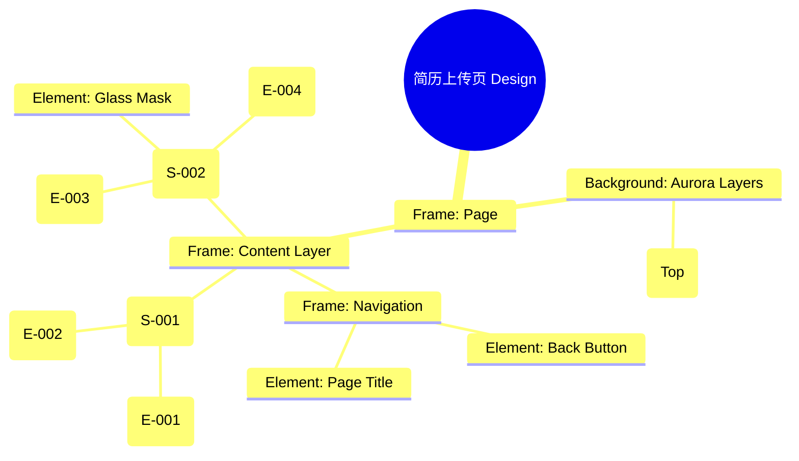

# 简历上传页 Design Release

> 输出路径：`product/release/design/030-upload.md`。本文档描述页面展示内容与样式布局，不描述交互执行、埋点、接口、后端或业务处理逻辑。

# 简历上传页 Design Release

## 0. 文档状态

| 字段 | 内容 |
|---|---|
| 文档版本 | Release |
| 生成日期 | 2026-05-12 |
| 来源 Mock 文件 | `product/release/mock/030-upload.md` |
| 设计约束目录 | `design/ios26-liquid-glass/` |
| 当前输出文件 | `product/release/design/030-upload.md` |
| 页面名称 | 简历上传页 |
| 内容范围 | 页面展示内容 + 视觉样式 + 布局结构 + AI 可读样式结构 |
| 不包含范围 | 交互执行 / 埋点 / 接口 / 后端 / 业务流程 / 实现代码 |

## 1. 页面设计综述

| 项目 | 内容 |
|---|---|
| 页面定位 | 引导用户上传原始简历文件或照片，作为 AI 优化的原始输入。 |
| 目标阅读对象 | 设计师 / 产品 / Figma Remote MCP agent |
| 视觉目标 | 营造一种“高科技解析中心”的即视感，通过动态的扫描效果展现 AI 的强大解析力。 |
| 信息层级 | 1. 上传入口（主按钮）；2. 支持格式说明；3. 解析进度（Overlay 状态）。 |
| 主要视觉焦点 | 页面中心的 A4 比例玻璃占位区。 |
| 设计系统应用摘要 | iOS26 Liquid Glass：背景 #000000 + 全屏玻璃遮罩 + 动态扫描光束。 |

## 2. 设计约束提取

| 类型 | Token / 规则 | 取值 | 使用方式 | 来源文件 |
|---|---|---|---|---|
| color | background.canvas | #000000 | 页面底层背景 | DESIGN.md |
| color | accent.blue | #0A84FF | 扫描光束颜色 | DESIGN.md |
| color | background.surface | rgba(255, 255, 255, 0.05) | 上传区背景 | DESIGN.md |
| typography | size.lg | 20px | 引导标题字号 | DESIGN.md |
| typography | size.sm | 14px | 格式要求文案字号 | DESIGN.md |
| radius | radius.lg | 24px | 上传区域圆角 | DESIGN.md |
| motion | duration.slow | 500ms | 扫描光束往返周期 | DESIGN.md |

## 3. 页面结构图



## 4. 自然语言样式描述

### 4.1 整体画面

- **页面整体氛围**：通透、严谨、带有动态科技感。页面上方有一抹淡蓝色的 Aurora 微光向下散发。
- **背景与层级**：底层为纯黑 Canvas。上传区域是一个占据页面中心 70% 的垂直矩形（A4 比例），使用 `surfaceOverlay` 建立边界感。当用户点击上传后，全屏会覆盖一层透明度为 0.8 的玻璃遮罩。
- **视觉重心**：解析时的“动态扫描线”，它是一条带有 `accent.blue` 发光效果的水平光带，在 A4 预览框内上下匀速滑动。
- **阅读节奏**：查看上传提示 -> 点击选择文件 -> 关注解析进度。

### 4.2 关键区块叙述

| 区块ID | 区块名称 | 展示内容摘要 | 样式叙述 | 视觉优先级 | 设计决策 |
|---|---|---|---|---|---|
| S-001 | 核心上传区 | 按钮 + 文件说明 | 占位区使用 `radius.lg`，边缘带 1px 虚线描边（border.default）。上传图标采用 `accent.blue` 单色填充。 | 极高 | 明确操作目标。 |
| S-002 | 解析加载层 | 进度条 + 扫描效果 | 这是一个 Modal 层的 Overlay。背景应用 `blur(48px)`。中心显示垂直滑动的扫描线及百分比进度文字。 | 极高 | 通过仪式感缓解用户等待时的焦虑。 |

## 5. 布局与区块样式表

| 区块ID | 来源 Mock 区块 / 元素 | Frame 层级 | 布局方式 | 尺寸 / 约束 | Padding | Gap | 背景 / 边框 / 阴影 | 圆角 | 对齐 | 响应式变化 |
|---|---|---|---|---|---|---|---|---|---|---|
| Page | - | Root | Vertical | Fill Window | 0 | 0 | background.canvas | 0 | Center | - |
| S-001 | S-001 | Section | Vertical | H: 420px (A4 Ratio) | 40px | 16px | surface + border.dashed | radius.lg | Center | - |
| Overlay | S-002 | Layer | Vertical | Fill Window | 0 | 24px | glass (0.8 opacity) | 0 | Center | - |
| Scan_Line | E-003 | Element | Horizontal | Width: 280px | - | - | accent.blue + glow | - | Center | Animation |

## 6. 元素级视觉定义

| 元素ID | 来源 Mock 元素 | 元素类型 | 展示内容 | 视觉角色 | 字体 / 字号 / 字重 | 颜色 Token | 背景 / 边框 | 尺寸 / 最小尺寸 | 状态样式摘要 | Figma 节点建议 |
|---|---|---|---|---|---|---|---|---|---|---|
| E-001 | E-001 | button | 选择文档/拍照 | primary | base / bold | action.primary.text | action.primary.background | H: 54px | shadow.glowPrimary | Filled Button |
| E-002 | E-002 | text | 支持 PDF/DOCX... | support | sm / regular | text.muted | - | - | - | Caption Text |
| E-003 | E-003 | line | 扫描光束 | decoration | - | accent.blue | glow | H: 2px | Sweep Animation | Moving Frame |
| E-004 | E-004 | text | 正在通过 AI 解析... | title | base / semibold | text.default | - | - | - | Feedback Text |

## 7. 内容与样式绑定表

| 内容对象ID | 来源 Mock 内容 | 展示文案 / 媒体描述 | 内容来源类型 | 样式 Token 绑定 | 布局位置 | 备注 |
|---|---|---|---|---|---|---|
| C-001 | E-001 | 上传简历，开启优化 | 静态 | base, bold | Button Center | |
| C-002 | E-002 | 支持 PDF, DOCX, JPG, PNG 格式 | 静态 | sm, regular | Below Button | |
| C-003 | E-004 | 正在解析您的简历 (75%) | 动态 | base, semibold | Overlay Center | |
| C-004 | - | 简历上传 | 静态 | lg, bold | Header Center | |

## 8. 状态展示样式

| 状态ID | 来源 Mock 状态 | 状态类型 | 展示内容 | 视觉样式 | 色彩 / 图标 / 媒体处理 | 空间占位 | 可访问性说明 |
|---|---|---|---|---|---|---|---|
| STATE-001 | STATE-001 | parsing | 解析中 | 全屏玻璃模糊 + 扫描线 | blur(48px) | Overlay 层 | |
| STATE-002 | STATE-002 | error | 解析失败 | 红色警示图标 + 重试按钮 | status.error | 覆盖上传区 | 读屏应播报错误 |
| Hover_Zone | - | hover | 拖拽进入 | 描边高亮 + 区域变亮 | border.highlight | - | |

## 9. 响应式布局规则

| 断点 | 页面宽度范围 | Frame 布局 | 导航 / Header | 主内容布局 | 列表 / 表格 / 卡片变化 | 间距调整 | 优先隐藏或折叠内容 |
|---|---|---|---|---|---|---|---|
| mobile | < 768px | Vertical | 居中标题 | 容器宽 90% | - | space.4 | - |
| tablet | 768px - 1023px | Vertical | 居中标题 | 容器宽 70% | - | space.6 | - |
| desktop | 1024px+ | Horizontal | 居左标题 | 左侧说明右侧上传 | - | space.8 | - |

## 10. AI 可读样式结构

```yaml
page:
  id: "U-020-010"
  name: "Upload Page"
  source_mock: "product/release/mock/030-upload.md"
  design_system: "design/ios26-liquid-glass/"
  output: "product/release/design/030-upload.md"
  canvas:
    background_token: "color.background.canvas"
  background_effects:
    - type: "blur_blob"
      color: "accent.blue"
      position: "top"
      size: "800px"
      blur: "180px"
      opacity: 0.1
  frames:
    - id: "frame-root"
      type: "frame"
      layout: "vertical"
      children:
        - id: "upload-zone"
          type: "frame"
          background: "background.surface"
          border: "1px dashed border.default"
          radius: "radius.lg"
          padding: 40
          children: ["E-001", "E-002"]
        - id: "parsing-overlay"
          type: "overlay"
          background: "rgba(0,0,0,0.8)"
          backdrop_filter: "blur(48px)"
          children: ["E-003-scanner", "E-004-status"]
  components:
    - id: "scan-line"
      type: "rectangle"
      height: 2
      background: "accent.blue"
      shadow: "shadow.glowPrimary"
      animation: "y_sweep"
```

## 11. Figma Remote MCP 生成提示

| 项目 | 指令 |
|---|---|
| Frame 创建顺序 | Canvas -> Background Blob -> Upload Zone -> Parsing Overlay (Hidden by Default) |
| Auto Layout 设置 | Upload Zone 使用 Vertical Auto Layout 居中。 |
| Token 应用方式 | 解析扫描线使用 accent.blue 并添加外部发光 shadow.glowPrimary。 |
| 组件分组 | 将扫描线与进度文字编组为 "Parsing_State". |
| 文本节点命名 | 进度文字命名为 "Progress_Text", 提示语为 "Format_Hint". |
| 响应式变体 | 在 Mobile 下调整 Upload Zone 的宽高比例以适应屏幕。 |
| 生成时禁止事项 | 不生成真实的文件选择器弹窗、不生成真实的 OCR 解析结果预览。 |

## 12. 设计决策记录

| 决策ID | 决策内容 | 依据 | 影响范围 |
|---|---|---|---|
| DD-001 | 使用全屏玻璃 Overlay 展示解析进度。 | 增强 AI 解析的仪式感，通过视觉特效平衡较长的后台处理时间。 | 交互反馈 |
| DD-002 | 上传区域采用 A4 比例。 | 暗示文档属性，引导用户上传正式的简历文件。 | 页面结构 |
| DD-003 | 扫描线使用垂直往返动画。 | 经典的“扫描”视觉隐喻，直观传达“数据读取”中。 | 动画设计 |
