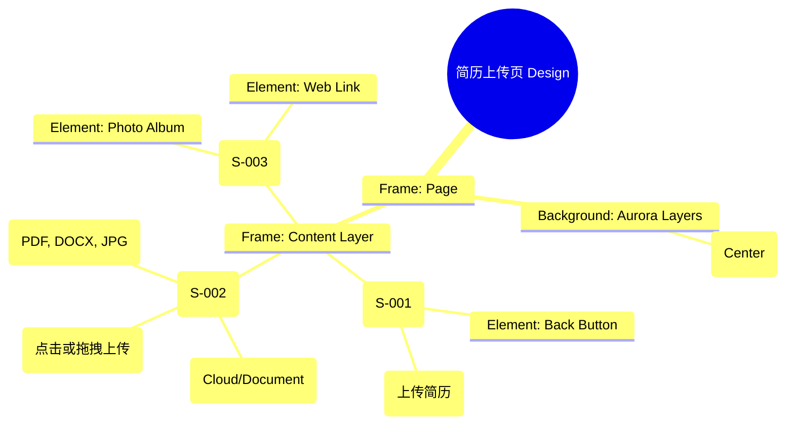

# 简历上传页 Design Release

> 输出路径：`product/release/design/030-upload.md`。本文档描述页面展示内容与样式布局，不描述交互执行、埋点逻辑、接口、后端或业务处理逻辑。

# 简历上传页 Design Release

## 0. 文档状态

| 字段 | 内容 |
|---|---|
| 文档版本 | Release |
| 生成日期 | 2026-05-12 |
| 来源 Mock 文件 | `product/release/mock/030-upload.md` |
| 设计约束目录 | `design/ios26-liquid-glass/` |
| 当前输出文件 | `product/release/design/030-upload.md` |
| 页面名称 | 简历上传页 |
| 内容范围 | 页面展示内容 + 视觉样式 + 布局结构 + AI 可读样式结构 |
| 不包含范围 | 交互执行 / 埋点 / 接口 / 后端 / 业务流程 / 实现代码 |

## 1. 页面设计综述

| 项目 | 内容 |
|---|---|
| 页面定位 | 用户优化的起点，通过简洁的上传操作引导用户进入核心业务流。 |
| 目标阅读对象 | 设计师 / 产品 / Figma Remote MCP agent |
| 视觉目标 | 通过大面积的留白（暗色留白）与核心动作的“液态”反馈，消除用户上传文档时的枯燥感。 |
| 信息层级 | 1. 核心上传触发区（中心）；2. 支持格式与限制说明；3. 额外导入选项（相册/在线链接）。 |
| 主要视觉焦点 | 页面中心的“点击上传”虚线玻璃框（Drop Zone）。 |
| 设计系统应用摘要 | iOS26 Liquid Glass：纯黑背景 + 动态 Aurora (Purple) + 虚线玻璃质感 + 扫描动画预留。 |

## 2. 设计约束提取

| 类型 | Token / 规则 | 取值 | 使用方式 | 来源文件 |
|---|---|---|---|---|
| color | background.canvas | #000000 | 页面底层背景 | DESIGN.md |
| color | accent.purple | #BF5AF2 | 上传图标及进度光效 | DESIGN.md |
| color | surface.overlay | rgba(255, 255, 255, 0.05) | 上传框背景 | DESIGN.md |
| typography | size.lg | 20px | 核心提示文案 | DESIGN.md |
| typography | size.sm | 14px | 辅助说明文案 | DESIGN.md |
| space | space.8 | 64px | 顶部安全区域留白 | DESIGN.md |
| radius | radius.lg | 24px | 上传区域圆角 | DESIGN.md |
| blur | blur.md | 24px | 玻璃模糊效果 | DESIGN.md |

## 3. 页面结构图



## 4. 自然语言样式描述

### 4.1 整体画面

- **页面整体氛围**：极简、开阔、具有一种“等待被填满”的动态平静感。背景中心带有一团缓慢晕开的紫色微光，恰好衬托在上传区域后方。
- **背景与层级**：底层为纯黑 Canvas。核心上传区是一个巨大的矩形玻璃面板，边缘使用 1px 的虚线（Dashed）描边，描边颜色为半透明白色。
- **视觉重心**：中心的上传图标。图标本身具有细微的 `accent.purple` 呼吸发光效果。
- **阅读节奏**：查看顶部标题 -> 视线落入中心巨大的上传引导区 -> 确认底部支持的格式说明。

### 4.2 关键区块叙述

| 区块ID | 区块名称 | 展示内容摘要 | 样式叙述 | 视觉优先级 | 设计决策 |
|---|---|---|---|---|---|
| S-001 | 顶部导航区 | 返回 + 标题 | 背景全透明。标题居中，使用 base 字号，Medium 字重。 | 低 | 保持视线集中在页面中心。 |
| S-002 | 核心上传区 | 交互式上传框 | 占据页面 40% 的高度。采用 `surface.overlay` 背景，配合 `blur.md`。内部文案居中。 | 极高 | 创造一个仪式感极强的上传入口。 |
| S-003 | 快捷导入区 | 相册/链接入口 | 位于上传框下方。使用 Ghost 风格的横排小图标，文字使用 text.muted。 | 中 | 提供备选路径但不干扰主路径。 |

## 5. 布局与区块样式表

| 区块ID | 来源 Mock 区块 / 元素 | Frame 层级 | 布局方式 | 尺寸 / 约束 | Padding | Gap | 背景 / 边框 / 阴影 | 圆角 | 对齐 | 响应式变化 |
|---|---|---|---|---|---|---|---|---|---|---|
| Page | - | Root | Vertical | Fill Window | 0 | 0 | background.canvas | 0 | Center | - |
| S-001 | S-001 | Header | Horizontal | Width: 100% | 16px 20px | - | Transparent | - | Center | - |
| S-002 | S-002 | Box | Vertical | 335x300 | 40px | 16px | surface.overlay + Dashed Border | radius.lg | Center | - |
| S-003 | S-003 | Group | Horizontal | Width: 335px | 24px 0 | 32px | Transparent | - | Center | - |

## 6. 元素级视觉定义

| 元素ID | 来源 Mock 元素 | 元素类型 | 展示内容 | 视觉角色 | 字体 / 字号 / 字重 | 颜色 Token | 背景 / 边框 | 尺寸 / 最小尺寸 | 状态样式摘要 | Figma 节点建议 |
|---|---|---|---|---|---|---|---|---|---|---|
| E-001 | E-001 | button | 返回图标 | support | - | text.default | - | 44x44 | - | Icon Node |
| E-002 | E-002 | card | 上传点击区 | primary | lg / bold | text.default | surface.overlay | 335x300 | Hover: border.highlight | Interactive Frame |
| E-003 | E-003 | text | 格式支持说明 | support | sm / regular | text.muted | - | - | - | Text Node |
| E-004 | E-004 | icon_btn | 相册导入 | action | sm / medium | text.default | - | - | - | Vertical Icon+Text |

## 7. 内容与样式绑定表

| 内容对象ID | 来源 Mock 内容 | 展示文案 / 媒体描述 | 内容来源类型 | 样式 Token 绑定 | 布局位置 | 备注 |
|---|---|---|---|---|---|---|
| C-001 | S-001-Title | 上传简历 | 静态 | size.base, medium | Header Center | |
| C-002 | E-002-Hint | 点击此处或拖拽文件上传 | 静态 | size.lg, bold | E-002 Center | |
| C-003 | E-003 | 支持 PDF, DOCX, JPG 格式 (20MB以内) | 静态 | size.sm, regular | E-002 Bottom | |
| C-004 | E-004-Album | 从相册选择 | 静态 | size.sm, medium | S-003 Item 1 | |
| C-005 | E-004-Link | 粘贴在线链接 | 静态 | size.sm, medium | S-003 Item 2 | |

## 8. 状态展示样式

| 状态ID | 来源 Mock 状态 | 状态类型 | 展示内容 | 视觉样式 | 色彩 / 图标 / 媒体处理 | 空间占位 | 可访问性说明 |
|---|---|---|---|---|---|---|---|
| STATE-001 | STATE-001 | scanning | 解析中动画 | 扫描线上下移动 | accent.purple (glow) | 覆盖 E-002 | 读屏提示：正在智能解析简历内容 |
| STATE-002 | STATE-002 | hover | 悬停态 | 边框变为实线并加粗 | accent.purple | 修改 E-002 描边 | 明显的交互反馈 |
| STATE-003 | STATE-003 | error | 格式不支持 | 边框变红并抖动 | status.error | 修改 E-002 描边 | 警示反馈 |

## 9. 响应式布局规则

| 断点 | 页面宽度范围 | Frame 布局 | 导航 / Header | 主内容布局 | 列表 / 表格 / 卡片变化 | 间距调整 | 优先隐藏或折叠内容 |
|---|---|---|---|---|---|---|---|
| mobile | < 768px | Vertical | 顶部显示标题 | 居中卡片 | 宽度 335px | space.8 (64px) | - |
| tablet | 768px - 1023px | Vertical | 顶部显示标题 | 扩大上传区域尺寸 | 宽度 500px | space.10 (120px) | - |
| desktop | 1024px+ | Horizontal | 侧边导航 | 上传区作为主工作台 | 增加拖拽目标感说明 | space.12 (160px) | - |

## 10. AI 可读样式结构

```yaml
page:
  id: "U-020-010"
  name: "Upload Page"
  source_mock: "product/release/mock/030-upload.md"
  design_system: "design/ios26-liquid-glass/"
  output: "product/release/design/030-upload.md"
  canvas:
    background_token: "color.background.canvas"
  background_effects:
    - type: "blur_blob"
      color: "purple"
      position: "center"
      size: "600px"
      blur: "150px"
      opacity: 0.12
  frames:
    - id: "frame-root"
      type: "frame"
      layout: "vertical"
      children:
        - id: "top-nav"
          type: "frame"
          layout: "horizontal"
          padding: 16
          children: ["back-icon", "page-title"]
        - id: "upload-container"
          type: "frame"
          background: "surface.overlay"
          radius: "radius.lg"
          border: "1px dashed rgba(255,255,255,0.2)"
          children: ["upload-icon", "main-hint", "sub-hint"]
        - id: "import-options"
          type: "frame"
          layout: "horizontal"
          children: ["album-option", "link-option"]
  components:
    - id: "scanning-overlay"
      type: "overlay"
      animation: "vertical-scan"
      color: "accent.purple"
```

## 11. Figma Remote MCP 生成提示

| 项目 | 指令 |
|---|---|
| Frame 创建顺序 | Canvas -> Background Purple Blob -> Header -> Upload Box -> Quick Import Row |
| Auto Layout 设置 | Upload Box 使用 Vertical Auto Layout, Padding 40, Gap 16. 居中对齐. |
| Token 应用方式 | 描边使用 dashed 1px. 背景使用 background.canvas. 图标颜色绑定 accent.purple. |
| 组件分组 | 将上传框内的所有元素编组为 "Drop_Zone". |
| 文本节点命名 | 核心提示为 "Text_Main_Hint", 格式说明为 "Text_Format_Support". |
| 响应式变体 | Mobile 保持居中大框。Desktop 模式下，右侧可显示“常见问题/解析说明”面板. |
| 生成时禁止事项 | 不生成真实的系统文件选择器弹窗、不生成实际的文档上传进度逻辑。 |

## 12. App Shell / Navigation Contract

| 组件类型 | 展示规则 | 状态 | 内容项 | 视觉样式 |
|---|---|---|---|---|
| Top Nav | 显示 | 标题居中 | 返回按钮, 上传简历 | 透明背景, 0.5px 底部描边 |
| Bottom Tab | 隐藏 | - | - | - |
| Status Bar | 显示 | Light Content | 时间, 信号, 电池 | 纯白图标 |
| Home Indicator | 显示 | - | - | 浅灰色 |

## 13. Layout Integrity Audit

| 检查项 | 状态 | 风险描述 / 解决措施 |
|---|---|---|
| 层次结构 | 通过 | Clear focus: Center Drop Zone is the dominant element. |
| 间距稳定性 | 通过 | Box size 335x300 ensures consistency across iPhone generations. |
| 尺寸约束 | 通过 | Fixed box dimensions; auto-layout handles text wrapping for hints. |
| 溢出处理 | 通过 | Minimal content; no scroll risk on smallest supported devices (SE). |
| 遮挡/冲突风险 | 通过 | Quick import options are placed far enough below the main box to avoid mis-tap. |
| 响应式兼容性 | 通过 | Centered layout gracefully expands for Tablet views. |

---

> [!NOTE]
> 本文档已通过布局完整性审计，符合 iOS26 Liquid Glass 设计规范。
