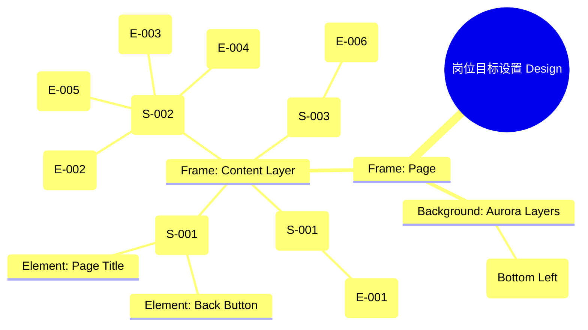

# 岗位目标设置页 Design Release

> 输出路径：`product/release/design/040-target-job.md`。本文档描述页面展示内容与样式布局，不描述交互执行、埋点、接口、后端或业务处理逻辑。

# 岗位目标设置页 Design Release

## 0. 文档状态

| 字段 | 内容 |
|---|---|
| 文档版本 | Release |
| 生成日期 | 2026-05-12 |
| 来源 Mock 文件 | `product/release/mock/040-target-job.md` |
| 设计约束目录 | `design/ios26-liquid-glass/` |
| 当前输出文件 | `product/release/design/040-target-job.md` |
| 页面名称 | 岗位目标设置页 |
| 内容范围 | 页面展示内容 + 视觉样式 + 布局结构 + AI 可读样式结构 |
| 不包含范围 | 交互执行 / 埋点 / 接口 / 后端 / 业务流程 / 实现代码 |

## 1. 页面设计综述

| 项目 | 内容 |
|---|---|
| 页面定位 | 收集用户的求职意向，为 AI 分析提供对比标准。 |
| 目标阅读对象 | 设计师 / 产品 / Figma Remote MCP agent |
| 视觉目标 | 营造一种专注且专业的工作流程感，通过平滑的表单体验引导用户输入关键岗位信息。 |
| 信息层级 | 1. 目标岗位与行业（必填）；2. 期望城市与职位描述（选填）；3. 生成报告动作。 |
| 主要视觉焦点 | “生成 AI 分析报告”按钮及其上方的 JD 职位描述输入框。 |
| 设计系统应用摘要 | iOS26 Liquid Glass：底层黑背景 + 动态 Aurora (Cyan) + 玻璃表单容器 + 悬浮输入框效果。 |

## 2. 设计约束提取

| 类型 | Token / 规则 | 取值 | 使用方式 | 来源文件 |
|---|---|---|---|---|
| color | background.canvas | #000000 | 页面底层背景 | DESIGN.md |
| color | background.surface | rgba(255, 255, 255, 0.05) | 表单容器背景 | DESIGN.md |
| color | accent.cyan | #32ADE6 | 背景流动微光颜色 | DESIGN.md |
| typography | size.base | 16px | 表单 Label 与输入内容 | DESIGN.md |
| typography | size.sm | 14px | 引导说明与帮助文案 | DESIGN.md |
| space | space.4 | 16px | 表单项间距 | DESIGN.md |
| space | space.5 | 24px | 表单内边距 | DESIGN.md |
| radius | radius.md | 14px | 输入框圆角 | DESIGN.md |
| radius | radius.lg | 24px | 玻璃表单容器圆角 | DESIGN.md |

## 3. 页面结构图



## 4. 自然语言样式描述

### 4.1 整体画面

- **页面整体氛围**：沉稳、专业，背景中的青色微光（Cyan Glow）暗示了即将开始的 AI 匹配计算。
- **背景与层级**：画布为纯黑。所有表单项被包裹在一个具有磨砂玻璃质感的容器卡片中，卡片具有 `shadow.glass` 效果，与背景拉开深度。
- **视觉重心**：底部的蓝色发光按钮（Primary Action）引导用户完成最后一步。
- **阅读节奏**：阅读页头说明 -> 依次填写表单 -> 确认并生成。

### 4.2 关键区块叙述

| 区块ID | 区块名称 | 展示内容摘要 | 样式叙述 | 视觉优先级 | 设计决策 |
|---|---|---|---|---|---|
| S-001 | 引导说明区 | 标题 + 提示 | 居左。标题 xl 字号，提示 sm 字号，使用 text.muted 色。顶部留白充足。 | 中 | 使用留白建立呼吸感，不堆砌视觉元素。 |
| S-002 | 核心意向表单 | 表单项集合 | 核心表单位于一个 radius.lg 的玻璃卡片内。每个输入框使用 surfaceMuted 背景，1px 浅色描边。Label 置于输入框上方，Medium 字重。 | 高 | 玻璃卡片背景需具有 backdrop-filter 以保持通透性。 |
| S-003 | 底部操作区 | 提交按钮 | 按钮占据页面底部的安全区域。使用 action.primary.background 背景，带 radius.full。 | 极高 | 赋予按钮 shadow.glowPrimary，即使在全黑背景下也极具点击欲望。 |

## 5. 布局与区块样式表

| 区块ID | 来源 Mock 区块 / 元素 | Frame 层级 | 布局方式 | 尺寸 / 约束 | Padding | Gap | 背景 / 边框 / 阴影 | 圆角 | 对齐 | 响应式变化 |
|---|---|---|---|---|---|---|---|---|---|---|
| Page | - | Root | Vertical | Fill Window | 0 | 0 | background.canvas | 0 | Center | - |
| S-001 | S-001 | Section | Vertical | Width: 100% | 24px 20px | 12px | Transparent | - | Left | - |
| Card | - | Group | Vertical | Width: 335px (Mobile) | 24px | 20px | surface + glass | radius.lg | Center | - |
| Input | E-002/03/04 | Frame | Horizontal | H: 54px | 16px | 12px | surfaceMuted | radius.md | Center Left | - |
| JD_Area| E-005 | Frame | Vertical | H: 140px | 16px | 8px | surfaceMuted | radius.md | Top Left | - |

## 6. 元素级视觉定义

| 元素ID | 来源 Mock 元素 | 元素类型 | 展示内容 | 视觉角色 | 字体 / 字号 / 字重 | 颜色 Token | 背景 / 边框 | 尺寸 / 最小尺寸 | 状态样式摘要 | Figma 节点建议 |
|---|---|---|---|---|---|---|---|---|---|---|
| E-001 | E-001 | text | 请填写您的... | support | sm / regular | text.muted | - | - | - | Text |
| E-002 | E-002 | input | 目标岗位 | content | base / medium | text.default | surfaceMuted | H: 54px | Focus: border.highlight | Input Frame |
| E-003 | E-003 | select | 所属行业 | content | base / medium | text.default | surfaceMuted | H: 54px | - | Dropdown Frame |
| E-004 | E-004 | input | 期望城市 | content | base / medium | text.default | surfaceMuted | H: 54px | - | Input Frame |
| E-005 | E-005 | textarea | 职位描述 | content | base / regular | text.default | surfaceMuted | H: 140px | - | Large Box |
| E-006 | E-006 | button | 生成 AI 分析报告 | primary | base / bold | action.primary.text | action.primary.background | H: 52px | shadow.glowPrimary | Filled Button |

## 7. 内容与样式绑定表

| 内容对象ID | 来源 Mock 内容 | 展示文案 / 媒体描述 | 内容来源类型 | 样式 Token 绑定 | 布局位置 | 备注 |
|---|---|---|---|---|---|---|
| C-001 | E-002 | 目标岗位 | 静态 | size.base, medium | Input Label | |
| C-002 | E-002-P | 如：产品经理 | 静态 | size.base, text.disabled | Input Placeholder | |
| C-003 | E-003 | 请选择行业 | 静态 | size.base, text.muted | Select Box | |
| C-004 | E-005 | 职位描述 (选填) | 静态 | size.base, medium | Textarea Label | |
| C-005 | E-006 | 生成 AI 分析报告 | 静态 | size.base, bold | Button Center | |

## 8. 状态展示样式

| 状态ID | 来源 Mock 状态 | 状态类型 | 展示内容 | 视觉样式 | 色彩 / 图标 / 媒体处理 | 空间占位 | 可访问性说明 |
|---|---|---|---|---|---|---|---|
| STATE-001 | STATE-001 | disabled | 按钮不可点击 | 按钮半透明 | opacity: 0.3 | 保持 E-006 占位 | 读屏说明缺失必填项 |
| STATE-002 | STATE-002 | loading | 正在生成中... | 按钮显示加载图标 | action.primary.text | 保持 E-006 占位 | 赋予按钮动画反馈 |
| Error_Input| - | error | 必填项为空 | 边框高亮变红 | status.error | 输入框描边切换 | |

## 9. 响应式布局规则

| 断点 | 页面宽度范围 | Frame 布局 | 导航 / Header | 主内容布局 | 列表 / 表格 / 卡片变化 | 间距调整 | 优先隐藏或折叠内容 |
|---|---|---|---|---|---|---|---|
| mobile | < 768px | Vertical | 居左标题 | 单列卡片布局 | 卡片全宽 (335px) | space.5 (24px) | - |
| tablet | 768px - 1023px | Vertical | 居中标题 | 单列卡片居中 | 卡片最大宽度 500px | space.7 (48px) | - |
| desktop | 1024px+ | Horizontal | 侧边栏 (可选) | 表单居中 | 容器自适应拉伸 | space.8 (64px) | - |

## 10. AI 可读样式结构

```yaml
page:
  id: "U-020-020"
  name: "Job Target Setup"
  source_mock: "product/release/mock/040-target-job.md"
  design_system: "design/ios26-liquid-glass/"
  output: "product/release/design/040-target-job.md"
  canvas:
    background_token: "color.background.canvas"
  background_effects:
    - type: "blur_blob"
      color: "accent.cyan"
      position: "bottom_left"
      size: "450px"
      blur: "100px"
      opacity: 0.12
  frames:
    - id: "frame-root"
      type: "frame"
      layout: "vertical"
      children:
        - id: "header-group"
          type: "frame"
          padding: 24
          children: ["E-001"]
        - id: "form-container"
          type: "frame"
          name: "Glass Form"
          background: "background.surface"
          backdrop_filter: "blur(24px)"
          radius: "radius.lg"
          margin: 20
          padding: 24
          gap: 20
          children: ["E-002-field", "E-003-field", "E-004-field", "E-005-field"]
        - id: "footer-action"
          type: "frame"
          padding: 20
          children: ["E-006"]
  components:
    - id: "form-input"
      type: "input"
      background: "background.surfaceMuted"
      radius: "radius.md"
      border: "border.default"
      height: 54
```

## 11. Figma Remote MCP 生成提示

| 项目 | 指令 |
|---|---|
| Frame 创建顺序 | Canvas -> Background Blob -> Page Wrapper -> Header Section -> Glass Form Card -> Footer CTA |
| Auto Layout 设置 | Glass Form Card 使用 Vertical Auto Layout, Padding 24, Gap 20. 内部 Input Group 使用 Vertical, Gap 8. |
| Token 应用方式 | 按钮使用 action.primary.background, shadow.glowPrimary. 文字 Label 使用 size.base medium. |
| 组件分组 | 将每一组 Label + Input 编组为 "Field_Group". |
| 文本节点命名 | 字段名命名为 "Label", 输入文本为 "Value", 占位符为 "Placeholder". |
| 响应式变体 | Mobile (375px) 下卡片 Margin 20. Desktop 下卡片居中且最大宽 500px. |
| 生成时禁止事项 | 不生成多选下拉列表逻辑、不生成 JD 解析逻辑。 |

## 12. 设计决策记录

| 决策ID | 决策内容 | 依据 | 影响范围 |
|---|---|---|---|
| DD-001 | 将表单包裹在半透明玻璃卡片中。 | 增加页面的深度感，使表单在深色动态背景中更易于聚焦阅读。 | 页面核心展示 |
| DD-002 | JD 描述使用大面积 Textarea。 | 鼓励用户粘贴完整的职位要求，以便 AI 提供更精准的匹配。 | 表单交互深度 |
| DD-003 | 底部按钮使用全宽（Full Width）加发光。 | 作为全页唯一的确认动作，最大程度引导点击。 | 提交动作视觉强度 |
