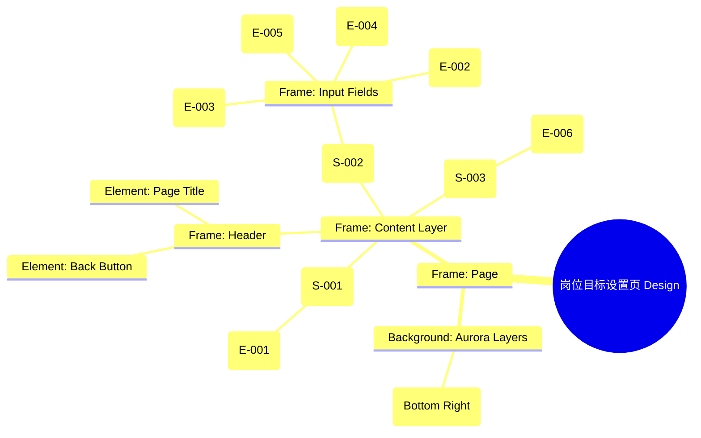

# 岗位目标设置页 Design Release

> 输出路径：`product/release/design/040-target-job.md`。本文档描述页面展示内容与样式布局，不描述交互执行、埋点、接口、后端或业务处理逻辑。

# 岗位目标设置页 Design Release

## 0. 文档状态

| 字段 | 内容 |
|---|---|
| 文档版本 | Release |
| 生成日期 | 2026-05-12 |
| 来源 Mock 文件 | `product/release/mock/040-target-job.md` |
| 设计约束目录 | `design/ios26-liquid-glass/` |
| 当前输出文件 | `product/release/design/040-target-job.md` |
| 页面名称 | 岗位目标设置页 |
| 内容范围 | 页面展示内容 + 视觉样式 + 布局结构 + AI 可读样式结构 |
| 不包含范围 | 交互执行 / 埋点 / 接口 / 后端 / 业务流程 / 实现代码 |

## 1. 页面设计综述

| 项目 | 内容 |
|---|---|
| 页面定位 | 收集用户的求职意向，为 AI 分析提供对比标准。 |
| 目标阅读对象 | 设计师 / 产品 / Figma Remote MCP agent |
| 视觉目标 | 通过极其通透的表单设计降低用户的填写焦虑，营造出一种“与 AI 对话”的轻快感。 |
| 信息层级 | 1. 引导文案；2. 核心表单字段（岗位、行业、城市）；3. JD 长文本输入；4. 生成报告按钮。 |
| 主要视觉焦点 | 底部带有强烈发光效果的“生成 AI 分析报告”按钮。 |
| 设计系统应用摘要 | iOS26 Liquid Glass：背景 #000000 + 玻璃表单卡片 + 选中态发光边框。 |

## 2. 设计约束提取

| 类型 | Token / 规则 | 取值 | 使用方式 | 来源文件 |
|---|---|---|---|---|
| color | background.canvas | #000000 | 页面底层背景 | DESIGN.md |
| color | accent.blue | #0A84FF | 选中态发光 / 按钮背景 | DESIGN.md |
| color | background.surface | rgba(255, 255, 255, 0.05) | 表单项背景 | DESIGN.md |
| typography | size.base | 16px | 表单输入内容字号 | DESIGN.md |
| typography | size.sm | 14px | 表单 Label 字号 | DESIGN.md |
| space | space.4 | 16px | 表单项内部 Padding | DESIGN.md |
| radius | radius.md | 14px | 输入框圆角 | DESIGN.md |
| shadow | glowPrimary | 0 0 24px rgba(10, 132, 255, 0.3) | 提交按钮发光 | DESIGN.md |

## 3. 页面结构图



## 4. 自然语言样式描述

### 4.1 整体画面

- **页面整体氛围**：理智、清晰、高质感。背景右下方带有一处柔和的蓝色 Aurora 渲染。
- **背景与层级**：底层为纯黑 Canvas。表单项并不是散落在页面上，而是嵌套在一个巨大的透明玻璃容器（Section）中。每个 Input 字段又是独立的子玻璃层。
- **视觉重心**：正在输入的 Input 框，其边框会呈现出 `border.highlight` 的呼吸感。
- **阅读节奏**：阅读引导语 -> 从上至下填写岗位信息 -> 粘贴 JD -> 点击底部主按钮。

### 4.2 关键区块叙述

| 区块ID | 区块名称 | 展示内容摘要 | 样式叙述 | 视觉优先级 | 设计决策 |
|---|---|---|---|---|---|
| S-001 | 引导说明区 | 顶部引导语 | 文字使用 `size.sm`，颜色为 `text.muted`。左对齐，带有一点间距。 | 低 | 辅助信息，不抢视觉。 |
| S-002 | 核心意向表单 | 输入框集合 | 采用 Vertical 布局。每个输入框使用 `surfaceMuted` 背景，`radius.md` 圆角。Label 位于输入框上方。 | 极高 | 确保填写的准确性与流畅度。 |
| S-003 | 底部操作区 | 生成报告按钮 | 固定在底部。按钮采用 `action.primary.background`，并伴有强烈的 `shadow.glowPrimary`。 | 极高 | 最终转化点。 |

## 5. 布局与区块样式表

| 区块ID | 来源 Mock 区块 / 元素 | Frame 层级 | 布局方式 | 尺寸 / 约束 | Padding | Gap | 背景 / 边框 / 阴影 | 圆角 | 对齐 | 响应式变化 |
|---|---|---|---|---|---|---|---|---|---|---|
| Page | - | Root | Vertical | Fill Window | 0 | 0 | background.canvas | 0 | Center | - |
| S-001 | S-001 | Section | Vertical | Width: 100% | 24px 20px | - | Transparent | - | Left | - |
| S-002 | S-002 | Form | Vertical | Width: 100% | 0 20px | 20px | Transparent | - | Top | - |
| Field | E-002..E-005 | Group | Vertical | Width: 100% | - | 8px | - | - | Left | - |
| S-003 | S-003 | Footer | Vertical | Width: 100% | 24px 20px | - | surfaceOverlay + blur | - | Center | Fixed Bottom |

## 6. 元素级视觉定义

| 元素ID | 来源 Mock 元素 | 元素类型 | 展示内容 | 视觉角色 | 字体 / 字号 / 字重 | 颜色 Token | 背景 / 边框 | 尺寸 / 最小尺寸 | 状态样式摘要 | Figma 节点建议 |
|---|---|---|---|---|---|---|---|---|---|---|
| E-002 | E-002 | input | 目标岗位 | field | base / regular | text.default | surfaceMuted | H: 54px | Focus: border.highlight | Input Box |
| E-003 | E-003 | select | 行业选择 | field | base / regular | text.default | surfaceMuted | H: 54px | - | Select Box |
| E-005 | E-005 | textarea | JD 职位描述 | field | base / regular | text.default | surfaceMuted | H: 160px | - | Textarea |
| E-006 | E-006 | button | 生成 AI 分析报告 | primary | base / bold | action.primary.text | action.primary.background | H: 54px | shadow.glowPrimary | Filled Button |

## 7. 内容与样式绑定表

| 内容对象ID | 来源 Mock 内容 | 展示文案 / 媒体描述 | 内容来源类型 | 样式 Token 绑定 | 布局位置 | 备注 |
|---|---|---|---|---|---|---|
| C-001 | E-001 | 请填写您的目标岗位... | 静态 | sm, regular | S-001 | |
| C-002 | FORM-001-L1 | 目标岗位 | 静态 | sm, regular | E-002 Label | |
| C-003 | E-002-PH | 如：产品经理 | 静态 | base, regular | E-002 Placeholder | |
| C-004 | E-006 | 生成 AI 分析报告 | 静态 | base, bold | E-006 Text | |

## 8. 状态展示样式

| 状态ID | 来源 Mock 状态 | 状态类型 | 展示内容 | 视觉样式 | 色彩 / 图标 / 媒体处理 | 空间占位 | 可访问性说明 |
|---|---|---|---|---|---|---|---|
| STATE-001 | STATE-001 | disabled | 必填项缺失 | 按钮半透明 | opacity: 0.4 | 保持 E-006 占位 | 读屏应提示未完成项 |
| STATE-002 | STATE-002 | loading | 正在生成中... | 按钮内 Spinner | #FFFFFF | 保持 E-006 占位 | |
| Input_Focus| - | active | 输入框激活 | 边框蓝色微光 | border.highlight | - | |

## 9. 响应式布局规则

| 断点 | 页面宽度范围 | Frame 布局 | 导航 / Header | 主内容布局 | 列表 / 表格 / 卡片变化 | 间距调整 | 优先隐藏或折叠内容 |
|---|---|---|---|---|---|---|---|
| mobile | < 768px | Vertical | 居左 | 100% 宽 | - | space.4 | - |
| tablet | 768px - 1023px | Vertical | 居左 | 限制最大宽 (600px) | - | space.6 | - |
| desktop | 1024px+ | Horizontal | 居左 | 左右分栏 (标题+表单) | - | space.8 | - |

## 10. AI 可读样式结构

```yaml
page:
  id: "U-020-020"
  name: "Target Job Settings"
  source_mock: "product/release/mock/040-target-job.md"
  design_system: "design/ios26-liquid-glass/"
  output: "product/release/design/040-target-job.md"
  canvas:
    background_token: "color.background.canvas"
  background_effects:
    - type: "blur_blob"
      color: "accent.blue"
      position: "bottom_right"
      size: "600px"
      blur: "150px"
      opacity: 0.1
  frames:
    - id: "frame-root"
      type: "frame"
      layout: "vertical"
      children:
        - id: "guide-hint"
          type: "frame"
          padding: 24
          children: ["E-001"]
        - id: "form-container"
          type: "frame"
          layout: "vertical"
          padding_horizontal: 20
          gap: 20
          children: ["E-002-field", "E-003-field", "E-004-field", "E-005-field"]
        - id: "bottom-action"
          type: "frame"
          background: "background.surfaceOverlay"
          backdrop_filter: "blur(24px)"
          padding: 24
          children: ["E-006"]
  components:
    - id: "form-input"
      type: "frame"
      background: "background.surfaceMuted"
      radius: "radius.md"
      height: 54
```

## 11. Figma Remote MCP 生成提示

| 项目 | 指令 |
|---|---|
| Frame 创建顺序 | Canvas -> Background Blob -> Header Section -> Form Section -> Bottom Footer |
| Auto Layout 设置 | Form Section 使用 Vertical Auto Layout, Gap 20. |
| Token 应用方式 | 底部按钮应用 shadow.glowPrimary. 输入框激活态应用 border.highlight. |
| 组件分组 | 将 Label 与 Input 编组为 "Field_Group". |
| 文本节点命名 | Input Placeholder 命名为 "Input_Placeholder", Label 为 "Field_Label". |
| 响应式变体 | 在 Mobile 下将表单宽度设为 "Fill Container". |
| 生成时禁止事项 | 不生成复杂的表单校验逻辑交互。 |

## 12. 设计决策记录

| 决策ID | 决策内容 | 依据 | 影响范围 |
|---|---|---|---|
| DD-001 | 使用深色玻璃表单降低填写压抑感。 | 表单通常是用户流失点，轻盈的材质能提升填写意愿。 | 表单设计 |
| DD-002 | 底部按钮固定并伴随强发光。 | 引导用户点击，完成从数据录入到 AI 分析的转化。 | 页面交互 |
| DD-003 | Input 背景使用极低透明度的 surfaceMuted。 | 在纯黑背景上通过细微的明度差建立深度感。 | 元素样式 |
