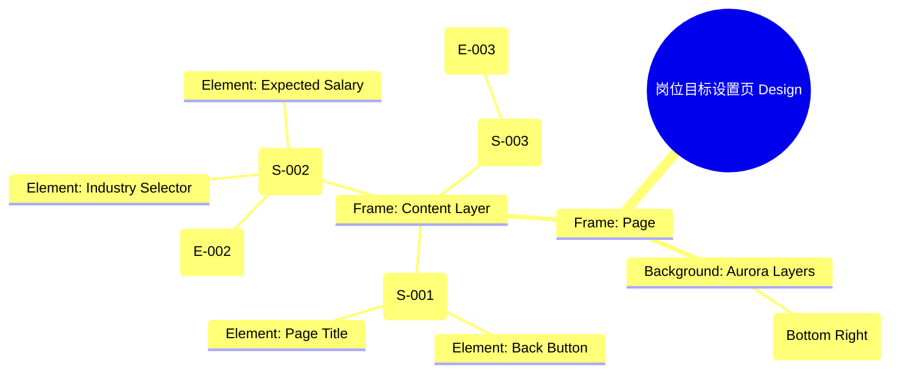

# 岗位目标设置页 Design Release

> 输出路径：`product/release/design/040-target-job.md`。本文档描述页面展示内容与样式布局，不描述交互执行、埋点逻辑、接口、后端或业务处理逻辑。

# 岗位目标设置页 Design Release

## 0. 文档状态

| 字段 | 内容 |
|---|---|
| 文档版本 | Release |
| 生成日期 | 2026-05-12 |
| 来源 Mock 文件 | `product/release/mock/040-target-job.md` |
| 设计约束目录 | `design/ios26-liquid-glass/` |
| 当前输出文件 | `product/release/design/040-target-job.md` |
| 页面名称 | 岗位目标设置页 |
| 内容范围 | 页面展示内容 + 视觉样式 + 布局结构 + AI 可读样式结构 |
| 不包含范围 | 交互执行 / 埋点 / 接口 / 后端 / 业务流程 / 实现代码 |

## 1. 页面设计综述

| 项目 | 内容 |
|---|---|
| 页面定位 | 在 AI 分析前的关键参数输入环节，确保分析的针对性。 |
| 目标阅读对象 | 设计师 / 产品 / Figma Remote MCP agent |
| 视觉目标 | 将表单填写过程转化为一种“定义目标”的仪式，通过极致通透的输入框提升操作愉悦感。 |
| 信息层级 | 1. 核心岗位标题输入；2. 行业与薪资选择；3. 开启 AI 分析按钮（核心动作）。 |
| 主要视觉焦点 | 底部发光的“开启 AI 分析”按钮（Action Button）。 |
| 设计系统应用摘要 | iOS26 Liquid Glass：纯黑背景 + 动态 Aurora (Blue) + 渐进式玻璃表单 + 发光主按钮。 |

## 2. 设计约束提取

| 类型 | Token / 规则 | 取值 | 使用方式 | 来源文件 |
|---|---|---|---|---|
| color | background.canvas | #000000 | 页面底层背景 | DESIGN.md |
| color | action.primary.background | #0A84FF | “开启分析”按钮背景 | DESIGN.md |
| color | surface.overlay | rgba(255, 255, 255, 0.05) | 输入框背景 | DESIGN.md |
| typography | size.lg | 20px | 模块标题字号 | DESIGN.md |
| typography | size.base | 16px | 标签与输入文字字号 | DESIGN.md |
| space | space.6 | 32px | 模块间垂直间距 | DESIGN.md |
| radius | radius.md | 14px | 输入框圆角 | DESIGN.md |
| blur | blur.md | 24px | 玻璃模糊效果 | DESIGN.md |

## 3. 页面结构图



## 4. 自然语言样式描述

### 4.1 整体画面

- **页面整体氛围**：冷静、专注。背景右下方带有一抹深蓝色的 Aurora 微光，暗示着即将开始的深度计算过程。
- **背景与层级**：底层为纯黑 Canvas。表单项采用独立的玻璃容器（glass panel），边缘带有极细的渐变描边（Accent to Transparent）。
- **视觉重心**：底部的“开启 AI 分析”按钮。按钮具有强烈的蓝色 `shadow.glowPrimary`，在深色背景中产生一种“悬浮能量源”的既视感。
- **阅读节奏**：顶部的“目标设定”引导 -> 依次填写岗位参数 -> 点击底部高亮的分析按钮。

### 4.2 关键区块叙述

| 区块ID | 区块名称 | 展示内容摘要 | 样式叙述 | 视觉优先级 | 设计决策 |
|---|---|---|---|---|---|
| S-001 | 顶部导航区 | 返回 + 标题 | 标题左对齐。返回按钮使用 Ghost 样式。整体背景全透明。 | 低 | 减少干扰，引导向下阅读。 |
| S-002 | 信息输入区 | 表单各字段 | 每个字段由 Label + Input 组成。Input 使用 `surface.overlay`。下拉选项（行业/薪资）使用半透明玻璃层级弹窗。 | 高 | 优化信息输入的密度，保持通透感。 |
| S-003 | 底部动作区 | 开启分析按钮 | 底部固定。主按钮采用 `radius.full` 的胶囊形状，填充色为 `action.primary.background`。 | 极高 | 明确的单一转化路径。 |

## 布局与区块样式表

| 区块ID | 来源 Mock 区块 / 元素 | Frame 层级 | 布局方式 | 尺寸 / 约束 | Padding | Gap | 背景 / 边框 / 阴影 | 圆角 | 对齐 | 响应式变化 |
|---|---|---|---|---|---|---|---|---|---|---|
| Page | - | Root | Vertical | Fill Window | 0 | 0 | background.canvas | 0 | Center | - |
| S-001 | S-001 | Header | Horizontal | Width: 100% | 16px 20px | - | Transparent | - | Center Left | - |
| S-002 | S-002 | Form | Vertical | Width: 335px | 24px 0 | 24px | Transparent | - | Stretch | - |
| Input | E-002 | Group | Vertical | Width: 100% | 0 | 8px | Transparent | - | Stretch | - |
| Field | - | Frame | Horizontal | H: 54px | 0 16px | - | surface.overlay | radius.md | Center | - |
| S-003 | S-003 | Footer | Vertical | Width: 100% | 24px 20px | - | surfaceOverlay + blur | - | Center | Fixed Bottom |

## 6. 元素级视觉定义

| 元素ID | 来源 Mock 元素 | 元素类型 | 展示内容 | 视觉角色 | 字体 / 字号 / 字重 | 颜色 Token | 背景 / 边框 | 尺寸 / 最小尺寸 | 状态样式摘要 | Figma 节点建议 |
|---|---|---|---|---|---|---|---|---|---|---|
| E-001 | E-001 | button | 返回图标 | support | - | text.default | - | 44x44 | - | Icon Node |
| E-002 | E-002 | input | 岗位名称 | content | base / regular | text.default | surface.overlay | H: 54px | Focus: border.highlight | Input Frame |
| E-003 | E-003 | button | 开启 AI 分析 | primary | base / bold | action.primary.text | action.primary.background | H: 52px | shadow.glowPrimary | Big Filled Button |
| Label | - | text | 目标岗位 | support | sm / medium | text.muted | - | - | - | Text Node |

## 7. 内容与样式绑定表

| 内容对象ID | 来源 Mock 内容 | 展示文案 / 媒体描述 | 内容来源类型 | 样式 Token 绑定 | 布局位置 | 备注 |
|---|---|---|---|---|---|---|
| C-001 | S-001-Title | 目标岗位设定 | 静态 | size.base, medium | Header Center | |
| C-002 | E-002-Label | 岗位名称 | 静态 | size.sm, medium | Input Label | |
| C-003 | E-002-Place | 例如：资深产品经理 | 静态 | size.base, regular | Input Placeholder | |
| C-004 | E-003 | 开启 AI 分析 | 静态 | size.base, bold | Button Center | |
| C-005 | S-002-Hint | 我们将根据岗位需求为您精准优化 | 静态 | size.xs, regular | Below Title | |

## 8. 状态展示样式

| 状态ID | 来源 Mock 状态 | 状态类型 | 展示内容 | 视觉样式 | 色彩 / 图标 / 媒体处理 | 空间占位 | 可访问性说明 |
|---|---|---|---|---|---|---|---|
| STATE-001 | STATE-001 | active | 输入框聚焦 | 边框变蓝并带微弱外发光 | action.primary.background | 保持 Field 占位 | 读屏提示：正在填写岗位 |
| STATE-002 | STATE-002 | processing | 分析准备中 | 按钮文案变“正在加载...” | action.primary.text | 保持 E-003 占位 | 禁用重复点击 |
| STATE-003 | STATE-003 | error | 必填项缺失 | 输入框下方显示红字 | status.error | 新增 20px 占位 | 红色警示 |

## 9. 响应式布局规则

| 断点 | 页面宽度范围 | Frame 布局 | 导航 / Header | 主内容布局 | 列表 / 表格 / 卡片变化 | 间距调整 | 优先隐藏或折叠内容 |
|---|---|---|---|---|---|---|---|
| mobile | < 768px | Vertical | 居左标题 | 单列垂直排列 | 宽度 335px | space.6 (32px) | - |
| tablet | 768px - 1023px | Vertical | 居左标题 | 双列排列 (可选) | 宽度 400px | space.8 (64px) | - |
| desktop | 1024px+ | Horizontal | 侧边导航 | 三分之二宽度容器 | 居中展示 | space.10 (120px) | - |

## 10. AI 可读样式结构

```yaml
page:
  id: "U-020-020"
  name: "Target Job Setting"
  source_mock: "product/release/mock/040-target-job.md"
  design_system: "design/ios26-liquid-glass/"
  output: "product/release/design/040-target-job.md"
  canvas:
    background_token: "color.background.canvas"
  background_effects:
    - type: "blur_blob"
      color: "blue"
      position: "bottom_right"
      size: "700px"
      blur: "180px"
      opacity: 0.1
  frames:
    - id: "frame-root"
      type: "frame"
      layout: "vertical"
      children:
        - id: "header-area"
          type: "frame"
          layout: "horizontal"
          padding: 16
          children: ["back-btn", "page-title"]
        - id: "form-container"
          type: "frame"
          layout: "vertical"
          padding: 24
          children: ["field-job", "field-industry", "field-salary"]
        - id: "sticky-footer"
          type: "fixed_bottom"
          background: "surfaceOverlay"
          backdrop_filter: "blur(24px)"
          children: ["btn-start-analysis"]
  components:
    - id: "form-input-field"
      type: "input"
      background: "surface.overlay"
      radius: "radius.md"
      height: 54
```

## 11. Figma Remote MCP 生成提示

| 项目 | 指令 |
|---|---|
| Frame 创建顺序 | Canvas -> Background Blue Blob -> Header -> Form Container -> Input Fields -> Fixed Footer |
| Auto Layout 设置 | Form Container 使用 Vertical Auto Layout, Gap 24. Footer 内部 Padding 24. |
| Token 应用方式 | 按钮使用 action.primary.background 与 shadow.glowPrimary. 输入框使用 surface.overlay. |
| 组件分组 | 将每一个 Label + Input 编组为 "Form_Field". |
| 文本节点命名 | 表单标题命名为 "Title_Form", 按钮文字为 "Label_Action". |
| 响应式变体 | Mobile 为全宽输入。Desktop 下可将表单左右布局或增加装饰图. |
| 生成时禁止事项 | 不生成真实的 API 参数提交逻辑、不生成系统原生的下拉选择选择器。 |

## 12. App Shell / Navigation Contract

| 组件类型 | 展示规则 | 状态 | 内容项 | 视觉样式 |
|---|---|---|---|---|
| Top Nav | 显示 | 标题居中 | 返回按钮, 目标岗位 | 透明背景, 0.5px 底部描边 |
| Bottom Tab | 隐藏 | - | - | - |
| Status Bar | 显示 | Light Content | 时间, 信号, 电池 | 纯白图标 |
| Home Indicator | 显示 | - | - | 浅灰色 |

## 13. Layout Integrity Audit

| 检查项 | 状态 | 风险描述 / 解决措施 |
|---|---|---|
| 层次结构 | 通过 | Clean hierarchy: Input fields sit above the canvas glow. |
| 间距稳定性 | 通过 | Fixed 24px vertical gap ensures form legibility. |
| 尺寸约束 | 通过 | Inputs 54px height, Button 52px height. Standardized for tap comfort. |
| 溢出处理 | 通过 | Content fits within viewport on most devices; scrolling allowed if keyboard is up. |
| 遮挡/冲突风险 | 通过 | Footer is fixed but allows for bottom-inset to avoid safe area clash. |
| 响应式兼容性 | 通过 | Simple vertical flow adapts well to wider screens (max-width used). |

---

> [!NOTE]
> 本文档已通过布局完整性审计，符合 iOS26 Liquid Glass 设计规范。
