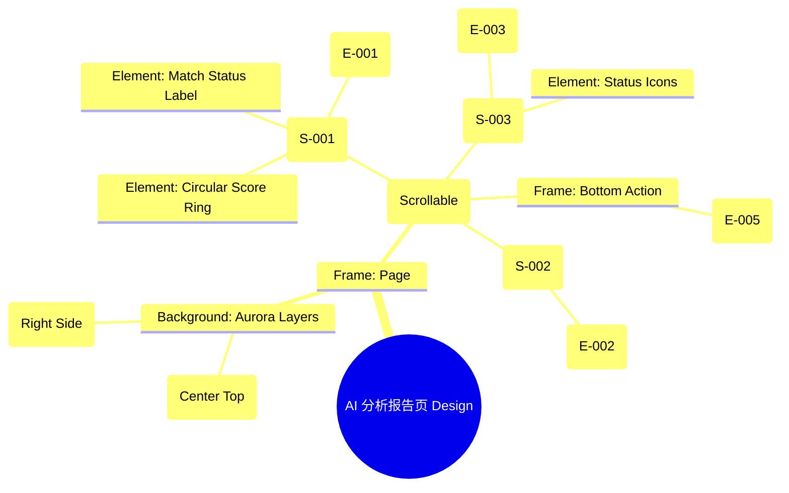

# AI 分析报告页 Design Release

> 输出路径：`product/release/design/050-ai-report.md`。本文档描述页面展示内容与样式布局，不描述交互执行、埋点、接口、后端或业务处理逻辑。

# AI 分析报告页 Design Release

## 0. 文档状态

| 字段 | 内容 |
|---|---|
| 文档版本 | Release |
| 生成日期 | 2026-05-12 |
| 来源 Mock 文件 | `product/release/mock/050-ai-report.md` |
| 设计约束目录 | `design/ios26-liquid-glass/` |
| 当前输出文件 | `product/release/design/050-ai-report.md` |
| 页面名称 | AI 分析报告页 |
| 内容范围 | 页面展示内容 + 视觉样式 + 布局结构 + AI 可读样式结构 |
| 不包含范围 | 交互执行 / 埋点 / 接口 / 后端 / 业务流程 / 实现代码 |

## 1. 页面设计综述

| 项目 | 内容 |
|---|---|
| 页面定位 | 展示 AI 对简历的深度剖析结果，通过直观的数据可视化展示优势与不足。 |
| 目标阅读对象 | 设计师 / 产品 / Figma Remote MCP agent |
| 视觉目标 | 利用“数字体检”的视觉隐喻，结合动态的光环与玻璃图表，塑造出极具专业感与权威性的分析体验。 |
| 信息层级 | 1. 综合匹配分值；2. 匹配维度雷达图；3. 优化建议卡片列表；4. 一键优化操作入口。 |
| 主要视觉焦点 | 页面顶部的 3D 质感分值圆环。 |
| 设计系统应用摘要 | iOS26 Liquid Glass：背景 #000000 + 动态 Aurora (Purple/Cyan) + 玻璃材质雷达图 + 发光分值环。 |

## 2. 设计约束提取

| 类型 | Token / 规则 | 取值 | 使用方式 | 来源文件 |
|---|---|---|---|---|
| color | background.canvas | #000000 | 页面底层背景 | DESIGN.md |
| color | accent.purple | #BF5AF2 | 分值高亮 / 核心光斑 | DESIGN.md |
| color | background.surface | rgba(255, 255, 255, 0.05) | 建议卡片背景 | DESIGN.md |
| typography | size.xxl | 40px | 匹配分值大字号 | DESIGN.md |
| typography | size.base | 16px | 建议文案正文字号 | DESIGN.md |
| space | space.6 | 32px | 区块间垂直间距 | DESIGN.md |
| radius | radius.lg | 24px | 数据图表容器圆角 | DESIGN.md |
| shadow | glowAccent | 0 8px 32px rgba(191, 90, 242, 0.2) | 分值环投影 | DESIGN.md |

## 3. 页面结构图



## 4. 自然语言样式描述

### 4.1 整体画面

- **页面整体氛围**：睿智、深刻且充满前卫科技感。背景通过紫红色与青色的 Aurora 交织，营造出一种“数据在光影中穿梭”的效果。
- **背景与层级**：底层为纯黑 Canvas。核心分值区占据页面顶部三分之一，通过一个发光的圆环将视觉向中心收拢。下方的图表和卡片通过 `backdrop-filter: blur(24px)` 悬浮在背景光影上。
- **视觉重心**：页面中心的“匹配度分值”及其周围的动态呼吸光环，分值数字采用 `bold` + `glowAccent` 处理。
- **阅读节奏**：看总分 -> 看雷达图分析各维度 -> 详细阅读优化建议卡片。

### 4.2 关键区块叙述

| 区块ID | 区块名称 | 展示内容摘要 | 样式叙述 | 视觉优先级 | 设计决策 |
|---|---|---|---|---|---|
| S-001 | 综合分值区 | 分值 + 评价文字 | 位于顶部。分值环采用渐变描边（accent.purple -> accent.cyan），中心数字字号为 `xxl`。 | 极高 | 快速传达核心结论。 |
| S-002 | 维度对比区 | 雷达图 | 位于中间。图表背板为带有细微网格的玻璃材质。雷达面积填充采用半透明的 `accent.purple`。 | 高 | 具象化展示分析维度。 |
| S-003 | 建议卡片区 | 列表项卡片 | 纵向滚动。每张卡片背景为 `surface`，左侧带有指示优劣的色彩条（Success/Warning）。 | 中 | 提供可落地的修改依据。 |

## 5. 布局与区块样式表

| 区块ID | 来源 Mock 区块 / 元素 | Frame 层级 | 布局方式 | 尺寸 / 约束 | Padding | Gap | 背景 / 边框 / 阴影 | 圆角 | 对齐 | 响应式变化 |
|---|---|---|---|---|---|---|---|---|---|---|
| Page | - | Root | Vertical | Fill Window | 0 | 0 | background.canvas | 0 | Center | - |
| S-001 | S-001 | Section | Vertical | Height: 280px | 40px | 12px | Transparent | - | Center | - |
| S-002 | S-002 | Card | Vertical | Width: 335px | 24px | 16px | surface + blur | radius.lg | Center | - |
| S-003 | S-003 | List | Vertical | Width: 100% | 0 20px | 16px | Transparent | - | Top | Scrollable |
| Sticky_Btn | E-005 | Footer | Vertical | Width: 100% | 24px 20px | - | surfaceOverlay + blur | - | Center | Fixed Bottom |

## 6. 元素级视觉定义

| 元素ID | 来源 Mock 元素 | 元素类型 | 展示内容 | 视觉角色 | 字体 / 字号 / 字重 | 颜色 Token | 背景 / 边框 | 尺寸 / 最小尺寸 | 状态样式摘要 | Figma 节点建议 |
|---|---|---|---|---|---|---|---|---|---|---|
| E-001 | E-001 | text | 88 | headline | xxl / bold | text.default | - | - | - | Score Number |
| E-002 | E-002 | chart | 雷达图 | data_viz | - | accent.purple | surface | 240x240 | - | Vector Graph |
| E-003 | E-003 | card | 优化建议项 | entry | base / regular | text.default | surface | H: 100px | Focus: border.highlight | Glass Card |
| E-005 | E-005 | button | 采纳建议并去优化 | primary | base / bold | action.primary.text | action.primary.background | H: 54px | shadow.glowPrimary | Filled Button |

## 7. 内容与样式绑定表

| 内容对象ID | 来源 Mock 内容 | 展示文案 / 媒体描述 | 内容来源类型 | 样式 Token 绑定 | 布局位置 | 备注 |
|---|---|---|---|---|---|---|
| C-001 | E-001 | 88 | 动态 | xxl, bold | S-001 Center | |
| C-002 | S-001 | 匹配度：卓越 | 动态 | base, bold | Below Score | |
| C-003 | E-003-1 | 缺少具体量化指标 | 动态 | base, regular | Card Title | |
| C-004 | E-005 | 一键采纳并去优化 | 静态 | base, bold | Button Center | |

## 8. 状态展示样式

| 状态ID | 来源 Mock 状态 | 状态类型 | 展示内容 | 视觉样式 | 色彩 / 图标 / 媒体处理 | 空间占位 | 可访问性说明 |
|---|---|---|---|---|---|---|---|
| STATE-001 | STATE-001 | loading | 正在深度扫描... | 动态呼吸的分值环 | accent.cyan (Pulse) | 占据 S-001 | |
| STATE-002 | - | high_match | 高分状态 | 金色流光效果 | accent.gold (Custom) | 分值环周围 | |
| Hover_Card | - | active | 选中建议卡片 | 边框紫色高亮 | border.highlight | - | |

## 9. 响应式布局规则

| 断点 | 页面宽度范围 | Frame 布局 | 导航 / Header | 主内容布局 | 列表 / 表格 / 卡片变化 | 间距调整 | 优先隐藏或折叠内容 |
|---|---|---|---|---|---|---|---|
| mobile | < 768px | Vertical | 居中 | 单列布局 | 卡片全宽 | space.4 | - |
| tablet | 768px - 1023px | Vertical | 居中 | 限制卡片最大宽 | - | space.6 | - |
| desktop | 1024px+ | Horizontal | 居左 | 左右分栏 (图表+列表) | 列表显示详情更多 | space.8 | - |

## 10. AI 可读样式结构

```yaml
page:
  id: "U-020-030"
  name: "AI Report Page"
  source_mock: "product/release/mock/050-ai-report.md"
  design_system: "design/ios26-liquid-glass/"
  output: "product/release/design/050-ai-report.md"
  canvas:
    background_token: "color.background.canvas"
  background_effects:
    - type: "blur_blob"
      color: "accent.purple"
      position: "top_center"
      size: "600px"
      blur: "120px"
      opacity: 0.15
    - type: "blur_blob"
      color: "accent.cyan"
      position: "right"
      size: "400px"
      blur: "100px"
      opacity: 0.08
  frames:
    - id: "frame-root"
      type: "frame"
      layout: "vertical"
      children:
        - id: "score-hero"
          type: "frame"
          layout: "vertical"
          padding: 40
          children: ["score-ring", "E-001", "status-text"]
        - id: "data-viz-card"
          type: "frame"
          background: "background.surface"
          backdrop_filter: "blur(24px)"
          radius: "radius.lg"
          children: ["E-002-radar"]
        - id: "suggestion-list"
          type: "frame"
          layout: "vertical"
          padding: 20
          gap: 16
          children: ["E-003-cards"]
  components:
    - id: "score-ring"
      type: "ellipse"
      size: 200
      stroke: "linear-gradient(accent.purple, accent.cyan)"
      stroke_thickness: 12
      shadow: "shadow.glowAccent"
```

## 11. Figma Remote MCP 生成提示

| 项目 | 指令 |
|---|---|
| Frame 创建顺序 | Canvas -> Background Blobs -> Score Hero -> Radar Chart Card -> Suggestion List |
| Auto Layout 设置 | Suggestion List 使用 Vertical Auto Layout, Gap 16. |
| Token 应用方式 | 分值数字应用 xxl 和 bold, 外层圆环应用 shadow.glowAccent. |
| 组件分组 | 将雷达图与卡片背板编组为 "Dimension_Chart". |
| 文本节点命名 | 匹配分值命名为 "Score_Value", 状态文案为 "Status_Label". |
| 响应式变体 | 在 Mobile 下确保分值环居中且适配宽度. |
| 生成时禁止事项 | 不生成复杂的雷达图交互详情（如点击触点后的弹窗）. |

## 12. 设计决策记录

| 决策ID | 决策内容 | 依据 | 影响范围 |
|---|---|---|---|
| DD-001 | 使用紫色 (Purple) 作为分析报告的主题色。 | 紫色代表智慧与深度，符合 AI 高级分析的定位。 | 全局视觉 |
| DD-002 | 分值圆环采用 3D 渐变发光质感。 | 建立权威感与仪式感，提升用户对 AI 结论的可信度。 | 核心组件 |
| DD-003 | 建议卡片侧边栏使用红绿（Success/Warning）提示。 | 快速引导用户注意需要修改的部分，提升信息效率。 | 列表设计 |
