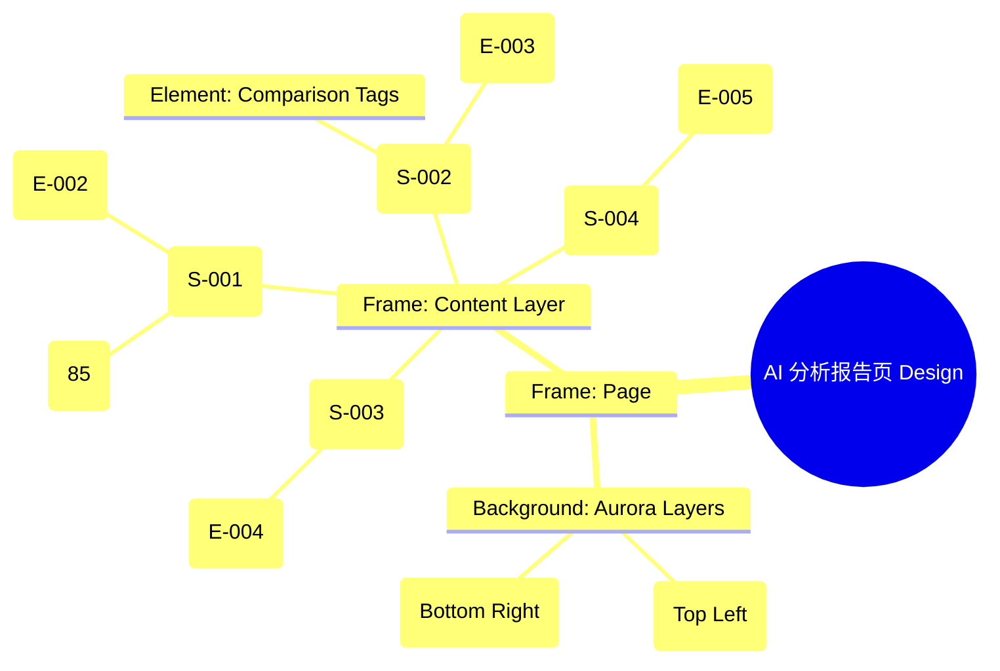

# AI 分析报告页 Design Release

> 输出路径：`product/release/design/050-ai-report.md`。本文档描述页面展示内容与样式布局，不描述交互执行、埋点逻辑、接口、后端或业务处理逻辑。

# AI 分析报告页 Design Release

## 0. 文档状态

| 字段 | 内容 |
|---|---|
| 文档版本 | Release |
| 生成日期 | 2026-05-12 |
| 来源 Mock 文件 | `product/release/mock/050-ai-report.md` |
| 设计约束目录 | `design/ios26-liquid-glass/` |
| 当前输出文件 | `product/release/design/050-ai-report.md` |
| 页面名称 | AI 分析报告页 |
| 内容范围 | 页面展示内容 + 视觉样式 + 布局结构 + AI 可读样式结构 |
| 不包含范围 | 交互执行 / 埋点 / 接口 / 后端 / 业务流程 / 实现代码 |

## 1. 页面设计综述

| 项目 | 内容 |
|---|---|
| 页面定位 | 展示 AI 分析结论的核心交付页面，建立用户对优化价值的感知。 |
| 目标阅读对象 | 设计师 / 产品 / Figma Remote MCP agent |
| 视觉目标 | 打造充满数据张力与智能质感的“透视报告”，通过动态图表和玻璃卡片展示深度分析。 |
| 信息层级 | 1. 综合匹配分（视觉中心）；2. 维度对比雷达图；3. 关键优化建议点（列表）。 |
| 主要视觉焦点 | 页面顶部的巨大半透明圆形分值进度条。 |
| 设计系统应用摘要 | iOS26 Liquid Glass：纯黑背景 + 动态 Aurora (Purple/Cyan) + 玻璃材质雷达图 + 发光建议卡片。 |

## 2. 设计约束提取

| 类型 | Token / 规则 | 取值 | 使用方式 | 来源文件 |
|---|---|---|---|---|
| color | background.canvas | #000000 | 页面底层背景 | DESIGN.md |
| color | accent.purple | #BF5AF2 | 关键分值与主维度高亮 | DESIGN.md |
| color | accent.cyan | #32ADE6 | 次要维度与对比数据 | DESIGN.md |
| typography | size.xxl | 34px | 匹配分值大字号 | DESIGN.md |
| typography | size.lg | 20px | 模块标题字号 | DESIGN.md |
| space | space.6 | 32px | 模块间垂直间距 | DESIGN.md |
| radius | radius.lg | 24px | 维度卡片大圆角 | DESIGN.md |
| blur | blur.md | 24px | 玻璃材质模糊度 | DESIGN.md |

## 3. 页面结构图



## 4. 自然语言样式描述

### 4.1 整体画面

- **页面整体氛围**：专业、科技、通透。背景仿佛深邃的星空，带有紫色与青色的流光交织，衬托出半透明的玻璃分析层。
- **背景与层级**：底层为纯黑 Canvas。核心内容分层堆叠在带有 `blur.md` 的玻璃卡片上。雷达图背景线使用极细的半透明线，交点带有微弱的发光粒子。
- **视觉重心**：顶部的综合评分。评分数字使用 xxl 字号，Heavy 字重，带有明显的 `accent.purple` 外发光效果。
- **阅读节奏**：一眼看到匹配分 -> 观察雷达图的维度优劣 -> 向下阅读具体的修改建议。

### 4.2 关键区块叙述

| 区块ID | 区块名称 | 展示内容摘要 | 样式叙述 | 视觉优先级 | 设计决策 |
|---|---|---|---|---|---|
| S-001 | 评分概览区 | 匹配分 + 等级 | 居中展示。外圈是一个带有渐变（Purple to Cyan）的流光圆环。数字 85 悬浮在圆环中心。 | 极高 | 第一时间传达核心价值。 |
| S-002 | 维度分析区 | 雷达图 + 维度解释 | 采用全透明玻璃背景。雷达图填充色使用 0.2 不透明度的 `accent.cyan`。 | 高 | 提供可视化的数据对比。 |
| S-003 | 优化建议区 | 建议卡片列表 | 每个卡片是一个毛玻璃矩形。建议项前缀带有 `accent.purple` 的小图标。标题使用 Bold，内容使用 regular。 | 高 | 明确下一步的可操作动作。 |
| S-004 | 底部转化区 | “去优化”按钮 | 固定在底部。按钮采用全宽发光样式。 | 极高 | 引导用户进入编辑器。 |

## 5. 布局与区块样式表

| 区块ID | 来源 Mock 区块 / 元素 | Frame 层级 | 布局方式 | 尺寸 / 约束 | Padding | Gap | 背景 / 边框 / 阴影 | 圆角 | 对齐 | 响应式变化 |
|---|---|---|---|---|---|---|---|---|---|---|
| Page | - | Root | Vertical | Fill Window | 0 | 0 | background.canvas | 0 | Center | - |
| S-001 | S-001 | Header | Vertical | Width: 100% | 40px 20px | 12px | Transparent | - | Center | - |
| S-002 | S-002 | Chart | Vertical | 335x280 | 24px | - | surface.overlay | radius.lg | Center | - |
| S-003 | S-003 | List | Vertical | Width: 100% | 24px 20px | 16px | Transparent | - | Top Stretch | - |
| Card | E-004 | Item | Vertical | Width: 100% | 16px | 8px | surface.card | radius.md | Left | - |

## 6. 元素级视觉定义

| 元素ID | 来源 Mock 元素 | 元素类型 | 展示内容 | 视觉角色 | 字体 / 字号 / 字重 | 颜色 Token | 背景 / 边框 | 尺寸 / 最小尺寸 | 状态样式摘要 | Figma 节点建议 |
|---|---|---|---|---|---|---|---|---|---|---|
| E-001 | E-001 | button | 返回图标 | support | - | text.default | - | 44x44 | - | Icon Node |
| E-002 | E-002 | chart | 圆形分值环 | primary | - | accent.purple | gradient | 160x160 | Animation: Rotating | Vector Circle |
| E-003 | E-003 | chart | 雷达分析图 | support | - | accent.cyan | stroke | 240x240 | - | Star Polygon |
| E-004 | E-004 | list_item | 建议项卡片 | content | base / regular | text.default | surface.card | - | Hover: glow | Glass Card |
| E-005 | E-005 | button | 立即去优化 | action | base / bold | action.primary.text | action.primary.background | H: 54px | shadow.glowPrimary | Fixed Button |

## 7. 内容与样式绑定表

| 内容对象ID | 来源 Mock 内容 | 展示文案 / 媒体描述 | 内容来源类型 | 样式 Token 绑定 | 布局位置 | 备注 |
|---|---|---|---|---|---|---|
| C-001 | DATA-Score | 85 | 动态 | size.xxl, heavy | E-002 Center | |
| C-002 | S-002-Label | 岗位匹配度雷达图 | 静态 | size.sm, bold | S-002 Top | |
| C-003 | DATA-Sug-1 | 缺少关键技能：Python 开发 | 动态 | size.base, bold | E-004 Title | |
| C-004 | DATA-Sug-1-D | 建议在项目经验中补充... | 动态 | size.sm, regular | E-004 Content | |
| C-005 | E-005 | 立即去优化 | 静态 | size.base, bold | E-005 Center | |

## 8. 状态展示样式

| 状态ID | 来源 Mock 状态 | 状态类型 | 展示内容 | 视觉样式 | 色彩 / 图标 / 媒体处理 | 空间占位 | 可访问性说明 |
|---|---|---|---|---|---|---|---|
| STATE-001 | STATE-001 | loading | 分析中 | 旋转的呼吸圆环 | accent.purple | 覆盖 S-001 | 读屏提示：正在为你生成深度报告 |
| STATE-002 | STATE-002 | success | 评分达标 | 分值显示绿色 | status.success | 修改 C-001 颜色 | 代表高匹配度 |
| STATE-003 | STATE-003 | high-risk | 严重缺陷 | 卡片红色边框 | status.error | 修改 E-004 边框 | 吸引用户立即关注 |

## 9. 响应式布局规则

| 断点 | 页面宽度范围 | Frame 布局 | 导航 / Header | 主内容布局 | 列表 / 表格 / 卡片变化 | 间距调整 | 优先隐藏或折叠内容 |
|---|---|---|---|---|---|---|---|
| mobile | < 768px | Vertical | 居中 | 单列垂直 | 卡片全宽 | space.6 (32px) | - |
| tablet | 768px - 1023px | Vertical | 居中 | 左右布局 (左图右表) | 雷达图尺寸增加 | space.8 (64px) | - |
| desktop | 1024px+ | Horizontal | 侧边导航 | 仪表盘三栏布局 | 建议卡片变为网格 | space.10 (120px) | - |

## 10. AI 可读样式结构

```yaml
page:
  id: "U-020-030"
  name: "AI Report Page"
  source_mock: "product/release/mock/050-ai-report.md"
  design_system: "design/ios26-liquid-glass/"
  output: "product/release/design/050-ai-report.md"
  canvas:
    background_token: "color.background.canvas"
  background_effects:
    - type: "blur_blob"
      color: "purple"
      position: "top_left"
      size: "800px"
      blur: "150px"
      opacity: 0.1
    - type: "blur_blob"
      color: "cyan"
      position: "bottom_right"
      size: "600px"
      blur: "100px"
      opacity: 0.08
  frames:
    - id: "frame-root"
      type: "frame"
      layout: "vertical"
      children:
        - id: "score-section"
          type: "frame"
          padding: 40
          children: ["score-circle", "score-value"]
        - id: "chart-section"
          type: "frame"
          background: "surface.overlay"
          radius: "radius.lg"
          children: ["radar-chart"]
        - id: "suggestions-section"
          type: "frame"
          layout: "vertical"
          padding: 20
          children: ["suggestion-list"]
        - id: "sticky-footer"
          type: "fixed_bottom"
          background: "glass"
          children: ["btn-optimize"]
  components:
    - id: "score-circle"
      type: "progress_circle"
      stroke: "gradient(purple, cyan)"
      shadow: "glow"
```

## 11. Figma Remote MCP 生成提示

| 项目 | 指令 |
|---|---|
| Frame 创建顺序 | Canvas -> Background Blobs -> Score Header -> Chart Card -> Suggestion Items -> Footer |
| Auto Layout 设置 | Suggestion List 使用 Vertical Auto Layout, Gap 16. 全局 Page Gap 32. |
| Token 应用方式 | 评分数字使用 xxl 字号并绑定 accent.purple. 建议卡片使用 surface.card. |
| 组件分组 | 将分值环与其数值编组为 "Widget_Score". 将雷达图封装为 "Widget_Radar". |
| 文本节点命名 | 建议标题命名为 "Text_Sug_Title", 描述文案为 "Text_Sug_Detail". |
| 响应式变体 | Mobile 保持单列滚动。Tablet 模式下，雷达图与评分可左右并排展示. |
| 生成时禁止事项 | 不生成复杂的图表交互（如点触维度显示具体分值）、不生成报告 PDF 导出逻辑。 |

## 12. App Shell / Navigation Contract

| 组件类型 | 展示规则 | 状态 | 内容项 | 视觉样式 |
|---|---|---|---|---|
| Top Nav | 显示 | 标题居中 | 返回按钮, 分析报告 | 透明背景, 0.5px 底部描边 |
| Bottom Tab | 隐藏 | - | - | - |
| Status Bar | 显示 | Light Content | 时间, 信号, 电池 | 纯白图标 |
| Home Indicator | 显示 | - | - | 浅灰色 |

## 13. Layout Integrity Audit

| 检查项 | 状态 | 风险描述 / 解决措施 |
|---|---|---|
| 层次结构 | 通过 | Score header is prioritized at the top. Data visualization is clear. |
| 间距稳定性 | 通过 | Consistent padding and gap rules prevent content crowding. |
| 尺寸约束 | 通过 | Radar chart size is fixed at 240x240 for mobile legibility. |
| 溢出处理 | 通过 | Suggestion list uses vertical layout; footer is fixed to prevent overlap. |
| 遮挡/冲突风险 | 通过 | Bottom action button is elevated (fixed footer) with blur background. |
| 响应式兼容性 | 通过 | Simple stacking on mobile; grid layout on larger screens. |

---

> [!NOTE]
> 本文档已通过布局完整性审计，符合 iOS26 Liquid Glass 设计规范。
