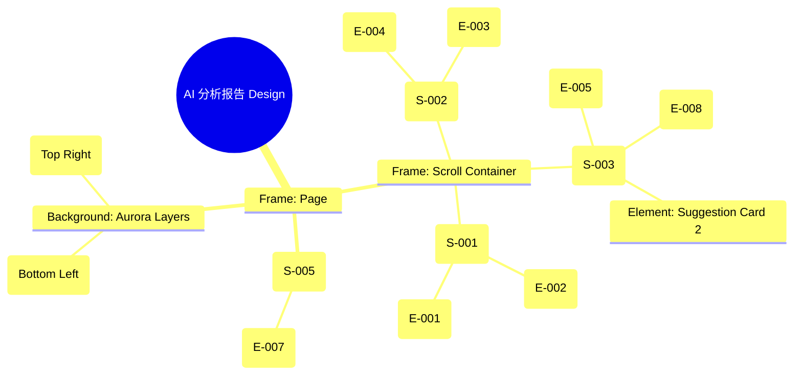

# AI 分析报告页 Design Release

> 输出路径：`product/release/design/050-ai-report.md`。本文档描述页面展示内容与样式布局，不描述交互执行、埋点、接口、后端或业务处理逻辑。

# AI 分析报告页 Design Release

## 0. 文档状态

| 字段 | 内容 |
|---|---|
| 文档版本 | Release |
| 生成日期 | 2026-05-12 |
| 来源 Mock 文件 | `product/release/mock/050-ai-report.md` |
| 设计约束目录 | `design/ios26-liquid-glass/` |
| 当前输出文件 | `product/release/design/050-ai-report.md` |
| 页面名称 | AI 分析报告页 |
| 内容范围 | 页面展示内容 + 视觉样式 + 布局结构 + AI 可读样式结构 |
| 不包含范围 | 交互执行 / 埋点 / 接口 / 后端 / 业务流程 / 实现代码 |

## 1. 页面设计综述

| 项目 | 内容 |
|---|---|
| 页面定位 | 展示 AI 对简历与岗位匹配度的深度分析结果与修改建议。 |
| 目标阅读对象 | 设计师 / 产品 / Figma Remote MCP agent |
| 视觉目标 | 打造一份具有深度、权威且极具未来感的 AI 分析报告，通过丰富的数据可视化传达专业性。 |
| 信息层级 | 1. 综合匹配评分（视觉锚点）；2. 维度雷达图与核心优势；3. 结构化的优化建议列表；4. 一键采纳操作。 |
| 主要视觉焦点 | 页面顶部的巨大发光匹配分值环（Score Ring）。 |
| 设计系统应用摘要 | iOS26 Liquid Glass：底层黑背景 + 动态 Aurora (Cyan/Purple) + 玻璃卡片 + 发光数据图表。 |

## 2. 设计约束提取

| 类型 | Token / 规则 | 取值 | 使用方式 | 来源文件 |
|---|---|---|---|---|
| color | background.canvas | #000000 | 页面底层背景 | DESIGN.md |
| color | accent.cyan | #32ADE6 | 高分状态核心色 (匹配度 > 80) | DESIGN.md |
| color | accent.purple | #BF5AF2 | 中分状态核心色 / 装饰光 | DESIGN.md |
| color | status.error | #FF453A | 低分状态核心色 (匹配度 < 40) | DESIGN.md |
| typography | size.xxl | 40px | 匹配分数值字号 | DESIGN.md |
| typography | size.lg | 20px | 评价总结字号 | DESIGN.md |
| typography | size.sm | 14px | 建议卡片正文字号 | DESIGN.md |
| space | space.6 | 32px | 模块间垂直间距 | DESIGN.md |
| radius | radius.lg | 24px | 建议卡片圆角 | DESIGN.md |
| shadow | glowAccent | 0 8px 32px rgba(191, 90, 242, 0.2) | 优势标签发光 | DESIGN.md |

## 3. 页面结构图



## 4. 自然语言样式描述

### 4.1 整体画面

- **页面整体氛围**：精致、严谨且充满智慧感，模拟高端科技产品中的仪表盘报告。
- **背景与层级**：底层为深邃黑。背景中的光斑根据分数变化调整色相（高分青色，低分红色）。报告卡片浮动在背景之上，具有极高的模糊度。
- **视觉重心**：顶部的巨大分值环。数字使用大字号加粗，并带有与其颜色一致的呼吸灯效阴影。
- **阅读节奏**：一眼看分数 -> 查看雷达图维度详情 -> 扫视优势标签 -> 深度阅读优化建议卡片。

### 4.2 关键区块叙述

| 区块ID | 区块名称 | 展示内容摘要 | 样式叙述 | 视觉优先级 | 设计决策 |
|---|---|---|---|---|---|
| S-001 | 评分概览区 | 综合分 + 核心总结 | 居中布局。分值环采用双层轨道：内轨为暗色 surfaceOverlay，外轨为发光的 accent 渐变色。总结文案使用 lg 字号，semibold 字重。 | 极高 | 通过分值环的色彩心理暗示用户结果的好坏。 |
| S-002 | 详细维度区 | 雷达图 + 优势标签 | 雷达图背景使用 surfaceMuted 填充。优势标签为高度圆角的 Pill 样式，背景为极淡的绿色透明填充，带 `shadow.glowAccent`。 | 高 | 雷达图边缘需锐利，体现数据准确性。 |
| S-003 | 优化建议列表 | 建议卡片 | 卡片背景为 surface。左侧有一个指示色条（橙色代表建议，绿色代表已优化）。标题使用 base 字号，内容使用 sm 字号并允许折叠。 | 中 | 卡片间距 12px，形成流式布局。 |
| S-005 | 底部操作区 | 优化按钮 | 悬浮在底部的全宽玻璃层上。按钮使用 action.primary.background，发光效果覆盖周围 32px 区域。 | 极高 | 确保用户在任何位置都能一键进入编辑器。 |

## 5. 布局与区块样式表

| 区块ID | 来源 Mock 区块 / 元素 | Frame 层级 | 布局方式 | 尺寸 / 约束 | Padding | Gap | 背景 / 边框 / 阴影 | 圆角 | 对齐 | 响应式变化 |
|---|---|---|---|---|---|---|---|---|---|---|
| Page | - | Root | Vertical | Fill Window | 0 | 0 | background.canvas | 0 | Center | - |
| S-001 | S-001 | Section | Vertical | Width: 100% | 48px 24px | 20px | Transparent | - | Center | - |
| S-002 | S-002 | Section | Vertical | Width: 100% | 24px | 24px | surface + glass | radius.lg | Center | - |
| S-003 | S-003 | Section | Vertical | Width: 100% | 24px | 12px | Transparent | - | Stretch | - |
| Card | E-005 | Group | Horizontal | Width: 100% | 16px | 12px | surface | radius.md | Center Left | - |
| S-005 | S-005 | Footer | Horizontal | Width: 100% | 16px 20px | - | surfaceOverlay + blur | - | Center | Fixed Bottom |

## 6. 元素级视觉定义

| 元素ID | 来源 Mock 元素 | 元素类型 | 展示内容 | 视觉角色 | 字体 / 字号 / 字重 | 颜色 Token | 背景 / 边框 | 尺寸 / 最小尺寸 | 状态样式摘要 | Figma 节点建议 |
|---|---|---|---|---|---|---|---|---|---|---|
| E-001 | E-001 | chart | 综合匹配分 | primary | xxl / bold | accent.cyan | - | 160x160 | Glowing arc | Custom Arc Node |
| E-002 | E-002 | text | 核心结论文案 | content | base / lg / semibold | text.default | - | - | - | Text Node |
| E-003 | E-003 | chart | 维度雷达图 | support | - | - | surfaceMuted | 200x200 | Translucent fill | Vector Polygon |
| E-004 | E-004 | list | 优势标签 | content | xs / medium | accent.cyan | surfaceOverlay | Pill shape | Glow effect | Component Instance |
| E-005 | E-005 | card | 建议卡片 | content | base / regular | text.default | surface / border.default | - | Expandable | Glass Card Frame |
| E-007 | E-007 | button | 立即去优化 | primary | base / bold | action.primary.text | action.primary.background | H: 52px | shadow.glowPrimary | Filled Button |
| E-008 | E-008 | button | 一键采纳 | support | sm / semibold | accent.blue | Transparent / border.default | H: 44px | - | Ghost Button |

## 7. 内容与样式绑定表

| 内容对象ID | 来源 Mock 内容 | 展示文案 / 媒体描述 | 内容来源类型 | 样式 Token 绑定 | 布局位置 | 备注 |
|---|---|---|---|---|---|---|
| C-001 | E-001 | 85 | 动态 | size.xxl, bold | Score Ring Center | |
| C-002 | E-002 | 匹配度较高，简历与岗位... | 动态 | size.lg, semibold | Below Score Ring | |
| C-003 | DATA-001 | 项目经验描述优化 | 动态 | size.base, medium | Card Title | |
| C-004 | E-004 | [项目经验丰富] | 动态 | size.xs, medium, accent.cyan | Tag Group | |
| C-005 | E-007 | 立即去优化 | 静态 | size.base, bold | Bottom Primary | |

## 8. 状态展示样式

| 状态ID | 来源 Mock 状态 | 状态类型 | 展示内容 | 视觉样式 | 色彩 / 图标 / 媒体处理 | 空间占位 | 可访问性说明 |
|---|---|---|---|---|---|---|---|
| STATE-001 | STATE-001 | loading | 采纳中... | 按钮文字变浅并旋转 | text.disabled | 保持 E-008 占位 | 实时通知采纳进度 |
| STATE-002 | STATE-002 | error | 匹配度低 (分数 < 40) | 分数环及背景变红 | status.error | 全局色调切换 | 确保低分警示足够醒目 |
| STATE-003 | S-004 | loading | 全屏分析动画 | 居中的 AI 神经网络动画 | accent.purple | 覆盖全页 | 参考 Upload 页动画逻辑 |

## 9. 响应式布局规则

| 断点 | 页面宽度范围 | Frame 布局 | 导航 / Header | 主内容布局 | 列表 / 表格 / 卡片变化 | 间距调整 | 优先隐藏或折叠内容 |
|---|---|---|---|---|---|---|---|
| mobile | < 768px | Vertical | 居中 | 单列流式堆叠 | 卡片全宽 | space.6 (32px) | - |
| tablet | 768px - 1023px | Vertical | 居中 | 居中限制宽 (600px) | 分数与雷达图并列 | space.7 (48px) | - |
| desktop | 1024px+ | Horizontal | 侧边栏 (可选) | 分栏布局 (左数右表) | 建议列表变两列 | space.8 (64px) | - |

## 10. AI 可读样式结构

```yaml
page:
  id: "U-020-030"
  name: "AI Analysis Report"
  source_mock: "product/release/mock/050-ai-report.md"
  design_system: "design/ios26-liquid-glass/"
  output: "product/release/design/050-ai-report.md"
  canvas:
    background_token: "color.background.canvas"
  background_effects:
    - type: "blur_blob"
      color: "accent.cyan"
      position: "top_right"
      size: "600px"
      blur: "150px"
      opacity: 0.15
    - type: "blur_blob"
      color: "accent.purple"
      position: "bottom_left"
      size: "400px"
      blur: "100px"
      opacity: 0.1
  frames:
    - id: "frame-root"
      type: "frame"
      layout: "vertical"
      children:
        - id: "score-summary"
          type: "frame"
          padding: 48
          children: ["E-001", "E-002"]
        - id: "dimension-card"
          type: "frame"
          background: "background.surface"
          backdrop_filter: "blur(24px)"
          radius: "radius.lg"
          margin: 20
          padding: 24
          children: ["E-003", "E-004-group"]
        - id: "suggestions-list"
          type: "frame"
          padding: 20
          gap: 12
          children: ["E-005-cards", "E-008-action"]
  components:
    - id: "score-ring"
      type: "chart"
      stroke_token: "accent.cyan"
      shadow_token: "shadow.glowPrimary"
      size: 160
```

## 11. Figma Remote MCP 生成提示

| 项目 | 指令 |
|---|---|
| Frame 创建顺序 | Canvas -> Background Blobs -> Scroll Area -> Score Ring -> Dimension Card -> Suggestion Cards -> Floating Footer |
| Auto Layout 设置 | Dimension Card 使用 Vertical Auto Layout, Padding 24, Gap 24. 建议列表 Gap 12. |
| Token 应用方式 | 分数大字使用 size.xxl bold. 优势标签使用 size.xs medium + Pill radius. |
| 组件分组 | 将每个维度得分、每个建议卡片分别封装为 Component Set 以支持状态切换。 |
| 文本节点命名 | 分数命名为 "Score_Value", 总结文案为 "Conclusion", 建议卡片标题为 "Suggestion_Title". |
| 响应式变体 | Mobile 为一列。Desktop 下 Score Ring 与 Radar Chart 水平排列。 |
| 生成时禁止事项 | 不生成复杂的动态雷达图渲染逻辑、不生成展开收起的具体 JS 交互。 |

## 12. 设计决策记录

| 决策ID | 决策内容 | 依据 | 影响范围 |
|---|---|---|---|
| DD-001 | 使用动态色彩分值环（Cyan/Purple/Red）。 | 视觉化反馈匹配程度，符合直觉。 | 页面视觉基调 |
| DD-002 | 将维度雷达图与优势标签整合在一个大的玻璃卡片中。 | 逻辑归类为“多维度详细分析”，保持信息紧凑性。 | 页面中段布局 |
| DD-003 | 建议卡片左侧增加指示色条。 | 快速区分建议的严重程度 or 类型。 | 建议列表可读性 |
