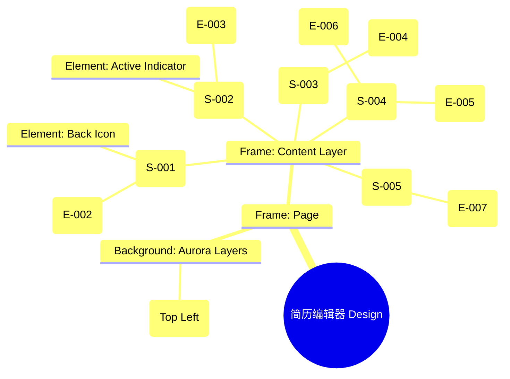

# 简历编辑器 Design Release

> 输出路径：`product/release/design/060-editor.md`。本文档描述页面展示内容与样式布局，不描述交互执行、埋点、接口、后端或业务处理逻辑。

# 简历编辑器 Design Release

## 0. 文档状态

| 字段 | 内容 |
|---|---|
| 文档版本 | Release |
| 生成日期 | 2026-05-12 |
| 来源 Mock 文件 | `product/release/mock/060-editor.md` |
| 设计约束目录 | `design/ios26-liquid-glass/` |
| 当前输出文件 | `product/release/design/060-editor.md` |
| 页面名称 | 简历编辑器 |
| 内容范围 | 页面展示内容 + 视觉样式 + 布局结构 + AI 可读样式结构 |
| 不包含范围 | 交互执行 / 埋点 / 接口 / 后端 / 业务流程 / 实现代码 |

## 1. 页面设计综述

| 项目 | 内容 |
|---|---|
| 页面定位 | 核心简历编辑工具，集成 AI 建议对比与实时保存功能。 |
| 目标阅读对象 | 设计师 / 产品 / Figma Remote MCP agent |
| 视觉目标 | 打造一个高效且极具质感的数字化工作台，通过深邃的玻璃层级减少长时间编辑的视觉疲劳。 |
| 信息层级 | 1. 模块切换（Tab）；2. 简历表单内容（Core）；3. AI 优化建议入口（AI Assistant）；4. 预览与导出动作。 |
| 主要视觉焦点 | 浮动的 AI 优化建议悬浮球（AI Assistant Orb）。 |
| 设计系统应用摘要 | iOS26 Liquid Glass：底层黑背景 + 动态 Aurora (Blue) + 玻璃面板堆叠 + 呼吸感微光效果。 |

## 2. 设计约束提取

| 类型 | Token / 规则 | 取值 | 使用方式 | 来源文件 |
|---|---|---|---|---|
| color | background.canvas | #000000 | 页面底层背景 | DESIGN.md |
| color | action.primary.glow | rgba(10, 132, 255, 0.4) | AI 悬浮球呼吸光效 | DESIGN.md |
| color | accent.blue | #007AFF | 活跃 Tab 指示器颜色 | DESIGN.md |
| typography | size.base | 16px | 表单输入内容 | DESIGN.md |
| typography | size.sm | 14px | 辅助文案与 Tab 文字 | DESIGN.md |
| space | space.3 | 12px | 表单项内部间距 | DESIGN.md |
| space | space.6 | 32px | 模块间垂直留白 | DESIGN.md |
| radius | radius.md | 14px | 输入框圆角 | DESIGN.md |
| radius | radius.full | 999px | AI 悬浮球圆角 | DESIGN.md |

## 3. 页面结构图



## 4. 自然语言样式描述

### 4.1 整体画面

- **页面整体氛围**：专业、专注且充满智能感，模拟深色模式下的沉浸式 IDE 环境。
- **背景与层级**：画布为纯黑。背景中带有一个极弱的蓝色 Aurora 流动微光。编辑器主体是一个占据屏幕 80% 的巨大玻璃容器，边缘带有细微的 0.5px 浅色描边。
- **视觉重心**：正在编辑的表单区域，以及右下角带呼吸动画的 AI 悬浮球。
- **阅读节奏**：切换上方 Tab -> 填写中部内容 -> 关注保存状态 -> 点击右下角 AI 建议。

### 4.2 关键区块叙述

| 区块ID | 区块名称 | 展示内容摘要 | 样式叙述 | 视觉优先级 | 设计决策 |
|---|---|---|---|---|---|
| S-001 | 顶部操作区 | 返回 + 导出预览 | 背景全透明。导出预览按钮采用 Primary 样式，带圆角 radius.full。 | 中 | 保持顶部视线通透。 |
| S-002 | 模块切换区 | 简历各版块 Tab | 横向排布。非活跃项使用 text.muted，活跃项使用 text.default 并在下方显示 4px 宽的 accent.blue 圆角线条。 | 高 | 建立清晰的导航层级。 |
| S-003 | 动态表单区 | 编辑字段集合 | 表单项嵌套在 Editor Panel 内部。每个 Group 之间有 space.6 的垂直间距。输入框背景使用 surfaceMuted，半透明度 0.1。 | 极高 | 优化表单密度，确保长时间编辑不拥挤。 |
| S-004 | AI 建议浮窗 | 悬浮球 + 对比弹窗 | 悬浮球位于右下角，使用 `background.surface` 加 `blur(24px)`。弹窗采用全屏覆盖模式，内容区域为左右分栏玻璃卡片。 | 极高 | 通过呼吸动画引导用户点击 AI 优化。 |
| S-005 | 底部操作区 | 状态文字 | 极细文案，置于页面最底部，不遮挡内容。使用 xs 字号。 | 低 | 提供静默式的同步反馈。 |

## 5. 布局与区块样式表

| 区块ID | 来源 Mock 区块 / 元素 | Frame 层级 | 布局方式 | 尺寸 / 约束 | Padding | Gap | 背景 / 边框 / 阴影 | 圆角 | 对齐 | 响应式变化 |
|---|---|---|---|---|---|---|---|---|---|---|
| Page | - | Root | Vertical | Fill Window | 0 | 0 | background.canvas | 0 | Center | - |
| S-001 | S-001 | Header | Horizontal | Width: 100% | 16px 20px | - | Transparent | - | Center | - |
| S-002 | S-002 | Nav | Horizontal | Width: 100% | 12px 20px | 24px | surfaceOverlay | - | Center Left | Scrollable |
| S-003 | S-003 | Panel | Vertical | Fill Container | 24px | 24px | Transparent | - | Top Stretch | - |
| Orb | E-005 | Float | Horizontal | 60x60 | - | - | surface + glass | radius.full | Center | Right: 24, Bottom: 80 |

## 6. 元素级视觉定义

| 元素ID | 来源 Mock 元素 | 元素类型 | 展示内容 | 视觉角色 | 字体 / 字号 / 字重 | 颜色 Token | 背景 / 边框 | 尺寸 / 最小尺寸 | 状态样式摘要 | Figma 节点建议 |
|---|---|---|---|---|---|---|---|---|---|---|
| E-001 | E-001 | button | < 图标 | support | - | text.default | - | 44x44 | - | Circle Frame |
| E-002 | E-002 | button | 预览并生成 PDF | primary | sm / bold | action.primary.text | action.primary.background | H: 36px | shadow.glowPrimary | Small Button |
| E-003 | E-003 | nav_item | 基本信息 | nav | sm / regular | text.muted | - | - | Active: accent.blue | Text |
| E-004 | E-004 | input | 简历字段输入 | content | base / regular | text.default | surfaceMuted | H: 54px | Focus: border.highlight | Input Frame |
| E-005 | E-005 | float_btn | AI 助手 | action | - | - | surface | 60x60 | Pulse animation | Floating Circle |
| E-006 | E-006 | modal | 对比弹窗 | overlay | - | - | blur(48px) | Full Screen | Side-by-side | Overlay Layer |
| E-007 | E-007 | text | 已自动保存 | support | xs / regular | text.muted | - | - | - | Small Text |

## 7. 内容与样式绑定表

| 内容对象ID | 来源 Mock 内容 | 展示文案 / 媒体描述 | 内容来源类型 | 样式 Token 绑定 | 布局位置 | 备注 |
|---|---|---|---|---|---|---|
| C-001 | E-003 | 基本信息 | 静态 | size.sm, regular | Tab Item | |
| C-002 | BASIC-001 | 姓名 | 静态 | size.base, medium | Input Label | |
| C-003 | E-005 | 发现 3 处可优化项 | 动态 | size.xs, regular | Beside Orb | |
| C-004 | E-007 | 正在保存... | 动态 | size.xs, regular | Bottom Right | |
| C-005 | E-006-Title | AI 建议对比 | 静态 | size.lg, bold | Modal Header | |

## 8. 状态展示样式

| 状态ID | 来源 Mock 状态 | 状态类型 | 展示内容 | 视觉样式 | 色彩 / 图标 / 媒体处理 | 空间占位 | 可访问性说明 |
|---|---|---|---|---|---|---|---|
| STATE-001 | STATE-001 | pulse | 悬浮球呼吸态 | 外围光圈扩散 | action.primary.glow | 覆盖 Orb 背景 | 触觉反馈 (如支持) |
| STATE-002 | STATE-002 | syncing | 保存中文案 | 文字透明度变化 | text.muted | 保持 E-007 占位 | 读屏实时播报状态 |
| STATE-003 | STATE-003 | error | 校验失败红框 | 字段边框变色 | status.error | 修改 Input 描边 | 颜色对比度符合规范 |

## 9. 响应式布局规则

| 断点 | 页面宽度范围 | Frame 布局 | 导航 / Header | 主内容布局 | 列表 / 表格 / 卡片变化 | 间距调整 | 优先隐藏或折叠内容 |
|---|---|---|---|---|---|---|---|
| mobile | < 768px | Vertical | 居左 | 单列平铺 | Tab 允许横移 | space.4 (16px) | - |
| tablet | 768px - 1023px | Vertical | 居左 | 限制最大宽 (720px) | Tab 居中展示 | space.6 (32px) | - |
| desktop | 1024px+ | Horizontal | 侧边 Tab | 左侧导航+右侧编辑 | 弹窗变浮动面板 | space.8 (64px) | - |

## 10. AI 可读样式结构

```yaml
page:
  id: "U-020-040"
  name: "Resume Editor"
  source_mock: "product/release/mock/060-editor.md"
  design_system: "design/ios26-liquid-glass/"
  output: "product/release/design/060-editor.md"
  canvas:
    background_token: "color.background.canvas"
  background_effects:
    - type: "blur_blob"
      color: "accent.blue"
      position: "top_left"
      size: "500px"
      blur: "120px"
      opacity: 0.1
  frames:
    - id: "frame-root"
      type: "frame"
      layout: "vertical"
      children:
        - id: "header-action"
          type: "frame"
          layout: "horizontal"
          padding: 16
          children: ["E-001", "E-002"]
        - id: "tab-navigator"
          type: "frame"
          layout: "horizontal"
          background: "background.surfaceOverlay"
          children: ["E-003-list"]
        - id: "editor-canvas"
          type: "frame"
          layout: "vertical"
          padding: 24
          children: ["E-004-groups"]
        - id: "assistant-layer"
          type: "overlay"
          children: ["E-005", "E-006"]
  components:
    - id: "ai-orb"
      type: "button"
      background: "background.surface"
      radius: "radius.full"
      shadow: "shadow.glowPrimary"
      animation: "pulse"
```

## 11. Figma Remote MCP 生成提示

| 项目 | 指令 |
|---|---|
| Frame 创建顺序 | Canvas -> Background Blob -> Header -> Tab Bar -> Editor Panel -> AI Orb (Overlay) |
| Auto Layout 设置 | Editor Panel 使用 Vertical Auto Layout, Padding 24, Gap 24. Tab Bar 间距 24. |
| Token 应用方式 | AI Orb 使用 shadow.glowPrimary. 活跃 Tab 使用 accent.blue 指示条. |
| 组件分组 | 将每个表单项 Label + Input 编组为 "Editor_Field". |
| 文本节点命名 | Tab 命名为 "Tab_Name", 输入框 Label 为 "Field_Label", 保存状态为 "Save_Status". |
| 响应式变体 | Mobile 为顶部导航。Desktop 下可考虑将 Tab 移动到左侧。 |
| 生成时禁止事项 | 不生成具体的表单实时保存逻辑、不生成 AI 解析具体的后端延迟效果。 |

## 12. 设计决策记录

| 决策ID | 决策内容 | 依据 | 影响范围 |
|---|---|---|---|
| DD-001 | 使用深色玻璃面板替代传统纸质模拟背景。 | 强化“数字化”属性，减少白底深色文字对眼睛的刺激。 | 页面视觉核心 |
| DD-002 | AI 建议采用“右下角悬浮球”而非侧边栏。 | 确保移动端最大化编辑空间，仅在需要时通过悬浮球唤起 AI 建议。 | AI 辅助交互 |
| DD-003 | 模块切换 Tab 固定在顶部。 | 方便用户在多个简历版块间快速跳转，无需返回上一页。 | 导航操作效率 |
