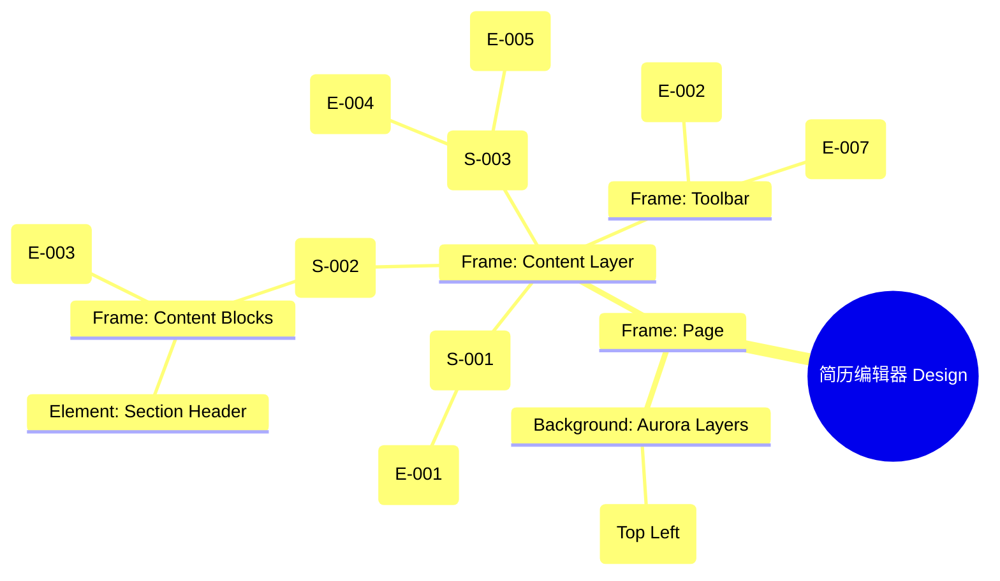

# 简历编辑器 Design Release

> 输出路径：`product/release/design/060-editor.md`。本文档描述页面展示内容与样式布局，不描述交互执行、埋点、接口、后端或业务处理逻辑。

# 简历编辑器 Design Release

## 0. 文档状态

| 字段 | 内容 |
|---|---|
| 文档版本 | Release |
| 生成日期 | 2026-05-12 |
| 来源 Mock 文件 | `product/release/mock/060-editor.md` |
| 设计约束目录 | `design/ios26-liquid-glass/` |
| 当前输出文件 | `product/release/design/060-editor.md` |
| 页面名称 | 简历编辑器 |
| 内容范围 | 页面展示内容 + 视觉样式 + 布局结构 + AI 可读样式结构 |
| 不包含范围 | 交互执行 / 埋点 / 接口 / 后端 / 业务流程 / 实现代码 |

## 1. 页面设计综述

| 项目 | 内容 |
|---|---|
| 页面定位 | 核心生产力工具，支持用户手动修改简历内容或一键采纳 AI 优化建议。 |
| 目标阅读对象 | 设计师 / 产品 / Figma Remote MCP agent |
| 视觉目标 | 打造一个如 IDE (集成开发环境) 般专业且专注的编辑空间。通过深色模式下的微弱层级区分，减少长时间编辑的视觉疲劳。 |
| 信息层级 | 1. 简历内容编辑区；2. AI 助手悬浮入口；3. 模块导航 Tab；4. 下一步导出入口。 |
| 主要视觉焦点 | 带有呼吸动效的 AI 助手悬浮球及其展开的透明对话窗。 |
| 设计系统应用摘要 | iOS26 Liquid Glass：背景 #000000 + 侧边栏玻璃遮罩 + 动态 Aurora (Blue) + 极简输入框样式。 |

## 2. 设计约束提取

| 类型 | Token / 规则 | 取值 | 使用方式 | 来源文件 |
|---|---|---|---|---|
| color | background.canvas | #000000 | 页面底层背景 | DESIGN.md |
| color | accent.blue | #0A84FF | AI 助手高亮 / 焦点边框 | DESIGN.md |
| color | background.surface | rgba(255, 255, 255, 0.05) | 内容区块背景 | DESIGN.md |
| typography | size.base | 16px | 简历正文字号 | DESIGN.md |
| typography | size.sm | 14px | AI 建议文字字号 | DESIGN.md |
| space | space.4 | 16px | 输入框内部间距 | DESIGN.md |
| radius | radius.md | 14px | 内容卡片圆角 | DESIGN.md |
| component | button.minHeight | 48px | 操作按钮高度 | DESIGN.md |

## 3. 页面结构图



## 4. 自然语言样式描述

### 4.1 整体画面

- **页面整体氛围**：沉浸、高效、智能感。背景左上方有一抹淡淡的 Blue Aurora，暗示着 AI 助手的能量源。
- **背景与层级**：底层为纯黑 Canvas。编辑区域并非一张白纸，而是由多个深灰色的玻璃卡片（surfaceMuted）组合而成的结构化画布。
- **视觉重心**：AI 助手悬浮球，它具有半透明的蓝色核心，并伴有规律的扩大/缩小发光效果。
- **阅读节奏**：切换模块 Tab -> 在结构化表单中修改内容 -> 点击 AI 助手查看一键优化方案 -> 保存并前往导出。

### 4.2 关键区块叙述

| 区块ID | 区块名称 | 展示内容摘要 | 样式叙述 | 视觉优先级 | 设计决策 |
|---|---|---|---|---|---|
| S-001 | 模块切换区 | 基本信息/经历等 Tab | 位于顶部。采用横向滚动设计。选中项下方带有发光的 `accent.blue` 短横线。 | 中 | 快速跳转不同简历版块。 |
| S-002 | 核心编辑区 | 简历各版块表单 | 位于中心。每个输入项是一个去边框的玻璃容器。文字采用 `text.default`。 | 极高 | 确保文字编辑的沉浸感。 |
| S-003 | AI 助手区 | 悬浮球 + 建议浮窗 | 悬浮球位于右下角上方。点击后弹出的浮窗使用 `blur(48px)` 的极高模糊度。 | 极高 | 差异化功能点，需突出展示。 |

## 5. 布局与区块样式表

| 区块ID | 来源 Mock 区块 / 元素 | Frame 层级 | 布局方式 | 尺寸 / 约束 | Padding | Gap | 背景 / 边框 / 阴影 | 圆角 | 对齐 | 响应式变化 |
|---|---|---|---|---|---|---|---|---|---|---|
| Page | - | Root | Vertical | Fill Window | 0 | 0 | background.canvas | 0 | Center | - |
| S-001 | S-001 | TabBar | Horizontal | Width: 100% | 12px 20px | 24px | surfaceOverlay | - | Left | Scrollable |
| S-002 | S-002 | ScrollView | Vertical | Width: 100% | 20px | 24px | Transparent | - | Top | Scrollable |
| Orb | E-004 | Floating | - | 56x56 | - | - | accent.blue + glow | radius.full | Bottom Right | Floating |
| Footer | - | Toolbar | Horizontal | Width: 100% | 16px 20px | - | surfaceOverlay + blur | - | Center | Fixed Bottom |

## 6. 元素级视觉定义

| 元素ID | 来源 Mock 元素 | 元素类型 | 展示内容 | 视觉角色 | 字体 / 字号 / 字重 | 颜色 Token | 背景 / 边框 | 尺寸 / 最小尺寸 | 状态样式摘要 | Figma 节点建议 |
|---|---|---|---|---|---|---|---|---|---|---|
| E-001 | E-001 | tab | 模块标题 | support | base / medium | text.default | - | - | Active: accent.blue | Tab Item |
| E-003 | E-003 | field | 内容编辑框 | entry | base / regular | text.default | surfaceMuted | min-H: 48px | Focus: border.highlight | Editor Field |
| E-004 | E-004 | orb | AI 助手入口 | brand | - | - | accent.blue | 56x56 | Breathing Glow | Floating Orb |
| E-005 | E-005 | window | AI 建议浮窗 | functional | sm / regular | text.default | glass_dark | Width: 280px | Backdrop blur: 48px | Floating Panel |

## 7. 内容与样式绑定表

| 内容对象ID | 来源 Mock 内容 | 展示文案 / 媒体描述 | 内容来源类型 | 样式 Token 绑定 | 布局位置 | 备注 |
|---|---|---|---|---|---|---|
| C-001 | E-001 | 工作经历 | 静态 | base, medium | Tab Bar | |
| C-002 | E-003 | 负责产品原型设计及... | 动态 | base, regular | Editor Field | |
| C-003 | E-005 | 建议增加量化数据... | 动态 | sm, regular | AI Window | |
| C-004 | E-007 | 已自动保存 | 动态 | xs, muted | Toolbar Left | |

## 8. 状态展示样式

| 状态ID | 来源 Mock 状态 | 状态类型 | 展示内容 | 视觉样式 | 色彩 / 图标 / 媒体处理 | 空间占位 | 可访问性说明 |
|---|---|---|---|---|---|---|---|
| STATE-001 | STATE-001 | saving | 正在保存... | 灰色文字微光 | text.muted (Pulse) | E-007 位置 | |
| STATE-002 | STATE-002 | typing | 输入中 | 蓝色光晕边框 | border.highlight | E-003 容器 | |
| Orb_Active | - | active | 助手展开 | 悬浮球旋转 | Transform: Rotate(45deg) | - | |

## 9. 响应式布局规则

| 断点 | 页面宽度范围 | Frame 布局 | 导航 / Header | 主内容布局 | 列表 / 表格 / 卡片变化 | 间距调整 | 优先隐藏或折叠内容 |
|---|---|---|---|---|---|---|---|
| mobile | < 768px | Vertical | 顶部 Tab | 垂直表单 | - | space.4 | - |
| tablet | 768px - 1023px | Horizontal | 侧边 Tab | 左右布局 | - | space.6 | - |
| desktop | 1024px+ | Horizontal | 侧边 Tab | 预览+编辑分栏 | 建议浮窗固定在右侧 | space.8 | - |

## 10. AI 可读样式结构

```yaml
page:
  id: "U-020-040"
  name: "Resume Editor"
  source_mock: "product/release/mock/060-editor.md"
  design_system: "design/ios26-liquid-glass/"
  output: "product/release/design/060-editor.md"
  canvas:
    background_token: "color.background.canvas"
  background_effects:
    - type: "blur_blob"
      color: "accent.blue"
      position: "top_left"
      size: "700px"
      blur: "200px"
      opacity: 0.1
  frames:
    - id: "frame-root"
      type: "frame"
      layout: "vertical"
      children:
        - id: "tab-navigation"
          type: "frame"
          layout: "horizontal"
          background: "background.surfaceOverlay"
          children: ["E-001-tabs"]
        - id: "editor-scroll-view"
          type: "frame"
          layout: "vertical"
          padding: 20
          children: ["E-003-fields"]
        - id: "ai-assistant-overlay"
          type: "overlay"
          children: ["E-004-orb", "E-005-suggestion"]
        - id: "bottom-toolbar"
          type: "frame"
          layout: "horizontal"
          padding: 16
          children: ["E-007", "E-002"]
  components:
    - id: "ai-orb"
      type: "ellipse"
      size: 56
      background: "accent.blue"
      shadow: "shadow.glowPrimary"
      animation: "breathing_glow"
```

## 11. Figma Remote MCP 生成提示

| 项目 | 指令 |
|---|---|
| Frame 创建顺序 | Canvas -> Background Blob -> Tab Bar -> Editor Area -> AI Orb (Overlay) -> Bottom Toolbar |
| Auto Layout 设置 | Editor Area 使用 Vertical Auto Layout, Gap 24. |
| Token 应用方式 | AI 悬浮球应用 shadow.glowPrimary. 保存状态文字应用 size.xs. |
| 组件分组 | 将输入框与 Label 编组为 "Editor_Block". |
| 文本节点命名 | 简历内容命名为 "Resume_Content", AI 建议为 "AI_Advice". |
| 响应式变体 | 在 Desktop 下将 Tab Bar 移动到左侧作为 Sidebar. |
| 生成时禁止事项 | 不生成真实的文本光标闪烁效果。 |

## 12. 设计决策记录

| 决策ID | 决策内容 | 依据 | 影响范围 |
|---|---|---|---|
| DD-001 | 使用 IDE 风格的布局逻辑。 | 编辑简历是一项高专注度任务，IDE 风格能提供最直观的模块化管理体验。 | 页面结构 |
| DD-002 | AI 助手设计为呼吸感悬浮球。 | 建立“智能体就在身边”的心理暗示，不占用常驻空间。 | 交互组件 |
| DD-003 | 采用无边框的玻璃输入框设计。 | 减少线条对视觉的干扰，使内容本身成为主角。 | 表单设计 |
 Riverside, CA
