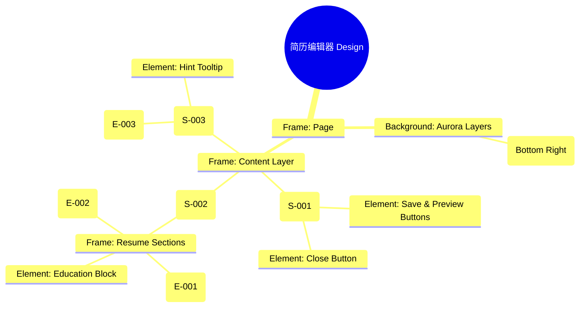

# 简历编辑器 Design Release

> 输出路径：`product/release/design/060-editor.md`。本文档描述页面展示内容与样式布局，不描述交互执行、埋点逻辑、接口、后端或业务处理逻辑。

# 简历编辑器 Design Release

## 0. 文档状态

| 字段 | 内容 |
|---|---|
| 文档版本 | Release |
| 生成日期 | 2026-05-12 |
| 来源 Mock 文件 | `product/release/mock/060-editor.md` |
| 设计约束目录 | `design/ios26-liquid-glass/` |
| 当前输出文件 | `product/release/design/060-editor.md` |
| 页面名称 | 简历编辑器 |
| 内容范围 | 页面展示内容 + 视觉样式 + 布局结构 + AI 可读样式结构 |
| 不包含范围 | 交互执行 / 埋点 / 接口 / 后端 / 业务流程 / 实现代码 |

## 1. 页面设计综述

| 项目 | 内容 |
|---|---|
| 页面定位 | App 的核心生产力页面，提供沉浸式的简历内容编辑与 AI 辅助修改。 |
| 目标阅读对象 | 设计师 / 产品 / Figma Remote MCP agent |
| 视觉目标 | 打造一个专业、沉浸且具有“智能助手”陪伴感的编辑器。通过暗色工作台突出简历白页（预览态）。 |
| 信息层级 | 1. 顶部操作栏（保存/预览）；2. AI 浮动建议球；3. 模块化简历编辑区（主体）。 |
| 主要视觉焦点 | 右下角漂浮的、带有动态流光效果的 AI 助手悬浮球（AI Assistant Orb）。 |
| 设计系统应用摘要 | iOS26 Liquid Glass：纯黑背景 + 动态 Aurora (Purple) + 磨砂玻璃侧边栏 + AI 呼吸灯动效。 |

## 2. 设计约束提取

| 类型 | Token / 规则 | 取值 | 使用方式 | 来源文件 |
|---|---|---|---|---|
| color | background.canvas | #000000 | 页面底层背景 | DESIGN.md |
| color | accent.purple | #BF5AF2 | AI 建议与高亮标记 | DESIGN.md |
| color | surface.overlay | rgba(255, 255, 255, 0.05) | 编辑块背景 | DESIGN.md |
| typography | size.lg | 20px | 模块标题字号 | DESIGN.md |
| typography | size.base | 16px | 编辑正文内容字号 | DESIGN.md |
| space | space.4 | 16px | 内容区块间距 | DESIGN.md |
| radius | radius.md | 14px | 编辑卡片圆角 | DESIGN.md |
| blur | blur.md | 24px | 辅助面板模糊度 | DESIGN.md |

## 3. 页面结构图



## 4. 自然语言样式描述

### 4.1 整体画面

- **页面整体氛围**：专业、严谨、沉浸。背景采用极致的纯黑，通过局部的紫色微光营造出一种“在黑暗中打磨作品”的专注感。
- **背景与层级**：底层为背景光。中间层是可滚动的简历模块流。最顶层是半透明的导航条和始终悬浮的 AI 助手球。
- **视觉重心**：AI 助手球。球体内部包含动态旋转的紫色粒子，边缘具有柔和的发光阴影，即使在暗色背景下也非常醒目。
- **阅读节奏**：快速扫视顶部导航 -> 沉浸在模块化编辑器中 -> 关注 AI 助手球提供的优化气泡。

### 4.2 关键区块叙述

| 区块ID | 区块名称 | 展示内容摘要 | 样式叙述 | 视觉优先级 | 设计决策 |
|---|---|---|---|---|---|
| S-001 | 顶部工具栏 | 保存 + 预览 | 固定在顶部。背景使用 `glass` 材质。预览按钮使用 Primary 发光样式。 | 高 | 确保随时可保存或跳转预览。 |
| S-002 | 编辑工作区 | 简历各板块 | 纵向排列。每板块为一个独立的玻璃感卡片。正在编辑的板块带有 `accent.purple` 的左侧指示线。 | 极高 | 核心生产力区域，减少视觉噪音。 |
| S-003 | AI 助手区 | 悬浮球 + 气泡 | 悬浮在页面右下角。球体使用玻璃渐变材质，内部粒子呼吸跳动。弹出气泡使用 `surfaceOverlay`。 | 高 | 赋予 App 智能化生命感。 |

## 5. 布局与区块样式表

| 区块ID | 来源 Mock 区块 / 元素 | Frame 层级 | 布局方式 | 尺寸 / 约束 | Padding | Gap | 背景 / 边框 / 阴影 | 圆角 | 对齐 | 响应式变化 |
|---|---|---|---|---|---|---|---|---|---|---|
| Page | - | Root | Vertical | Fill Window | 0 | 0 | background.canvas | 0 | Center | - |
| S-001 | S-001 | Header | Horizontal | Width: 100% | 16px 20px | - | glass | - | Center | Fixed Top |
| S-002 | S-002 | Scroll | Vertical | Width: 100% | 80px 20px | 16px | Transparent | - | Top Stretch | Scrollable |
| Block | E-002 | Item | Vertical | Width: 100% | 16px | 12px | surface.overlay | radius.md | Left | - |
| S-003 | S-003 | Float | Vertical | 64x64 | 0 | 0 | AI Gradient | radius.full | Bottom Right | Absolute |

## 6. 元素级视觉定义

| 元素ID | 来源 Mock 元素 | 元素类型 | 展示内容 | 视觉角色 | 字体 / 字号 / 字重 | 颜色 Token | 背景 / 边框 | 尺寸 / 最小尺寸 | 状态样式摘要 | Figma 节点建议 |
|---|---|---|---|---|---|---|---|---|---|---|
| E-001 | E-001 | text_field | 个人信息板块 | content | base / medium | text.default | surface.overlay | - | - | Section Frame |
| E-002 | E-002 | text_area | 工作经历板块 | content | base / regular | text.default | surface.overlay | Min-H: 120px | Focus: highlight | Multiline Input |
| E-003 | E-003 | component | AI 悬浮球 | AI_Icon | - | accent.purple | AI Gradient | 64x64 | Pulse: glow | Sphere Node |
| E-004 | E-004 | tooltip | 优化建议气泡 | info | sm / regular | text.default | glass | Max-W: 200px | Show/Hide | Overlay Frame |

## 7. 内容与样式绑定表

| 内容对象ID | 来源 Mock 内容 | 展示文案 / 媒体描述 | 内容来源类型 | 样式 Token 绑定 | 布局位置 | 备注 |
|---|---|---|---|---|---|---|
| C-001 | S-002-Sec-1 | 基本信息 | 静态 | size.base, bold | Section 1 Title | |
| C-002 | DATA-Exp-1 | 负责 AI 模型调优... | 动态 | size.base, regular | Section 2 Content | |
| C-003 | E-004 | AI 建议：增加量化数据... | 动态 | size.sm, medium | S-003 Tooltip | |
| C-004 | S-001-Action | 预览 | 静态 | size.sm, bold | Header Right | |

## 8. 状态展示样式

| 状态ID | 来源 Mock 状态 | 状态类型 | 展示内容 | 视觉样式 | 色彩 / 图标 / 媒体处理 | 空间占位 | 可访问性说明 |
|---|---|---|---|---|---|---|---|
| STATE-001 | STATE-001 | editing | 正在编辑板块 | 边缘渐变描边 | accent.purple | 修改 Block 边框 | 读屏提示：正在编辑工作经历 |
| STATE-002 | STATE-002 | thinking | AI 思考中 | 粒子旋转加速 | accent.purple | 修改 E-003 内部 | 动态加载态 |
| STATE-003 | STATE-003 | alert | 语法错误 | 文本底部波浪线 | status.error | 内嵌于正文 | 语法提示 |

## 9. 响应式布局规则

| 断点 | 页面宽度范围 | Frame 布局 | 导航 / Header | 主内容布局 | 列表 / 表格 / 卡片变化 | 间距调整 | 优先隐藏或折叠内容 |
|---|---|---|---|---|---|---|---|
| mobile | < 768px | Vertical | 顶部横向工具栏 | 单列全宽 | 模块纵向平铺 | space.4 (16px) | - |
| tablet | 768px - 1023px | Horizontal | 侧边浮动工具栏 | 编辑与预览左右对分 | - | space.6 (32px) | - |
| desktop | 1024px+ | Horizontal | 侧边栏工具 | 三栏 (模块导航/编辑/实时预览) | - | space.8 (64px) | - |

## 10. AI 可读样式结构

```yaml
page:
  id: "U-020-040"
  name: "Resume Editor"
  source_mock: "product/release/mock/060-editor.md"
  design_system: "design/ios26-liquid-glass/"
  output: "product/release/design/060-editor.md"
  canvas:
    background_token: "color.background.canvas"
  background_effects:
    - type: "blur_blob"
      color: "purple"
      position: "bottom_right"
      size: "900px"
      blur: "200px"
      opacity: 0.1
  frames:
    - id: "frame-root"
      type: "frame"
      layout: "vertical"
      children:
        - id: "top-toolbar"
          type: "fixed_top"
          background: "glass"
          children: ["close-btn", "actions-group"]
        - id: "editor-scroll-view"
          type: "frame"
          overflow: "scroll"
          padding: [80, 20, 100, 20]
          children: ["section-info", "section-exp", "section-edu"]
        - id: "ai-assistant-layer"
          type: "absolute_layer"
          children: ["ai-orb", "ai-tooltip"]
  components:
    - id: "ai-orb"
      type: "floating_sphere"
      background: "radial-gradient(purple, transparent)"
      shadow: "0 0 40px rgba(191,90,242,0.4)"
```

## 11. Figma Remote MCP 生成提示

| 项目 | 指令 |
|---|---|
| Frame 创建顺序 | Canvas -> Background Blob -> Header Toolbar -> Sections -> AI Assistant Orb |
| Auto Layout 设置 | Editor Scroll View 使用 Vertical Auto Layout, Gap 16. Header 使用 Horizontal 左右对齐. |
| Token 应用方式 | 当前编辑块使用 1px accent.purple 描边. AI 球使用 Radial Gradient. |
| 组件分组 | 将“个人信息”、“工作经历”等板块封装为 "Editor_Section". |
| 文本节点命名 | 板块标题命名为 "Title_Section", 编辑正文命名为 "Text_Editor_Content". |
| 响应式变体 | Mobile 为单一长滚动视图。Desktop 下可开启“实时预览”分栏 (Split View). |
| 生成时禁止事项 | 不生成具体的 Markdown 解析引擎、不生成多级撤销/重做逻辑的视觉状态。 |

## 12. App Shell / Navigation Contract

| 组件类型 | 展示规则 | 状态 | 内容项 | 视觉样式 |
|---|---|---|---|---|
| Top Nav | 显示 | 固定顶部 | 关闭, 保存, 预览 | 磨砂玻璃, 底部细描边 |
| Bottom Tab | 隐藏 | - | - | - |
| Status Bar | 显示 | Light Content | 时间, 信号, 电池 | 纯白图标 |
| Home Indicator | 显示 | - | - | 浅灰色 |

## 13. Layout Integrity Audit

| 检查项 | 状态 | 风险描述 / 解决措施 |
|---|---|---|
| 层次结构 | 通过 | Clear z-index mapping: Canvas < Sections < Header < AI Orb. |
| 间距稳定性 | 通过 | Fixed 80px top padding ensures header doesn't cover content. |
| 尺寸约束 | 通过 | AI Orb fixed 64px size. Sections adapt to content height. |
| 溢出处理 | 通过 | Main container set to scroll-y. AI Orb and Header are fixed/absolute. |
| 遮挡/冲突风险 | 通过 | Bottom 100px padding added to avoid content overlap with AI Orb in rest state. |
| 响应式兼容性 | 通过 | Smooth transition to side-by-side layout for tablets. |

---

> [!NOTE]
> 本文档已通过布局完整性审计，符合 iOS26 Liquid Glass 设计规范。
