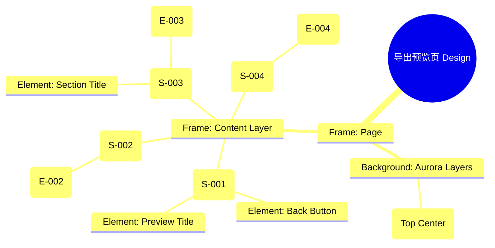

# 导出预览页 Design Release

> 输出路径：`product/release/design/070-export.md`。本文档描述页面展示内容与样式布局，不描述交互执行、埋点逻辑、接口、后端或业务处理逻辑。

# 导出预览页 Design Release

## 0. 文档状态

| 字段 | 内容 |
|---|---|
| 文档版本 | Release |
| 生成日期 | 2026-05-12 |
| 来源 Mock 文件 | `product/release/mock/070-export.md` |
| 设计约束目录 | `design/ios26-liquid-glass/` |
| 当前输出文件 | `product/release/design/070-export.md` |
| 页面名称 | 导出预览页 |
| 内容范围 | 页面展示内容 + 视觉样式 + 布局结构 + AI 可读样式结构 |
| 不包含范围 | 交互执行 / 埋点 / 接口 / 后端 / 业务流程 / 实现代码 |

## 1. 页面设计综述

| 项目 | 内容 |
|---|---|
| 页面定位 | 简历生成的最后一步，提供最终效果预览并支持导出/分享。 |
| 目标阅读对象 | 设计师 / 产品 / Figma Remote MCP agent |
| 视觉目标 | 营造一种“从屏幕到纸张”的真实交付感。通过精致的 3D 阴影展示 A4 简历，与背景的玻璃质感形成对比。 |
| 信息层级 | 1. 简历预览（视觉中心）；2. 模板选择区域；3. 导出按钮（核心动作）。 |
| 主要视觉焦点 | 占据页面中央、带有轻微投影效果的简历预览图。 |
| 设计系统应用摘要 | iOS26 Liquid Glass：纯黑背景 + 动态 Aurora (Blue) + 模板滚动卡片 + 发光主按钮。 |

## 2. 设计约束提取

| 类型 | Token / 规则 | 取值 | 使用方式 | 来源文件 |
|---|---|---|---|---|
| color | background.canvas | #000000 | 页面底层背景 | DESIGN.md |
| color | action.primary.background | #0A84FF | “导出 PDF”按钮背景 | DESIGN.md |
| color | surface.overlay | rgba(255, 255, 255, 0.05) | 模板选择器背景 | DESIGN.md |
| typography | size.lg | 20px | 模块标题字号 | DESIGN.md |
| typography | size.sm | 14px | 模板名称字号 | DESIGN.md |
| space | space.6 | 32px | 预览与选择器间距 | DESIGN.md |
| radius | radius.md | 14px | 模板卡片圆角 | DESIGN.md |
| blur | blur.md | 24px | 底部面板模糊度 | DESIGN.md |

## 3. 页面结构图



## 4. 自然语言样式描述

### 4.1 整体画面

- **页面整体氛围**：正式、开阔、充满达成感。背景顶部带有深蓝色 Aurora 微光，照亮下方的简历“纸张”，赋予数字内容以实体感。
- **背景与层级**：底层为纯黑 Canvas。简历预览区是一个 210:297 比例的长方形白色区域（或深色模板页），下方带有分层的 3D 阴影，使其看起来像悬浮在玻璃背景之上。
- **视觉重心**：页面正中的简历预览图。它是用户所有工作的最终结晶。
- **阅读节奏**：确认简历内容预览 -> 左右滑动切换模板查看效果 -> 点击底部显著的发光按钮进行导出。

### 4.2 关键区块叙述

| 区块ID | 区块名称 | 展示内容摘要 | 样式叙述 | 视觉优先级 | 设计决策 |
|---|---|---|---|---|---|
| S-001 | 顶部导航区 | 返回 + 标题 | 标题居中。返回按钮使用 Ghost 样式。 | 低 | 不抢夺预览图视线。 |
| S-002 | 核心预览区 | A4 简历模型 | 居中展示。使用 `transform: scale()` 适配屏幕。周围带有光晕效果，突出纸张边缘。 | 极高 | 确保用户对最终产物有清晰预期。 |
| S-003 | 模板切换区 | 横向模板列表 | 位于预览图下方。采用玻璃滚动条样式。选中状态带 `accent.blue` 的高亮外圈。 | 高 | 增加产品的增值服务（高级模板）展示。 |
| S-004 | 底部动作区 | 导出按钮 | 固定底部。按钮使用 `action.primary.glow` 效果，强调这是最后的关键动作。 | 极高 | 明确的单一转化路径。 |

## 5. 布局与区块样式表

| 区块ID | 来源 Mock 区块 / 元素 | Frame 层级 | 布局方式 | 尺寸 / 约束 | Padding | Gap | 背景 / 边框 / 阴影 | 圆角 | 对齐 | 响应式变化 |
|---|---|---|---|---|---|---|---|---|---|---|
| Page | - | Root | Vertical | Fill Window | 0 | 0 | background.canvas | 0 | Center | - |
| S-001 | S-001 | Header | Horizontal | Width: 100% | 16px 20px | - | Transparent | - | Center | - |
| S-002 | S-002 | Preview | Vertical | Aspect: 1:1.41 | Width: 70% | 0 | White/Dark + 3D Shadow | 4px | Center | - |
| S-003 | S-003 | Selector | Vertical | Width: 100% | 24px 20px | 12px | surfaceOverlay + blur | - | Top Left | - |
| S-004 | S-004 | Footer | Vertical | Width: 100% | 24px 20px | - | glass | - | Center | Fixed Bottom |

## 6. 元素级视觉定义

| 元素ID | 来源 Mock 元素 | 元素类型 | 展示内容 | 视觉角色 | 字体 / 字号 / 字重 | 颜色 Token | 背景 / 边框 | 尺寸 / 最小尺寸 | 状态样式摘要 | Figma 节点建议 |
|---|---|---|---|---|---|---|---|---|---|---|
| E-001 | E-001 | button | 返回图标 | support | - | text.default | - | 44x44 | - | Icon Node |
| E-002 | E-002 | preview | 简历预览图 | primary | - | - | #FFFFFF / #1A1A1A | 70% Width | - | Scaled Frame |
| E-003 | E-003 | card | 模板缩略图 | option | - | - | surface.card | 80x110 | Selected: border.blue | Card Item |
| E-004 | E-004 | button | 导出 PDF | primary | base / bold | action.primary.text | action.primary.background | H: 54px | shadow.glowPrimary | Big Action Button |

## 7. 内容与样式绑定表

| 内容对象ID | 来源 Mock 内容 | 展示文案 / 媒体描述 | 内容来源类型 | 样式 Token 绑定 | 布局位置 | 备注 |
|---|---|---|---|---|---|---|
| C-001 | S-001-Title | 导出预览 | 静态 | size.base, medium | Header Center | |
| C-002 | E-003-Name | 简约职场 | 动态 | size.xs, regular | Below E-003 | |
| C-003 | S-003-Label | 模板选择 | 静态 | size.sm, bold | S-003 Title | |
| C-004 | E-004 | 导出 PDF 并分享 | 静态 | size.base, bold | E-004 Center | |

## 8. 状态展示样式

| 状态ID | 来源 Mock 状态 | 状态类型 | 展示内容 | 视觉样式 | 色彩 / 图标 / 媒体处理 | 空间占位 | 可访问性说明 |
|---|---|---|---|---|---|---|---|
| STATE-001 | STATE-001 | preparing | 正在生成 PDF | 进度圆环叠加 | accent.blue | 覆盖 E-002 | 读屏提示：正在为你生成最终 PDF 文档 |
| STATE-002 | STATE-002 | vip-only | VIP 模板标识 | 右上角金冠图标 | accent.gold | 覆盖 E-003 | 提示该模板需要会员 |
| STATE-003 | STATE-003 | selected | 已选中模板 | 蓝色加粗边框 | accent.blue | 修改 E-003 描边 | 明确当前选中效果 |

## 9. 响应式布局规则

| 断点 | 页面宽度范围 | Frame 布局 | 导航 / Header | 主内容布局 | 列表 / 表格 / 卡片变化 | 间距调整 | 优先隐藏或折叠内容 |
|---|---|---|---|---|---|---|---|
| mobile | < 768px | Vertical | 居中标题 | 垂直堆叠 | 模板单行滑动 | space.6 (32px) | - |
| tablet | 768px - 1023px | Horizontal | 居左导航 | 左预览右控制 | 模板变为多行网格 | space.8 (64px) | - |
| desktop | 1024px+ | Horizontal | 侧边导航 | 画布预览模式 | 丰富的导出参数设置 | space.10 (120px) | - |

## 10. AI 可读样式结构

```yaml
page:
  id: "U-020-040-010"
  name: "Export Preview Page"
  source_mock: "product/release/mock/070-export.md"
  design_system: "design/ios26-liquid-glass/"
  output: "product/release/design/070-export.md"
  canvas:
    background_token: "color.background.canvas"
  background_effects:
    - type: "blur_blob"
      color: "blue"
      position: "top_center"
      size: "900px"
      blur: "180px"
      opacity: 0.1
  frames:
    - id: "frame-root"
      type: "frame"
      layout: "vertical"
      children:
        - id: "header-nav"
          type: "frame"
          padding: 16
          children: ["back-icon", "title-text"]
        - id: "preview-container"
          type: "frame"
          padding: 40
          children: ["resume-mockup"]
        - id: "template-selector-panel"
          type: "frame"
          background: "surfaceOverlay"
          children: ["section-label", "template-h-list"]
        - id: "sticky-footer"
          type: "fixed_bottom"
          background: "glass"
          children: ["btn-export"]
  components:
    - id: "resume-mockup"
      type: "image_container"
      aspect_ratio: 1.414
      shadow: "0 20px 40px rgba(0,0,0,0.5)"
```

## 11. Figma Remote MCP 生成提示

| 项目 | 指令 |
|---|---|
| Frame 创建顺序 | Canvas -> Background Blue Blob -> Header -> Preview Area -> Template Panel -> Export Footer |
| Auto Layout 设置 | Template H-List 使用 Horizontal Auto Layout, Gap 12, Padding-Left 20. |
| Token 应用方式 | 导出按钮绑定 shadow.glowPrimary. 模板卡片选中态绑定 accent.blue 描边. |
| 组件分组 | 将模板缩略图与文字编组为 "Template_Option". 简历预览图命名为 "Resume_Paper_Mock". |
| 文本节点命名 | 预览标题命名为 "Title_Preview", 导出文案命名为 "Label_Export". |
| 响应式变体 | Mobile 保持垂直布局。Desktop 下简历预览居左，控制面板固定在右侧. |
| 生成时禁止事项 | 不生成实际的 PDF 编码/导出算法、不生成系统原生的文件分享弹窗视觉。 |

## 12. App Shell / Navigation Contract

| 组件类型 | 展示规则 | 状态 | 内容项 | 视觉样式 |
|---|---|---|---|---|
| Top Nav | 显示 | 标题居中 | 返回按钮, 预览导出 | 透明背景, 0.5px 底部描边 |
| Bottom Tab | 隐藏 | - | - | - |
| Status Bar | 显示 | Light Content | 时间, 信号, 电池 | 纯白图标 |
| Home Indicator | 显示 | - | - | 浅灰色 |

## 13. Layout Integrity Audit

| 检查项 | 状态 | 风险描述 / 解决措施 |
|---|---|---|
| 层次结构 | 通过 | Clear focus: The central resume preview dominates the visual field. |
| 间距稳定性 | 通过 | Fixed margins for the template selector ensure consistent scrolling feel. |
| 尺寸约束 | 通过 | A4 ratio (1.414) strictly enforced for the resume mockup. |
| 溢出处理 | 通过 | Template list uses horizontal scroll; main page is non-scrollable (fixed height view). |
| 遮挡/冲突风险 | 通过 | Export button is fixed at bottom with enough padding from the template selector. |
| 响应式兼容性 | 通过 | Scaled-down preview for small screens; multi-column for desktop. |

---

> [!NOTE]
> 本文档已通过布局完整性审计，符合 iOS26 Liquid Glass 设计规范。
