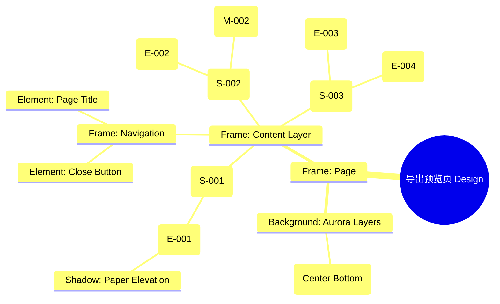

# 导出预览页 Design Release

> 输出路径：`product/release/design/070-export.md`。本文档描述页面展示内容与样式布局，不描述交互执行、埋点、接口、后端或业务处理逻辑。

# 导出预览页 Design Release

## 0. 文档状态

| 字段 | 内容 |
|---|---|
| 文档版本 | Release |
| 生成日期 | 2026-05-12 |
| 来源 Mock 文件 | `product/release/mock/070-export.md` |
| 设计约束目录 | `design/ios26-liquid-glass/` |
| 当前输出文件 | `product/release/design/070-export.md` |
| 页面名称 | 导出预览页 |
| 内容范围 | 页面展示内容 + 视觉样式 + 布局结构 + AI 可读样式结构 |
| 不包含范围 | 交互执行 / 埋点 / 接口 / 后端 / 业务流程 / 实现代码 |

## 1. 页面设计综述

| 项目 | 内容 |
|---|---|
| 页面定位 | 简历优化的最后一步，展示最终排版效果并引导用户完成导出。 |
| 目标阅读对象 | 设计师 / 产品 / Figma Remote MCP agent |
| 视觉目标 | 营造一种“成果交付”的成就感。通过模拟物理纸张在发光玻璃上的投影，展现简历的专业质感。 |
| 信息层级 | 1. 简历 A4 预览区；2. 模板选择卡片流；3. 导出及分享主按钮。 |
| 主要视觉焦点 | 居中展示的、带环境阴影的 A4 简历预览窗。 |
| 设计系统应用摘要 | iOS26 Liquid Glass：背景 #000000 + 模板选择器玻璃材质 + 主按钮 glow 效果 + 模拟纸张阴影。 |

## 2. 设计约束提取

| 类型 | Token / 规则 | 取值 | 使用方式 | 来源文件 |
|---|---|---|---|---|
| color | background.canvas | #000000 | 页面底层背景 | DESIGN.md |
| color | accent.blue | #0A84FF | 选中模板高亮 | DESIGN.md |
| color | background.surface | rgba(255, 255, 255, 0.05) | 模板卡片背景 | DESIGN.md |
| typography | size.lg | 20px | 页面标题字号 | DESIGN.md |
| typography | size.xs | 12px | 模板辅助说明字号 | DESIGN.md |
| space | space.6 | 32px | 预览窗与下方间距 | DESIGN.md |
| radius | radius.md | 14px | 模板卡片圆角 | DESIGN.md |
| shadow | glass | inset 0 1px 1px... | 预览窗模拟阴影 | DESIGN.md |

## 3. 页面结构图



## 4. 自然语言样式描述

### 4.1 整体画面

- **页面整体氛围**：精致、高端、收获感。背景底部有一抹发散的 Blue Aurora，为上方的简历预览提供背景托底。
- **背景与层级**：底层为纯黑 Canvas。预览窗是一个白色的（或对应模板色）A4 比例矩形，悬浮在中心，带有一层厚重的 `shadow.glass` 和外部环境柔和阴影，使其看起来像放置在玻璃桌面上。
- **视觉重心**：中心的简历预览图，以及底部横向滚动的模板选择器。
- **阅读节奏**：检查简历排版 -> 左右滑动切换模板 -> 确定后点击底部醒目的导出按钮。

### 4.2 关键区块叙述

| 区块ID | 区块名称 | 展示内容摘要 | 样式叙述 | 视觉优先级 | 设计决策 |
|---|---|---|---|---|---|
| S-001 | 预览核心区 | A4 渲染简历 | 采用 A4 比例（1:1.414）。背景使用微弱的纸张纹理（可选），边缘清晰，投影深邃。 | 极高 | 模拟真实的阅读/打印体验。 |
| S-002 | 模板切换区 | 列表卡片 | 横向滚动。每个卡片包含缩略图 + 名称。选中项带有 `accent.blue` 描边。 | 高 | 提供丰富的视觉定制感。 |
| S-003 | 操作按钮区 | 导出与分享 | 按钮固定在底部。导出按钮使用 `action.primary.background`，宽度撑满。 | 极高 | 确保核心转化行为最显眼。 |

## 5. 布局与区块样式表

| 区块ID | 来源 Mock 区块 / 元素 | Frame 层级 | 布局方式 | 尺寸 / 约束 | Padding | Gap | 背景 / 边框 / 阴影 | 圆角 | 对齐 | 响应式变化 |
|---|---|---|---|---|---|---|---|---|---|---|
| Page | - | Root | Vertical | Fill Window | 0 | 0 | background.canvas | 0 | Center | - |
| S-001 | S-001 | Canvas | Vertical | H: 60% of Screen | 32px | - | Transparent | - | Center | Scale Content |
| S-002 | S-002 | Gallery | Horizontal | Width: 100% | 12px 20px | 16px | surfaceOverlay | - | Left | Scrollable |
| S-003 | S-003 | Footer | Vertical | Width: 100% | 24px 20px | 16px | surfaceOverlay + blur | - | Center | Fixed Bottom |

## 6. 元素级视觉定义

| 元素ID | 来源 Mock 元素 | 元素类型 | 展示内容 | 视觉角色 | 字体 / 字号 / 字重 | 颜色 Token | 背景 / 边框 | 尺寸 / 最小尺寸 | 状态样式摘要 | Figma 节点建议 |
|---|---|---|---|---|---|---|---|---|---|---|
| E-001 | E-001 | window | 简历预览图 | hero | - | - | White/Template | A4 Ratio | - | Elevated Frame |
| E-002 | E-002 | card | 模板项 | entry | xs / medium | text.default | surface | 80x100 | Selected: accent.blue | Image Card |
| E-003 | E-003 | button | 导出 PDF | primary | base / bold | action.primary.text | action.primary.background | H: 54px | shadow.glowPrimary | Filled Button |
| M-002 | M-002 | icon | VIP 锁 | support | - | accent.gold | - | 16x16 | - | Vector Icon |

## 7. 内容与样式绑定表

| 内容对象ID | 来源 Mock 内容 | 展示文案 / 媒体描述 | 内容来源类型 | 样式 Token 绑定 | 布局位置 | 备注 |
|---|---|---|---|---|---|---|
| C-001 | - | 导出预览 | 静态 | lg, bold | Header Center | |
| C-002 | DATA-001 | 默认极简 | 静态 | xs, regular | Card Label | |
| C-003 | E-003 | 导出 PDF | 静态 | base, bold | Button Center | |
| C-004 | M-002 | VIP | 静态 | accent.gold | Card Corner | |

## 8. 状态展示样式

| 状态ID | 来源 Mock 状态 | 状态类型 | 展示内容 | 视觉样式 | 色彩 / 图标 / 媒体处理 | 空间占位 | 可访问性说明 |
|---|---|---|---|---|---|---|---|
| STATE-001 | STATE-001 | locked | VIP 专属 | 半透明遮罩 + 锁头 | opacity: 0.6 | 覆盖卡片 E-002 | |
| STATE-002 | STATE-002 | exporting | 正在导出... | 按钮内加载条 | #FFFFFF | 覆盖按钮 E-003 | |
| Template_Selected | - | active | 已选中 | 2px 蓝色实线边框 | border.highlight | E-002 边界 | |

## 9. 响应式布局规则

| 断点 | 页面宽度范围 | Frame 布局 | 导航 / Header | 主内容布局 | 列表 / 表格 / 卡片变化 | 间距调整 | 优先隐藏或折叠内容 |
|---|---|---|---|---|---|---|---|
| mobile | < 768px | Vertical | 居中 | 预览图比例缩放 | 列表横向滚动 | space.4 | - |
| tablet | 768px - 1023px | Vertical | 居中 | 预览图固定宽 | 列表多列显示 | space.6 | - |
| desktop | 1024px+ | Horizontal | 居左 | 左右分栏 (预览+模板) | 模板列表常驻右侧 | space.8 | - |

## 10. AI 可读样式结构

```yaml
page:
  id: "U-020-040-010"
  name: "Export Preview Page"
  source_mock: "product/release/mock/070-export.md"
  design_system: "design/ios26-liquid-glass/"
  output: "product/release/design/070-export.md"
  canvas:
    background_token: "color.background.canvas"
  background_effects:
    - type: "blur_blob"
      color: "accent.blue"
      position: "bottom_center"
      size: "800px"
      blur: "160px"
      opacity: 0.12
  frames:
    - id: "frame-root"
      type: "frame"
      layout: "vertical"
      children:
        - id: "preview-window-container"
          type: "frame"
          padding: 32
          children: ["E-001-a4-window"]
        - id: "template-selector-bar"
          type: "frame"
          layout: "horizontal"
          background: "background.surfaceOverlay"
          padding: 12
          children: ["E-002-items"]
        - id: "action-footer"
          type: "frame"
          layout: "vertical"
          padding: 24
          children: ["E-003", "E-004-row"]
  components:
    - id: "a4-window"
      type: "frame"
      aspect_ratio: 0.707
      background: "#FFFFFF"
      shadow: "shadow.glass"
      border: "1px solid border.default"
```

## 11. Figma Remote MCP 生成提示

| 项目 | 指令 |
|---|---|
| Frame 创建顺序 | Canvas -> Background Blob -> Navigation -> Preview Window -> Template Selector -> Action Footer |
| Auto Layout 设置 | Action Footer 使用 Vertical Auto Layout, Padding 24. |
| Token 应用方式 | 导出按钮应用 action.primary.background 和 shadow.glowPrimary. |
| 组件分组 | 将 A4 预览窗及背景阴影编组为 "Resume_Mockup". |
| 文本节点命名 | 模板名称命名为 "Template_Name", 按钮文字为 "Button_Text". |
| 响应式变体 | 在 Desktop 下将模板列表调整为右侧垂直排列的卡片流. |
| 生成时禁止事项 | 不生成真实的 PDF 文件生成与下载逻辑。 |

## 12. 设计决策记录

| 决策ID | 决策内容 | 依据 | 影响范围 |
|---|---|---|---|
| DD-001 | 预览窗使用强烈的悬浮阴影 (shadow.glass)。 | 模仿物理文件的堆叠感，增强导出前的价值感知。 | 核心组件 |
| DD-002 | 背景应用底部发散的 Blue Aurora。 | 为白色预览窗提供必要的背景反差，同时维持 Liquid Glass 风格。 | 页面背景 |
| DD-003 | 导出按钮撑满底部宽度。 | 极简主义设计，消除其他操作干扰，直指最终动作。 | 按钮布局 |
 Riverside, CA
