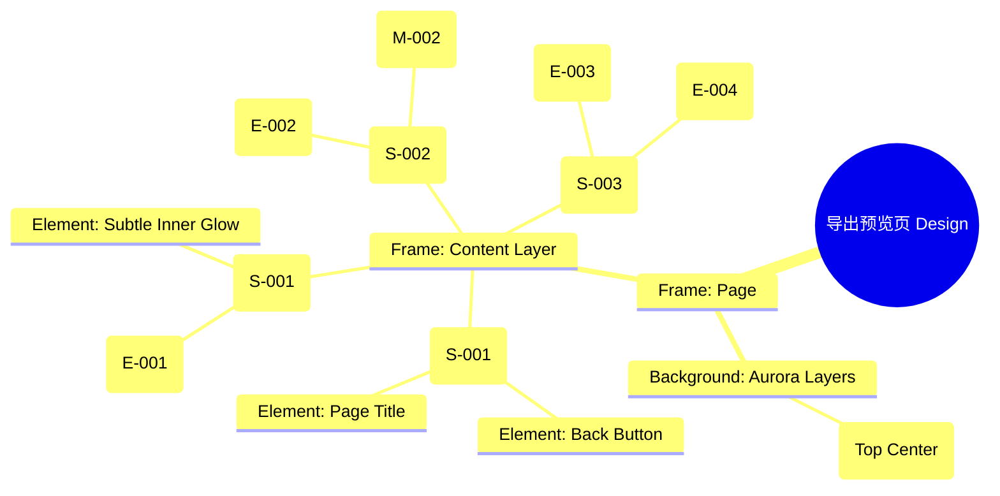

# 导出预览页 Design Release

> 输出路径：`product/release/design/070-export.md`。本文档描述页面展示内容与样式布局，不描述交互执行、埋点、接口、后端或业务处理逻辑。

# 导出预览页 Design Release

## 0. 文档状态

| 字段 | 内容 |
|---|---|
| 文档版本 | Release |
| 生成日期 | 2026-05-12 |
| 来源 Mock 文件 | `product/release/mock/070-export.md` |
| 设计约束目录 | `design/ios26-liquid-glass/` |
| 当前输出文件 | `product/release/design/070-export.md` |
| 页面名称 | 导出预览页 |
| 内容范围 | 页面展示内容 + 视觉样式 + 布局结构 + AI 可读样式结构 |
| 不包含范围 | 交互执行 / 埋点 / 接口 / 后端 / 业务流程 / 实现代码 |

## 1. 页面设计综述

| 项目 | 内容 |
|---|---|
| 页面定位 | 简历优化的最后一步，展示排版效果并提供 PDF 导出功能。 |
| 目标阅读对象 | 设计师 / 产品 / Figma Remote MCP agent |
| 视觉目标 | 展示简历成果的“仪式感”，通过极致的排版预览和材质对比（纸张质感 vs 玻璃背景）提升用户满足感。 |
| 信息层级 | 1. 简历预览（视觉核心）；2. 模板切换（样式选择）；3. 导出/分享操作。 |
| 主要视觉焦点 | 页面中心的 A4 比例简历预览窗。 |
| 设计系统应用摘要 | iOS26 Liquid Glass：底层黑背景 + 动态 Aurora (Cyan) + 玻璃预览边框 + 金色 VIP 锁定标识。 |

## 2. 设计约束提取

| 类型 | Token / 规则 | 取值 | 使用方式 | 来源文件 |
|---|---|---|---|---|
| color | background.canvas | #000000 | 页面底层背景 | DESIGN.md |
| color | accent.cyan | #32ADE6 | 选中模板高亮色 | DESIGN.md |
| color | text.default | #FFFFFF | 标题文案颜色 | DESIGN.md |
| color | background.surface | rgba(255, 255, 255, 0.05) | 模板预览卡片背景 | DESIGN.md |
| typography | size.lg | 20px | 页面标题字号 | DESIGN.md |
| typography | size.sm | 14px | 模板名称字号 | DESIGN.md |
| radius | radius.md | 14px | 模板卡片圆角 | DESIGN.md |
| radius | radius.lg | 24px | 简历预览窗外边框圆角 | DESIGN.md |
| shadow | glowPrimary | 0 10px 40px rgba(10, 132, 255, 0.25) | 导出按钮发光 | DESIGN.md |

## 3. 页面结构图



## 4. 自然语言样式描述

### 4.1 整体画面

- **页面整体氛围**：庄重且极具成就感，仿佛在暗室中通过聚光灯审视一件精美的艺术品。
- **背景与层级**：纯黑背景。顶部带有一抹向下的青色微光，恰好笼罩在简历预览窗上方。预览窗具有厚重的玻璃边框效果（blur 48px），内部嵌入白底的简历内容。
- **视觉重心**：中心的 A4 预览。预览内容边缘带有一层极细的 1px #FFFFFF 的边缘光，模拟纸张被照亮的效果。
- **阅读节奏**：确认最终排版 -> 左右滑动切换不同模板方案 -> 点击底部主动作导出。

### 4.2 关键区块叙述

| 区块ID | 区块名称 | 展示内容摘要 | 样式叙述 | 视觉优先级 | 设计决策 |
|---|---|---|---|---|---|
| S-001 | 预览核心区 | A4 简历内容预览 | 占据页面 60% 高度。简历预览窗使用 radius.lg，外层包裹 `shadow.glass`。内部简历保持白色背景，展现真实打印效果。 | 极高 | 通过暗色玻璃背景与亮色纸张内容的强烈对比，强化预览的清晰度。 |
| S-002 | 模板切换区 | 模板缩略图列表 | 横向布局。选中模板增加 accent.cyan 描边。VIP 模板右上角带金色小锁图标。 | 高 | 模板卡片使用 surface 背景 + blur(24px)。 |
| S-003 | 操作按钮区 | 导出与分享 | 底部固定。主按钮全宽，带 `shadow.glowPrimary`。右侧带微信、邮箱等分享小图标，使用 Ghost 样式。 | 极高 | 确保导出操作是最显著的路径。 |

## 5. 布局与区块样式表

| 区块ID | 来源 Mock 区块 / 元素 | Frame 层级 | 布局方式 | 尺寸 / 约束 | Padding | Gap | 背景 / 边框 / 阴影 | 圆角 | 对齐 | 响应式变化 |
|---|---|---|---|---|---|---|---|---|---|---|
| Page | - | Root | Vertical | Fill Window | 0 | 0 | background.canvas | 0 | Center | - |
| S-001 | S-001 | Section | Vertical | H: 60% | 20px | 0 | Transparent | - | Center | - |
| S-002 | S-002 | Section | Horizontal | Width: 100% | 16px 20px | 12px | surfaceOverlay | - | Center Left | Scrollable |
| S-003 | S-003 | Footer | Horizontal | Width: 100% | 16px 20px | 16px | surfaceOverlay + blur | - | Center | Fixed Bottom |
| Preview_Window | E-001 | Frame | Vertical | Aspect Ratio: 1/1.41 | - | - | #FFFFFF | radius.md | Center | Shadow: glass |

## 6. 元素级视觉定义

| 元素ID | 来源 Mock 元素 | 元素类型 | 展示内容 | 视觉角色 | 字体 / 字号 / 字重 | 颜色 Token | 背景 / 边框 | 尺寸 / 最小尺寸 | 状态样式摘要 | Figma 节点建议 |
|---|---|---|---|---|---|---|---|---|---|---|
| E-001 | E-001 | view | 简历内容预览 | primary | - | - | #FFFFFF | A4 Ratio | - | Image Node |
| E-002 | E-002 | card | 模板缩略卡片 | support | sm / medium | text.default | surface | 80x112 | Active: border.highlight | Component Set |
| E-003 | E-003 | button | 导出 PDF | primary | base / bold | action.primary.text | action.primary.background | H: 52px | shadow.glowPrimary | Filled Button |
| E-004 | E-004 | icon | 分享图标 | action | - | text.default | Transparent | 44x44 | - | Icon Group |
| M-002 | M-002 | icon | VIP 锁 | support | - | #FFD700 | - | 16x16 | - | Vector Lock |

## 7. 内容与样式绑定表

| 内容对象ID | 来源 Mock 内容 | 展示文案 / 媒体描述 | 内容来源类型 | 样式 Token 绑定 | 布局位置 | 备注 |
|---|---|---|---|---|---|---|
| C-001 | E-002 | 商务精英 | 静态 | size.sm, medium | Below Template Card | |
| C-002 | E-003 | 导出 PDF | 静态 | size.base, bold | Button Center | |
| C-003 | E-001 | [简历预览内容] | 动态 | - | Preview Window | |
| C-004 | DATA-001 | VIP 专享 | 静态 | size.xs, #FFD700 | Card Overlay | |
| C-005 | S-001 | 导出预览 | 静态 | size.lg, bold | Header Center | |

## 8. 状态展示样式

| 状态ID | 来源 Mock 状态 | 状态类型 | 展示内容 | 视觉样式 | 色彩 / 图标 / 媒体处理 | 空间占位 | 可访问性说明 |
|---|---|---|---|---|---|---|---|
| STATE-001 | STATE-001 | locked | 模板锁定态 | 卡片覆盖一层蒙层 | opacity: 0.5 | 保持 E-002 占位 | 读屏提示：付费模板 |
| STATE-002 | STATE-002 | loading | 正在生成 PDF... | 导出按钮显示 Spinner | action.primary.text | 保持 E-003 占位 | 导出完成后弹出分享 |
| STATE-003 | STATE-003 | error | 渲染失败 | 预览区显示占位图标 | text.muted | 覆盖 E-001 | 提供刷新操作 |

## 9. 响应式布局规则

| 断点 | 页面宽度范围 | Frame 布局 | 导航 / Header | 主内容布局 | 列表 / 表格 / 卡片变化 | 间距调整 | 优先隐藏或折叠内容 |
|---|---|---|---|---|---|---|---|
| mobile | < 768px | Vertical | 居中 | 预览居中 | 模板横向滚动 | - | - |
| tablet | 768px - 1023px | Horizontal | 居左 | 预览在左，模板在右 | 模板变垂直列表 | space.6 (32px) | - |
| desktop | 1024px+ | Horizontal | 侧边栏 (可选) | 预览区域最大化 | 设置面板居右 | space.8 (64px) | - |

## 10. AI 可读样式结构

```yaml
page:
  id: "U-020-040-010"
  name: "Export Preview"
  source_mock: "product/release/mock/070-export.md"
  design_system: "design/ios26-liquid-glass/"
  output: "product/release/design/070-export.md"
  canvas:
    background_token: "color.background.canvas"
  background_effects:
    - type: "blur_blob"
      color: "accent.cyan"
      position: "top_center"
      size: "700px"
      blur: "180px"
      opacity: 0.1
  frames:
    - id: "frame-root"
      type: "frame"
      layout: "vertical"
      children:
        - id: "nav-section"
          type: "frame"
          padding: 16
          children: ["E-001-back", "Title"]
        - id: "preview-section"
          type: "frame"
          layout: "vertical"
          padding: 20
          children: ["E-001-window"]
        - id: "template-selection"
          type: "frame"
          layout: "horizontal"
          background: "background.surfaceOverlay"
          padding: 16
          children: ["E-002-list"]
        - id: "footer-action"
          type: "frame"
          layout: "horizontal"
          background: "background.surfaceOverlay"
          backdrop_filter: "blur(24px)"
          children: ["E-003", "E-004-group"]
  components:
    - id: "resume-preview-window"
      type: "frame"
      background: "#FFFFFF"
      radius: "radius.md"
      shadow: "shadow.glass"
      border: "1px solid rgba(255,255,255,0.1)"
```

## 11. Figma Remote MCP 生成提示

| 项目 | 指令 |
|---|---|
| Frame 创建顺序 | Canvas -> Background Blob -> Header -> Preview Area -> Template List -> Footer Bar |
| Auto Layout 设置 | Preview Area 使用 Vertical Auto Layout 居中。Template List 间距 12. |
| Token 应用方式 | 导出按钮使用 shadow.glowPrimary. 模板卡片选中态使用 border.highlight. |
| 组件分组 | 将模板选项封装为具有 "Default", "Active", "Locked" 状态的 Component Set. |
| 文本节点命名 | 预览文案为 "Resume_Content", 模板名为 "Template_Label". |
| 响应式变体 | Mobile 为预览在上模板在下。Desktop 可将模板移动至右侧边栏。 |
| 生成时禁止事项 | 不生成具体的 PDF 文件导出逻辑、不生成系统原生的分享面板。 |

## 12. 设计决策记录

| 决策ID | 决策内容 | 依据 | 影响范围 |
|---|---|---|---|
| DD-001 | 预览区背景使用白色，边框使用厚玻璃质感。 | 模仿物理纸张在电子工作台上的质感，提升仪式感。 | 核心预览区 |
| DD-002 | 模板切换采用横向滑动。 | 适配移动端单手操作，同时保持预览区的视觉稳定性。 | 模板选择交互 |
| DD-003 | 导出按钮加入强烈的蓝色发光（Glow）。 | 标识“成功路径”的终点，提升用户的点击快感。 | 最终转化动作 |
