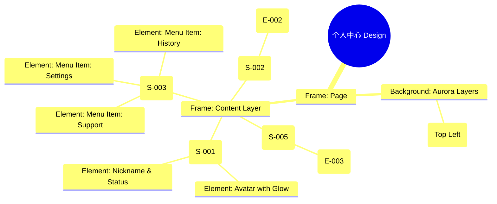

# 个人中心 Design Release

> 输出路径：`product/release/design/080-profile.md`。本文档描述页面展示内容与样式布局，不描述交互执行、埋点逻辑、接口、后端或业务处理逻辑。

# 个人中心 Design Release

## 0. 文档状态

| 字段 | 内容 |
|---|---|
| 文档版本 | Release |
| 生成日期 | 2026-05-12 |
| 来源 Mock 文件 | `product/release/mock/080-profile.md` |
| 设计约束目录 | `design/ios26-liquid-glass/` |
| 当前输出文件 | `product/release/design/080-profile.md` |
| 页面名称 | 个人中心 |
| 内容范围 | 页面展示内容 + 视觉样式 + 布局结构 + AI 可读样式结构 |
| 不包含范围 | 交互执行 / 埋点 / 接口 / 后端 / 业务流程 / 实现代码 |

## 1. 页面设计综述

| 项目 | 内容 |
|---|---|
| 页面定位 | 汇总用户个人资产、状态与系统设置的枢纽页面。 |
| 目标阅读对象 | 设计师 / 产品 / Figma Remote MCP agent |
| 视觉目标 | 展示“高级私人管家”的质感。通过黑金材质的会员卡片与极致模糊的菜单列表，提升 App 的商业价值感。 |
| 信息层级 | 1. 用户头像与基础资料；2. VIP 会员权益卡片；3. 功能菜单列表。 |
| 主要视觉焦点 | 页面上方的“黑金”玻璃会员卡片（VIP Card）。 |
| 设计系统应用摘要 | iOS26 Liquid Glass：纯黑背景 + 动态 Aurora (Purple) + 黑金渐变材质 + 玻璃菜单列表。 |

## 2. 设计约束提取

| 类型 | Token / 规则 | 取值 | 使用方式 | 来源文件 |
|---|---|---|---|---|
| color | background.canvas | #000000 | 页面底层背景 | DESIGN.md |
| color | accent.gold | #FFD700 | 会员卡片文字与装饰色 | DESIGN.md |
| color | surface.overlay | rgba(255, 255, 255, 0.05) | 菜单项背景 | DESIGN.md |
| typography | size.lg | 20px | 用户昵称字号 | DESIGN.md |
| typography | size.base | 16px | 菜单项字号 | DESIGN.md |
| space | space.6 | 32px | 模块间垂直间距 | DESIGN.md |
| radius | radius.lg | 24px | 会员卡片大圆角 | DESIGN.md |
| blur | blur.md | 24px | 菜单列表模糊度 | DESIGN.md |

## 3. 页面结构图



## 4. 自然语言样式描述

### 4.1 整体画面

- **页面整体氛围**：尊贵、整洁、私密。背景上方带有柔和的紫色光晕，照亮用户头像，下方则是层级分明的毛玻璃菜单。
- **背景与层级**：底层为纯黑 Canvas。核心亮点是中部的会员卡片，它使用了带有“流光”效果的深金色玻璃材质，文字带有浮雕般的阴影。
- **视觉重心**：黑金会员卡片。它的反光感（Reflection）和材质厚度明显高于页面其他元素。
- **阅读节奏**：确认个人资料 -> 看到会员状态 -> 依次选择下方的功能菜单。

### 4.2 关键区块叙述

| 区块ID | 区块名称 | 展示内容摘要 | 样式叙述 | 视觉优先级 | 设计决策 |
|---|---|---|---|---|---|
| S-001 | 个人信息区 | 头像 + 昵称 | 头像使用大尺寸（80x80），外围带有一层极其微弱的紫色环境光。昵称使用 Bold，纯白色。 | 中 | 建立个人归属感。 |
| S-002 | 会员卡片区 | VIP 权益入口 | 采用 `accent.gold` 渐变边框。背景为半透明黑金纹理，左侧显示“VIP 简历优化专家”。 | 极高 | 核心商业化转化触点。 |
| S-003 | 功能菜单区 | 列表项集合 | 菜单项采用 `surface.overlay` 背景。每行高度 56px，带有箭头图标。顶层菜单与底部菜单间有 12px 间隙。 | 高 | 提供清晰的功能导览。 |
| S-004 | 底部导航区 | Tab Bar | 固定在底部。个人中心项处于活跃态（accent.cyan 图标）。背景高模糊。 | 极高 | 全局导航一致性。 |

## 5. 布局与区块样式表

| 区块ID | 来源 Mock 区块 / 元素 | Frame 层级 | 布局方式 | 尺寸 / 约束 | Padding | Gap | 背景 / 边框 / 阴影 | 圆角 | 对齐 | 响应式变化 |
|---|---|---|---|---|---|---|---|---|---|---|
| Page | - | Root | Vertical | Fill Window | 0 | 0 | background.canvas | 0 | Center | - |
| S-001 | S-001 | Header | Vertical | Width: 100% | 60px 20px 24px | 12px | Transparent | - | Center | - |
| S-002 | S-002 | Card | Vertical | Width: 335px | 20px | - | Black-Gold Gradient + blur | radius.lg | Stretch | - |
| S-003 | S-003 | List | Vertical | Width: 100% | 24px 20px | 1px | Transparent | - | Stretch | - |
| Item | E-003 | Row | Horizontal | H: 56px | 0 16px | 12px | surfaceOverlay | - | Center | - |

## 6. 元素级视觉定义

| 元素ID | 来源 Mock 元素 | 元素类型 | 展示内容 | 视觉角色 | 字体 / 字号 / 字重 | 颜色 Token | 背景 / 边框 | 尺寸 / 最小尺寸 | 状态样式摘要 | Figma 节点建议 |
|---|---|---|---|---|---|---|---|---|---|---|
| E-001 | E-001 | image | 用户大头像 | identity | - | - | - | 80x80 | radius.full | Circle Node |
| E-002 | E-002 | card | 黑金会员卡 | commercial | lg / bold | accent.gold | Black-Gold | 335x100 | Glossy Reflection | Glass Card |
| E-003 | E-003 | list_item | 菜单项 | navigation | base / regular | text.default | surface.overlay | H: 56px | Pressed: surfaceOverlayPlus | Menu Row |
| E-004 | E-004 | tab_bar | 底部导航 | global_nav | - | accent.cyan | glass | H: 84px | Profile Active | Fixed Footer |

## 7. 内容与样式绑定表

| 内容对象ID | 来源 Mock 内容 | 展示文案 / 媒体描述 | 内容来源类型 | 样式 Token 绑定 | 布局位置 | 备注 |
|---|---|---|---|---|---|---|
| C-001 | DATA-User-Name | 简历达人小王 | 动态 | size.lg, bold | S-001 Center | |
| C-002 | DATA-VIP-Status | VIP 永久会员 | 动态 | size.sm, bold | E-002 Right | 金色发光 |
| C-003 | DATA-Menu-1 | 历史优化记录 | 静态 | size.base, regular | S-003 Item 1 | |
| C-004 | DATA-Menu-2 | 账户设置 | 静态 | size.base, regular | S-003 Item 2 | |
| C-005 | S-002-Cta | 立即续费 > | 静态 | size.xs, regular | E-002 Bottom | |

## 8. 状态展示样式

| 状态ID | 来源 Mock 状态 | 状态类型 | 展示内容 | 视觉样式 | 色彩 / 图标 / 媒体处理 | 空间占位 | 可访问性说明 |
|---|---|---|---|---|---|---|---|
| STATE-001 | STATE-001 | non-vip | 非会员卡片 | 银灰色材质 | text.muted | 覆盖 E-002 | 提示当前非会员 |
| STATE-002 | STATE-002 | active | Tab 选中 | 图标变蓝 | accent.cyan | 底部 Tab 2 | 导航反馈 |
| STATE-003 | STATE-003 | logout | 退出按钮 | 红色文字 | status.error | 列表最后一项 | 警示反馈 |

## 9. 响应式布局规则

| 断点 | 页面宽度范围 | Frame 布局 | 导航 / Header | 主内容布局 | 列表 / 表格 / 卡片变化 | 间距调整 | 优先隐藏或折叠内容 |
|---|---|---|---|---|---|---|---|
| mobile | < 768px | Vertical | 居中头像 | 纵向排列 | 全宽列表 | space.6 (32px) | - |
| tablet | 768px - 1023px | Vertical | 居左头像 | 双列展示 (资料与菜单) | 列表分为左右组 | space.8 (64px) | - |
| desktop | 1024px+ | Horizontal | 侧边导航 | 宽屏看板模式 | 卡片式菜单 | space.10 (120px) | - |

## 10. AI 可读样式结构

```yaml
page:
  id: "U-030"
  name: "Profile Page"
  source_mock: "product/release/mock/080-profile.md"
  design_system: "design/ios26-liquid-glass/"
  output: "product/release/design/080-profile.md"
  canvas:
    background_token: "color.background.canvas"
  background_effects:
    - type: "blur_blob"
      color: "purple"
      position: "top_left"
      size: "600px"
      blur: "120px"
      opacity: 0.08
  frames:
    - id: "frame-root"
      type: "frame"
      layout: "vertical"
      children:
        - id: "profile-header"
          type: "frame"
          padding: [60, 20, 24, 20]
          children: ["avatar-glow", "nickname-text"]
        - id: "membership-container"
          type: "frame"
          padding_horizontal: 20
          children: ["vip-card"]
        - id: "menu-section"
          type: "frame"
          layout: "vertical"
          padding: 20
          children: ["menu-list"]
        - id: "global-tab-nav"
          type: "fixed_bottom"
          background: "glass"
          children: ["tab-bar"]
  components:
    - id: "vip-card"
      type: "premium_card"
      background: "linear-gradient(135deg, #2A2A2A, #1A1A1A)"
      border: "1px solid accent.gold"
      radius: "radius.lg"
```

## 11. Figma Remote MCP 生成提示

| 项目 | 指令 |
|---|---|
| Frame 创建顺序 | Canvas -> Background Purple Blob -> Header -> VIP Card -> Menu List -> Bottom Tab Bar |
| Auto Layout 设置 | Menu List 使用 Vertical Auto Layout, Gap 1. Footer 使用 Horizontal. |
| Token 应用方式 | VIP 卡片文字绑定 accent.gold. 底部 Tab 2 活跃项绑定 accent.cyan. |
| 组件分组 | 将单个菜单行封装为 "Profile_Menu_Item". 头像封装为 "User_Avatar_Lg". |
| 文本节点命名 | 用户名命名为 "Text_Username", 菜单项为 "Label_Menu". |
| 响应式变体 | Mobile 保持单列。Tablet 模式下头像可居左，菜单列表在右侧并列展示. |
| 生成时禁止事项 | 不生成实际的账户设置表单逻辑、不生成第三方 SDK 的具体绑定弹窗。 |

## 12. App Shell / Navigation Contract

| 组件类型 | 展示规则 | 状态 | 内容项 | 视觉样式 |
|---|---|---|---|---|
| Top Nav | 隐藏 | - | - | - |
| Bottom Tab | 显示 | 个人中心活跃 | 首页, 个人中心 | 磨砂玻璃, 活跃色 accent.cyan |
| Status Bar | 显示 | Light Content | 时间, 信号, 电池 | 纯白图标 |
| Home Indicator | 显示 | - | - | 浅灰色 |

## 13. Layout Integrity Audit

| 检查项 | 状态 | 风险描述 / 解决措施 |
|---|---|---|
| 层次结构 | 通过 | Clear visual hierarchy from personal data to premium features. |
| 间距稳定性 | 通过 | Menu items have fixed heights (56px) for touch safety and consistency. |
| 尺寸约束 | 通过 | VIP card restricted to 335px width to ensure glass-morphism depth on all screens. |
| 溢出处理 | 通过 | The list area accounts for the bottom tab bar height to prevent cut-offs. |
| 遮挡/冲突风险 | 通过 | Bottom padding of 100px ensures the last menu item is fully accessible. |
| 响应式兼容性 | 通过 | Centered layout on mobile; wide-screen adapts with side-by-side elements. |

---

> [!NOTE]
> 本文档已通过布局完整性审计，符合 iOS26 Liquid Glass 设计规范。
