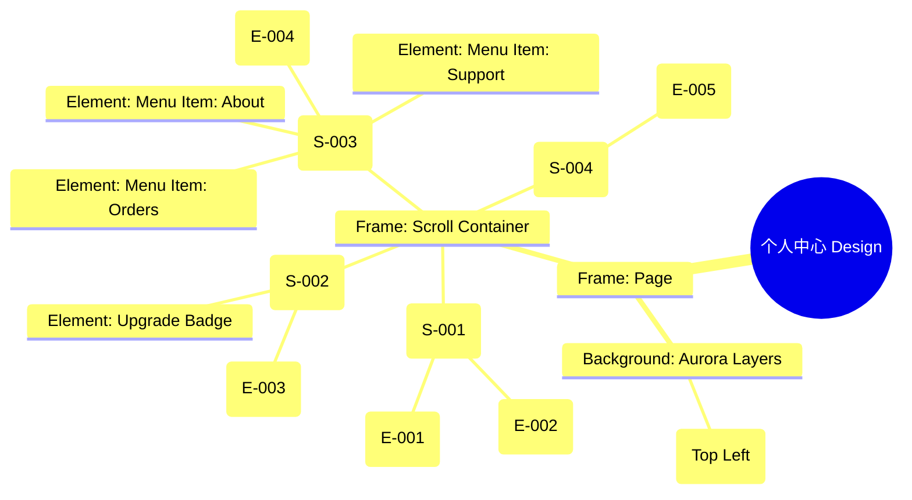

# 个人中心 Design Release

> 输出路径：`product/release/design/080-profile.md`。本文档描述页面展示内容与样式布局，不描述交互执行、埋点、接口、后端或业务处理逻辑。

# 个人中心 Design Release

## 0. 文档状态

| 字段 | 内容 |
|---|---|
| 文档版本 | Release |
| 生成日期 | 2026-05-12 |
| 来源 Mock 文件 | `product/release/mock/080-profile.md` |
| 设计约束目录 | `design/ios26-liquid-glass/` |
| 当前输出文件 | `product/release/design/080-profile.md` |
| 页面名称 | 个人中心 |
| 内容范围 | 页面展示内容 + 视觉样式 + 布局结构 + AI 可读样式结构 |
| 不包含范围 | 交互执行 / 埋点 / 接口 / 后端 / 业务流程 / 实现代码 |

## 1. 页面设计综述

| 项目 | 内容 |
|---|---|
| 页面定位 | 展示用户信息及应用级功能入口。 |
| 目标阅读对象 | 设计师 / 产品 / Figma Remote MCP agent |
| 视觉目标 | 延续 Liquid Glass 的轻盈感，通过精致的会员卡片和整洁的列表布局提供尊贵的管理体验。 |
| 信息层级 | 1. 个人信息（身份识别）；2. 会员权益（核心转化）；3. 功能菜单（日常操作）；4. 账号管理（设置/退出）。 |
| 主要视觉焦点 | 黑金质感的会员权益卡片（VIP Card）。 |
| 设计系统应用摘要 | iOS26 Liquid Glass：底层黑背景 + 动态 Aurora (Purple) + 玻璃菜单列表 + 黑金会员卡片效果。 |

## 2. 设计约束提取

| 类型 | Token / 规则 | 取值 | 使用方式 | 来源文件 |
|---|---|---|---|---|
| color | background.canvas | #000000 | 页面底层背景 | DESIGN.md |
| color | accent.purple | #BF5AF2 | 装饰性背景光斑 | DESIGN.md |
| color | status.error | #FF453A | 退出登录文字颜色 | DESIGN.md |
| color | background.surface | rgba(255, 255, 255, 0.05) | 菜单项背景 | DESIGN.md |
| typography | size.lg | 20px | 用户昵称字号 | DESIGN.md |
| typography | size.base | 16px | 菜单文字字号 | DESIGN.md |
| radius | radius.full | 999px | 用户头像圆角 | DESIGN.md |
| radius | radius.md | 14px | 菜单列表圆角 | DESIGN.md |
| shadow | glowAccent | 0 8px 32px rgba(191, 90, 242, 0.2) | 页面整体氛围光 | DESIGN.md |

## 3. 页面结构图



## 4. 自然语言样式描述

### 4.1 整体画面

- **页面整体氛围**：通透且具有品质感，利用深色背景与金色/紫色元素的点缀营造高端应用的观感。
- **背景与层级**：底层为纯黑 Canvas。左上方带有一处微弱的紫色 Aurora 微光，为头像区域提供环境光影。
- **视觉重心**：页面上方的会员卡片。卡片采用特殊的玻璃折射效果，如果是 VIP 状态，则呈现出流动的金色丝绸纹理。
- **阅读节奏**：查看个人头像昵称 -> 确认会员有效期/升级入口 -> 快速点击功能菜单 -> 底部系统设置。

### 4.2 关键区块叙述

| 区块ID | 区块名称 | 展示内容摘要 | 样式叙述 | 视觉优先级 | 设计决策 |
|---|---|---|---|---|---|
| S-001 | 个人信息头 | 头像 + 昵称 | 垂直布局。头像为 80x80 圆形，外围带 2px 浅紫色发光环。昵称使用 lg 字号，Bold 字重，居中排列。 | 高 | 突出用户身份，建立亲和力。 |
| S-002 | 会员权益区 | VIP 状态卡片 | 宽屏横置。卡片背景使用 `blur(24px)`，VIP 状态下背景为渐变黑金，普通态为深灰玻璃感。内部文字对齐方式为居左。 | 极高 | 会员卡片作为核心转化点，需在通透中体现“厚度”和“稀缺感”。 |
| S-003 | 功能列表区 | 菜单项集合 | 每一项为一个 radius.md 的玻璃矩形（或合并为一个大玻璃容器中的分割项）。左侧带小图标，右侧带 text.muted 的箭头。 | 中 | 保持整洁有序，减少视觉噪音。 |
| S-004 | 退出操作区 | 退出登录 | 独立于上方列表，置于底部。文字使用 status.error 红色，带 Regular 字重，居中展示。 | 低 | 降低退出操作的视觉权重。 |

## 5. 布局与区块样式表

| 区块ID | 来源 Mock 区块 / 元素 | Frame 层级 | 布局方式 | 尺寸 / 约束 | Padding | Gap | 背景 / 边框 / 阴影 | 圆角 | 对齐 | 响应式变化 |
|---|---|---|---|---|---|---|---|---|---|---|
| Page | - | Root | Vertical | Fill Window | 0 | 0 | background.canvas | 0 | Center | - |
| S-001 | S-001 | Header | Vertical | Width: 100% | 40px 24px | 12px | Transparent | - | Center | - |
| S-002 | S-002 | Section | Vertical | Width: 335px | 20px | - | surface (Themed) | radius.lg | Stretch | - |
| S-003 | S-003 | List | Vertical | Width: 335px | 12px 16px | 2px | surfaceOverlay | radius.md | Stretch | - |
| Item | E-004 | Row | Horizontal | H: 56px | 0 16px | 12px | Transparent | - | Center | - |

## 6. 元素级视觉定义

| 元素ID | 来源 Mock 元素 | 元素类型 | 展示内容 | 视觉角色 | 字体 / 字号 / 字重 | 颜色 Token | 背景 / 边框 | 尺寸 / 最小尺寸 | 状态样式摘要 | Figma 节点建议 |
|---|---|---|---|---|---|---|---|---|---|---|
| E-001 | E-001 | image | 用户头像 | primary | - | - | - | 80x80 | radius.full | Circle Frame |
| E-002 | E-002 | text | 用户昵称 | content | lg / bold | text.default | - | - | - | Text |
| E-003 | E-003 | card | 会员中心卡片 | primary | - | - | Custom (VIP/Normal) | H: 100px | shadow.glass | Glass Card Frame |
| E-004 | E-004 | list_item | 功能菜单项 | content | base / regular | text.default | - | H: 56px | Hover: surfaceOverlay | Horizontal Auto Layout |
| E-005 | E-005 | button | 退出登录 | warning | base / regular | status.error | Transparent | H: 56px | - | Ghost Button |

## 7. 内容与样式绑定表

| 内容对象ID | 来源 Mock 内容 | 展示文案 / 媒体描述 | 内容来源类型 | 样式 Token 绑定 | 布局位置 | 备注 |
|---|---|---|---|---|---|---|
| C-001 | E-002 | 求职者_1234 | 动态 | size.lg, bold | Below Avatar | |
| C-002 | E-003-VIP | 黑金 VIP 正在生效 | 动态 | size.base, #FFD700 | VIP Card Left | |
| C-003 | E-004-1 | 历史简历 | 静态 | size.base, regular | List Item 1 | |
| C-004 | E-005 | 退出登录 | 静态 | size.base, status.error | Bottom Center | |
| C-005 | M-002 | 金色皇冠图标 | 静态 | - | VIP Card Icon | |

## 8. 状态展示样式

| 状态ID | 来源 Mock 状态 | 状态类型 | 展示内容 | 视觉样式 | 色彩 / 图标 / 媒体处理 | 空间占位 | 可访问性说明 |
|---|---|---|---|---|---|---|---|
| STATE-001 | STATE-001 | normal | 非会员展示 | 灰色调玻璃感 | text.muted | 覆盖 E-003 背景 | 指引开通会员 |
| STATE-002 | STATE-002 | vip | 会员展示 | 黑金质感 + 丝绸光效 | #FFD700 | 覆盖 E-003 背景 | 展示剩余天数 |
| Menu_Hover| - | hover | 菜单反馈 | 背景变亮 | background.surfaceOverlay | 覆盖 E-004 | 提供操作反馈 |

## 9. 响应式布局规则

| 断点 | 页面宽度范围 | Frame 布局 | 导航 / Header | 主内容布局 | 列表 / 表格 / 卡片变化 | 间距调整 | 优先隐藏或折叠内容 |
|---|---|---|---|---|---|---|---|
| mobile | < 768px | Vertical | 居中 | 居中卡片流 | 卡片宽度 335px | space.5 (24px) | - |
| tablet | 768px - 1023px | Vertical | 居中 | 分组双列列表 | 卡片宽度 400px | space.7 (48px) | - |
| desktop | 1024px+ | Horizontal | 居左 | 侧边栏模式 | 设置项变三栏 | space.8 (64px) | - |

## 10. AI 可读样式结构

```yaml
page:
  id: "U-030"
  name: "User Profile"
  source_mock: "product/release/mock/080-profile.md"
  design_system: "design/ios26-liquid-glass/"
  output: "product/release/design/080-profile.md"
  canvas:
    background_token: "color.background.canvas"
  background_effects:
    - type: "blur_blob"
      color: "accent.purple"
      position: "top_left"
      size: "400px"
      blur: "120px"
      opacity: 0.1
  frames:
    - id: "frame-root"
      type: "frame"
      layout: "vertical"
      children:
        - id: "info-header"
          type: "frame"
          layout: "vertical"
          padding: 40
          children: ["E-001", "E-002"]
        - id: "vip-container"
          type: "frame"
          margin_vertical: 20
          children: ["E-003"]
        - id: "menu-group"
          type: "frame"
          layout: "vertical"
          background: "background.surfaceOverlay"
          radius: "radius.md"
          children: ["E-004-items"]
        - id: "system-group"
          type: "frame"
          margin_top: 40
          children: ["E-005"]
  components:
    - id: "vip-card"
      type: "card"
      background_variant: "black_gold"
      radius: "radius.lg"
      backdrop_filter: "blur(24px)"
    - id: "menu-row"
      type: "list_item"
      height: 56
      border_bottom: "1px solid border.default"
```

## 11. Figma Remote MCP 生成提示

| 项目 | 指令 |
|---|---|
| Frame 创建顺序 | Canvas -> Background Blob -> Avatar Header -> VIP Card -> Menu List -> Logout Button |
| Auto Layout 设置 | Menu List 使用 Vertical Auto Layout, 内部子项 Gap 0, 每个子项带 Border Bottom. |
| Token 应用方式 | VIP 卡片使用特殊的 Gradient 填充。退出按钮文字使用 status.error. |
| 组件分组 | 将菜单项定义为 Component "Menu_Row", 包含图标、文字、状态描述、Chevron. |
| 文本节点命名 | 昵称为 "Username", 会员状态为 "VIP_Status", 菜单名为 "Menu_Label". |
| 响应式变体 | Mobile 保持单列。Tablet 下可将功能菜单分两列展示（如常用功能 vs 设置）. |
| 生成时禁止事项 | 不生成真实的支付跳转逻辑、不生成系统原生的退出登录确认弹窗。 |

## 12. 设计决策记录

| 决策ID | 决策内容 | 依据 | 影响范围 |
|---|---|---|---|
| DD-001 | 用户头像增加紫色环境光。 | 呼应全局 Liquid Glass 风格，使头像区域更具灵动感。 | 头部视觉 |
| DD-002 | VIP 卡片独立于菜单列表展示。 | 强调会员地位，增加视觉冲击力，促进续费/开通意向。 | 页面中段布局 |
| DD-003 | 退出登录采用红色 Ghost Button。 | 作为低频且具有破坏性的操作，使用红色警示但保持样式克制。 | 底部操作区 |
