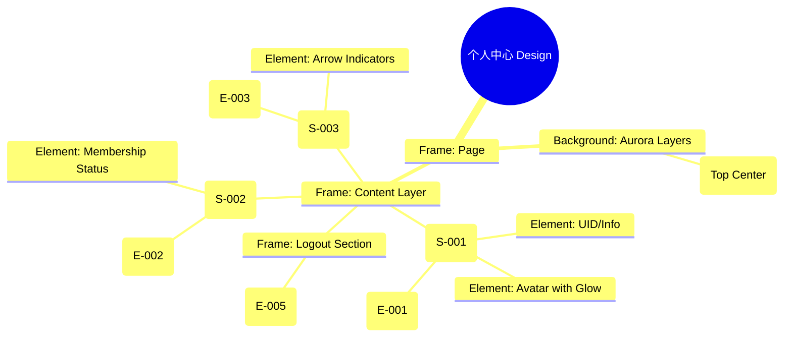

# 个人中心 Design Release

> 输出路径：`product/release/design/080-profile.md`。本文档描述页面展示内容与样式布局，不描述交互执行、埋点、接口、后端或业务处理逻辑。

# 个人中心 Design Release

## 0. 文档状态

| 字段 | 内容 |
|---|---|
| 文档版本 | Release |
| 生成日期 | 2026-05-12 |
| 来源 Mock 文件 | `product/release/mock/080-profile.md` |
| 设计约束目录 | `design/ios26-liquid-glass/` |
| 当前输出文件 | `product/release/design/080-profile.md` |
| 页面名称 | 个人中心 |
| 内容范围 | 页面展示内容 + 视觉样式 + 布局结构 + AI 可读样式结构 |
| 不包含范围 | 交互执行 / 埋点 / 接口 / 后端 / 业务流程 / 实现代码 |

## 1. 页面设计综述

| 项目 | 内容 |
|---|---|
| 页面定位 | 用户的个人信息聚合页，包含会员状态管理、设置入口及简历资产汇总。 |
| 目标阅读对象 | 设计师 / 产品 / Figma Remote MCP agent |
| 视觉目标 | 营造一种“尊享感”与“归属感”。通过精致的会员卡片设计与通透的菜单列表，体现产品的服务品质。 |
| 信息层级 | 1. 用户基本信息（头像/昵称）；2. 会员卡片（核心转化/状态）；3. 功能菜单列表；4. 退出登录入口。 |
| 主要视觉焦点 | 带有黑金磨砂质感的 VIP 会员卡片。 |
| 设计系统应用摘要 | iOS26 Liquid Glass：背景 #000000 + 顶部环境光晕 + 黑金玻璃材质 + 列表项玻璃材质。 |

## 2. 设计约束提取

| 类型 | Token / 规则 | 取值 | 使用方式 | 来源文件 |
|---|---|---|---|---|
| color | background.canvas | #000000 | 页面底层背景 | DESIGN.md |
| color | accent.purple | #BF5AF2 | 顶部环境光晕 | DESIGN.md |
| color | background.surface | rgba(255, 255, 255, 0.05) | 菜单卡片背景 | DESIGN.md |
| typography | size.lg | 20px | 用户昵称字号 | DESIGN.md |
| typography | size.base | 16px | 菜单文字字号 | DESIGN.md |
| space | space.6 | 32px | 会员卡片下方间距 | DESIGN.md |
| radius | radius.lg | 24px | 会员卡片圆角 | DESIGN.md |
| shadow | glowAccent | 0 8px 32px rgba(191, 90, 242, 0.2) | 会员卡片外发光 | DESIGN.md |

## 3. 页面结构图



## 4. 自然语言样式描述

### 4.1 整体画面

- **页面整体氛围**：优雅、沉静、带有些许奢华感。背景顶部有一处向下扩散的紫色 Aurora，为头像区提供环境底色。
- **背景与层级**：底层为纯黑 Canvas。核心内容分层：顶部是浮现的用户信息；中间是具有“实重感”的黑金玻璃 VIP 卡片；下方是轻盈的透明菜单列表。
- **视觉重心**：黑金 VIP 会员卡片。它不同于普通的玻璃卡片，它采用了更深的填充色和金色的描边，并带有微弱的流光动画。
- **阅读节奏**：确认登录身份 -> 查看会员到期时间/权益 -> 访问具体功能菜单 -> (可选) 退出登录。

### 4.2 关键区块叙述

| 区块ID | 区块名称 | 展示内容摘要 | 样式叙述 | 视觉优先级 | 设计决策 |
|---|---|---|---|---|---|
| S-001 | 用户信息区 | 头像 + 昵称 | 头像带有一圈 2px 的紫色呼吸灯效果。昵称使用 `size.lg` + `bold`。 | 高 | 建立身份归属感。 |
| S-002 | 会员权益区 | VIP 卡片 | 核心组件。背景为 `rgba(20, 20, 20, 0.8)`，边框为渐变金色。卡片应用 `shadow.glowAccent`。 | 极高 | 刺激会员转化与续费。 |
| S-003 | 功能菜单区 | 菜单列表项 | 纵向列表。每项高度 54px，背景为 `surface`，项与项之间使用 1px 的 `border.default` 分割（不撑满全宽）。 | 中 | 保持功能的清晰入口。 |

## 5. 布局与区块样式表

| 区块ID | 来源 Mock 区块 / 元素 | Frame 层级 | 布局方式 | 尺寸 / 约束 | Padding | Gap | 背景 / 边框 / 阴影 | 圆角 | 对齐 | 响应式变化 |
|---|---|---|---|---|---|---|---|---|---|---|
| Page | - | Root | Vertical | Fill Window | 0 | 0 | background.canvas | 0 | Center | - |
| S-001 | S-001 | Section | Vertical | Width: 100% | 64px 20px 32px | 12px | Transparent | - | Center | - |
| S-002 | S-002 | Card | Vertical | Width: 335px | 24px | 12px | Black-Gold Glass | radius.lg | Left | - |
| S-003 | S-003 | List | Vertical | Width: 100% | 0 20px | 0 | Transparent | - | Top | - |
| Logout | E-005 | Section | Vertical | Width: 100% | 48px 20px | - | Transparent | - | Center | - |

## 6. 元素级视觉定义

| 元素ID | 来源 Mock 元素 | 元素类型 | 展示内容 | 视觉角色 | 字体 / 字号 / 字重 | 颜色 Token | 背景 / 边框 | 尺寸 / 最小尺寸 | 状态样式摘要 | Figma 节点建议 |
|---|---|---|---|---|---|---|---|---|---|---|
| E-001 | E-001 | text | 昵称 [张三] | headline | lg / bold | text.default | - | - | - | User_Name |
| E-002 | E-002 | card | 会员卡片 | premium | - | - | Custom Gold | H: 160px | shadow.glowAccent | VIP_Card_Comp |
| E-003 | E-003 | item | 菜单项 | entry | base / regular | text.default | surface | H: 54px | Hover: surfaceOverlay | List_Item |
| E-005 | E-005 | button | 退出登录 | support | base / regular | status.error | - | H: 50px | - | Text_Button |

## 7. 内容与样式绑定表

| 内容对象ID | 来源 Mock 内容 | 展示文案 / 媒体描述 | 内容来源类型 | 样式 Token 绑定 | 布局位置 | 备注 |
|---|---|---|---|---|---|---|
| C-001 | E-001 | 简历达人-张三 | 动态 | lg, bold | S-001 | |
| C-002 | E-002 | 您的会员将于 2026-12-31 到期 | 动态 | sm, regular | VIP Card Bottom | |
| C-003 | DATA-001 | 历史简历、意见反馈... | 静态 | base, regular | S-003 Items | |
| C-004 | E-005 | 退出当前账号 | 静态 | base, regular | S-004 | |

## 8. 状态展示样式

| 状态ID | 来源 Mock 状态 | 状态类型 | 展示内容 | 视觉样式 | 色彩 / 图标 / 媒体处理 | 空间占位 | 可访问性说明 |
|---|---|---|---|---|---|---|---|
| STATE-001 | STATE-001 | non-vip | 未开通会员 | 灰色调卡片 + 引导语 | text.muted | 替换 S-002 | |
| STATE-002 | - | vip_active | 已开通 | 金色流光动画 | accent.gold (Linear) | S-002 边框 | |
| Menu_Press | - | active | 菜单按压 | 表面不透明度增加 | surfaceOverlay | - | |

## 9. 响应式布局规则

| 断点 | 页面宽度范围 | Frame 布局 | 导航 / Header | 主内容布局 | 列表 / 表格 / 卡片变化 | 间距调整 | 优先隐藏或折叠内容 |
|---|---|---|---|---|---|---|---|
| mobile | < 768px | Vertical | 顶部 Tab 2 | 单栏垂直列表 | - | space.4 | - |
| tablet | 768px - 1023px | Vertical | 顶部 Tab 2 | 网格菜单 (2列) | - | space.6 | - |
| desktop | 1024px+ | Horizontal | 侧边栏 | 个人看板视图 | 菜单变为侧边导航 | space.8 | - |

## 10. AI 可读样式结构

```yaml
page:
  id: "U-030"
  name: "Profile Page"
  source_mock: "product/release/mock/080-profile.md"
  design_system: "design/ios26-liquid-glass/"
  output: "product/release/design/080-profile.md"
  canvas:
    background_token: "color.background.canvas"
  background_effects:
    - type: "blur_blob"
      color: "accent.purple"
      position: "top_center"
      size: "600px"
      blur: "150px"
      opacity: 0.1
  frames:
    - id: "frame-root"
      type: "frame"
      layout: "vertical"
      children:
        - id: "profile-header"
          type: "frame"
          layout: "vertical"
          padding: 40
          children: ["avatar-glow", "E-001"]
        - id: "vip-card-container"
          type: "frame"
          padding: 20
          children: ["E-002-vip-card"]
        - id: "menu-list"
          type: "frame"
          layout: "vertical"
          padding: 20
          children: ["E-003-items"]
  components:
    - id: "vip-card"
      type: "frame"
      background: "rgba(20, 20, 20, 0.9)"
      backdrop_filter: "blur(32px)"
      border: "2px solid linear-gradient(accent.gold, transparent)"
      radius: "radius.lg"
      shadow: "shadow.glowAccent"
```

## 11. Figma Remote MCP 生成提示

| 项目 | 指令 |
|---|---|
| Frame 创建顺序 | Canvas -> Background Blob -> Profile Header -> VIP Card -> Menu List -> Logout Button |
| Auto Layout 设置 | Menu List 使用 Vertical Auto Layout, Gap 0. |
| Token 应用方式 | VIP 卡片边框使用金色渐变, 并应用 shadow.glowAccent. |
| 组件分组 | 将菜单图标、文字、箭头编组为 "Menu_Row". |
| 文本节点命名 | 昵称命名为 "User_Nickname", 会员状态为 "VIP_Status". |
| 响应式变体 | 在 Mobile 下确保 VIP 卡片宽度撑满(带两边距). |
| 生成时禁止事项 | 不生成复杂的设置二级页面跳转。 |

## 12. 设计决策记录

| 决策ID | 决策内容 | 依据 | 影响范围 |
|---|---|---|---|
| DD-001 | VIP 会员卡片采用黑金磨砂玻璃。 | 区分普通业务卡片，建立显著的高级感与会员尊享标识。 | 核心组件 |
| DD-002 | 顶部紫色 Aurora 环境光。 | 与 AI 分析报告的主色调呼应，维持全站视觉统一性。 | 页面基调 |
| DD-003 | 退出登录按钮使用 status.error 色。 | 视觉上起到警示作用，防止误操作。 | 底部按钮 |
 Riverside, CA
