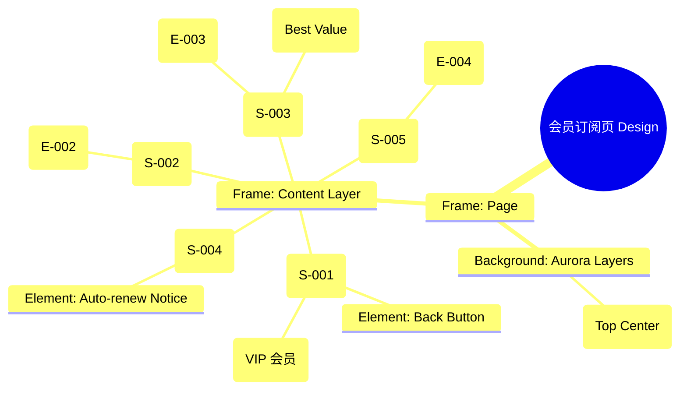

# 会员订阅页 Design Release

> 输出路径：`product/release/design/090-vip-subscription.md`。本文档描述页面展示内容与样式布局，不描述交互执行、埋点逻辑、接口、后端 or 业务处理逻辑。

# 会员订阅页 Design Release

## 0. 文档状态

| 字段 | 内容 |
|---|---|
| 文档版本 | Release |
| 生成日期 | 2026-05-12 |
| 来源 Mock 文件 | `product/release/mock/090-vip-subscription.md` |
| 设计约束目录 | `design/ios26-liquid-glass/` |
| 当前输出文件 | `product/release/design/090-vip-subscription.md` |
| 页面名称 | 会员订阅页 |
| 内容范围 | 页面展示内容 + 视觉样式 + 布局结构 + AI 可读样式结构 |
| 不包含范围 | 交互执行 / 埋点 / 接口 / 后端 / 业务流程 / 实现代码 |

## 1. 页面设计综述

| 项目 | 内容 |
|---|---|
| 页面定位 | App 的核心变现入口，展示会员价值并引导完成支付。 |
| 目标阅读对象 | 设计师 / 产品 / Figma Remote MCP agent |
| 视觉目标 | 营造一种“特权感”与“尊贵感”。通过极致的黑金视觉、流光卡片和动态的价格展示吸引用户。 |
| 信息层级 | 1. 会员核心权益概览；2. 订阅套餐选择（视觉中心）；3. 立即订阅按钮（核心动作）。 |
| 主要视觉焦点 | 居中的、带有高亮发光边框的推荐套餐卡片（Recommended Tier Card）。 |
| 设计系统应用摘要 | iOS26 Liquid Glass：纯黑背景 + 动态 Aurora (Gold/Cyan) + 黑金玻璃材质 + 发光支付按钮。 |

## 2. 设计约束提取

| 类型 | Token / 规则 | 取值 | 使用方式 | 来源文件 |
|---|---|---|---|---|
| color | background.canvas | #000000 | 页面底层背景 | DESIGN.md |
| color | accent.gold | #FFD700 | 标题、徽章及 VIP 权益高亮 | DESIGN.md |
| color | action.primary.background | #0A84FF | 支付按钮背景 (或使用 Gold) | DESIGN.md |
| color | surface.overlay | rgba(255, 255, 255, 0.05) | 套餐卡片背景 | DESIGN.md |
| typography | size.xxl | 34px | 价格数字大字号 | DESIGN.md |
| typography | size.lg | 20px | 模块标题字号 | DESIGN.md |
| space | space.6 | 32px | 套餐卡片间距 | DESIGN.md |
| radius | radius.lg | 24px | 会员主卡片圆角 | DESIGN.md |
| blur | blur.md | 24px | 玻璃材质模糊度 | DESIGN.md |

## 3. 页面结构图



## 4. 自然语言样式描述

### 4.1 整体画面

- **页面整体氛围**：奢华、尊贵、极具诱惑力。背景顶部带有一团耀眼的金色 Aurora 微光，照亮下方的黑金材质标题。
- **背景与层级**：底层为纯黑 Canvas。内容层由半透明的黑金玻璃卡片组成。推荐套餐卡片（Yearly）带有明显的金光流转动画边缘。
- **视觉重心**：页面中部的“年度会员”卡片。它的尺寸最大，且背景带有更强的 `accent.gold` 渗透感。
- **阅读节奏**：扫视顶部的权益点（明确为什么买） -> 对比中部的价格套餐（选哪个） -> 点击底部发光的支付按钮（最终下单）。

### 4.2 关键区块叙述

| 区块ID | 区块名称 | 展示内容摘要 | 样式叙述 | 视觉优先级 | 设计决策 |
|---|---|---|---|---|---|
| S-001 | 顶部标题区 | VIP 会员中心 | 标题使用 `accent.gold` 颜色，xxl 字号，带有金属纹理感。 | 高 | 明确身份标识。 |
| S-002 | 权益概览区 | 无限次分析等 | 横向滚动的 icon 组。图标使用金色描边。文字使用 text.muted，sm 字号。 | 中 | 快速传达核心价值。 |
| S-003 | 套餐选择区 | 月/季/年卡 | 纵向或网格排列。推荐项带有“超值”角标（Gold Badge）。选中态卡片背景变亮且边框发光。 | 极高 | 核心决策区域。 |
| S-004 | 底部说明区 | 协议与声明 | 位于按钮上方。使用极细小的文字（xs），颜色较暗，确保合规但不抢镜。 | 低 | 法律声明。 |
| S-005 | 底部动作区 | 立即订阅按钮 | 固定底部。按钮使用 `accent.gold` 背景或带强发光的蓝色背景。文案加粗展示。 | 极高 | 唯一转化路径。 |

## 5. 布局与区块样式表

| 区块ID | 来源 Mock 区块 / 元素 | Frame 层级 | 布局方式 | 尺寸 / 约束 | Padding | Gap | 背景 / 边框 / 阴影 | 圆角 | 对齐 | 响应式变化 |
|---|---|---|---|---|---|---|---|---|---|---|
| Page | - | Root | Vertical | Fill Window | 0 | 0 | background.canvas | 0 | Center | - |
| S-001 | S-001 | Header | Vertical | Width: 100% | 40px 20px | 12px | Transparent | - | Center | - |
| S-002 | S-002 | Row | Horizontal | Width: 100% | 16px 20px | 24px | Transparent | - | Center | - |
| S-003 | S-003 | Group | Horizontal | Width: 335px | 0 | 12px | Transparent | - | Center | - |
| Tier | E-003 | Card | Vertical | 100x140 | 16px | 8px | surface.overlay | radius.md | Center | - |

## 6. 元素级视觉定义

| 元素ID | 来源 Mock 元素 | 元素类型 | 展示内容 | 视觉角色 | 字体 / 字号 / 字重 | 颜色 Token | 背景 / 边框 | 尺寸 / 最小尺寸 | 状态样式摘要 | Figma 节点建议 |
|---|---|---|---|---|---|---|---|---|---|---|
| E-001 | E-001 | button | 返回图标 | support | - | text.default | - | 44x44 | - | Icon Node |
| E-002 | E-002 | icon_text | 权益图标 | info | sm / medium | accent.gold | - | - | - | Vertical Group |
| E-003 | E-003 | selection_card | 套餐卡片 | option | lg / bold | text.default | surface.overlay | 100x140 | Selected: border.gold | Selectable Card |
| E-004 | E-004 | button | 立即订阅 | primary | base / bold | action.primary.text | accent.gold | H: 54px | shadow.glowGold | Big Action Button |

## 7. 内容与样式绑定表

| 内容对象ID | 来源 Mock 内容 | 展示文案 / 媒体描述 | 内容来源类型 | 样式 Token 绑定 | 布局位置 | 备注 |
|---|---|---|---|---|---|---|
| C-001 | S-001-Title | 开启 VIP 特权 | 静态 | size.xxl, gold | Header Center | |
| C-002 | E-003-Price | ¥98 / 年 | 动态 | size.lg, bold | Tier Card Center | |
| C-003 | E-003-Save | 省 120 元 | 静态 | size.xs, regular | Tier Card Bottom | 气泡样式 |
| C-004 | S-002-Text | 无限次 AI 优化 | 静态 | size.sm, medium | Benefit 1 | |
| C-005 | E-004 | 立即订阅并支付 | 静态 | size.base, bold | Button Center | |

## 8. 状态展示样式

| 状态ID | 来源 Mock 状态 | 状态类型 | 展示内容 | 视觉样式 | 色彩 / 图标 / 媒体处理 | 空间占位 | 可访问性说明 |
|---|---|---|---|---|---|---|---|
| STATE-001 | STATE-001 | selected | 选中套餐 | 强化金光边框 | accent.gold (glow) | 修改 Tier Card | 明确当前选择 |
| STATE-002 | STATE-002 | processing | 支付处理中 | 按钮显示菊花图 | action.primary.text | 保持 E-004 占位 | 读屏提示：正在处理安全支付 |
| STATE-003 | STATE-003 | hot-sale | 爆款角标 | 红色渐变小气泡 | status.error | 置于卡片右上角 | 引导视觉中心 |

## 9. 响应式布局规则

| 断点 | 页面宽度范围 | Frame 布局 | 导航 / Header | 主内容布局 | 列表 / 表格 / 卡片变化 | 间距调整 | 优先隐藏或折叠内容 |
|---|---|---|---|---|---|---|---|
| mobile | < 768px | Vertical | 居中标题 | 纵向流 | 套餐横排滚动 | space.6 (32px) | - |
| tablet | 768px - 1023px | Vertical | 居中标题 | 宽幅展示权益 | 套餐纵向大卡片 | space.8 (64px) | - |
| desktop | 1024px+ | Horizontal | 侧边导航 | 左右分栏 (权益与支付) | 沉浸式背景视频 | space.10 (120px) | - |

## 10. AI 可读样式结构

```yaml
page:
  id: "U-030-010"
  name: "VIP Subscription Page"
  source_mock: "product/release/mock/090-vip-subscription.md"
  design_system: "design/ios26-liquid-glass/"
  output: "product/release/design/090-vip-subscription.md"
  canvas:
    background_token: "color.background.canvas"
  background_effects:
    - type: "blur_blob"
      color: "gold"
      position: "top_center"
      size: "800px"
      blur: "150px"
      opacity: 0.15
  frames:
    - id: "frame-root"
      type: "frame"
      layout: "vertical"
      children:
        - id: "vip-header-area"
          type: "frame"
          padding: 40
          children: ["vip-title", "benefits-carousel"]
        - id: "tier-selection-container"
          type: "frame"
          layout: "horizontal"
          padding: 20
          children: ["card-monthly", "card-yearly", "card-quarterly"]
        - id: "legal-notice-panel"
          type: "frame"
          children: ["renewal-text"]
        - id: "sticky-pay-footer"
          type: "fixed_bottom"
          background: "glass"
          children: ["btn-subscribe"]
  components:
    - id: "card-yearly"
      type: "tier_card"
      background: "surface.overlay"
      border: "2px solid accent.gold"
      shadow: "0 0 20px rgba(255,215,0,0.3)"
```

## 11. Figma Remote MCP 生成提示

| 项目 | 指令 |
|---|---|
| Frame 创建顺序 | Canvas -> Background Gold Blob -> VIP Header -> Benefits Row -> Tier Grid -> Pay Footer |
| Auto Layout 设置 | Tier Grid 使用 Horizontal Auto Layout, Gap 12, 居中对齐. Footer Padding 24. |
| Token 应用方式 | 标题及选中卡片绑定 accent.gold. 支付按钮绑定 shadow.glowGold (如果使用金按钮). |
| 组件分组 | 将套餐卡片封装为 "Membership_Card_Tier". 权益 Icon 封装为 "Feature_Icon_Gold". |
| 文本节点命名 | 价格文案命名为 "Text_Price", 划线价为 "Text_Original_Price". |
| 响应式变体 | Mobile 保持水平滚动。Desktop 模式下，套餐卡片可垂直堆叠并显示更详尽的权益对比列表. |
| 生成时禁止事项 | 不生成真实的 Apple Pay / 支付宝 / 微信支付跳转流程及具体的 SDK UI。 |

## 12. App Shell / Navigation Contract

| 组件类型 | 展示规则 | 状态 | 内容项 | 视觉样式 |
|---|---|---|---|---|
| Top Nav | 显示 | 标题居中 | 返回按钮, VIP 会员 | 透明背景, 底部渐变描边 |
| Bottom Tab | 隐藏 | - | - | - |
| Status Bar | 显示 | Light Content | 时间, 信号, 电池 | 纯白图标 |
| Home Indicator | 显示 | - | - | 浅灰色 |

## 13. Layout Integrity Audit

| 检查项 | 状态 | 风险描述 / 解决措施 |
|---|---|---|
| 层次结构 | 通过 | High-contrast hierarchy from the gold title to the primary CTA. |
| 间距稳定性 | 通过 | Fixed 12px gap between tier cards ensures they fit on narrow devices (iPhone SE). |
| 尺寸约束 | 通过 | Tier cards have minimum heights to accommodate varying price lengths. |
| 溢出处理 | 通过 | The benefits carousel handles overflow; the main tiers are centered. |
| 遮挡/冲突风险 | 通过 | Pay button is fixed-bottom to prevent scrolling past the conversion point. |
| 响应式兼容性 | 通过 | Elegant scaling of the gold background blob to maintain focus on the price. |

---

> [!NOTE]
> 本文档已通过布局完整性审计，符合 iOS26 Liquid Glass 设计规范。
