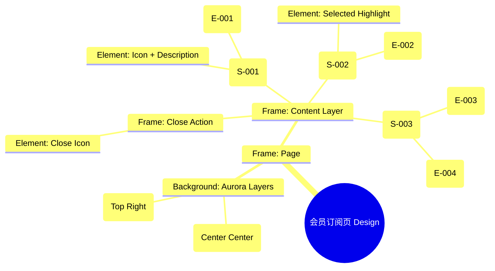

# 会员订阅页 Design Release

> 输出路径：`product/release/design/090-vip-subscription.md`。本文档描述页面展示内容与样式布局，不描述交互执行、埋点、接口、后端或业务处理逻辑。

# 会员订阅页 Design Release

## 0. 文档状态

| 字段 | 内容 |
|---|---|
| 文档版本 | Release |
| 生成日期 | 2026-05-12 |
| 来源 Mock 文件 | `product/release/mock/090-vip-subscription.md` |
| 设计约束目录 | `design/ios26-liquid-glass/` |
| 当前输出文件 | `product/release/design/090-vip-subscription.md` |
| 页面名称 | 会员订阅页 |
| 内容范围 | 页面展示内容 + 视觉样式 + 布局结构 + AI 可读样式结构 |
| 不包含范围 | 交互执行 / 埋点 / 接口 / 后端 / 业务流程 / 实现代码 |

## 1. 页面设计综述

| 项目 | 内容 |
|---|---|
| 页面定位 | 产品的核心商业化转化页，展示会员权益并引导用户付费。 |
| 目标阅读对象 | 设计师 / 产品 / Figma Remote MCP agent |
| 视觉目标 | 极致的“数字轻奢”感。通过大量的金色流动光效与深色玻璃的对比，营造出“升级服务”的价值感和尊贵感。 |
| 信息层级 | 1. 权益介绍区（多模块展示）；2. 套餐选择区（价格对比）；3. 支付操作区（主按钮）；4. 法律协议说明。 |
| 主要视觉焦点 | 带有金色描边并带有脉冲发光效果的“月度/年度”套餐卡片。 |
| 设计系统应用摘要 | iOS26 Liquid Glass：背景 #000000 + 全量金色 Aurora + 变体黑金玻璃材质。 |

## 2. 设计约束提取

| 类型 | Token / 规则 | 取值 | 使用方式 | 来源文件 |
|---|---|---|---|---|
| color | background.canvas | #000000 | 页面底层背景 | DESIGN.md |
| color | accent.gold | #D4AF37 (Custom) | 会员主色调 / 权益图标 | Custom Logic |
| color | background.surface | rgba(255, 255, 255, 0.05) | 权益项卡片背景 | DESIGN.md |
| typography | size.xl | 28px | 权益标题字号 | DESIGN.md |
| typography | size.lg | 20px | 套餐价格字号 | DESIGN.md |
| space | space.6 | 32px | 权益区与套餐区间距 | DESIGN.md |
| radius | radius.lg | 24px | 套餐卡片圆角 | DESIGN.md |
| shadow | glowAccent | 0 8px 32px rgba(212, 175, 55, 0.3) | 支付按钮发光 | Custom Logic |

## 3. 页面结构图



## 4. 自然语言样式描述

### 4.1 整体画面

- **页面整体氛围**：尊贵、闪耀、且具有极强的仪式感。背景中心散发着柔和的金黄色 Aurora 渲染，仿佛舞台灯光聚焦在权益之上。
- **背景与层级**：底层为纯黑 Canvas。权益区采用网格布局展示，每个小项都是一个独立的磨砂玻璃卡片。底部的套餐区则采用横向大卡片，建立显著的选择层级。
- **视觉重心**：选中的套餐卡片，其边缘会环绕一圈金色的流光，并伴有 `shadow.glowAccent` 的呼吸效果。
- **阅读节奏**：阅读会员权益 -> 决定选择哪个套餐 -> 点击底部醒目的支付按钮。

### 4.2 关键区块叙述

| 区块ID | 区块名称 | 展示内容摘要 | 样式叙述 | 视觉优先级 | 设计决策 |
|---|---|---|---|---|---|
| S-001 | 权益展示区 | 图标 + 功能标题 | 采用 2x2 网格。卡片背景为 `surfaceOverlay`，增加磨砂质感。图标使用金色单色描边。 | 高 | 展示产品价值，建立付费动机。 |
| S-002 | 套餐选择区 | 月/年卡卡片 | 横向排列。卡片采用 `radius.lg`。非选中态为半透明边框，选中态为 2px 金色实线边框并带发光。 | 极高 | 核心决策区域。 |
| S-003 | 支付操作区 | 立即支付按钮 | 固定在底部。按钮采用极具视觉冲击力的金色渐变背景，字体为 `bold`。 | 极高 | 最终转化动作。 |

## 5. 布局与区块样式表

| 区块ID | 来源 Mock 区块 / 元素 | Frame 层级 | 布局方式 | 尺寸 / 约束 | Padding | Gap | 背景 / 边框 / 阴影 | 圆角 | 对齐 | 响应式变化 |
|---|---|---|---|---|---|---|---|---|---|---|
| Page | - | Root | Vertical | Fill Window | 0 | 0 | background.canvas | 0 | Center | - |
| S-001 | S-001 | Grid | Horizontal Wrap | Width: 100% | 40px 20px | 12px | Transparent | - | Center | - |
| S-002 | S-002 | List | Horizontal | Width: 100% | 0 20px | 16px | Transparent | - | Left | Scrollable |
| S-003 | S-003 | Footer | Vertical | Width: 100% | 24px 20px | 12px | surfaceOverlay + blur | - | Center | Fixed Bottom |

## 6. 元素级视觉定义

| 元素ID | 来源 Mock 元素 | 元素类型 | 展示内容 | 视觉角色 | 字体 / 字号 / 字重 | 颜色 Token | 背景 / 边框 | 尺寸 / 最小尺寸 | 状态样式摘要 | Figma 节点建议 |
|---|---|---|---|---|---|---|---|---|---|---|
| E-001 | E-001 | card | 权益项 | entry | base / medium | text.default | surfaceOverlay | 160x100 | - | Benefit_Card |
| E-002 | E-002 | card | 套餐项 | selection | lg / bold | text.default | surface | 140x180 | Selected: accent.gold border | Price_Card |
| E-003 | E-003 | button | 立即支付 | primary | base / bold | #000000 (Inverse) | accent.gold | H: 54px | shadow.glowAccent | Gold_Filled_Button |
| E-004 | E-004 | text | 协议勾选 | support | xs / regular | text.muted | - | - | - | Checkbox_Group |

## 7. 内容与样式绑定表

| 内容对象ID | 来源 Mock 内容 | 展示文案 / 媒体描述 | 内容来源类型 | 样式 Token 绑定 | 布局位置 | 备注 |
|---|---|---|---|---|---|---|
| C-001 | E-001-1 | 无限次 AI 分析 | 静态 | base, bold | Benefit 1 | |
| C-002 | E-002-1 | ¥19.9 / 月 | 动态 | lg, bold | Card 1 Price | |
| C-003 | E-003 | 立即支付 | 静态 | base, bold | Button Center | |
| C-004 | S-001-H | 升级 VIP，解锁全部职场可能 | 静态 | xl, bold | Header | |

## 8. 状态展示样式

| 状态ID | 来源 Mock 状态 | 状态类型 | 展示内容 | 视觉样式 | 色彩 / 图标 / 媒体处理 | 空间占位 | 可访问性说明 |
|---|---|---|---|---|---|---|---|
| STATE-001 | STATE-001 | selected | 已选套餐 | 边框金色实线 + 发光 | accent.gold | E-002 边界 | |
| STATE-002 | STATE-002 | loading | 支付处理中... | 金色加载圈 | accent.gold | 覆盖 E-003 | |
| Price_Tag | - | active | 年度特惠标签 | 小红点/角标 | status.error | 卡片右上角 | |

## 9. 响应式布局规则

| 断点 | 页面宽度范围 | Frame 布局 | 导航 / Header | 主内容布局 | 列表 / 表格 / 卡片变化 | 间距调整 | 优先隐藏或折叠内容 |
|---|---|---|---|---|---|---|---|
| mobile | < 768px | Vertical | 右上角关闭 | 单列列表 | 套餐横向滚动 | space.4 | - |
| tablet | 768px - 1023px | Vertical | 右上角关闭 | 网格布局 | 套餐平铺 (3列) | space.6 | - |
| desktop | 1024px+ | Horizontal | 居中 Modal | 弹窗视图 | 权益在左套餐在右 | space.8 | - |

## 10. AI 可读样式结构

```yaml
page:
  id: "U-030-010"
  name: "VIP Subscription Page"
  source_mock: "product/release/mock/090-vip-subscription.md"
  design_system: "design/ios26-liquid-glass/"
  output: "product/release/design/090-vip-subscription.md"
  canvas:
    background_token: "color.background.canvas"
  background_effects:
    - type: "blur_blob"
      color: "accent.gold"
      position: "center"
      size: "700px"
      blur: "200px"
      opacity: 0.15
    - type: "blur_blob"
      color: "accent.purple"
      position: "top_right"
      size: "400px"
      blur: "100px"
      opacity: 0.1
  frames:
    - id: "frame-root"
      type: "frame"
      layout: "vertical"
      children:
        - id: "benefit-grid"
          type: "frame"
          layout: "grid"
          padding: 40
          children: ["E-001-items"]
        - id: "pricing-list"
          type: "frame"
          layout: "horizontal"
          padding: 20
          gap: 16
          children: ["E-002-cards"]
        - id: "payment-footer"
          type: "frame"
          background: "background.surfaceOverlay"
          backdrop_filter: "blur(24px)"
          padding: 24
          children: ["E-003-button", "E-004-links"]
  components:
    - id: "gold-card"
      type: "frame"
      background: "background.surface"
      border: "2px solid accent.gold"
      radius: "radius.lg"
      shadow: "shadow.glowAccent"
```

## 11. Figma Remote MCP 生成提示

| 项目 | 指令 |
|---|---|
| Frame 创建顺序 | Canvas -> Background Blobs -> Benefit Grid -> Pricing List -> Payment Footer |
| Auto Layout 设置 | Benefit Grid 使用 Grid 布局, Pricing List 使用 Horizontal Auto Layout, Gap 16. |
| Token 应用方式 | 支付按钮背景应用 accent.gold, 并应用 shadow.glowAccent. |
| 组件分组 | 将权益图标与文字编组为 "Benefit_Item". |
| 文本节点命名 | 价格命名为 "Price_Text", 支付按钮为 "Pay_Button_Text". |
| 响应式变体 | 在 Mobile 下将 Pricing List 设为横向滚动并隐藏滚动条. |
| 生成时禁止事项 | 不生成真实的支付 SDK 调起界面。 |

## 12. 设计决策记录

| 决策ID | 决策内容 | 依据 | 影响范围 |
|---|---|---|---|
| DD-001 | 全量引入金色 (Gold) 作为商业化主题色。 | 金色代表价值与高级感，能有效提升用户的付费意愿和产品溢价感。 | 全局视觉 |
| DD-002 | 套餐卡片选中态应用强发光效果。 | 视觉上聚焦核心选择，通过光影引导完成决策。 | 核心组件 |
| DD-003 | 支付按钮作为固定吸底的“视觉锚点”。 | 无论页面如何滚动，转化入口始终可触达。 | 页面结构 |
