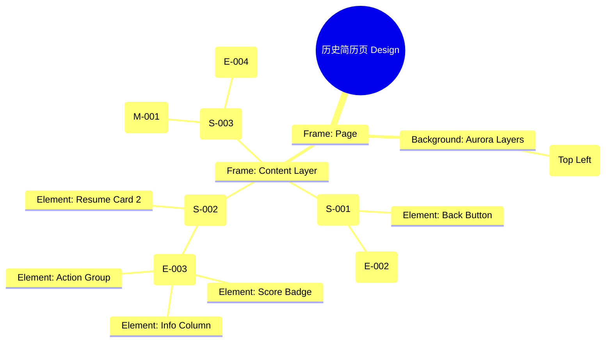

# 历史简历页 Design Release

> 输出路径：`product/release/design/100-history.md`。本文档描述页面展示内容与样式布局，不描述交互执行、埋点、接口、后端或业务处理逻辑。

# 历史简历页 Design Release

## 0. 文档状态

| 字段 | 内容 |
|---|---|
| 文档版本 | Release |
| 生成日期 | 2026-05-12 |
| 来源 Mock 文件 | `product/release/mock/100-history.md` |
| 设计约束目录 | `design/ios26-liquid-glass/` |
| 当前输出文件 | `product/release/design/100-history.md` |
| 页面名称 | 历史简历页 |
| 内容范围 | 页面展示内容 + 视觉样式 + 布局结构 + AI 可读样式结构 |
| 不包含范围 | 交互执行 / 埋点 / 接口 / 后端 / 业务流程 / 实现代码 |

## 1. 页面设计综述

| 项目 | 内容 |
|---|---|
| 页面定位 | 管理所有已保存的历史简历记录。 |
| 目标阅读对象 | 设计师 / 产品 / Figma Remote MCP agent |
| 视觉目标 | 打造一个有序、通透的数字化档案库，通过清晰的列表层级让用户快速回溯过往记录。 |
| 信息层级 | 1. 搜索过滤（快速定位）；2. 简历卡片列表（核心展示）；3. 简历状态（得分/时间）；4. 操作入口（编辑/导出/删除）。 |
| 主要视觉焦点 | 简历卡片上的彩色匹配分值标签。 |
| 设计 system 应用摘要 | iOS26 Liquid Glass：底层黑背景 + 动态 Aurora (Cyan) + 玻璃列表项 + 侧滑操作反馈。 |

## 2. 设计约束提取

| 类型 | Token / 规则 | 取值 | 使用方式 | 来源文件 |
|---|---|---|---|---|
| color | background.canvas | #000000 | 页面底层背景 | DESIGN.md |
| color | background.surface | rgba(255, 255, 255, 0.05) | 简历卡片背景 | DESIGN.md |
| color | accent.cyan | #32ADE6 | 搜索框焦点/高分标识颜色 | DESIGN.md |
| typography | size.base | 16px | 简历名称字号 | DESIGN.md |
| typography | size.sm | 14px | 目标岗位与时间字号 | DESIGN.md |
| space | space.4 | 16px | 卡片内边距 | DESIGN.md |
| space | space.3 | 12px | 卡片间距 | DESIGN.md |
| radius | radius.md | 14px | 搜索框与卡片圆角 | DESIGN.md |
| shadow | glass | 0 4px 16px rgba(0, 0, 0, 0.2) | 玻璃层级阴影 | DESIGN.md |

## 3. 页面结构图



## 4. 自然语言样式描述

### 4.1 整体画面

- **页面整体氛围**：整洁、理智、具有浓郁的“数字化档案”美感，强调信息的条理性。
- **背景与层级**：画布为纯黑。顶部搜索栏固定，背景带有毛玻璃（blur 24px）模糊。简历列表随手势滚动，卡片浮动在背景 Aurora 微光之上。
- **视觉重心**：带有彩色分值标签的简历卡片。
- **阅读节奏**：输入关键词搜索 -> 浏览列表 -> 关注高分简历 -> 执行编辑或导出动作。

### 4.2 关键区块叙述

| 区块ID | 区块名称 | 展示内容摘要 | 样式叙述 | 视觉优先级 | 设计决策 |
|---|---|---|---|---|---|
| S-001 | 搜索导航区 | 返回 + 搜索框 | 搜索框采用 surfaceMuted 背景，内嵌搜索图标。焦点态下，边框呈现 accent.cyan 高亮。 | 中 | 保持导航区的轻量化。 |
| S-002 | 历史列表区 | 简历卡片列表 | 卡片采用垂直堆叠，间距 12px。卡片背景为 surface，带有细微的 border.default 描边。 | 极高 | 通过统一的卡片尺寸建立视觉秩序。 |
| Card_Item| 简历卡片项 | 标题 + 岗位 + 分数 | 标题 semibold。分数以带发光的小圆点或胶囊形式展示在右侧。操作按钮（编辑/导出）为 Ghost 风格小图标，置于底部或右侧。 | 高 | 突出展示“匹配分”，因为这是用户回溯简历的核心动力。 |
| S-003 | 空状态区 | 占位图 + 文案 | 居中。插画采用半透明玻璃质感风格。文案使用 text.muted。 | 低 | 避免空状态过于突兀，保持调性统一。 |

## 5. 布局与区块样式表

| 区块ID | 来源 Mock 区块 / 元素 | Frame 层级 | 布局方式 | 尺寸 / 约束 | Padding | Gap | 背景 / 边框 / 阴影 | 圆角 | 对齐 | 响应式变化 |
|---|---|---|---|---|---|---|---|---|---|---|
| Page | - | Root | Vertical | Fill Window | 0 | 0 | background.canvas | 0 | Center | - |
| S-001 | S-001 | Header | Vertical | Width: 100% | 16px 20px | 12px | surfaceOverlay + blur | - | Center | Fixed Top |
| S-002 | S-002 | Section | Vertical | Width: 100% | 12px 20px | 12px | Transparent | - | Top Stretch | - |
| Card | E-003 | Group | Horizontal | Width: 100% | 16px | 12px | surface | radius.md | Center | - |
| S-003 | S-003 | Section | Vertical | Fill Container | 0 | 20px | Transparent | - | Center | - |

## 6. 元素级视觉定义

| 元素ID | 来源 Mock 元素 | 元素类型 | 展示内容 | 视觉角色 | 字体 / 字号 / 字重 | 颜色 Token | 背景 / 边框 | 尺寸 / 最小尺寸 | 状态样式摘要 | Figma 节点建议 |
|---|---|---|---|---|---|---|---|---|---|---|
| E-001 | E-001 | button | 返回图标 | support | - | text.default | - | 44x44 | - | Circle Icon |
| E-002 | E-002 | input | 搜索简历... | search | base / regular | text.default | surfaceMuted | H: 44px | Focus: border.highlight | Search Bar |
| E-003 | E-003 | card | 简历项卡片 | content | - | - | surface | - | Hover: surfaceOverlay | Glass Row |
| E-005/06 | E-005/06 | button | 编辑/导出 | action | sm / medium | accent.blue | Transparent | H: 32px | - | Ghost Buttons |
| E-007 | E-007 | button | 删除图标 | warning | - | status.error | - | 32x32 | - | Icon |
| M-001 | M-001 | image | 空状态插画 | support | - | - | - | 120x120 | Opacity 0.6 | Illustration |

## 7. 内容与样式绑定表

| 内容对象ID | 来源 Mock 内容 | 展示文案 / 媒体描述 | 内容来源类型 | 样式 Token 绑定 | 布局位置 | 备注 |
|---|---|---|---|---|---|---|
| C-001 | E-003-Title | 互联网大厂产品经理 | 动态 | size.base, semibold | Card Top Left | |
| C-002 | E-003-Score | 匹配分：85 | 动态 | size.sm, medium, accent.cyan | Card Top Right | 颜色随分数变 |
| C-003 | E-003-Info | 时间：2026.05.10 | 动态 | size.xs, regular, text.muted | Card Bottom Left | |
| C-004 | E-004 | 您还没有任何优化记录 | 静态 | size.base, regular, text.muted | Center | |
| C-005 | S-001-Title | 历史简历 | 静态 | size.lg, bold | Header Center | |

## 8. 状态展示样式

| 状态ID | 来源 Mock 状态 | 状态类型 | 展示内容 | 视觉样式 | 色彩 / 图标 / 媒体处理 | 空间占位 | 可访问性说明 |
|---|---|---|---|---|---|---|---|
| STATE-001 | STATE-001 | empty | 暂无记录插画 | 全屏居中半透明图 | text.disabled | 覆盖 S-002 | 读屏应播报空状态 |
| STATE-002 | STATE-002 | no_result | 搜索无果 | 放大镜形态插画 | text.disabled | 覆盖 S-002 | 提示更换关键词 |
| STATE-003 | STATE-003 | loading | 骨架屏 | 卡片内容灰度渐变 | surfaceMuted | 保持 E-003 占位 | 建立加载预期 |

## 9. 响应式布局规则

| 断点 | 页面宽度范围 | Frame 布局 | 导航 / Header | 主内容布局 | 列表 / 表格 / 卡片变化 | 间距调整 | 优先隐藏或折叠内容 |
|---|---|---|---|---|---|---|---|
| mobile | < 768px | Vertical | 居中标题 | 单列垂直列表 | 卡片 100% 宽 | space.4 (16px) | - |
| tablet | 768px - 1023px | Vertical | 居左标题 | 网格布局 (双列) | 卡片宽度固定 340px | space.6 (32px) | - |
| desktop | 1024px+ | Horizontal | 侧边栏导航 | 网格布局 (三列) | 卡片带有更多详表 | space.8 (64px) | - |

## 10. AI 可读样式结构

```yaml
page:
  id: "U-030-020"
  name: "History Records"
  source_mock: "product/release/mock/100-history.md"
  design_system: "design/ios26-liquid-glass/"
  output: "product/release/design/100-history.md"
  canvas:
    background_token: "color.background.canvas"
  background_effects:
    - type: "blur_blob"
      color: "accent.cyan"
      position: "top_left"
      size: "450px"
      blur: "100px"
      opacity: 0.1
  frames:
    - id: "frame-root"
      type: "frame"
      layout: "vertical"
      children:
        - id: "search-header"
          type: "frame"
          background: "background.surfaceOverlay"
          backdrop_filter: "blur(24px)"
          padding: 16
          children: ["E-001", "E-002"]
        - id: "records-list"
          type: "frame"
          layout: "vertical"
          padding: 20
          gap: 12
          children: ["E-003-items"]
        - id: "empty-state-layer"
          type: "frame"
          layout: "vertical"
          visibility: "hidden" # Conditional
          children: ["M-001", "E-004"]
  components:
    - id: "history-card"
      type: "card"
      background: "background.surface"
      radius: "radius.md"
      border: "1px solid border.default"
      padding: 16
      layout: "horizontal"
```

## 11. Figma Remote MCP 生成提示

| 项目 | 指令 |
|---|---|
| Frame 创建顺序 | Canvas -> Background Blob -> Header (Fixed) -> Scroll Area -> Card Items -> Empty State (Overlay) |
| Auto Layout 设置 | Card Items 使用 Vertical Auto Layout, Gap 12. 列表区域 Padding 20. |
| Token 应用方式 | 搜索框使用 radius.md. 分数数字使用 accent.cyan 加 Bold. |
| 组件分组 | 将“简历卡片”定义为 Component "History_Resume_Card", 包含 Title, Score, Info, Actions. |
| 文本节点命名 | 简历名为 "Resume_Title", 分数位为 "Score_Text", 日期为 "Date_Label". |
| 响应式变体 | Mobile 为一列。Desktop 切换为 Grid 布局（双列或三列）。 |
| 生成时禁止事项 | 不生成真实的搜索算法、不生成真实的删除确认 API 逻辑。 |

## 12. 设计决策记录

| 决策ID | 决策内容 | 依据 | 影响范围 |
|---|---|---|---|
| DD-001 | 搜索框与标题合并在带有强模糊背景的 Header 中。 | 确保列表滚动时，搜索功能始终可用，且背景模糊能维持文本可读性。 | 页面顶部导航 |
| DD-002 | 匹配分数使用彩色发光胶囊样式。 | 视觉化区分高分与低分简历，作为用户决策的主要依据。 | 卡片视觉信息层 |
| DD-003 | 采用 iOS 风格的极简卡片，而非复杂的表格。 | 符合移动端操作直觉，在深色背景下通过卡片阴影建立层次感。 | 列表展示形式 |
