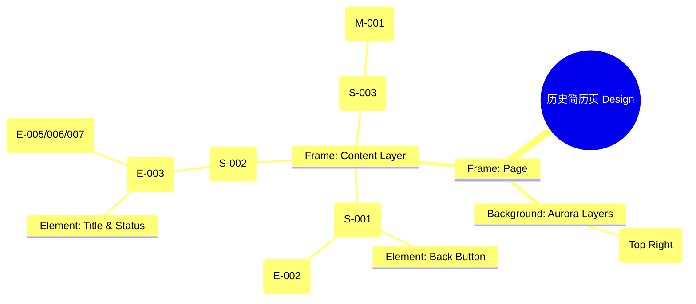

# 历史简历页 Design Release

> 输出路径：`product/release/design/100-history.md`。本文档描述页面展示内容与样式布局，不描述交互执行、埋点、接口、后端或业务处理逻辑。

# 历史简历页 Design Release

## 0. 文档状态

| 字段 | 内容 |
|---|---|
| 文档版本 | Release |
| 生成日期 | 2026-05-12 |
| 来源 Mock 文件 | `product/release/mock/100-history.md` |
| 设计约束目录 | `design/ios26-liquid-glass/` |
| 当前输出文件 | `product/release/design/100-history.md` |
| 页面名称 | 历史简历页 |
| 内容范围 | 页面展示内容 + 视觉样式 + 布局结构 + AI 可读样式结构 |
| 不包含范围 | 交互执行 / 埋点 / 接口 / 后端 / 业务流程 / 实现代码 |

## 1. 页面设计综述

| 项目 | 内容 |
|---|---|
| 页面定位 | 用户管理已生成简历的个人资产库。 |
| 目标阅读对象 | 设计师 / 产品 / Figma Remote MCP agent |
| 视觉目标 | 营造一种“有序、通透”的数据管理氛围。通过高斯模糊的搜索栏与重复的玻璃卡片，展现出内容的条理性与呼吸感。 |
| 信息层级 | 1. 搜索与导航；2. 历史记录列表（时间倒序）；3. 每项记录的操作功能（编辑/导出/删除）。 |
| 主要视觉焦点 | 位于顶部的、带有深色玻璃材质的搜索框。 |
| 设计系统应用摘要 | iOS26 Liquid Glass：背景 #000000 + 列表项玻璃材质 + 顶栏高斯模糊。 |

## 2. 设计约束提取

| 类型 | Token / 规则 | 取值 | 使用方式 | 来源文件 |
|---|---|---|---|---|
| color | background.canvas | #000000 | 页面底层背景 | DESIGN.md |
| color | accent.cyan | #32ADE6 | 分值标签颜色 | DESIGN.md |
| color | background.surface | rgba(255, 255, 255, 0.05) | 简历项卡片背景 | DESIGN.md |
| typography | size.base | 16px | 简历标题字号 | DESIGN.md |
| typography | size.xs | 12px | 时间标签字号 | DESIGN.md |
| space | space.4 | 16px | 卡片内部 Padding | DESIGN.md |
| radius | radius.md | 14px | 卡片圆角 | DESIGN.md |
| component | glassEffect.blur | blur(24px) | 搜索栏背景模糊 | DESIGN.md |

## 3. 页面结构图



## 4. 自然语言样式描述

### 4.1 整体画面

- **页面整体氛围**：整洁、有序、具有透气感。背景右上方带有一处微弱的蓝绿色 Aurora，为列表提供背景纵深。
- **背景与层级**：底层为纯黑 Canvas。搜索导航栏固定在顶部，并带有 `blur(48px)` 的极高模糊度，当列表向上滚动时，卡片会在搜索栏下方产生朦胧的流动感。
- **视觉重心**：顶部的搜索框。它采用了 `surfaceOverlay` 材质，带有 1px 的亮白边框。
- **阅读节奏**：快速搜索关键词 -> 浏览简历记录列表 -> 对特定项执行编辑或导出操作。

### 4.2 关键区块叙述

| 区块ID | 区块名称 | 展示内容摘要 | 样式叙述 | 视觉优先级 | 设计决策 |
|---|---|---|---|---|---|
| S-001 | 搜索导航区 | 标题 + 搜索框 | 采用 `backdrop-filter: blur(48px)`。搜索框圆角为 `radius.full`，左侧带有搜索图标。 | 高 | 保证在不同背景下的文字可读性。 |
| S-002 | 历史列表区 | 简历卡片流 | 卡片采用垂直堆叠布局。背景为 `surface`，分值部分使用 `accent.cyan` 强调。操作按钮采用小尺寸图标形式。 | 极高 | 核心资产展示，需极致清晰。 |
| S-003 | 空状态区 | 插画 + 引导语 | 居中展示。插画采用玻璃拟态风格（Glassmorphism Illustration），透明度较低。 | 中 | 引导用户开启第一次优化。 |

## 5. 布局与区块样式表

| 区块ID | 来源 Mock 区块 / 元素 | Frame 层级 | 布局方式 | 尺寸 / 约束 | Padding | Gap | 背景 / 边框 / 阴影 | 圆角 | 对齐 | 响应式变化 |
|---|---|---|---|---|---|---|---|---|---|---|
| Page | - | Root | Vertical | Fill Window | 0 | 0 | background.canvas | 0 | Center | - |
| S-001 | S-001 | Header | Vertical | Width: 100% | 12px 20px | 12px | surfaceOverlay + blur(48) | - | Left | Fixed Top |
| S-002 | S-002 | List | Vertical | Width: 100% | 80px 20px 20px | 12px | Transparent | - | Top | Scrollable |
| S-003 | S-003 | Section | Vertical | Fill Container | 0 | 16px | Transparent | - | Center | - |

## 6. 元素级视觉定义

| 元素ID | 来源 Mock 元素 | 元素类型 | 展示内容 | 视觉角色 | 字体 / 字号 / 字重 | 颜色 Token | 背景 / 边框 | 尺寸 / 最小尺寸 | 状态样式摘要 | Figma 节点建议 |
|---|---|---|---|---|---|---|---|---|---|---|
| E-002 | E-002 | input | 搜索简历... | filter | base / regular | text.default | surfaceMuted | H: 44px | Radius: full | Search_Bar |
| E-003 | E-003 | card | 简历项 | entry | base / medium | text.default | surface | H: 88px | Radius: md | List_Card |
| E-005 | E-005 | button | 编辑 | action | xs / medium | accent.blue | - | - | - | Small_Text_Button |
| M-001 | M-001 | image | 空状态插画 | support | - | - | Glass_Illustration | 200x200 | - | Vector_Asset |

## 7. 内容与样式绑定表

| 内容对象ID | 来源 Mock 内容 | 展示文案 / 媒体描述 | 内容来源类型 | 样式 Token 绑定 | 布局位置 | 备注 |
|---|---|---|---|---|---|---|
| C-001 | E-002-PH | 搜索简历名称或岗位 | 静态 | base, regular | Search Bar | |
| C-002 | DATA-001 | 互联网大厂产品经理 | 动态 | base, bold | Card Title | |
| C-003 | DATA-001-T | 2026.05.10 | 动态 | xs, muted | Card Subtitle | |
| C-004 | E-004 | 您还没有任何优化记录 | 静态 | base, regular | Empty Center | |

## 8. 状态展示样式

| 状态ID | 来源 Mock 状态 | 状态类型 | 展示内容 | 视觉样式 | 色彩 / 图标 / 媒体处理 | 空间占位 | 可访问性说明 |
|---|---|---|---|---|---|---|---|
| STATE-001 | STATE-001 | empty | 空状态插画 | 半透明玻璃拟态效果 | text.disabled | 居中全屏 | |
| STATE-002 | STATE-003 | loading | 列表骨架屏 | 灰色脉冲占位块 | surfaceMuted | 保持 E-003 占位 | |
| Card_Hover | - | active | 项选中 | 表面不透明度增加 | surfaceOverlay | - | |

## 9. 响应式布局规则

| 断点 | 页面宽度范围 | Frame 布局 | 导航 / Header | 主内容布局 | 列表 / 表格 / 卡片变化 | 间距调整 | 优先隐藏或折叠内容 |
|---|---|---|---|---|---|---|---|
| mobile | < 768px | Vertical | 顶部固定 | 单列列表 | - | space.4 | - |
| tablet | 768px - 1023px | Vertical | 顶部固定 | 网格布局 (2列) | - | space.5 | - |
| desktop | 1024px+ | Horizontal | 侧边栏 | 宽屏看板 | 列表项并排展示详情 | space.6 | - |

## 10. AI 可读样式结构

```yaml
page:
  id: "U-030-020"
  name: "History Page"
  source_mock: "product/release/mock/100-history.md"
  design_system: "design/ios26-liquid-glass/"
  output: "product/release/design/100-history.md"
  canvas:
    background_token: "color.background.canvas"
  background_effects:
    - type: "blur_blob"
      color: "accent.cyan"
      position: "top_right"
      size: "600px"
      blur: "180px"
      opacity: 0.1
  frames:
    - id: "frame-root"
      type: "frame"
      layout: "vertical"
      children:
        - id: "search-header"
          type: "frame"
          background: "background.surfaceOverlay"
          backdrop_filter: "blur(48px)"
          padding: 16
          children: ["E-002-search-bar"]
        - id: "list-view-scroll"
          type: "frame"
          layout: "vertical"
          padding: 20
          gap: 12
          children: ["E-003-card-items"]
  components:
    - id: "resume-history-card"
      type: "frame"
      background: "background.surface"
      backdrop_filter: "blur(24px)"
      radius: "radius.md"
      padding: 16
      layout: "horizontal"
```

## 11. Figma Remote MCP 生成提示

| 项目 | 指令 |
|---|---|
| Frame 创建顺序 | Canvas -> Background Blob -> Fixed Header -> Scroll List -> Empty State (Conditional) |
| Auto Layout 设置 | Scroll List 使用 Vertical Auto Layout, Gap 12. |
| Token 应用方式 | 搜索框应用 radius.full. 简历分值应用 accent.cyan. |
| 组件分组 | 将卡片内的标题、时间、分值编组为 "Card_Info_Group". |
| 文本节点命名 | 简历标题命名为 "Resume_Name", 日期为 "Edit_Date". |
| 响应式变体 | 在 Mobile 下将搜索栏全宽显示. |
| 生成时禁止事项 | 不生成真实的搜索筛选逻辑交互。 |

## 12. 设计决策记录

| 决策ID | 决策内容 | 依据 | 影响范围 |
|---|---|---|---|
| DD-001 | 顶栏使用高强度模糊 (blur 48px)。 | 建立深层的视觉堆叠感，确保内容滚动时的沉浸式玻璃质感。 | 头部组件 |
| DD-002 | 搜索框采用全圆角 (radius.full)。 | 区分于业务卡片，引导用户进行交互。 | 交互组件 |
| DD-003 | 空状态使用玻璃拟态插画。 | 维持品牌一致性的同时，通过艺术化的视觉元素缓解空白页面的单调感。 | 页面状态 |
 Riverside, CA
