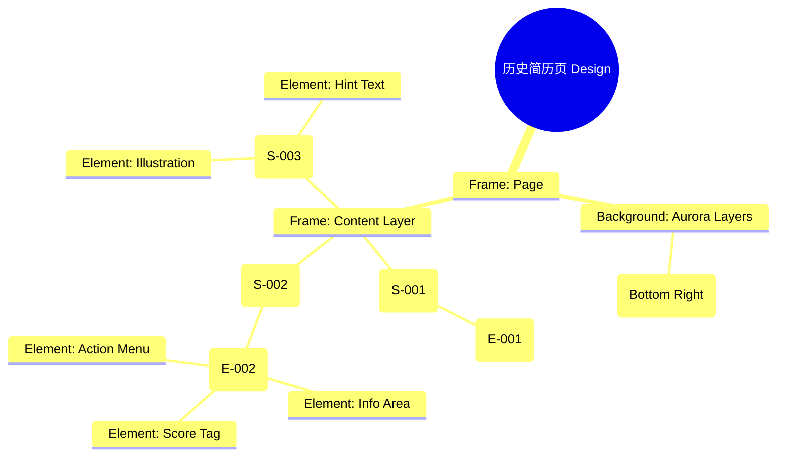

# 历史简历页 Design Release

> 输出路径：`product/release/design/100-history.md`。本文档描述页面展示内容与样式布局，不描述交互执行、埋点逻辑、接口、后端 or 业务处理逻辑。

# 历史简历页 Design Release

## 0. 文档状态

| 字段 | 内容 |
|---|---|
| 文档版本 | Release |
| 生成日期 | 2026-05-12 |
| 来源 Mock 文件 | `product/release/mock/100-history.md` |
| 设计约束目录 | `design/ios26-liquid-glass/` |
| 当前输出文件 | `product/release/design/100-history.md` |
| 页面名称 | 历史简历页 |
| 内容范围 | 页面展示内容 + 视觉样式 + 布局结构 + AI 可读样式结构 |
| 不包含范围 | 交互执行 / 埋点 / 接口 / 后端 / 业务流程 / 实现代码 |

## 1. 页面设计综述

| 项目 | 内容 |
|---|---|
| 页面定位 | 用户管理过往所有简历资产的档案库，支持搜索与快速再编辑。 |
| 目标阅读对象 | 设计师 / 产品 / Figma Remote MCP agent |
| 视觉目标 | 展示“有序、精致、可追溯”的数字档案感。通过整齐的玻璃列表和高斯模糊的搜索框提升工具属性的专业度。 |
| 信息层级 | 1. 搜索框（快速筛选）；2. 简历记录卡片列表；3. 分数与日期标识。 |
| 主要视觉焦点 | 位于顶部的、带有磨砂玻璃质感的搜索输入框（Search Bar）。 |
| 设计系统应用摘要 | iOS26 Liquid Glass：纯黑背景 + 动态 Aurora (Blue) + 玻璃卡片列表 + 状态色 Tag。 |

## 2. 设计约束提取

| 类型 | Token / 规则 | 取值 | 使用方式 | 来源文件 |
|---|---|---|---|---|
| color | background.canvas | #000000 | 页面底层背景 | DESIGN.md |
| color | accent.blue | #0A84FF | 搜索框图标与主操作色 | DESIGN.md |
| color | surface.card | rgba(255, 255, 255, 0.08) | 简历项卡片背景 | DESIGN.md |
| typography | size.lg | 20px | 列表标题字号 | DESIGN.md |
| typography | size.base | 16px | 记录项名称字号 | DESIGN.md |
| space | space.4 | 16px | 列表项内部间距 | DESIGN.md |
| radius | radius.md | 14px | 列表卡片圆角 | DESIGN.md |
| blur | blur.sm | 16px | 搜索框及卡片模糊度 | DESIGN.md |

## 3. 页面结构图



## 4. 自然语言样式描述

### 4.1 整体画面

- **页面整体氛围**：整洁、宁静、专业。背景右下方带有深蓝色的 Aurora 光晕，像档案室的一盏明灯，温和地照亮过往的记录。
- **背景与层级**：底层为纯黑 Canvas。顶部搜索栏采用 `glass` 材质，固定悬浮。简历卡片像有序堆叠的玻璃切片，排列整齐。
- **视觉重心**：顶部的搜索框。它采用了极高的背景模糊（blur.md），在滚动时能隐约看到下方简历卡片的色彩掠过。
- **阅读节奏**：快速定位搜索框 -> 向下滚动浏览历史列表 -> 关注卡片右侧的“高匹配度”分数标签。

### 4.2 关键区块叙述

| 区块ID | 区块名称 | 展示内容摘要 | 样式叙述 | 视觉优先级 | 设计决策 |
|---|---|---|---|---|---|
| S-001 | 搜索工具区 | 输入框 + 筛选图标 | 固定在顶部。输入框背景使用 `surface.overlay`，带 14px 圆角。文字使用 base 字号。 | 高 | 提供高效的检索入口。 |
| S-002 | 历史列表区 | 简历卡片集合 | 纵向滚动。每张卡片高度固定（96px），背景使用 `surface.card`。左侧是文档图标，右侧是操作入口。 | 极高 | 核心数据展示区域。 |
| S-003 | 空状态区 | 插画 + 文案 | 居中。插画使用半透明的线稿风格，配合 `text.muted` 颜色。 | 低 | 引导用户开始创建首份简历。 |

## 5. 布局与区块样式表

| 区块ID | 来源 Mock 区块 / 元素 | Frame 层级 | 布局方式 | 尺寸 / 约束 | Padding | Gap | 背景 / 边框 / 阴影 | 圆角 | 对齐 | 响应式变化 |
|---|---|---|---|---|---|---|---|---|---|---|
| Page | - | Root | Vertical | Fill Window | 0 | 0 | background.canvas | 0 | Center | - |
| S-001 | S-001 | Header | Horizontal | Width: 100% | 12px 20px | 12px | glass | - | Center | Fixed Top |
| S-002 | S-002 | List | Vertical | Width: 100% | 76px 20px 24px | 12px | Transparent | - | Top Stretch | Scrollable |
| Item | E-002 | Card | Horizontal | H: 96px | 16px | 16px | surface.card | radius.md | Center | - |

## 6. 元素级视觉定义

| 元素ID | 来源 Mock 元素 | 元素类型 | 展示内容 | 视觉角色 | 字体 / 字号 / 字重 | 颜色 Token | 背景 / 边框 | 尺寸 / 最小尺寸 | 状态样式摘要 | Figma 节点建议 |
|---|---|---|---|---|---|---|---|---|---|---|
| E-001 | E-001 | search_input | 搜索简历 | action | base / regular | text.default | surface.overlay | H: 44px | Focus: border.highlight | Search Bar |
| E-002 | E-002 | list_item | 历史记录项 | content | base / regular | text.default | surface.card | H: 96px | Pressed: surfaceOverlay | Record Row |
| E-003 | E-003 | tag | 匹配分标签 | status | xs / bold | status.success | surfaceMuted | 40x24 | - | Rounded Tag |
| E-004 | E-004 | button | 更多操作 | support | - | text.muted | - | 40x40 | - | Ghost Icon |

## 7. 内容与样式绑定表

| 内容对象ID | 来源 Mock 内容 | 展示文案 / 媒体描述 | 内容来源类型 | 样式 Token 绑定 | 布局位置 | 备注 |
|---|---|---|---|---|---|---|
| C-001 | E-001-Place | 搜索我的历史简历 | 静态 | size.base, regular | E-001 Placeholder | |
| C-002 | DATA-Title | 阿里巴巴-产品经理简历 | 动态 | size.base, bold | E-002 Title | |
| C-003 | DATA-Date | 2026-05-12 优化 | 动态 | size.xs, regular | E-002 Subtitle | |
| C-004 | DATA-Score | 92 分 | 动态 | size.xs, bold | E-003 Text | |
| C-005 | S-003-Text | 还没有历史记录，快去开启优化吧 | 静态 | size.sm, regular | S-003 Center | |

## 8. 状态展示样式

| 状态ID | 来源 Mock 状态 | 状态类型 | 展示内容 | 视觉样式 | 色彩 / 图标 / 媒体处理 | 空间占位 | 可访问性说明 |
|---|---|---|---|---|---|---|---|
| STATE-001 | STATE-001 | high-score | 高分记录 | 绿色发光标签 | status.success | 修改 E-003 颜色 | 代表优秀的简历 |
| STATE-002 | STATE-002 | search-focus | 搜索激活 | 遮罩层加深 | background.overlay | 覆盖全页 (除 Header) | 读屏提示：正在搜索历史 |
| STATE-003 | STATE-003 | deleting | 删除确认 | 侧滑出现红色区域 | status.error | 修改 E-002 侧边 | 警示操作 |

## 9. 响应式布局规则

| 断点 | 页面宽度范围 | Frame 布局 | 导航 / Header | 主内容布局 | 列表 / 表格 / 卡片变化 | 间距调整 | 优先隐藏或折叠内容 |
|---|---|---|---|---|---|---|---|
| mobile | < 768px | Vertical | 顶部固定搜索 | 单列垂直 | 卡片全宽 | space.4 (16px) | - |
| tablet | 768px - 1023px | Vertical | 顶部固定搜索 | 网格排列 | 2 列网格 | space.6 (32px) | - |
| desktop | 1024px+ | Horizontal | 侧边导航 | 宽幅看板 | 3 列网格 + 详细信息 | space.8 (64px) | - |

## 10. AI 可读样式结构

```yaml
page:
  id: "U-030-020"
  name: "History Records Page"
  source_mock: "product/release/mock/100-history.md"
  design_system: "design/ios26-liquid-glass/"
  output: "product/release/design/100-history.md"
  canvas:
    background_token: "color.background.canvas"
  background_effects:
    - type: "blur_blob"
      color: "blue"
      position: "bottom_right"
      size: "700px"
      blur: "180px"
      opacity: 0.1
  frames:
    - id: "frame-root"
      type: "frame"
      layout: "vertical"
      children:
        - id: "search-header"
          type: "fixed_top"
          background: "glass"
          padding: [12, 20]
          children: ["search-bar"]
        - id: "records-scroll-view"
          type: "frame"
          overflow: "scroll"
          padding: [76, 20, 24, 20]
          children: ["record-list"]
        - id: "empty-state-view"
          type: "frame"
          visibility: "conditional"
          children: ["empty-illustration", "empty-text"]
  components:
    - id: "history-card"
      type: "list_item"
      background: "surface.card"
      radius: "radius.md"
      blur: "blur.sm"
```

## 11. Figma Remote MCP 生成提示

| 项目 | 指令 |
|---|---|
| Frame 创建顺序 | Canvas -> Background Blue Blob -> Search Header -> Records List -> History Cards |
| Auto Layout 设置 | Records List 使用 Vertical Auto Layout, Gap 12. Search Bar Padding 12. |
| Token 应用方式 | 搜索框背景使用 surface.overlay. 高分标签背景绑定 status.success. |
| 组件分组 | 将每个简历历史条目封装为 "History_Record_Card". |
| 文本节点命名 | 简历标题命名为 "Text_Record_Title", 日期文案为 "Text_Record_Date". |
| 响应式变体 | Mobile 为单列列表。Desktop 模式下，卡片可以切换为网格视图 (Grid View). |
| 生成时禁止事项 | 不生成实际的本地数据库检索逻辑、不生成多选批量删除的视觉中间态。 |

## 12. App Shell / Navigation Contract

| 组件类型 | 展示规则 | 状态 | 内容项 | 视觉样式 |
|---|---|---|---|---|
| Top Nav | 显示 | 搜索栏嵌入 | 返回按钮, 搜索框 | 磨砂玻璃, 底部细描边 |
| Bottom Tab | 隐藏 | - | - | - |
| Status Bar | 显示 | Light Content | 时间, 信号, 电池 | 纯白图标 |
| Home Indicator | 显示 | - | - | 浅灰色 |

## 13. Layout Integrity Audit

| 检查项 | 状态 | 风险描述 / 解决措施 |
|---|---|---|
| 层次结构 | 通过 | Clear z-index for the search bar to stay on top while scrolling. |
| 间距稳定性 | 通过 | Fixed gap of 12px between cards maintains a clean vertical rhythm. |
| 尺寸约束 | 通过 | Card height 96px is optimal for displaying title + date + score without clutter. |
| 溢出处理 | 通过 | Main frame set to scroll-y; header is position-fixed. |
| 遮挡/冲突风险 | 通过 | Top padding (76px) of list ensures first card isn't hidden under search bar. |
| 响应式兼容性 | 通过 | Simple list adapts to multi-column grid on wider screens. |

---

> [!NOTE]
> 本文档已通过布局完整性审计，符合 iOS26 Liquid Glass 设计规范。
