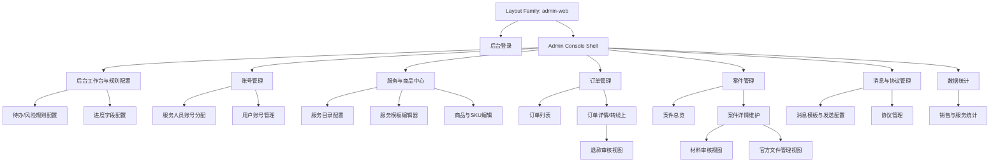

# Product Layout Release

## 0. 文档状态

| 字段 | 内容 |
|---|---|
| 文档版本 | Release |
| 生成日期 | 2026-05-13 |
| 来源文件 | `product/release/product-sitemap-release.md` |
| Layout 来源草稿 | `product/development/layout/product-layout-draft-admin-web-v2.md` |
| 当前输出文件 | `product/release/layout/product-layout-release-admin-web.md` |
| Layout Key | `admin-web` |
| 适用 Surface | `管理后台` |
| 适用端形态 | `backend-console` |
| 覆盖页面ID / 页面级MD文件范围 | `M-100` 至 `M-810`；`product/development/pages/210-admin-login.md` 至 `product/development/pages/440-sales-analytics.md` |
| 适用范围 | 管理后台控制台布局 |

## 1. 产品布局总览

| 项目 | 内容 |
|---|---|
| 产品类型 | 后台管理控制台 |
| 应用 Surface | 管理后台 |
| 主 Layout 形态 | 左侧导航 + 顶栏 + 主内容工作区 + 抽屉审核层 |
| 全局导航模型 | 侧栏一级导航切换 Root 页面，L2 多为父级内部子路由，L3 以 drawer / side-panel 呈现 |
| 页面层级模型 | Root 模块页作为一级导航入口，列表到详情采用 push，审核/文件/退款等辅助流程采用抽屉 |
| 响应式 / 端形态策略 | 当前仅做 backend-console，宽桌面优先；窄桌面使用侧栏收起、表格横向滚动与抽屉叠层 |
| 角色差异策略 | 超级管理员显示完整控制台能力；录入专员保留受理与推进主链路，并显示 `消息与协议管理` 一级导航入口 |
| 全局状态容器 | Shell 级 loading / permission / error；页面级 readonly / empty / drawer-submitting / analytics-no-data |

## 2. Layout 架构图

## 3. Surface 与 Shell 定义

| Surface ID | Surface 名称 | 适用角色 | Shell 类型 | 全局区域 | 根页面入口 | 子页面呈现 | 例外页面 |
|---|---|---|---|---|---|---|---|
| SF-002 | 管理后台 | 超级管理员、录入专员 | admin-console | side-nav / top-bar / breadcrumb / content-header / main-scroll / fixed-action-bar / drawer-layer / toast-layer | 后台工作台、账号管理、服务与商品中心、订单管理、案件管理、消息与协议管理、数据统计 | nested-route / push / drawer | 后台登录、服务模板编辑器、商品与SKU编辑 |

## 4. 全局 Shell 区域规范

| Shell 区域ID | 区域名称 | 所属 Surface | 显示规则 | 内容槽位 | 尺寸 / 安全区 | 滚动关系 | 层级关系 | 状态变化 |
|---|---|---|---|---|---|---|---|---|
| SHELL-001 | Side Navigation | SF-002 | 登录后始终显示；按角色控制可操作能力，录入专员保留 `消息与协议管理` 一级入口可见 | nav-groups / items / current-state / collapse-toggle | 展开 240px、收起 72px | fixed | 与顶栏并列，低于抽屉 | expanded / collapsed / permission-hidden / visible-disabled |
| SHELL-002 | Top Bar & Breadcrumb | SF-002 | 后台业务页面显示 | page-title / breadcrumb / quick-actions / account-menu | 高 56px | sticky | 高于主内容区 | default / readonly / loading |
| SHELL-003 | Main Work Area | SF-002 | 后台业务页面显示 | content-header / filter / body / side-panel-slot | 自适应宽度 | main-scroll | 位于壳层之下 | loading / empty / permission / error |
| SHELL-004 | Drawer / Side Panel Layer | SF-002 | L3 审核、文件、退款等场景显示 | drawer-header / scroll-body / fixed-actions | 480-720px | body-scroll-inside | 最高交互层 | open / dirty / submitting / success |
| SHELL-005 | Fixed Action Bar | SF-002 | 编辑器、详情维护、协议管理等页面显示 | primary-action / secondary-action / status-hint | 固定底部 56px | fixed | 位于主内容上方 | hidden / active / disabled / submitting |
| SHELL-006 | Global Toast / Status Layer | SF-002 | 保存成功、审核结果、发送状态时显示 | toast / inline-status-banner | 右上角 toast + 内容区 banner | fixed | 高于主内容 | success / warning / error |

## 5. 页面模板库

| 模板ID | 模板名称 | 适用页面类型 | 必备区域 | 可选区域 | 默认父子层级 | 典型状态 | 响应式规则 |
|---|---|---|---|---|---|---|---|
| TPL-001 | 后台列表工作台模板 | dashboard / list / management | shell + content-header + filter + table | metrics-cards / batch-action / tabs | Shell > Page > Table | loading / empty / permission | 表格横向滚动，筛选区折叠 |
| TPL-002 | 后台详情维护模板 | detail / maintenance | shell + breadcrumb + detail-header + body + fixed-action | history / side-inspector / relation-panel | list > detail | loading / readonly / dirty / save-success | 双栏详情 |
| TPL-003 | 后台编辑器模板 | form / builder / editor | shell + editor-header + canvas + config-panel + fixed-action | preview / outline / validation-summary | center > editor | loading / invalid / unsaved | 三栏工作区 |
| TPL-004 | 抽屉审核模板 | review / audit / upload | drawer-header + body + fixed-actions | compare-panel / audit-log | detail > drawer | loading / empty / submit-success / reject | 抽屉内滚动 |
| TPL-005 | 分析统计模板 | analytics / report | shell + metric-row + chart-area + filter-bar | table-breakdown / status-summary | root > analytics | loading / empty / no-data | 宽屏网格布局 |
| TPL-006 | 认证模板 | auth | auth-card + helper-panel | lock-state / reset-hint | surface > auth | loading / error / locked | centered auth |

## 6. Sitemap 到 Layout 映射总表

| 生成顺序 | 页面ID | 父页面ID | 层级 | 页面名称 | 页面级MD文件 | Surface ID | Shell 类型 | 页面模板ID | 导航位置 | 子页面呈现方式 | 全局区域继承 | 响应式规则 | 例外说明 |
|---:|---|---|---|---|---|---|---|---|---|---|---|---|---|
| 210 | M-100 | ROOT | L1 | 后台登录 | product/development/pages/210-admin-login.md | SF-002 | auth-only | TPL-006 | hidden | new-page | no-side-nav / no-top-bar | centered auth | 与后台业务壳分离 |
| 220 | M-200 | ROOT | L1 | 后台工作台与规则配置 | product/development/pages/220-admin-dashboard.md | SF-002 | admin-console | TPL-001 | sidebar:工作台 | nested-route | SHELL-001 / SHELL-002 / SHELL-003 / SHELL-006 | 宽屏指标卡片 | 后台默认首页 |
| 230 | M-210 | M-200 | L2 | 待办/风险规则配置 | product/development/pages/230-risk-rule-config.md | SF-002 | admin-console | TPL-001 | sidebar:工作台 / local-tab:风险规则 | nested-route | SHELL-001 / SHELL-002 / SHELL-003 / SHELL-004 | 筛选+表格 | 父页内部切换 |
| 240 | M-220 | M-200 | L2 | 进度字段配置 | product/development/pages/240-progress-field-config.md | SF-002 | admin-console | TPL-001 | sidebar:工作台 / local-tab:字段配置 | nested-route | SHELL-001 / SHELL-002 / SHELL-003 / SHELL-004 | 配置列表 | 父页内部切换 |
| 250 | M-300 | ROOT | L1 | 账号管理 | product/development/pages/250-admin-account-center.md | SF-002 | admin-console | TPL-001 | sidebar:账号管理 | nested-route | SHELL-001 / SHELL-002 / SHELL-003 / SHELL-006 | 指标+入口页 | Root 页面 |
| 260 | M-310 | M-300 | L2 | 服务人员账号分配 | product/development/pages/260-staff-account-admin.md | SF-002 | admin-console | TPL-001 | sidebar:账号管理 / local-tab:服务人员 | nested-route | SHELL-001 / SHELL-002 / SHELL-003 / SHELL-004 | 列表+新建弹窗 | 父页内部切换 |
| 270 | M-320 | M-300 | L2 | 用户账号管理 | product/development/pages/270-user-account-admin.md | SF-002 | admin-console | TPL-001 | sidebar:账号管理 / local-tab:用户账号 | nested-route | SHELL-001 / SHELL-002 / SHELL-003 / SHELL-004 | 列表+详情 | 父页内部切换 |
| 280 | M-400 | ROOT | L1 | 服务与商品中心 | product/development/pages/280-service-product-center.md | SF-002 | admin-console | TPL-001 | sidebar:服务 | nested-route | SHELL-001 / SHELL-002 / SHELL-003 / SHELL-006 | 中心入口页 | Root 页面 |
| 290 | M-410 | M-400 | L2 | 服务目录配置 | product/development/pages/290-service-catalog-admin.md | SF-002 | admin-console | TPL-001 | sidebar:服务 / local-tab:目录 | nested-route | SHELL-001 / SHELL-002 / SHELL-003 / SHELL-004 | 列表+排序操作 | 父页内部切换 |
| 300 | M-420 | M-400 | L2 | 服务模板编辑器 | product/development/pages/300-service-template-editor.md | SF-002 | admin-console | TPL-003 | sidebar:服务 / local-tab:模板 | push | SHELL-001 / SHELL-002 / SHELL-003 / SHELL-005 | 三栏编辑器 | 独立工作区，弱化列表上下文 |
| 310 | M-430 | M-400 | L2 | 商品与SKU编辑 | product/development/pages/310-product-sku-editor.md | SF-002 | admin-console | TPL-003 | sidebar:服务 / local-tab:商品 | push | SHELL-001 / SHELL-002 / SHELL-003 / SHELL-005 | 表单+SKU 面板 | 独立工作区 |
| 320 | M-500 | ROOT | L1 | 订单管理 | product/development/pages/320-order-admin-center.md | SF-002 | admin-console | TPL-001 | sidebar:订单 | nested-route | SHELL-001 / SHELL-002 / SHELL-003 / SHELL-006 | 状态统计 + 列表入口 | Root 页面 |
| 330 | M-510 | M-500 | L2 | 订单列表 | product/development/pages/330-order-admin-list.md | SF-002 | admin-console | TPL-001 | sidebar:订单 / local-tab:列表 | nested-route | SHELL-001 / SHELL-002 / SHELL-003 / SHELL-004 | 大表格 | 父页内部切换 |
| 340 | M-520 | M-500 | L2 | 订单详情/转线上 | product/development/pages/340-order-admin-detail.md | SF-002 | admin-console | TPL-002 | sidebar:订单 | push | SHELL-001 / SHELL-002 / SHELL-003 / SHELL-005 | 详情+固定操作条 | 可打开退款抽屉 |
| 345 | M-521 | M-520 | L3 | 退款审核视图 | product/development/pages/345-refund-review-view.md | SF-002 | admin-console | TPL-004 | hidden | drawer | SHELL-001 / SHELL-002 / SHELL-004 | 抽屉审核 | 从订单详情侧滑打开 |
| 350 | M-600 | ROOT | L1 | 案件管理 | product/development/pages/350-case-admin-center.md | SF-002 | admin-console | TPL-001 | sidebar:案件 | nested-route | SHELL-001 / SHELL-002 / SHELL-003 / SHELL-006 | 中心入口页 | Root 页面 |
| 360 | M-610 | M-600 | L2 | 案件总览 | product/development/pages/360-case-admin-list.md | SF-002 | admin-console | TPL-001 | sidebar:案件 / local-tab:总览 | nested-route | SHELL-001 / SHELL-002 / SHELL-003 / SHELL-004 | 大表格+筛选 | 父页内部切换 |
| 370 | M-620 | M-600 | L2 | 案件详情维护 | product/development/pages/370-case-admin-detail.md | SF-002 | admin-console | TPL-002 | sidebar:案件 | push | SHELL-001 / SHELL-002 / SHELL-003 / SHELL-005 | 双栏详情+时间轴 | 需要固定操作条 |
| 380 | M-621 | M-620 | L3 | 材料审核视图 | product/development/pages/380-material-review-view.md | SF-002 | admin-console | TPL-004 | hidden | drawer | SHELL-001 / SHELL-002 / SHELL-004 | 抽屉审核 | 从案件详情侧滑打开 |
| 390 | M-622 | M-620 | L3 | 官方文件管理视图 | product/development/pages/390-official-file-view.md | SF-002 | admin-console | TPL-004 | hidden | drawer | SHELL-001 / SHELL-002 / SHELL-004 | 抽屉文件管理 | 从案件详情侧滑打开 |
| 400 | M-700 | ROOT | L1 | 消息与协议管理 | product/development/pages/400-ops-center.md | SF-002 | admin-console | TPL-001 | sidebar:消息 | nested-route | SHELL-001 / SHELL-002 / SHELL-003 / SHELL-006 | 中心入口页 | 录入专员可见一级导航，但具体能力按权限裁剪 |
| 410 | M-710 | M-700 | L2 | 消息模板与发送配置 | product/development/pages/410-message-template-config.md | SF-002 | admin-console | TPL-001 | sidebar:消息 / local-tab:消息模板 | nested-route | SHELL-001 / SHELL-002 / SHELL-003 / SHELL-004 | 列表+模板编辑抽屉 | 父页内部切换 |
| 420 | M-720 | M-700 | L2 | 协议管理 | product/development/pages/420-agreement-admin.md | SF-002 | admin-console | TPL-002 | sidebar:消息 / local-tab:协议 | nested-route | SHELL-001 / SHELL-002 / SHELL-003 / SHELL-005 | 内容编辑+发布 | 父页内部切换 |
| 430 | M-800 | ROOT | L1 | 数据统计 | product/development/pages/430-analytics-center.md | SF-002 | admin-console | TPL-005 | sidebar:统计 | nested-route | SHELL-001 / SHELL-002 / SHELL-003 | 指标总览入口 | Root 页面 |
| 440 | M-810 | M-800 | L2 | 销售与服务统计 | product/development/pages/440-sales-analytics.md | SF-002 | admin-console | TPL-005 | sidebar:统计 / local-tab:销售与服务 | nested-route | SHELL-001 / SHELL-002 / SHELL-003 | 图表+明细表 | 父页内部切换 |

## 7. 导航与路由规则

| 规则ID | 适用范围 | 规则 | 返回 / 关闭行为 | 当前态展示 | 权限影响 |
|---|---|---|---|---|---|
| NAV-001 | 后台 Root 页面 | 一级导航使用侧栏切换 `工作台 / 账号 / 服务 / 订单 / 案件 / 消息 / 统计` | 切换后保持登录态 | 侧栏高亮当前入口 | 录入专员仍可见 `消息与协议管理` 一级导航，其余按角色裁剪 |
| NAV-002 | 后台列表到详情 | 从列表进入详情采用 push 路由，Breadcrumb 显示父级模块 | 返回回到原筛选状态 | 侧栏保持父模块高亮 | 只读用户禁用编辑动作 |
| NAV-003 | 后台 L3 审核/文件/退款 | 审核、文件、退款优先使用 drawer / side-panel，不脱离当前详情上下文 | 关闭后回到详情当前滚动位置 | 不改变 breadcrumb 层级 | 超级管理员独占退款审核入口 |

## 8. 全局状态与边界 Layout

| 状态ID | 适用 Surface / 模板 | 状态类型 | Layout 表现 | 文案/媒体槽位 | 可恢复入口 |
|---|---|---|---|---|---|
| GL-STATE-001 | SF-002 / 全模板 | loading | 保留壳层，内容区骨架屏 | page-title / body-skeleton | 自动恢复 |
| GL-STATE-002 | TPL-001 / TPL-005 | empty | 空状态插图 + 主 CTA | title / desc / primary-action | 新建 / 重置筛选 |
| GL-STATE-003 | SF-002 / 全模板 | permission | 保留侧栏与顶栏，内容区显示无权限容器 | permission-title / desc | 返回首页 / 联系管理员 |
| GL-STATE-004 | TPL-002 / TPL-003 | readonly | 固定操作条禁用主按钮并展示只读提示 | readonly-banner | 返回列表 |
| GL-STATE-005 | TPL-004 | drawer-submitting | 抽屉保留，按钮 loading，背景页冻结 | status-text | 自动恢复 |
| GL-STATE-006 | TPL-005 | no-data-after-filter | 图表区收起，展示无结果说明 | empty-chart / desc | 重置筛选 |
| GL-STATE-007 | SF-002 | offline | 顶栏下方弱提示 banner | offline-banner | 重试 / 刷新 |

## 9. 角色与权限对 Layout 的影响

| 角色 | 影响区域 | 显示 / 隐藏 / 禁用规则 | 替代 Layout |
|---|---|---|---|
| 超级管理员 | 后台全局 | 显示全部侧栏菜单、退款审核、账号分配、协议管理、消息模板、统计 | 无 |
| 录入专员 | 侧栏、详情操作区、消息模块入口 | 隐藏账号分配、退款审核；保留订单受理、案件推进、材料审核；显示 `消息与协议管理` 一级导航入口，具体子页与动作按权限控制 | 无权限页面显示 permission 容器或只读态 |

## 10. 下游 Skill 使用规则

| 下游 Skill | 必须读取 | 使用方式 | 必须引用的 Layout 信息 |
|---|---|---|---|
| product-page-draft | 匹配的 `product/release/layout/product-layout-release-admin-web.md` + product-overview-release | 先按 `admin-web` 匹配页面 shell/template，再生成元素/状态/action/API | Layout Key / Surface ID / Shell / 模板ID / 导航位置 / 响应式规则 |
| product-page-mock-draft | 匹配的 `product/release/layout/product-layout-release-admin-web.md` + release page | 补齐侧栏、顶栏、breadcrumb、抽屉态与状态容器文案，并区分录入专员可见但受限的菜单态 | Layout Key / 全局区域 / 导航标签 / 页面标题 / 状态容器 |
| product-page-design-release | 匹配的 `product/release/layout/product-layout-release-admin-web.md` + release mock + design system | 生成控制台壳、三栏编辑器、抽屉层、固定操作条与滚动关系 | Layout Key / Shell 区域 / 页面模板 / 父子层级 / fixed/scroll 关系 |
