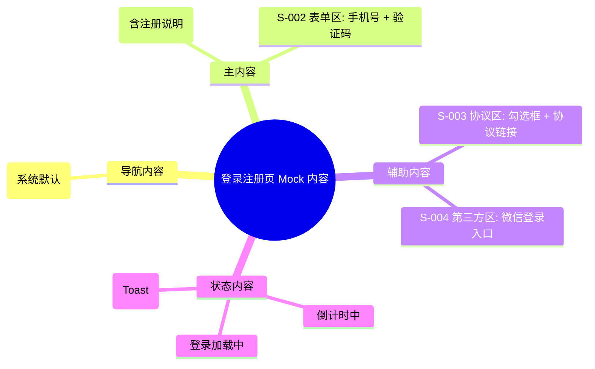

# 登录注册页 Mock Release

> 输出路径：`product/release/mock/010-login.md`。本文档只描述页面展示内容与 mock 数据，不描述交互执行、埋点、接口调用或业务执行逻辑。

# 登录注册页

## 0. Mock 文档状态

- 文档版本：Release
- 生成日期：2026-05-12
- 来源页面文件：`product/release/pages/010-login.md`
- 当前输出文件：`product/release/mock/010-login.md`
- 页面名称：登录注册页
- 内容范围：页面展示内容 / mock 数据 / 多状态文案 / 静态或动态来源标注
- 不包含范围：交互动作执行、埋点逻辑、接口定义、业务处理逻辑
- 必须对照的来源表：
  - `页面布局与内容区块`
  - `页面元素清单`
  - `元素状态矩阵`
  - `交互 Action 与执行效果`

## 1. 页面内容概览

| 项目 | 内容 |
|---|---|
| 页面定位 | App 身份验证入口，引导用户登录或快速注册。 |
| 主要用户 | 游客、未登录用户、Token 过期用户。 |
| 核心展示目标 | 简洁、专业、品牌感强。 |
| 内容语气 | 中性、专业。 |
| 主要动态数据来源 | 接口返回 / 用户输入 |

## 2. 来源对照矩阵

| 来源表 | 来源行ID | 来源名称 / 状态 / Action | 是否已映射 | 映射到 Mock 章节 | 映射对象ID | 未映射原因 |
|---|---|---|---|---|---|---|
| 页面布局与内容区块 | S-001 | 品牌展示区 | 是 | 4. 区块级内容描述 | S-001 | |
| 页面布局与内容区块 | S-002 | 登录表单区 | 是 | 4. 区块级内容描述 | S-002 | |
| 页面布局与内容区块 | S-003 | 协议与操作区 | 是 | 4. 区块级内容描述 | S-003 | |
| 页面布局与内容区块 | S-004 | 第三方登录区 | 是 | 4. 区块级内容描述 | S-004 | |
| 页面元素清单 | E-001 | App Logo | 是 | 5. 元素内容清单 | E-001 | |
| 页面元素清单 | E-002 | 欢迎标题 | 是 | 5. 元素内容清单 | E-002 | |
| 页面元素清单 | E-003 | 手机号输入框 | 是 | 5. 元素内容清单 | E-003 | |
| 页面元素清单 | E-004 | 验证码输入框 | 是 | 5. 元素内容清单 | E-004 | |
| 页面元素清单 | E-005 | 获取验证码按钮 | 是 | 5. 元素内容清单 | E-005 | |
| 页面元素清单 | E-006 | 协议勾选框 | 是 | 5. 元素内容清单 | E-006 | |
| 页面元素清单 | E-007 | 登录按钮 | 是 | 5. 元素内容清单 | E-007 | |
| 页面元素清单 | E-008 | 微信登录按钮 | 是 | 5. 元素内容清单 | E-008 | |
| 元素状态矩阵 | E-005 / 倒计时 | 倒计时状态 | 是 | 8. 状态文案与内容差异 | STATE-001 | |
| 元素状态矩阵 | E-007 / 禁用 | 协议未勾选 | 是 | 8. 状态文案与内容差异 | STATE-002 | |
| 交互 Action 与执行效果 | ACT-001 | 发送验证码 | 是 | 9. Action 可见内容映射 | AM-001 | |
| 交互 Action 与执行效果 | ACT-002 | 提交登录 | 是 | 9. Action 可见内容映射 | AM-002 | |

## 3. 页面内容结构图

## 4. 区块级内容描述

| 区块ID | 来源区块ID | 区块名称 | 展示目的 | 主要内容 | 内容来源类型 | 动态来源说明 | 状态差异 |
|---|---|---|---|---|---|---|---|
| S-001 | S-001 | 品牌展示区 | 建立第一视觉印象 | Logo 及品牌欢迎文案（含“未注册手机号验证后自动创建账户”） | 静态 | | |
| S-002 | S-002 | 登录表单区 | 用户输入身份信息 | 手机号输入框、验证码输入及获取按钮 | 动态 | 用户输入 | 倒计时中 |
| S-003 | S-003 | 协议与操作区 | 合规性告知与提交动作 | 协议勾选、登录/注册按钮 | 静态 | | 禁用/加载态 |
| S-004 | S-004 | 第三方登录区 | 多元化登录选项 | 微信快速登录按钮 | 静态 | | |

## 5. 元素内容清单

| 元素ID | 来源元素ID | 元素名称 | 元素类型 | 所属区块 | 展示内容 | 内容来源类型 | 动态来源说明 | 默认状态内容 | 空状态内容 | 加载状态内容 | 错误状态内容 | 禁用 / 无权限内容 |
|---|---|---|---|---|---|---|---|---|---|---|---|---|
| E-001 | E-001 | App Logo | image | S-001 | 资源 M-001 (品牌图标) | 静态 | | 正常展示 | | | | |
| E-002 | E-002 | 欢迎标题 | text | S-001 | 欢迎使用 AI 简历优化 (未注册手机号验证后自动创建账户) | 静态 | | 24px, #333 | | | | |
| E-003 | E-003 | 手机号输入框 | input | S-002 | 手机号文本 | 动态 | 用户输入 | 占位符: 请输入手机号 | | | 边框变红 | |
| E-004 | E-004 | 验证码输入框 | input | S-002 | 6位数字 | 动态 | 用户输入 | 占位符: 请输入验证码 | | | 边框变红 | |
| E-005 | E-005 | 获取验证码按钮 | button | S-002 | 获取验证码 / 倒计时文字 | 动态 | 系统状态 | 获取验证码 | | | | 灰色文字 |
| E-006 | E-006 | 协议勾选框 | checkbox | S-003 | 我已阅读并同意《用户协议》和《隐私政策》 | 静态 | | 未勾选 | | | | |
| E-007 | E-007 | 登录按钮 | button | S-003 | 登录 / 注册 | 静态 | | 正常按钮 | | 正在登录... | | 半透明按钮 |
| E-008 | E-008 | 微信登录按钮 | button | S-004 | 微信图标按钮 | 静态 | | 绿色图标 | | | | |

## 6. 表单与选项 Mock 内容

| 表单ID | 字段 / 控件ID | 字段名称 | 控件类型 | Label 文案 | Placeholder / 默认值 | 选项内容 | 帮助说明 | 校验提示展示文案 | 内容来源类型 | 动态来源说明 |
|---|---|---|---|---|---|---|---|---|---|---|
| FORM-001 | E-003 | 手机号 | input | 无 | 请输入手机号 | | | 手机号格式不正确 | 动态 | 用户输入 |
| FORM-001 | E-004 | 验证码 | input | 无 | 请输入验证码 | | | 验证码错误，请重新输入 | 动态 | 用户输入 |

## 7. 列表 / 卡片 / 表格 Mock 数据

> 本页面无列表/表格展示内容。

## 8. 图片 / 音视频 / 多媒体内容

| 资源ID | 资源类型 | 使用位置 | 展示内容描述 | 替代文本 / 标题 | Caption / 说明文案 | 缩略图 / 封面描述 | 不同状态展示 | 内容来源类型 | 动态来源说明 |
|---|---|---|---|---|---|---|---|---|---|
| M-001 | image | E-001 | 圆角品牌图标 | App Logo | | | | 静态 | |
| M-002 | icon | E-008 | 微信气泡图标 | 微信登录 | | | | 静态 | |

## 9. 状态文案与内容差异

| 状态ID | 来源元素ID | 来源状态 | 状态类型 | 触发场景说明 | 页面展示文本 | 主要元素内容变化 | 图片 / 多媒体变化 | 用户可见提示 | 内容来源类型 | 动态来源说明 |
|---|---|---|---|---|---|---|---|---|---|---|
| STATE-001 | E-005 | 倒计时 | 加载 | 点击获取验证码后 | 59s 后重新获取 | 文字动态递减 | 无 | | 动态 | 系统状态 |
| STATE-002 | E-007 | 禁用 | 禁用 | 未勾选协议或信息不全 | 登录 / 注册 | 按钮背景色变浅 | 无 | 请先勾选并同意用户协议 | 静态 | |
| STATE-003 | E-007 | 加载中 | 加载 | 提交登录请求中 | 正在登录... | 文字变化 + 菊花转动 | 无 | | 静态 | |
| STATE-004 | E-001 | 默认 | 默认 | 页面首屏 | 欢迎使用 AI 简历优化 (未注册手机号验证后自动创建账户) | | | | 静态 | |

## 10. Action 可见内容映射

| 映射ID | 来源ActionID | 触发元素ID | Action 名称 | 用户可见内容变化 | 成功可见文案 | 失败可见文案 | 跳转 / 弹窗 / Toast 展示内容 | 内容来源类型 | 动态来源说明 |
|---|---|---|---|---|---|---|---|---|---|
| AM-001 | ACT-001 | E-005 | 发送验证码 | 按钮进入倒计时 | 验证码已发送 | 发送失败，请稍后重试 | Toast: 验证码已发送至您的手机 | 静态 | |
| AM-002 | ACT-002 | E-007 | 提交登录 | 按钮显示加载态 | | 验证码错误 | Toast: 验证码错误，请重新输入 | 静态 | |

## 11. 内容来源汇总

| 内容对象 | 静态内容 | 动态内容 | 动态来源说明 | 是否需要用户确认 |
|---|---|---|---|---|
| 品牌文案 | 欢迎使用 AI 简历优化 | | | 否 |
| 注册提示 | 未注册手机号验证后自动创建账户 | | | 否 |
| 协议文案 | 我已阅读并同意《用户协议》和《隐私政策》 | | | 否 |
| 按钮文案 | 登录 / 注册、获取验证码 | | | 否 |
| 输入内容 | | 手机号、验证码 | 用户输入 | 否 |
| 状态反馈 | | 倒计时文字 | 系统状态 | 否 |
