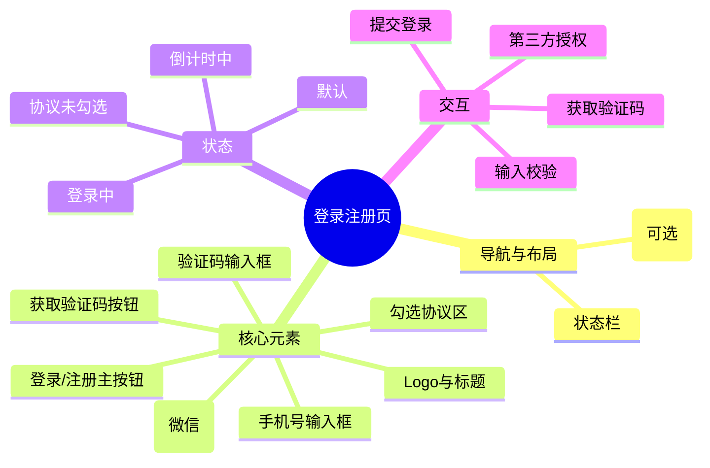

# 登录注册页

## 0. 页面文档状态

- 文档版本：Release
- 生成日期：2026-05-12
- 来源文件：`product/release/product-overview-release.md`
- 来源 Sitemap 行：
  - 生成顺序：10
  - 页面ID：U-010
  - 父页面ID：ROOT
  - 层级：L1
  - Surface：用户端App
  - Layout 区域：独立页
  - 页面名称：登录注册页
  - 页面类型：登录注册

## 1. 页面目标与上下文

### 1.1 页面目标

- 页面目的：提供用户身份验证入口，支持手机号与第三方登录。
- 用户目标：快速登录或注册，以便进入 App 使用核心功能。
- 业务目标：获取用户信息，建立用户账户，沉淀用户基础数据。
- 页面成功标准：用户成功登录并跳转至首页。

### 1.2 页面入口与出口

| 类型 | 来源 / 去向 | 触发条件 | 传入 / 传出数据 | 备注 |
|---|---|---|---|---|
| 入口 | 启动页 / 强登录拦截 | 首次打开或 token 过期 | 无 | App 采用强登录机制，不登录无法访问核心功能 |
| 出口 | 首页 | 登录成功 | 用户 Token、基本信息 | 跳转至 U-020 |
| 出口 | 用户协议页 | 点击协议链接 | 协议类型 | |
| 出口 | 隐私政策页 | 点击隐私链接 | 协议类型 | |

### 1.3 角色与权限

| 角色 | 是否可访问 | 权限条件 | 不满足时页面表现 |
|---|---|---|---|
| 游客 | 是 | 无 | 正常展示 |
| 已登录用户 | 否 | token 有效 | 自动跳转至首页 |

### 1.4 全局页面属性

| 属性 | 类型 | 来源 | 默认值 | 影响元素 / 状态 | 说明 |
|---|---|---|---|---|---|
| agreement_checked | boolean | local state | false | 登录按钮状态 | 是否勾选协议 |
| countdown | number | local state | 0 | 获取验证码按钮 | 验证码倒计时 |

## 2. 页面结构思维导图

## 3. 页面布局与内容区块

| 区块ID | 区块名称 | 区块类型 | 展示条件 | 包含元素ID | 布局 / 样式定义 | 数据来源 |
|---|---|---|---|---|---|---|
| S-001 | 品牌展示区 | content | 总是展示 | E-001, E-002 | 居中，上方留白 | 本地 |
| S-002 | 登录表单区 | content | 总是展示 | E-003, E-004, E-005, E-007 | 垂直布局，间距 16px | 用户输入 |
| S-003 | 协议与操作区 | footer | 总是展示 | E-006, E-007 | 居中或靠左 | 本地 |
| S-004 | 第三方登录区 | footer | 总是展示 | E-008 | 底部固定或在表单下方 | 微信接口 |

## 4. 页面元素清单

| 元素ID | 元素名称 | 元素类型 | 所属区块 | 是否必需 | 展示条件 | 默认文案 / 内容 | 样式定义 | 数据绑定 |
|---|---|---|---|---|---|---|---|---|
| E-001 | App Logo | image | S-001 | 是 | 总是展示 | Logo 图标 | 80x80, 圆角 | 无 |
| E-002 | 欢迎标题 | text | S-001 | 是 | 总是展示 | 欢迎使用 AI 简历优化 | 24px, 加粗 | 无 |
| E-003 | 手机号输入框 | input | S-002 | 是 | 总是展示 | 请输入手机号 | 11位数字校验 | phone_number |
| E-004 | 验证码输入框 | input | S-002 | 是 | 总是展示 | 请输入验证码 | 6位数字校验 | verify_code |
| E-005 | 获取验证码按钮 | button | S-002 | 是 | 总是展示 | 获取验证码 | 幽灵按钮样式 | countdown |
| E-006 | 协议勾选框 | checkbox | S-003 | 是 | 总是展示 | 未选中 | 圆形勾选框 | agreement_checked |
| E-007 | 登录按钮 | button | S-003 | 是 | 总是展示 | 登录 / 注册 | 品牌主色，圆角 | 无 |
| E-008 | 微信登录按钮 | button | S-004 | 是 | 总是展示 | 微信登录图标 | 绿色图标 | 无 |

## 5. 元素状态矩阵

| 元素ID | 状态 | 触发条件 | 状态来源 | 样式定义 | 可执行动作 | 禁止动作 | 提示文案 / 反馈 | 恢复条件 |
|---|---|---|---|---|---|---|---|---|
| E-005 | 默认 | countdown == 0 | local state | 可点击 | 点击获取 | 无 | | |
| E-005 | 倒计时 | countdown > 0 | local state | 灰色，不可点击 | 无 | 点击 | `${countdown}s 后重新获取` | countdown == 0 |
| E-007 | 禁用 | phone_number 为空 OR verify_code 为空 OR agreement_checked == false | local state | 半透明 | 无 | 点击 | (提示勾选协议或填写完整) | 条件满足 |
| E-007 | 默认 | 条件满足 | local state | 正常展示 | 点击登录 | 无 | | |
| E-007 | 加载中 | 点击后 API 请求中 | local state | 菊花加载 | 无 | 重复点击 | 正在登录... | API 返回 |

## 6. 交互 Action 与执行效果

| ActionID | 触发元素ID | 交互名称 | 用户动作 | 前置条件 | 校验规则 | 执行动作 | 成功结果 | 失败结果 | 页面跳转 / 状态变化 | 埋点事件ID | 埋点事件名称 |
|---|---|---|---|---|---|---|---|---|---|---|---|
| ACT-001 | E-005 | 发送验证码 | 点击 | 手机号格式正确 | 11位数字 | 调用 API-001 | 开始 60s 倒计时 | 提示发送失败 | local countdown = 60 | EVT-002 | 发送验证码点击 |
| ACT-002 | E-007 | 提交登录 | 点击 | 表单完整、已勾选协议 | 验证码6位 | 调用 API-002 | 存储 Token，进入首页 | 提示验证码错误 | 跳转 U-020 | EVT-003 | 登录尝试 |
| ACT-003 | E-008 | 微信登录 | 点击 | 已勾选协议 | 无 | 调用微信 SDK | 微信授权成功后调 API-003 | 授权取消/失败 | 跳转 U-020 | EVT-004 | 微信登录点击 |

## 7. 埋点事件统计设计

### 7.1 埋点事件总表

| 埋点事件ID | 事件名称 | 事件类型 | 关联元素ID / ActionID | 触发时机 | 统计次数口径 | 去重规则 | 上报时报 | 关键属性 | 成功 / 失败归因 | 漏斗阶段 |
|---|---|---|---|---|---|---|---|---|---|---|
| EVT-001 | 页面曝光 | page_view | 无 | 进入页面 | 每页面会话计 1 次 | sessionId | 实时 | page_id, page_name | | 注册登录漏斗 |
| EVT-002 | 发送验证码 | click | ACT-001 | 点击获取验证码 | 每次触发计 1 次 | requestId | 实时 | phone_prefix | | |
| EVT-003 | 登录尝试 | submit | ACT-002 | 点击登录按钮 | 每次触发计 1 次 | actionId | 实时 | login_method, result | success / failure | |
| EVT-004 | 微信登录点击 | click | ACT-003 | 点击微信图标 | 每次触发计 1 次 | actionId | 实时 | result | | |

### 7.2 埋点事件属性 definition

| 属性名 | 类型 | 必填 | 来源 | 示例值 | 使用事件ID | 说明 |
|---|---|---|---|---|---|---|
| page_id | string | 是 | Sitemap 页面ID | U-010 | EVT-001 | 页面唯一标识 |
| login_method | string | 否 | ActionID | sms / wechat | EVT-003 | 登录方式 |
| result | string | 否 | API 返回 | success / failure | EVT-003 | 结果 |

## 8. 数据结构与接口定义

### 8.1 页面数据模型

| 数据对象 | 字段 | 类型 | 必填 | 来源 | 默认值 | 使用位置 | 说明 |
|---|---|---|---|---|---|---|---|
| AuthInfo | phone | string | 是 | 用户输入 | | E-003 | |
| AuthInfo | code | string | 是 | 用户输入 | | E-004 | |

### 8.2 接口清单

| API ID | 接口名称 | 方法 | 路径 | 触发 ActionID | 请求数据结构 | 返回数据结构 | 成功处理 | 失败处理 |
|---|---|---|---|---|---|---|---|---|
| API-001 | 发送验证码 | POST | /api/auth/send-code | ACT-001 | {phone} | {code, message} | 倒计时 | Toast 提示 |
| API-002 | 手机号登录 | POST | /api/auth/login-sms | ACT-002 | {phone, code} | {token, user} | 跳转首页 | 错误提示 |
| API-003 | 微信登录 | POST | /api/auth/login-wechat | ACT-003 | {wechat_code} | {token, user} | 跳转首页 | 错误提示 |

## 9. 边界状态与错误处理

| 场景ID | 场景类型 | 触发条件 | 页面表现 | 元素表现 | 用户可执行操作 | 系统处理 | 兜底文案 |
|---|---|---|---|---|---|---|---|
| EDGE-001 | 网络错误 | API 请求失败 | Toast 提示 | 加载态结束 | 重试 | 恢复默认态 | 网络连接不稳定，请稍后再试 |
| EDGE-002 | 频繁操作 | 60s 内重复获取 | 按钮置灰 | 倒计时 | 等待 | 锁定按钮 | 请在 ${countdown}s 后重试 |

## 10. 多媒体与资源

| 资源ID | 资源类型 | 使用位置 | 来源 | 格式 / 尺寸 | 加载状态 | 失败降级 | 可访问性说明 |
|---|---|---|---|---|---|---|---|
| M-001 | icon | E-008 | 本地 | PNG/SVG | 默认 | 默认占位 | 微信登录图标 |
