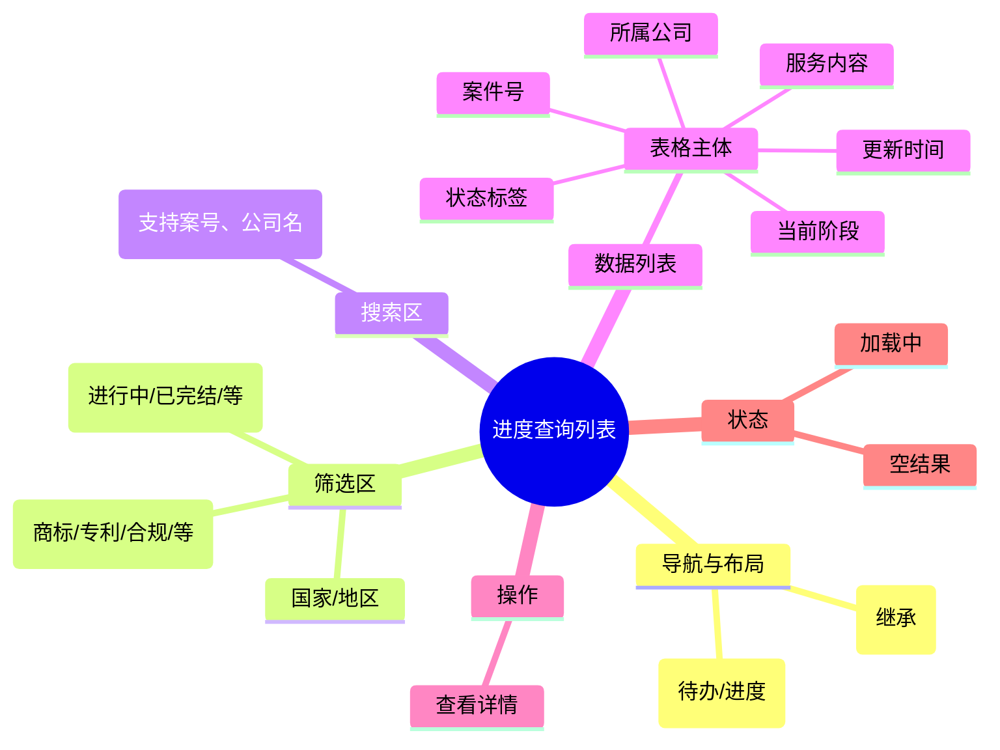

# 进度查询列表

## 0. 页面文档状态

- 文档版本：Release
- 生成日期：2026-05-13
- 来源文件：`product/release/product-sitemap-release.md`
- 页面ID：U-220
- 页面名称：进度查询列表
- 页面类型：列表
- 所属 Surface：用户端
- 匹配 Layout：`product-layout-release-user-web.md` (Layout Key: user-web)
- 页面模板：TPL-001 (用户端列表页模板)

## 1. 页面目标与上下文

### 1.1 页面目标

- 页面目的：提供用户端全局的案件进度追踪视图，支持多维度检索。
- 用户目标：快速定位特定案件并查看当前所属节点及状态。
- 业务目标：展示服务交付的透明度，减少用户主动询问客服的成本。
- 页面成功标准：搜索/筛选的精准度及案件详情页的点击流转率。

### 1.2 页面入口与出口

| 类型 | 来源 / 去向 | 触发条件 | 传入 / 传出数据 | 备注 |
|---|---|---|---|---|
| 入口 | 用户工作台 (U-200) | 点击“进度查询”卡片 | 初始筛选条件 |  |
| 出口 | 案件详情 (U-520) | 点击列表行 | 案件 ID |  |

### 1.3 角色与权限

| 角色 | 是否可访问 | 权限条件 | 不满足时页面表现 |
|---|---|---|---|
| 客户用户 | 是 | 已登录 | 跳转登录页 |

### 1.4 全局页面属性

| 属性 | 类型 | 来源 | 默认值 | 影响元素 / 状态 | 说明 |
|---|---|---|---|---|---|
| filter_service_type | string | local / route | "all" | 列表数据 | 过滤服务大类 |
| filter_country | string | local / route | "all" | 列表数据 | 过滤国家/地区 |

## 2. 页面结构思维导图

## 3. 页面布局与内容区块

| 区块ID | 区块名称 | 区块类型 | 展示条件 | 包含元素ID | 布局 / 样式定义 | 数据来源 |
|---|---|---|---|---|---|---|
| S-001 | 页面头部与 Tab | header | 总是显示 | E-001, E-002 | 居中，含 local-tab | - |
| S-002 | 多维筛选栏 | content | 总是显示 | E-003 至 E-006 | 多行排列，支持标签/下拉 | 后台配置 |
| S-003 | 案件列表表格 | content | 总是显示 | E-007, E-008 | 响应式表格 | API-001 |

## 4. 页面元素清单

| 元素ID | 元素名称 | 元素类型 | 所属区块 | 是否必需 | 展示条件 | 默认文案 / 内容 | 样式定义 | 数据绑定 |
|---|---|---|---|---|---|---|---|---|
| E-001 | 页面标题 | text | S-001 | 是 | 总是显示 | 工作台 / 进度查询 | H1 | - |
| E-002 | 业务 Tab | tab | S-001 | 是 | 总是显示 | 待办事项 / 进度查询 | - | current_tab |
| E-003 | 服务类型标签 | segmented-control | S-002 | 是 | 总是显示 | 全部 / 商标 / 专利... | 品牌样式 | service_type |
| E-004 | 国家地区下拉 | select | S-002 | 是 | 总是显示 | 全部国家 | - | country |
| E-005 | 状态筛选 | select | S-002 | 是 | 总是显示 | 全部状态 | - | status |
| E-006 | 关键词搜索 | input | S-002 | 是 | 总是显示 | 搜索案件号/公司名 | 带搜索图标 | search_key |
| E-007 | 案件数据表格 | list | S-003 | 是 | 有数据 | - | 8 列：案号、服务、公司、阶段、状态、时间、操作 | case_list |
| E-008 | 查看详情链接 | button | S-003 | 是 | 表格行内 | 查看 | 蓝色链接 | - |

## 5. 元素状态矩阵

| 元素ID | 状态 | 触发条件 | 状态来源 | 样式定义 | 可执行动作 | 禁止动作 | 提示文案 / 反馈 | 恢复条件 |
|---|---|---|---|---|---|---|---|---|
| E-007 | 列表项状态标签 | 根据案件状态 | item.status | 不同颜色标签 | - | - | 进行中 / 已驳回 / 已完结 | - |
| E-007 | 空状态 | 搜索无结果 | list.length=0 | 显示插画 | 清空筛选 | - | 没找到相关案件，换个关键词试试 | 重置筛选 |

## 6. 交互 Action 与执行效果

| ActionID | 触发元素ID | 交互名称 | 用户动作 | 前置条件 | 校验规则 | 执行动作 | 成功结果 | 失败结果 | 页面跳转 / 状态变化 | 埋点事件ID | 埋点事件名称 | 不埋点原因 |
|---|---|---|---|---|---|---|---|---|---|---|---|---|
| ACT-001 | E-003/004/005/006 | 触发检索 | 变更筛选或回车搜索 | - | - | 刷新列表数据 | 列表更新 | - | - | EVT-002 | 检索操作 | - |
| ACT-002 | E-008 | 跳转详情 | 点击查看 | - | - | 导航 | - | - | 跳转 U-520 | EVT-003 | 案件查看点击 | - |

## 7. 埋点事件统计设计

### 7.1 埋点事件总表

| 埋点事件ID | 事件名称 | 事件类型 | 关联元素ID / ActionID | 触发时机 | 统计次数口径 | 去重规则 | 上报时机 | 关键属性 | 成功 / 失败归因 | 漏斗阶段 |
|---|---|---|---|---|---|---|---|---|---|---|
| EVT-001 | 进度列表曝光 | page_view | - | 页面加载完成 | 每会话 1 次 | sessionId | 实时 | total_count | - | 列表查看 |
| EVT-002 | 检索行为 | click | E-006 | 搜索或筛选变更 | 每次触发 1 次 | - | 实时 | search_key, service_type | - | 效率工具 |
| EVT-003 | 案件点击 | click | E-008 | 点击 | 每次触发 1 次 | - | 实时 | case_id, case_status | - | 进入详情 |

## 8. 数据结构与接口定义

### 8.1 页面数据模型

| 数据对象 | 字段 | 类型 | 必填 | 来源 | 默认值 | 使用位置 | 说明 |
|---|---|---|---|---|---|---|---|
| CaseSummary | case_id | string | 是 | API | - | E-007 | 案件号 |
| CaseSummary | service_name | string | 是 | API | - | E-007 | 服务内容 |
| CaseSummary | company_name | string | 是 | API | - | E-007 | 申请公司 |
| CaseSummary | current_node | string | 是 | API | - | E-007 | 当前节点 |
| CaseSummary | status | enum | 是 | API | - | E-007 | 案件状态 |
| CaseSummary | update_time | string | 是 | API | - | E-007 |  |

### 8.2 接口清单

| API ID | 接口名称 | 方法 | 路径 | 触发 ActionID | 请求数据结构 | 返回数据结构 | 成功处理 | 失败处理 |
|---|---|---|---|---|---|---|---|---|
| API-001 | 获取进度列表 | GET | /api/case/list | 页面加载 / 检索 | {page, limit, service_type, country, status, search} | {list, total} | 渲染表格 | 错误提示 |

## 9. 边界状态与错误处理

| 场景ID | 场景类型 | 触发条件 | 页面表现 | 元素表现 | 用户可执行操作 | 系统处理 | 兜底文案 |
|---|---|---|---|---|---|---|---|
| EDGE-001 | 搜索无结果 | 接口返回空 | 显示提示 | - | 重置筛选 | - | 暂无符合条件的案件 |

## 10. 多媒体与资源

| 资源ID | 资源类型 | 使用位置 | 说明 |
|---|---|---|---|
| M-001 | image | S-003 | 空状态插图 |
