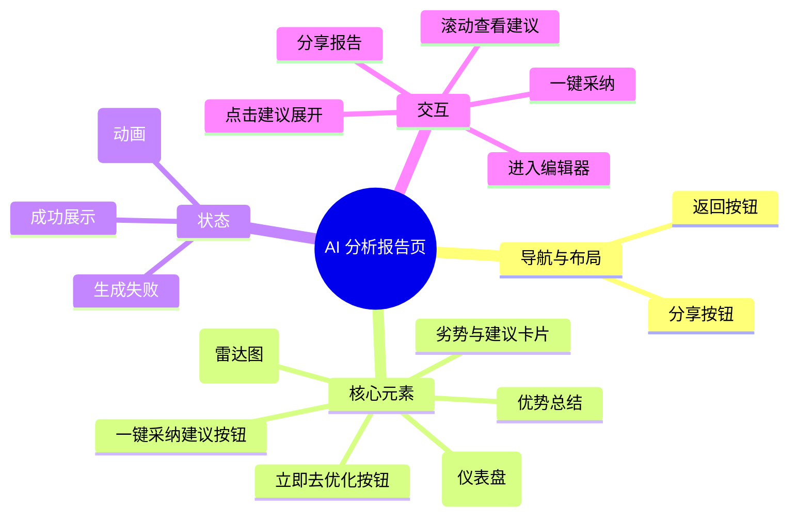

# AI 分析报告页

## 0. 页面文档状态

- 文档版本：Release
- 生成日期：2026-05-12
- 来源文件：`product/release/product-overview-release.md`
- 来源 Sitemap 行：
  - 生成顺序：50
  - 页面ID：U-020-030
  - 父页面ID：U-020
  - 层级：L2
  - Surface：用户端App
  - Layout 区域：独立层级
  - 页面名称：AI 分析报告页
  - 页面类型：详情/展示

## 1. 页面目标与上下文

### 1.1 页面目标

- 页面目的：展示 AI 对简历与目标岗位匹配度的分析结果。
- 用户目标：了解自己简历的优劣势，看到具体的修改建议。
- 业务目标：展示产品核心 AI 价值，引导用户进入编辑器进行修改，达成“优化简历”的核心闭环。
- 页面成功标准：用户点击“立即去优化”进入编辑器。

### 1.2 页面入口与出口

| 类型 | 来源 / 去向 | 触发条件 | 传入 / 传出数据 | 备注 |
|---|---|---|---|---|
| 入口 | 岗位目标设置页 | 提交分析任务成功 | 任务 ID | |
| 入口 | 首页 | 点击历史记录(已完成状态) | 简历 ID | |
| 出口 | 简历编辑器 | 点击“立即去优化” | 简历 ID、建议数据 | 跳转至 U-020-040 (U-060) |
| 出口 | 首页 | 点击返回 | 无 | 返回 U-020 |

### 1.3 角色与权限

| 角色 | 是否可访问 | 权限条件 | 不满足时页面表现 |
|---|---|---|---|
| 用户 | 是 | 已登录 | 正常展示 |

### 1.4 全局页面属性

| 属性 | 类型 | 来源 | 默认值 | 影响元素 / 状态 | 说明 |
|---|---|---|---|---|---|
| analysis_status | enum | API | loading | 页面整体展示 | loading, success, failure |
| match_score | number | API | 0 | 得分组件 | 0-100 |

## 2. 页面结构思维导图

## 3. 页面布局与内容区块

| 区块ID | 区块名称 | 区块类型 | 展示条件 | 包含元素ID | 布局 / 样式定义 | 数据来源 |
|---|---|---|---|---|---|---|
| S-001 | 评分概览区 | header | analysis_status == success | E-001, E-002 | 品牌渐变背景 | API |
| S-002 | 详细维度区 | content | analysis_status == success | E-003, E-004 | 居中展示图表 | API |
| S-003 | 优化建议列表 | content | analysis_status == success | E-005, E-008 | 垂直卡片流 | API |
| S-004 | 加载等待区 | overlay | analysis_status == loading | E-006 | 全屏覆盖动画 | 本地 |
| S-005 | 底部操作区 | footer | analysis_status == success | E-007 | 底部固定 | 本地 |

## 4. 页面元素清单

| 元素ID | 元素名称 | 元素类型 | 所属区块 | 是否必需 | 展示条件 | 默认文案 / 内容 | 样式定义 | 数据绑定 |
|---|---|---|---|---|---|---|---|---|
| E-001 | 综合匹配分 | chart | S-001 | 是 | 总是展示 | 仪表盘得分 | 28px, 白色数字 | match_score |
| E-002 | 核心结论文案 | text | S-001 | 是 | 总是展示 | 匹配度中等，建议针对岗位要求进行优化 | 14px, 白色 | conclusion_text |
| E-003 | 维度雷达图 | chart | S-002 | 是 | 总是展示 | 雷达图 (经验、技能、学历、稳定性、匹配度) | 200x200 | dimension_data |
| E-004 | 优势展示区 | list | S-002 | 是 | 总是展示 | 简历亮点 | 绿色小标签 | highlights[] |
| E-005 | 建议卡片 | card | S-003 | 是 | 总是展示 | [项目经验] 建议增加量化数据... | 阴影卡片，可点击展开 | suggestions[] |
| E-006 | 分析中动画 | animation | S-004 | 是 | loading | AI 正在阅读并分析... | 循环播放 | 无 |
| E-007 | 立即去优化按钮 | button | S-005 | 是 | 总是展示 | 立即去优化 | 品牌色，大尺寸 | 无 |
| E-008 | 一键采纳建议 | button | S-003 | 否 | analysis_status == success | 一键采纳所有建议 | 浅色背景按钮 | 无 |

## 5. 元素状态矩阵

| 元素ID | 状态 | 触发条件 | 状态来源 | 样式定义 | 可执行动作 | 禁止动作 | 提示文案 / 反馈 | 恢复条件 |
|---|---|---|---|---|---|---|---|---|
| E-005 | 默认 | 总是 | API | 正常 | 点击展开详情 | 无 | | |
| E-007 | 默认 | 总是 | 本地 | 品牌色 | 点击跳转 | 无 | | |
| E-008 | 默认 | 总是 | 本地 | 浅色背景 | 点击执行 | 无 | 采纳中... | 执行完成 |

## 6. 交互 Action 与执行效果

| ActionID | 触发元素ID | 交互名称 | 用户动作 | 前置条件 | 校验规则 | 执行动作 | 成功结果 | 失败结果 | 页面跳转 / 状态变化 | 埋点事件ID | 埋点事件名称 |
|---|---|---|---|---|---|---|---|---|---|---|---|
| ACT-001 | 页面 | 自动获取结果 | 页面加载 | 无 | 无 | 调 API-001 | 更新 status = success | status = failure | 展示结果 | EVT-002 | 分析报告生成成功 |
| ACT-002 | E-007 | 去优化 | 点击 | 状态为 success | 无 | 导航跳转 | 进入编辑器 | 无 | 跳转 U-060 | EVT-003 | 报告页去优化点击 |
| ACT-003 | E-005 | 查看建议详情 | 点击 | 无 | 无 | 状态切换 | 展开卡片详情 | 无 | 本地 UI 变化 | EVT-004 | 建议卡片展开点击 |
| ACT-004 | E-008 | 一键采纳建议 | 点击 | 状态为 success | 无 | 调 API-002 | 采纳成功并跳转编辑器 | 提示失败 | 跳转 U-060 | EVT-005 | 一键采纳点击 |

## 7. 埋点事件统计设计

### 7.1 埋点事件总表

| 埋点事件ID | 事件名称 | 事件类型 | 关联元素ID / ActionID | 触发时机 | 统计次数口径 | 去重规则 | 上报时机 | 关键属性 | 成功 / 失败归因 | 漏斗阶段 |
|---|---|---|---|---|---|---|---|---|---|---|
| EVT-001 | 报告页曝光 | page_view | 无 | 进入页面 | 每页面会话计 1 次 | sessionId | 实时 | page_id, resume_id | | |
| EVT-002 | 分析报告生成成功 | api_success | ACT-001 | 结果返回成功 | 每次触发计 1 次 | requestId | 实时 | match_score, parse_duration | | 核心转化 |
| EVT-003 | 报告页去优化点击 | click | ACT-002 | 点击主按钮 | 每次触发计 1 次 | actionId | 实时 | match_score | | 进入核心编辑 |
| EVT-004 | 建议卡片展开点击 | click | ACT-003 | 点击建议项 | 每次触发计 1 次 | actionId | 实时 | suggestion_type | | |
| EVT-005 | 一键采纳点击 | click | ACT-004 | 点击一键采纳 | 每次触发计 1 次 | actionId | 实时 | suggestion_count | | 深度转化 |

### 7.2 埋点事件属性定义

| 属性名 | 类型 | 必填 | 来源 | 示例值 | 使用事件ID | 说明 |
|---|---|---|---|---|---|---|
| match_score | number | 是 | API | 85 | EVT-002, EVT-003 | |
| suggestion_type | string | 否 | 元素属性 | project / skill / edu | EVT-004 | 建议所属维度 |

## 8. 数据结构与接口定义

### 8.1 页面数据模型

| 数据对象 | 字段 | 类型 | 必填 | 来源 | 默认值 | 使用位置 | 说明 |
|---|---|---|---|---|---|---|---|
| AnalysisResult | score | number | 是 | API | | E-001 | |
| AnalysisResult | conclusion | string | 是 | API | | E-002 | |
| AnalysisResult | dimensions | object | 是 | API | | E-003 | {skill: 80, exp: 70...} |
| AnalysisResult | suggestions | array | 是 | API | | E-005 | [{title, content, type}] |

### 8.2 接口清单

| API ID | 接口名称 | 方法 | 路径 | 触发 ActionID | 请求数据结构 | 返回数据结构 | 成功处理 | 失败处理 |
|---|---|---|---|---|---|---|---|---|
| API-001 | 获取分析结果 | GET | /api/analysis/result | ACT-001 | {task_id} | {AnalysisResult} | 展示报告 | 错误重试 |
| API-002 | 一键采纳建议 | POST | /api/analysis/apply-all | ACT-004 | {resume_id, task_id} | {resume_id, updated_data} | 跳转编辑器 | 提示失败 |

## 9. 边界状态与错误处理

| 场景ID | 场景类型 | 触发条件 | 页面表现 | 元素表现 | 用户可执行操作 | 系统处理 | 兜底文案 |
|---|---|---|---|---|---|---|---|
| EDGE-001 | 生成失败 | 后端算力异常 | 错误提示页 | 展示重试按钮 | 重新生成 | 清理旧任务 | 分析报告生成失败，请稍后重试 |
| EDGE-002 | 匹配度过低 | score < 40 | 预警文案 | 红色主题展示 | 立即去优化 | 无 | 匹配度较低，建议大幅度调整简历内容 |

## 10. 多媒体与资源

| 资源ID | 资源类型 | 使用位置 | 来源 | 格式 / 尺寸 | 加载状态 | 失败降级 | 可访问性说明 |
|---|---|---|---|---|---|---|---|
| M-001 | animation | S-004 | 本地 | Lottie/JSON | 总是加载 | 静态图 | AI 分析中动画 |
