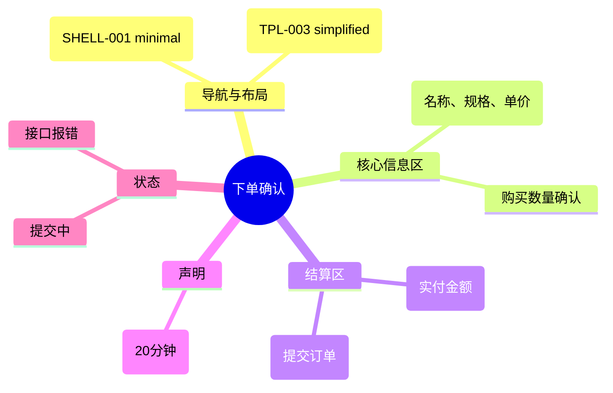

# 下单确认

## 0. 页面文档状态

- 文档版本：Release
- 生成日期：2026-05-13
- 来源文件：`product/release/product-sitemap-release.md`
- 页面ID：U-320
- 页面名称：下单确认
- 页面类型：表单
- 所属 Surface：用户端
- 匹配 Layout：`product-layout-release-user-web.md` (Layout Key: user-web)
- 页面模板：TPL-003 (用户端简化页模板)

## 1. 页面目标与上下文

### 1.1 页面目标

- 页面目的：核对已选服务的 SKU、数量与最终应付金额，确认后创建订单。
- 用户目标：确认选购内容无误，快速进入支付。
- 业务目标：锁定购买意向，生成待支付订单。
- 页面成功标准：订单创建成功率。

### 1.2 页面入口与出口

| 类型 | 来源 / 去向 | 触发条件 | 传入 / 传出数据 | 备注 |
|---|---|---|---|---|
| 入口 | 服务商品详情 (U-310) | 点击“立即下单” | 商品 ID、SKU ID、购买数量 |  |
| 出口 | 支付收银台 (U-330) | 点击“提交订单”且成功 | 订单 ID、支付金额 |  |
| 出口 | 服务商品详情 (U-310) | 点击返回 | 无 |  |

### 1.3 角色与权限

| 角色 | 是否可访问 | 权限条件 | 不满足时页面表现 |
|---|---|---|---|
| 客户用户 | 是 | 已登录 | 跳转登录页 |

### 1.4 全局页面属性

| 属性 | 类型 | 来源 | 默认值 | 影响元素 / 状态 | 说明 |
|---|---|---|---|---|---|
| product_sku_id | string | route / params | - | 页面信息展示 | 当前待确认的商品规格 |
| quantity | number | route / params | 1 | 总价计算 | 购买数量 |

## 2. 页面结构思维导图

## 3. 页面布局与内容区块

| 区块ID | 区块名称 | 区块类型 | 展示条件 | 包含元素ID | 布局 / 样式定义 | 数据来源 |
|---|---|---|---|---|---|---|
| S-001 | 订单核对区块 | content | 总是显示 | E-001 至 E-003 | 居中卡片布局 | 传入参数 |
| S-002 | 结算与提交 | footer-actions | 总是显示 | E-004, E-005 | 底部吸附或居中下方 | 计算得出 |

## 4. 页面元素清单

| 元素ID | 元素名称 | 元素类型 | 所属区块 | 是否必需 | 展示条件 | 默认文案 / 内容 | 样式定义 | 数据绑定 |
|---|---|---|---|---|---|---|---|---|
| E-001 | 商品规格摘要 | card | S-001 | 是 | 总是显示 | 商品名称 / SKU 名称 | 包含主图 | - |
| E-002 | 购买数量展示 | text | S-001 | 是 | 总是显示 | 数量：x{quantity} | - | quantity |
| E-003 | 单价展示 | text | S-001 | 是 | 总是显示 | 单价：¥{price} | - | price |
| E-004 | 总计金额 | text | S-002 | 是 | 总是显示 | 实付金额：¥{total_price} | 品牌高亮大字 | total_price |
| E-005 | 提交订单按钮 | button | S-002 | 是 | 总是显示 | 提交订单 | 品牌实色，宽按钮 | - |
| E-006 | 支付时效提示 | text | S-002 | 是 | 总是显示 | 请在 20 分钟内完成支付 | 灰小字 | - |

## 5. 元素状态矩阵

| 元素ID | 状态 | 触发条件 | 状态来源 | 样式定义 | 可执行动作 | 禁止动作 | 提示文案 / 反馈 | 恢复条件 |
|---|---|---|---|---|---|---|---|---|
| E-005 | 默认 | 页面加载 | - | - | 提交 | - | - | - |
| E-005 | 提交中 | 点击后 | submitting | loading | - | 点击 | 正在创建订单 | 请求结束 |

## 6. 交互 Action 与执行效果

| ActionID | 触发元素ID | 交互名称 | 用户动作 | 前置条件 | 校验规则 | 执行动作 | 成功结果 | 失败结果 | 页面跳转 / 状态变化 | 埋点事件ID | 埋点事件名称 | 不埋点原因 |
|---|---|---|---|---|---|---|---|---|---|---|---|---|
| ACT-001 | E-005 | 提交订单 | 点击 | - | - | 调用下单接口 (API-001) | 拿到 orderId，跳转支付 | 错误提示 | 跳转 U-330 | EVT-003 | 提交订单点击 | - |

## 7. 埋点事件统计设计

### 7.1 埋点事件总表

| 埋点事件ID | 事件名称 | 事件类型 | 关联元素ID / ActionID | 触发时机 | 统计次数口径 | 去重规则 | 上报时机 | 关键属性 | 成功 / 失败归因 | 漏斗阶段 |
|---|---|---|---|---|---|---|---|---|---|---|
| EVT-001 | 下单页曝光 | page_view | - | 页面进入 | 每会话 1 次 | sessionId | 实时 | product_sku_id | - | 确认环节 |
| EVT-003 | 订单提交结果 | submit | E-005 | 接口返回结果 | 每次触发 1 次 | actionId | 接口返回 | result, error_code | - | 转化完成 |

## 8. 数据结构与接口定义

### 8.1 页面数据模型

| 数据对象 | 字段 | 类型 | 必填 | 来源 | 默认值 | 使用位置 | 说明 |
|---|---|---|---|---|---|---|---|
| CheckoutInfo | sku_id | string | 是 | params | - | - |  |
| CheckoutInfo | quantity | number | 是 | params | 1 | - |  |
| CheckoutInfo | total_price | number | 是 | computed | - | E-004 | q * p |

### 8.2 接口清单

| API ID | 接口名称 | 方法 | 路径 | 触发 ActionID | 请求数据结构 | 返回数据结构 | 成功处理 | 失败处理 |
|---|---|---|---|---|---|---|---|---|
| API-001 | 提交订单 | POST | /api/order/create | ACT-001 | {sku_id, quantity} | {order_id, amount} | 跳转支付 | 提示失败 |

## 9. 边界状态与错误处理

| 场景ID | 场景类型 | 触发条件 | 页面表现 | 元素表现 | 用户可执行操作 | 系统处理 | 兜底文案 |
|---|---|---|---|---|---|---|---|
| EDGE-001 | 商品库存/状态失效 | 提交时商品已下架 | 弹窗提示 | - | 返回目录 | - | 抱歉，该服务已下架或规格已变动 |

## 10. 多媒体与资源

| 资源ID | 资源类型 | 使用位置 | 说明 |
|---|---|---|---|
| M-001 | image | E-001 | 商品主图 |
