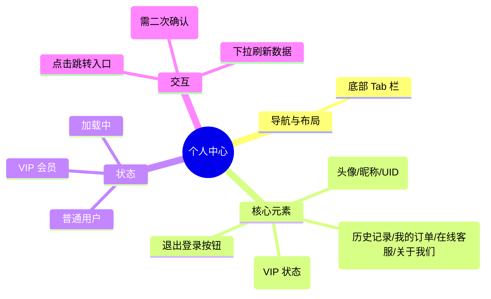

# 个人中心

## 0. 页面文档状态

- 文档版本：Release
- 生成日期：2026-05-12
- 来源文件：`product/release/product-overview-release.md`
- 来源 Sitemap 行：
  - 生成顺序：80
  - 页面ID：U-030
  - 父页面ID：ROOT
  - 层级：L1
  - Surface：用户端App
  - Layout 区域：底部Tab 2
  - 页面名称：个人中心
  - 页面类型：用户中心

## 1. 页面目标与上下文

### 1.1 页面目标

- 页面目的：展示用户信息、会员状态及其他功能入口。
- 用户目标：查看会员权益、管理历史简历、修改个人设置。
- 业务目标：通过会员中心入口提升转化率，提供用户退出登录等管理能力。
- 页面成功标准：用户点击核心入口（如会员、历史）。

### 1.2 页面入口与出口

| 类型 | 来源 / 去向 | 触发条件 | 传入 / 传出数据 | 备注 |
|---|---|---|---|---|
| 入口 | 首页 | 点击底部 Tab | 无 | |
| 出口 | 会员订阅页 | 点击会员卡片 | 无 | 跳转至 U-090 |
| 出口 | 历史简历页 | 点击历史记录入口 | 无 | 跳转至 U-100 |
| 出口 | 登录页 | 点击退出登录 | 无 | 清理 Token |

### 1.3 角色与权限

| 角色 | 是否可访问 | 权限条件 | 不满足时页面表现 |
|---|---|---|---|
| 用户 | 是 | 已登录 | 正常展示 |

### 1.4 全局页面属性

| 属性 | 类型 | 来源 | 默认值 | 影响元素 / 状态 | 说明 |
|---|---|---|---|---|---|
| user_info | object | global store | {} | 头像、昵称、UID | |
| membership_status | enum | global store | normal | 会员卡片样式 | normal, vip, expired |

## 2. 页面结构思维导图

## 3. 页面布局与内容区块

| 区块ID | 区块名称 | 区块类型 | 展示条件 | 包含元素ID | 布局 / 样式定义 | 数据来源 |
|---|---|---|---|---|---|---|
| S-001 | 个人信息头 | header | 总是展示 | E-001, E-002 | 品牌背景，左侧头像 | Store |
| S-002 | 会员权益区 | content | 总是展示 | E-003 | 宽卡片，左右通栏感 | Store |
| S-003 | 功能列表区 | content | 总是展示 | E-004 | 垂直分组列表 | 本地 |
| S-004 | 退出操作区 | footer | 总是展示 | E-005 | 底部居中 | 本地 |

## 4. 页面元素清单

| 元素ID | 元素名称 | 元素类型 | 所属区块 | 是否必需 | 展示条件 | 默认文案 / 内容 | 样式定义 | 数据绑定 |
|---|---|---|---|---|---|---|---|---|
| E-001 | 用户头像 | image | S-001 | 是 | 总是展示 | 默认头像图标 | 60x60, 圆形 | user.avatar |
| E-002 | 用户昵称 | text | S-001 | 是 | 总是展示 | 求职者_1234 | 18px, 加粗 | user.nickname |
| E-003 | 会员中心卡片 | card | S-002 | 是 | 总是展示 | 升级 VIP，解锁无限分析 | 金色/黑色主题 | membership_status |
| E-004 | 列表入口项 | list | S-003 | 是 | 总是展示 | 历史简历、我的订单、关于我们 | 带箭头指示 | 无 |
| E-005 | 退出登录按钮 | button | S-004 | 是 | 总是展示 | 退出登录 | 红色文案 | 无 |

## 5. 元素状态矩阵

| 元素ID | 状态 | 触发条件 | 状态来源 | 样式定义 | 可执行动作 | 禁止动作 | 提示文案 / 反馈 | 恢复条件 |
|---|---|---|---|---|---|---|---|---|
| E-003 | 普通 | membership_status == normal | store | 浅金色 | 点击购买 | 无 | | |
| E-003 | VIP | membership_status == vip | store | 黑金深色 | 点击查看权益 | 无 | 会员有效期至：2026-xx-xx | |

## 6. 交互 Action 与执行效果

| ActionID | 触发元素ID | 交互名称 | 用户动作 | 前置条件 | 校验规则 | 执行动作 | 成功结果 | 失败结果 | 页面跳转 / 状态变化 | 埋点事件ID | 埋点事件名称 |
|---|---|---|---|---|---|---|---|---|---|---|---|
| ACT-001 | E-003 | 点击会员卡片 | 点击 | 无 | 无 | 导航跳转 | 进入订阅页 | 无 | 跳转 U-090 | EVT-002 | 个人中心会员点击 |
| ACT-002 | E-004 | 点击历史记录 | 点击 | 无 | 无 | 导航跳转 | 进入历史页 | 无 | 跳转 U-100 | EVT-003 | 个人中心历史点击 |
| ACT-003 | E-005 | 退出登录 | 点击 | 无 | 二次确认 | 清理本地数据 | 返回登录页 | 无 | 跳转 U-010 | EVT-004 | 个人中心退出点击 |

## 7. 埋点事件统计设计

### 7.1 埋点事件总表

| 埋点事件ID | 事件名称 | 事件类型 | 关联元素ID / ActionID | 触发时机 | 统计次数口径 | 去重规则 | 上报时机 | 关键属性 | 成功 / 失败归因 | 漏斗阶段 |
|---|---|---|---|---|---|---|---|---|---|---|
| EVT-001 | 个人中心曝光 | page_view | 无 | 进入页面 | 每页面会话计 1 次 | sessionId | 实时 | page_id, is_vip | | |
| EVT-002 | 个人中心会员点击 | click | ACT-001 | 点击 VIP 卡片 | 每次触发计 1 次 | actionId | 实时 | membership_status | | |
| EVT-003 | 个人中心历史点击 | click | ACT-002 | 点击历史项 | 每次触发计 1 次 | actionId | 实时 | 无 | | |
| EVT-004 | 个人中心退出点击 | click | ACT-003 | 二次确认通过 | 每次触发计 1 次 | actionId | 实时 | 无 | | |

### 7.2 埋点事件属性定义

| 属性名 | 类型 | 必填 | 来源 | 示例值 | 使用事件ID | 说明 |
|---|---|---|---|---|---|---|
| page_id | string | 是 | Sitemap 页面ID | U-080 | EVT-001 | |
| is_vip | boolean | 是 | 用户状态 | true / false | EVT-001 | |

## 8. 数据结构与接口定义

### 8.1 页面数据模型

| 数据对象 | 字段 | 类型 | 必填 | 来源 | 默认值 | 使用位置 | 说明 |
|---|---|---|---|---|---|---|---|
| UserProfile | id | string | 是 | Store | | - | |
| UserProfile | nickname | string | 是 | Store | | E-002 | |
| UserProfile | avatar | string | 否 | Store | | E-001 | |
| UserProfile | is_vip | boolean | 是 | Store | | E-003 | |

### 8.2 接口清单

| API ID | 接口名称 | 方法 | 路径 | 触发 ActionID | 请求数据结构 | 返回数据结构 | 成功处理 | 失败处理 |
|---|---|---|---|---|---|---|---|---|
| API-001 | 获取个人信息 | GET | /api/user/profile | 页面加载 | 无 | {UserProfile} | 更新 Store | 无 |
| API-002 | 退出登录 | POST | /api/auth/logout | ACT-003 | 无 | {status} | 导航至登录页 | 强制退出 |

## 9. 边界状态与错误处理

| 场景ID | 场景类型 | 触发条件 | 页面表现 | 元素表现 | 用户可执行操作 | 系统处理 | 兜底文案 |
|---|---|---|---|---|---|---|---|
| EDGE-001 | 未登录状态 | token 丢失或过期 | 强制弹窗提示 | 无 | 去登录 | 导航至登录页 | 登录已过期，请重新登录 |

## 10. 多媒体与资源

| 资源ID | 资源类型 | 使用位置 | 来源 | 格式 / 尺寸 | 加载状态 | 失败降级 | 可访问性说明 |
|---|---|---|---|---|---|---|---|
| M-001 | icon | E-004 | 本地 | SVG | 总是加载 | 默认占位 | 功能图标 |
