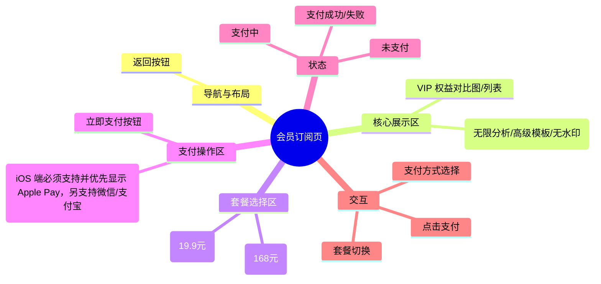

# 会员订阅页

## 0. 页面文档状态

- 文档版本：Release
- 生成日期：2026-05-12
- 来源文件：`product/release/product-overview-release.md`
- 来源 Sitemap 行：
  - 生成顺序：90
  - 页面ID：U-030-010
  - 父页面ID：U-030
  - 层级：L2
  - Surface：用户端App
  - Layout 区域：独立层级
  - 页面名称：会员订阅页
  - 页面类型：支付

## 1. 页面目标与上下文

### 1.1 页面目标

- 页面目的：提供会员增值服务的购买入口。
- 用户目标：通过支付获取高级功能权限（如无限次 AI 分析、高级模板导出等）。
- 业务目标：实现产品商业化变现，提升 ARPU 值。
- 页面成功标准：用户成功完成支付。

### 1.2 页面入口与出口

| 类型 | 来源 / 去向 | 触发条件 | 传入 / 传出数据 | 备注 |
|---|---|---|---|---|
| 入口 | 个人中心 | 点击会员卡片 | 无 | |
| 入口 | AI 分析报告页 | 额度用尽时弹出引导 | 无 | |
| 入口 | 导出预览页 | 点击锁定模板 | 模板 ID | |
| 出口 | 个人中心 | 支付成功或返回 | 支付结果 | 返回 U-080 |
| 出口 | 第三方支付 SDK | 点击“立即支付” | 订单信息 | 调起外部支付 |

### 1.3 角色与权限

| 角色 | 是否可访问 | 权限条件 | 不满足时页面表现 |
|---|---|---|---|
| 用户 | 是 | 已登录 | 正常展示 |

### 1.4 全局页面属性

| 属性 | 类型 | 来源 | 默认值 | 影响元素 / 状态 | 说明 |
|---|---|---|---|---|---|
| selected_plan_id | string | local state | month | 价格展示 | 当前选中的套餐 ID |

## 2. 页面结构思维导图

## 3. 页面布局与内容区块

| 区块ID | 区块名称 | 区块类型 | 展示条件 | 包含元素ID | 布局 / 样式定义 | 数据来源 |
|---|---|---|---|---|---|---|
| S-001 | 权益展示区 | header | 总是展示 | E-001 | 黑色/金色 brand 背景 | 本地 |
| S-002 | 套餐选择区 | content | 总是展示 | E-002, E-003 | 横向排列卡片 | API |
| S-003 | 支付方式区 | content | 总是展示 | E-004 | 垂直单选列表 | 本地 |
| S-004 | 底部操作区 | footer | 总是展示 | E-005 | 底部固定 | 本地 |

## 4. 页面元素清单

| 元素ID | 元素名称 | 元素类型 | 所属区块 | 是否必需 | 展示条件 | 默认文案 / 内容 | 样式定义 | 数据绑定 |
|---|---|---|---|---|---|---|---|---|
| E-001 | 权益列表 | list | S-001 | 是 | 总是展示 | 无限次 AI 分析、专业导出等 | 图标 + 文字 | 无 |
| E-002 | 月度套餐卡片 | button | S-002 | 是 | 总是展示 | 连续包月 ¥19.9 | 突出显示选中态 | selected_plan_id |
| E-003 | 年度套餐卡片 | button | S-002 | 是 | 总是展示 | 年度会员 ¥168 | 突出显示选中态 | selected_plan_id |
| E-004 | 支付方式选择 | radio | S-003 | 是 | 总是展示 | Apple Pay / 微信支付 / 支付宝 | 列表单选 | payment_method |
| E-005 | 立即支付按钮 | button | S-004 | 是 | 总是展示 | 立即支付 | 品牌主色，全宽 | 无 |

## 5. 元素状态矩阵

| 元素ID | 状态 | 触发条件 | 状态来源 | 样式定义 | 可执行动作 | 禁止动作 | 提示文案 / 反馈 | 恢复条件 |
|---|---|---|---|---|---|---|---|---|
| E-002 | 选中 | selected_plan_id == 'month' | local | 品牌描边 | 无 | 无 | | 切换套餐 |
| E-005 | 默认 | 总是 | 本地 | 正常 | 点击支付 | 无 | | |
| E-005 | 支付中 | 调起 SDK 后 | 本地 | 禁用加载 | 无 | 点击 | 支付处理中... | SDK 返回结果 |

## 6. 交互 Action 与执行效果

| ActionID | 触发元素ID | 交互名称 | 用户动作 | 前置条件 | 校验规则 | 执行动作 | 成功结果 | 失败结果 | 页面跳转 / 状态变化 | 埋点事件ID | 埋点事件名称 |
|---|---|---|---|---|---|---|---|---|---|---|---|
| ACT-001 | E-002/003 | 切换套餐 | 点击 | 无 | 无 | 更新状态 | UI 反馈价格 | 无 | 本地状态更新 | EVT-002 | 订阅页套餐切换 |
| ACT-002 | E-005 | 立即支付 | 点击 | 已选套餐 | 无 | 调 API-001 创建订单 | 调起支付 SDK | 提示下单失败 | 状态转为“支付中” | EVT-003 | 订阅页立即支付点击 |
| ACT-003 | SDK | 支付完成 | 回调 | 无 | 无 | 调 API-002 同步状态 | 更新全局会员态 | 提示支付失败 | 跳转回个人中心 | EVT-004 | 订阅页支付结果 |

## 7. 埋点事件统计设计

### 7.1 埋点事件总表

| 埋点事件ID | 事件名称 | 事件类型 | 关联元素ID / ActionID | 触发时机 | 统计次数口径 | 去重规则 | 上报时机 | 关键属性 | 成功 / 失败归因 | 漏斗阶段 |
|---|---|---|---|---|---|---|---|---|---|---|
| EVT-001 | 订阅页曝光 | page_view | 无 | 进入页面 | 每页面会话计 1 次 | sessionId | 实时 | page_id, source_page | | |
| EVT-002 | 订阅页套餐切换 | click | ACT-001 | 点击不同套餐卡片 | 每次触发计 1 次 | 无 | 实时 | plan_id | | |
| EVT-003 | 立即支付点击 | click | ACT-002 | 点击支付按钮 | 每次触发计 1 次 | actionId | 实时 | plan_id, payment_method | | 支付转化漏斗 |
| EVT-004 | 订阅页支付结果 | payment_result | ACT-003 | 支付回调返回 | 每次触发计 1 次 | orderId | 实时 | plan_id, result_code | success / failure | 商业化核心指标 |

### 7.2 埋点事件属性定义

| 属性名 | 类型 | 必填 | 来源 | 示例值 | 使用事件ID | 说明 |
|---|---|---|---|---|---|---|
| plan_id | string | 是 | 元素属性 | month / year | EVT-002, 003, 004 | |
| source_page | string | 否 | 路由来源 | ai_report / profile | EVT-001 | 来源页面归因 |

## 8. 数据结构与接口定义

### 8.1 页面数据模型

| 数据对象 | 字段 | 类型 | 必填 | 来源 | 默认值 | 使用位置 | 说明 |
|---|---|---|---|---|---|---|---|
| MembershipPlan | id | string | 是 | API | | E-002/003 | |
| MembershipPlan | price | number | 是 | API | | E-002/003 | |
| MembershipPlan | name | string | 是 | API | | E-002/003 | |

### 8.2 接口清单

| API ID | 接口名称 | 方法 | 路径 | 触发 ActionID | 请求数据结构 | 返回数据结构 | 成功处理 | 失败处理 |
|---|---|---|---|---|---|---|---|---|
| API-001 | 创建支付订单 | POST | /api/pay/create-order | ACT-002 | {plan_id, pay_type} | {order_id, sdk_params} | 调起 SDK | 错误提示 |
| API-002 | 支付结果确认 | POST | /api/pay/verify | ACT-003 | {order_id} | {status} | 权益激活 | 提示排队中或失败 |

## 9. 边界状态与错误处理

| 场景ID | 场景类型 | 触发条件 | 页面表现 | 元素表现 | 用户可执行操作 | 系统处理 | 兜底文案 |
|---|---|---|---|---|---|---|---|
| EDGE-001 | 支付取消 | 用户在 SDK 界面主动取消 | Toast 提示 | 恢复按钮状态 | 重新支付 | 记录取消事件 | 支付已取消 |
| EDGE-002 | 支付异常 | 扣款成功但权益未到账 | 错误反馈引导 | 提供客服入口 | 联系客服 | 记录异常订单 | 支付遇到问题？请联系客服处理 |

## 10. 多媒体与资源

| 资源ID | 资源类型 | 使用位置 | 来源 | 格式 / 尺寸 | 加载状态 | 失败降级 | 可访问性说明 |
|---|---|---|---|---|---|---|---|
| M-001 | icon | S-003 | 本地 | PNG/SVG | 总是加载 | 默认文字 | 支付渠道图标 |
