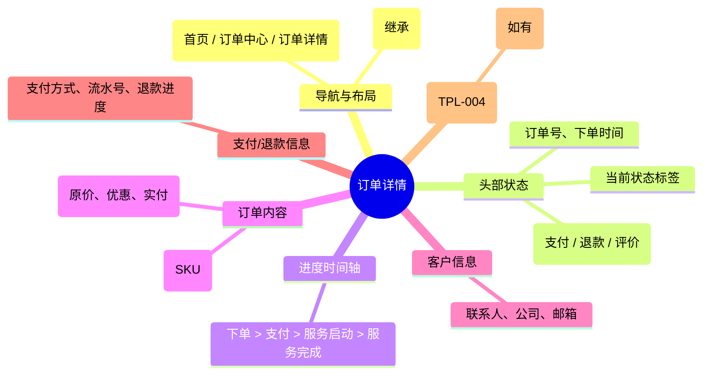

# 订单详情

## 0. 页面文档状态

- 文档版本：Release
- 生成日期：2026-05-13
- 来源文件：`product/release/product-sitemap-release.md`
- 页面ID：U-420
- 页面名称：订单详情
- 页面类型：详情
- 所属 Surface：用户端
- 匹配 Layout：`product-layout-release-user-web.md` (Layout Key: user-web)
- 页面模板：TPL-004 (用户端中心页模板)

## 1. 页面目标与上下文

### 1.1 页面目标

- 页面目的：展示单个订单的所有详细信息，包括状态轨迹、费用明细、用户信息及售后入口。
- 用户目标：确认订单支付情况，查看发票/合同（如有），或在订单异常时申请退款。
- 业务目标：提供透明的订单履约过程，降低售后沟通成本。
- 页面成功标准：订单详情页的自主查询率。

### 1.2 页面入口与出口

| 类型 | 来源 / 去向 | 触发条件 | 传入 / 传出数据 | 备注 |
|---|---|---|---|---|
| 入口 | 订单列表 (U-410) | 点击订单项 | 订单 ID |  |
| 入口 | 支付收银台 (U-330) | 支付成功跳转 | 订单 ID |  |
| 出口 | 支付收银台 (U-330) | 点击“去支付” | 订单 ID | 仅待支付订单 |
| 出口 | 案件详情 (U-520) | 点击“查看服务进度” | 案件 ID | 仅已支付且已启动订单 |

### 1.3 角色与权限

| 角色 | 是否可访问 | 权限条件 | 不满足时页面表现 |
|---|---|---|---|
| 客户用户 | 是 | 订单所属者 | 报错提示无权限 |

### 1.4 全局页面属性

| 属性 | 类型 | 来源 | 默认值 | 影响元素 / 状态 | 说明 |
|---|---|---|---|---|---|
| order_id | string | route | - | 页面数据加载 |  |

## 2. 页面结构思维导图

## 3. 页面布局与内容区块

| 区块ID | 区块名称 | 区块类型 | 展示条件 | 包含元素ID | 布局 / 样式定义 | 数据来源 |
|---|---|---|---|---|---|---|
| S-001 | 订单状态概览 | header | 总是显示 | E-001, E-002 | 顶部通栏，背景突出 | API-001 |
| S-002 | 详情信息组 | content | 总是显示 | E-003 至 E-006 | 垂直分组卡片 | API-001 |
| S-003 | 关联服务预览 | footer | 已支付时显示 | E-007 | 底部关联卡片 | API-001 |

## 4. 页面元素清单

| 元素ID | 元素名称 | 元素类型 | 所属区块 | 是否必需 | 展示条件 | 默认文案 / 内容 | 样式定义 | 数据绑定 |
|---|---|---|---|---|---|---|---|---|
| E-001 | 状态大标签 | text | S-001 | 是 | 总是显示 | 订单状态：已支付 | 粗体大字 | order.status |
| E-002 | 支付/退款动作按钮 | button | S-001 | 否 | 状态满足 | 去支付 / 申请退款 | 按钮组 | - |
| E-003 | 进度时间轴 | list | S-002 | 是 | 总是显示 | - | 时间轴 UI | order.history |
| E-004 | 商品摘要区 | card | S-002 | 是 | 总是显示 | - | 包含 SKU 详情 | order.item |
| E-005 | 金额明细表 | table | S-002 | 是 | 总是显示 | - | 对齐显示各金额 | order.price_split |
| E-006 | 客户信息区块 | group | S-002 | 是 | 总是显示 | - | 包含公司、联系人 | order.customer |
| E-007 | 关联案件链接 | card | S-003 | 否 | 有关联案件 | 查看服务详情 | 引导卡片 | order.case_id |

## 5. 元素状态矩阵

| 元素ID | 状态 | 触发条件 | 状态来源 | 样式定义 | 可执行动作 | 禁止动作 | 提示文案 / 反馈 | 恢复条件 |
|---|---|---|---|---|---|---|---|---|
| E-002 | 申请退款 | 状态="已支付" 且 服务未启动 | can_refund | 描边样式 | 弹窗申请 | - | - | - |
| E-002 | 去支付 | 状态="待支付" | can_pay | 实色样式 | 跳转 U-330 | - | - | - |
| E-007 | 高亮引导 | 状态="处理中" | is_processing | 品牌色边框 | 点击跳转 | - | 服务已启动 | - |

## 6. 交互 Action 与执行效果

| ActionID | 触发元素ID | 交互名称 | 用户动作 | 前置条件 | 校验规则 | 执行动作 | 成功结果 | 失败结果 | 页面跳转 / 状态变化 | 埋点事件ID | 埋点事件名称 | 不埋点原因 |
|---|---|---|---|---|---|---|---|---|---|---|---|---|
| ACT-001 | E-002 | 申请退款 | 点击 | 订单已支付且后台未流转至服务中状态 | - | 弹窗确认原因并提交 (无需上传材料) | 状态变更为“退款中” | 错误提示 | - | EVT-002 | 退款申请点击 | - |
| ACT-002 | E-007 | 跳转案件详情 | 点击 | 关联案件存在 | - | 导航 | - | - | 跳转 U-520 | EVT-003 | 服务详情跳转点击 | - |

## 7. 埋点事件统计设计

### 7.1 埋点事件总表

| 埋点事件ID | 事件名称 | 事件类型 | 关联元素ID / ActionID | 触发时机 | 统计次数口径 | 去重规则 | 上报时机 | 关键属性 | 成功 / 失败归因 | 漏斗阶段 |
|---|---|---|---|---|---|---|---|---|---|---|
| EVT-001 | 订单详情曝光 | page_view | - | 页面加载完成 | 每会话 1 次 | sessionId | 实时 | order_id, order_status | - | 详情查看 |
| EVT-002 | 退款申请操作 | click | E-002 | 确认提交退款 | 每次触发 1 次 | actionId | 接口返回 | order_id, refund_reason | result | 售后 |
| EVT-003 | 进度链接点击 | click | E-007 | 点击 | 每次触发 1 次 | - | 实时 | order_id, case_id | - | 履约跳转 |

## 8. 数据结构与接口定义

### 8.1 页面数据模型

| 数据对象 | 字段 | 类型 | 必填 | 来源 | 默认值 | 使用位置 | 说明 |
|---|---|---|---|---|---|---|---|
| OrderDetail | id | string | 是 | API | - | - |  |
| OrderDetail | status | enum | 是 | API | - | E-001 |  |
| OrderDetail | history | array | 是 | API | [] | E-003 | 状态轨迹 |
| OrderDetail | price_split | object | 是 | API | {} | E-005 | 金额拆解 |
| OrderDetail | case_id | string | 否 | API | - | E-007 | 关联案件 ID |

### 8.2 接口清单

| API ID | 接口名称 | 方法 | 路径 | 触发 ActionID | 请求数据结构 | 返回数据结构 | 成功处理 | 失败处理 |
|---|---|---|---|---|---|---|---|---|
| API-001 | 获取订单详情 | GET | /api/order/detail | 页面加载 | {order_id} | {OrderDetail} | 渲染页面 | 错误提示 |
| API-002 | 申请退款提交 | POST | /api/order/refund | ACT-001 | {order_id, reason} | {success} | 刷新状态 | 提示失败 |

## 9. 边界状态与错误处理

| 场景ID | 场景类型 | 触发条件 | 页面表现 | 元素表现 | 用户可执行操作 | 系统处理 | 兜底文案 |
|---|---|---|---|---|---|---|---|
| EDGE-001 | 订单不存在 | 404 错误 | 显示错误页 | - | 返回列表 | - | 抱歉，未找到该订单信息 |

## 10. 多媒体与资源

| 资源ID | 资源类型 | 使用位置 | 说明 |
|---|---|---|---|
| M-001 | icon | S-001 | 状态大图标 |
