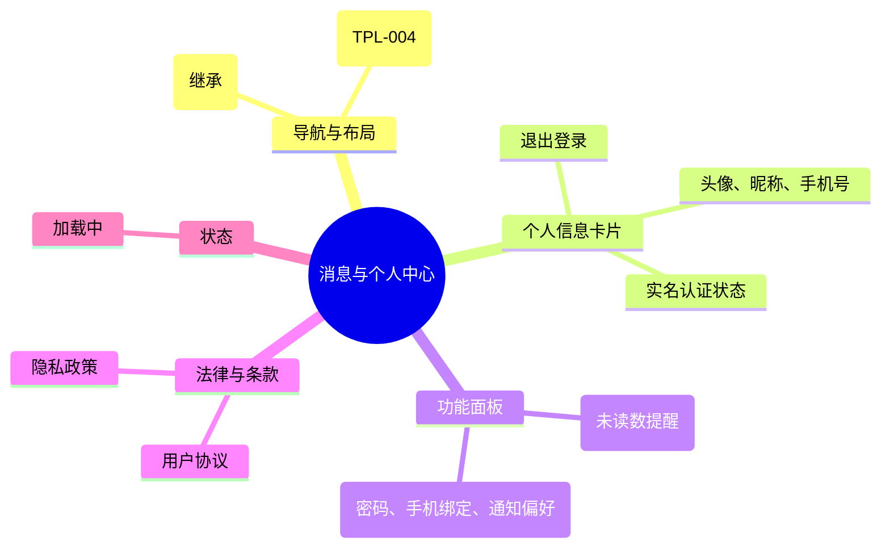

# 消息与个人中心

## 0. 页面文档状态

- 文档版本：Release
- 生成日期：2026-05-13
- 来源文件：`product/release/product-sitemap-release.md`
- 页面ID：U-600
- 页面名称：消息与个人中心
- 页面类型：首页
- 所属 Surface：用户端
- 匹配 Layout：`product-layout-release-user-web.md` (Layout Key: user-web)
- 页面模板：TPL-004 (用户端中心页模板)

## 1. 页面目标与上下文

### 1.1 页面目标

- 页面目的：提供用户账号信息汇总、消息通知入口及系统设置的导航中心。
- 用户目标：查看个人基本资料、处理未读消息，并管理账号安全与通知偏好。
- 业务目标：增强用户黏性，确保重要通知（如补件、逾期）能被用户及时触达。
- 页面成功标准：消息中心的点击率及账号信息维护的完整度。

### 1.2 页面入口与出口

| 类型 | 来源 / 去向 | 触发条件 | 传入 / 传出数据 | 备注 |
|---|---|---|---|---|
| 入口 | 顶栏导航 | 点击“个人中心/消息” | 无 |  |
| 出口 | 消息中心 (U-610) | 点击“消息通知” | 无 |  |
| 出口 | 账号设置 (U-620) | 点击“账号设置” | 无 | 包含个人资料、消息偏好设置 |
| 出口 | 登录注册 (U-100) | 点击“退出登录” | 无 |  |

### 1.3 角色与权限

| 角色 | 是否可访问 | 权限条件 | 不满足时页面表现 |
|---|---|---|---|
| 客户用户 | 是 | 已登录 | 跳转登录页 |

### 1.4 全局页面属性

| 属性 | 类型 | 来源 | 默认值 | 影响元素 / 状态 | 说明 |
|---|---|---|---|---|---|
| user_info | object | API / Store | - | 头像、昵称显示 |  |
| unread_count | number | API | 0 | 消息红点数字 |  |

## 2. 页面结构思维导图

## 3. 页面布局与内容区块

| 区块ID | 区块名称 | 区块类型 | 展示条件 | 包含元素ID | 布局 / 样式定义 | 数据来源 |
|---|---|---|---|---|---|---|
| S-001 | 用户名片 | header | 总是显示 | E-001 | 顶部半通栏或左侧区块 | API-001 |
| S-002 | 功能中心 | content | 总是显示 | E-002, E-003 | 列表项/宫格排列 | - |
| S-003 | 系统底部入口 | footer | 总是显示 | E-004, E-005 | 弱化展示 | - |

## 4. 页面元素清单

| 元素ID | 元素名称 | 元素类型 | 所属区块 | 是否必需 | 展示条件 | 默认文案 / 内容 | 样式定义 | 数据绑定 |
|---|---|---|---|---|---|---|---|---|
| E-001 | 用户基础信息项 | card | S-001 | 是 | 总是显示 | {昵称} / {手机号} | 包含头像 | user_info |
| E-002 | 消息中心入口 | button | S-002 | 是 | 总是显示 | 消息通知 | 包含红点 | unread_count |
| E-003 | 账号设置入口 | button | S-002 | 是 | 总是显示 | 账号设置 | 包含安全与通知偏好管理 | - |
| E-004 | 退出登录按钮 | button | S-001 | 是 | 总是显示 | 退出登录 | 红色弱文字 | - |
| E-005 | 协议查看链接 | button | S-003 | 是 | 总是显示 | 用户协议 / 隐私政策 | 链接样式 | - |

## 5. 元素状态矩阵

| 元素ID | 状态 | 触发条件 | 状态来源 | 样式定义 | 可执行动作 | 禁止动作 | 提示文案 / 反馈 | 恢复条件 |
|---|---|---|---|---|---|---|---|---|
| E-002 | 未读提醒 | unread_count > 0 | unread_count | 红色数字徽标 | 点击进入 | - | {n} | 清空消息 |

## 6. 交互 Action 与执行效果

| ActionID | 触发元素ID | 交互名称 | 用户动作 | 前置条件 | 校验规则 | 执行动作 | 成功结果 | 失败结果 | 页面跳转 / 状态变化 | 埋点事件ID | 埋点事件名称 | 不埋点原因 |
|---|---|---|---|---|---|---|---|---|---|---|---|---|
| ACT-001 | E-002 | 跳转消息中心 | 点击 | - | - | 导航 | - | - | 跳转 U-610 | - | - | 内部跳转 |
| ACT-002 | E-003 | 跳转账号设置 | 点击 | - | - | 导航 | - | - | 跳转 U-620 | - | - | 内部跳转 |
| ACT-003 | E-004 | 退出登录 | 点击 | - | 弹窗确认 | 清除 Token | 跳转 U-100 | - | 跳转 U-100 | EVT-002 | 退出登录点击 | - |

## 7. 埋点事件统计设计

### 7.1 埋点事件总表

| 埋点事件ID | 事件名称 | 事件类型 | 关联元素ID / ActionID | 触发时机 | 统计次数口径 | 去重规则 | 上报时机 | 关键属性 | 成功 / 失败归因 | 漏斗阶段 |
|---|---|---|---|---|---|---|---|---|---|---|
| EVT-001 | 个人中心曝光 | page_view | - | 页面进入 | 每会话 1 次 | sessionId | 实时 | user_id | - | - |
| EVT-002 | 退出登录操作 | click | E-004 | 确认退出 | 每次触发 1 次 | - | 实时 | user_id | - | 留存流失 |

## 8. 数据结构与接口定义

### 8.1 页面数据模型

| 数据对象 | 字段 | 类型 | 必填 | 来源 | 默认值 | 使用位置 | 说明 |
|---|---|---|---|---|---|---|---|
| UserProfile | nickname | string | 是 | API | - | E-001 |  |
| UserProfile | mobile | string | 是 | API | - | E-001 |  |
| UserProfile | avatar | string | 否 | API | - | E-001 |  |

### 8.2 接口清单

| API ID | 接口名称 | 方法 | 路径 | 触发 ActionID | 请求数据结构 | 返回数据结构 | 成功处理 | 失败处理 |
|---|---|---|---|---|---|---|---|---|
| API-001 | 获取个人资料摘要 | GET | /api/user/profile | 页面加载 | - | {UserProfile, unread_count} | 渲染页面 | - |

## 9. 边界状态与错误处理

| 场景ID | 场景类型 | 触发条件 | 页面表现 | 元素表现 | 用户可执行操作 | 系统处理 | 兜底文案 |
|---|---|---|---|---|---|---|---|
| EDGE-001 | 登录失效 | Token 过期 | 提示登录失效 | - | 重新登录 | 自动跳转 U-100 | 您的登录已过期，请重新登录 |

## 10. 多媒体与资源

| 资源ID | 资源类型 | 使用位置 | 说明 |
|---|---|---|---|
| M-001 | image | E-001 | 默认头像占位图 |
