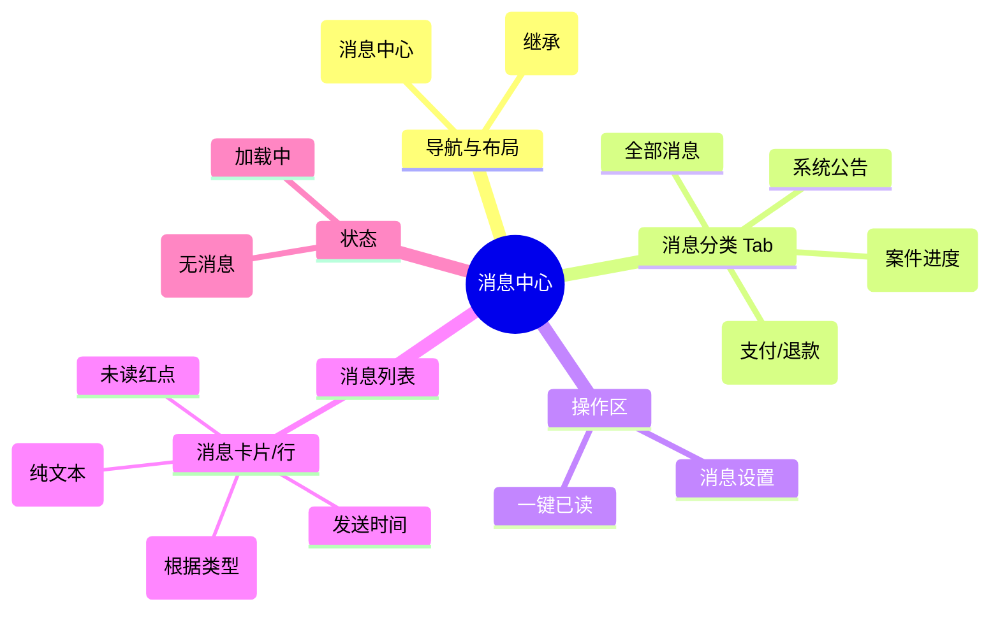

# 消息中心

## 0. 页面文档状态

- 文档版本：Release
- 生成日期：2026-05-13
- 来源文件：`product/release/product-sitemap-release.md`
- 页面ID：U-610
- 页面名称：消息中心
- 页面类型：列表
- 所属 Surface：用户端
- 匹配 Layout：`product-layout-release-user-web.md` (Layout Key: user-web)
- 页面模板：TPL-001 (用户端列表页模板)

## 1. 页面目标与上下文

### 1.1 页面目标

- 页面目的：集中展示系统通知、订单状态变更、服务进度更新及风险预警等所有业务消息。
- 用户目标：快速查阅新消息，不错过任何需要人工干预的节点提醒（如补件提醒）。
- 业务目标：作为平台与用户的沟通枢纽，降低因用户未读通知导致的交付延时。
- 页面成功标准：高优先级消息（如补件、驳回）的点击率。

### 1.2 页面入口与出口

| 类型 | 来源 / 去向 | 触发条件 | 传入 / 传出数据 | 备注 |
|---|---|---|---|---|
| 入口 | 全局顶栏 | 点击消息图标 | 无 |  |
| 入口 | 个人中心 (U-600) | 点击“消息中心” | 无 |  |
| 出口 | 案件详情 (U-520) | 点击服务类消息 | 案件 ID |  |
| 出口 | 订单详情 (U-420) | 点击订单类消息 | 订单 ID |  |

### 1.3 角色与权限

| 角色 | 是否可访问 | 权限条件 | 不满足时页面表现 |
|---|---|---|---|
| 客户用户 | 是 | 已登录 | 跳转登录页 |

### 1.4 全局页面属性

| 属性 | 类型 | 来源 | 默认值 | 影响元素 / 状态 | 说明 |
|---|---|---|---|---|---|
| current_type | enum | route | "all" | 列表数据 | 全部 / 订单消息 / 服务通知 / 系统消息 |

## 2. 页面结构思维导图

## 3. 页面布局与内容区块

| 区块ID | 区块名称 | 区块类型 | 展示条件 | 包含元素ID | 布局 / 样式定义 | 数据来源 |
|---|---|---|---|---|---|---|
| S-001 | 消息分类与操作 | header | 总是显示 | E-001, E-002 | 水平 Tab + 右侧操作 | - |
| S-002 | 消息列表主体 | content | 总是显示 | E-003 | 垂直列表，每行可点击 | API-001 |

## 4. 页面元素清单

| 元素ID | 元素名称 | 元素类型 | 所属区块 | 是否必需 | 展示条件 | 默认文案 / 内容 | 样式定义 | 数据绑定 |
|---|---|---|---|---|---|---|---|---|
| E-001 | 分类 Tab | tab | S-001 | 是 | 总是显示 | 服务通知 / 订单提醒... | 品牌激活样式 | current_type |
| E-002 | 一键已读按钮 | button | S-001 | 是 | 总是显示 | 全部标记为已读 | 弱文字样式 | - |
| E-003 | 消息项卡片 | list | S-002 | 是 | 有数据 | - | 标题与正文摘要仅展示纯文本，不支持 Markdown | message_list |
| E-004 | 未读标记 | other | S-002 | 否 | 消息未读 | 红色圆点 | - | is_read |
| E-005 | 跳转图标 | icon | S-002 | 否 | 可点击跳转 | > | - | - |

## 5. 元素状态矩阵

| 元素ID | 状态 | 触发条件 | 状态来源 | 样式定义 | 可执行动作 | 禁止动作 | 提示文案 / 反馈 | 恢复条件 |
|---|---|---|---|---|---|---|---|---|
| E-003 | 已读状态 | 用户点击或批量已读 | item.is_read=true | 标题变灰，红点消失 | - | - | - | - |
| E-003 | 紧急状态 | 消息类型="风险预警" | item.level="high" | 标题前置[紧急]标签 | - | - | - | - |

## 6. 交互 Action 与执行效果

| ActionID | 触发元素ID | 交互名称 | 用户动作 | 前置条件 | 校验规则 | 执行动作 | 成功结果 | 失败结果 | 页面跳转 / 状态变化 | 埋点事件ID | 埋点事件名称 | 不埋点原因 |
|---|---|---|---|---|---|---|---|---|---|---|---|---|
| ACT-001 | E-003 | 查看并已读 | 点击消息项 | - | - | 1. 标记已读 (API-002) 2. 导航至目标页 | 状态变灰并跳转 | - | 根据消息内容跳转 | EVT-002 | 消息点击跳转 | - |
| ACT-002 | E-002 | 批量已读 | 点击 | 有未读消息 | - | 调用批量已读 (API-003) | 列表所有红点消失 | - | - | EVT-003 | 一键已读点击 | - |

## 7. 埋点事件统计设计

### 7.1 埋点事件总表

| 埋点事件ID | 事件名称 | 事件类型 | 关联元素ID / ActionID | 触发时机 | 统计次数口径 | 去重规则 | 上报时机 | 关键属性 | 成功 / 失败归因 | 漏斗阶段 |
|---|---|---|---|---|---|---|---|---|---|---|
| EVT-001 | 消息中心曝光 | page_view | - | 页面进入 | 每会话 1 次 | sessionId | 实时 | total_unread | - | - |
| EVT-002 | 消息点击 | click | E-003 | 点击项 | 每次触发 1 次 | - | 实时 | message_type, target_url | - | 导流 |
| EVT-003 | 一键已读 | click | E-002 | 点击确认 | 每次触发 1 次 | - | 实时 | unread_before | - | 效率 |

## 8. 数据结构与接口定义

### 8.1 页面数据模型

| 数据对象 | 字段 | 类型 | 必填 | 来源 | 默认值 | 使用位置 | 说明 |
|---|---|---|---|---|---|---|---|
| MessageItem | id | string | 是 | API | - | - |  |
| MessageItem | title | string | 是 | API | - | E-003 |  |
| MessageItem | content | string | 是 | API | - | E-003 | 消息正文摘要 |
| MessageItem | is_read | boolean | 是 | API | false | E-004 |  |
| MessageItem | type | enum | 是 | API | - | - | order / service / system |
| MessageItem | target_url | string | 否 | API | - | ACT-001 | 点击跳转目标 |

### 8.2 接口清单

| API ID | 接口名称 | 方法 | 路径 | 触发 ActionID | 请求数据结构 | 返回数据结构 | 成功处理 | 失败处理 |
|---|---|---|---|---|---|---|---|---|
| API-001 | 获取消息列表 | GET | /api/message/list | 页面加载 / 切换 Tab | {page, limit, type} | {list, total} | 渲染列表 | - |
| API-002 | 标记单条已读 | POST | /api/message/read | ACT-001 | {message_id} | {success} | - | - |
| API-003 | 批量标记已读 | POST | /api/message/read-all | ACT-002 | {type} | {success} | 刷新列表状态 | - |

## 9. 边界状态与错误处理

| 场景ID | 场景类型 | 触发条件 | 页面表现 | 元素表现 | 用户可执行操作 | 系统处理 | 兜底文案 |
|---|---|---|---|---|---|---|---|
| EDGE-001 | 无消息 | 列表为空 | 显示空插画 | - | - | - | 暂时没有新消息 |

## 10. 多媒体与资源

| 资源ID | 资源类型 | 使用位置 | 说明 |
|---|---|---|---|
| M-001 | icon | E-003 | 不同消息类型对应的图标 |
