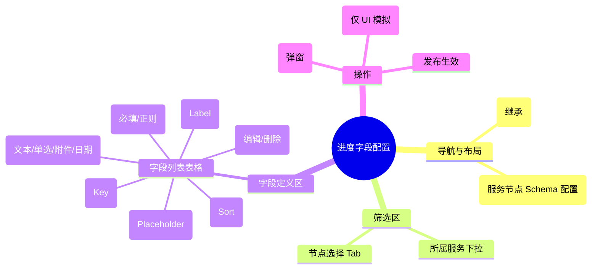

# 进度字段配置

## 0. 页面文档状态

- 文档版本：Release
- 生成日期：2026-05-13
- 来源文件：`product/release/product-sitemap-release.md`
- 页面ID：M-220
- 页面名称：进度字段配置
- 页面类型：列表与表单
- 所属 Surface：后台管理端
- 匹配 Layout：`product-layout-release-admin-web.md` (Layout Key: admin-web)
- 页面模板：TPL-001 (管理端列表页模板)

## 1. 页面目标与上下文

### 1.1 页面目标

- 页面目的：管理各服务类目下不同流程节点的表单字段模型（Data Schema），即定义用户在 U-521 页面需要提交的具体资料内容。
- 用户目标：通过可视化界面快速配置新服务的资料收集要求，无需修改前端代码。
- 业务目标：实现服务交付流程的灵活扩展，支持多种复杂的合规业务场景。
- 页面成功标准：配置结果在用户端 U-521 的实时渲染准确度。

### 1.2 页面入口与出口

| 类型 | 来源 / 去向 | 触发条件 | 传入 / 传出数据 | 备注 |
|---|---|---|---|---|
| 入口 | 后台工作台 (M-200) | 点击进度字段配置 | 无 |  |
| 出口 | 无 | - | - | 属于低频后台配置 |

### 1.3 角色与权限

| 角色 | 是否可访问 | 权限条件 | 不满足时页面表现 |
|---|---|---|---|
| 系统管理员 / 产品运营 | 是 | 流程配置权限 | 提示无权限 |

### 1.4 全局页面属性

| 属性 | 类型 | 来源 | 默认值 | 影响元素 / 状态 | 说明 |
|---|---|---|---|---|---|
| service_id | string | select | - | 数据过滤 | 选择具体的服务产品 |
| node_id | string | select | - | 数据加载 | 选择流程中的节点 |

## 2. 页面结构思维导图

## 3. 页面布局与内容区块

| 区块ID | 区块名称 | 区块类型 | 展示条件 | 包含元素ID | 布局 / 样式定义 | 数据来源 |
|---|---|---|---|---|---|---|
| S-001 | 服务与节点筛选 | header | 总是显示 | E-001, E-002 | 水平对齐 | API-001 |
| S-002 | 字段定义列表 | content | 已选择节点时 | E-003, E-004 | 响应式表格 | API-002 |
| S-003 | 表单预览模态 | modal | 点击预览时 | E-005 | 弹出层，模拟 U-521 UI 效果 | - |

## 4. 页面元素清单

| 元素ID | 元素名称 | 元素类型 | 所属区块 | 是否必需 | 展示条件 | 默认文案 / 内容 | 样式定义 | 数据绑定 |
|---|---|---|---|---|---|---|---|---|
| E-001 | 服务选择下拉 | select | S-001 | 是 | 总是显示 | 请选择服务 | - | service_id |
| E-002 | 节点切换 Tab | tab | S-001 | 是 | 已选服务 | - | 步进式 Tab | node_id |
| E-003 | 字段管理表格 | table | S-002 | 是 | 总是显示 | - | - | field_list |
| E-004 | 添加字段按钮 | button | S-002 | 是 | 已选节点 | + 添加字段 | 品牌色描边 | - |
| E-005 | 实时预览按钮 | button | S-002 | 否 | 字段数 > 0 | 预览用户端表单 | 弱样式 | - |
| E-006 | 保存发布按钮 | button | S-002 | 是 | 字段有变更 | 保存并发布 | 品牌色实色 | - |

## 5. 元素状态矩阵

| 元素ID | 状态 | 触发条件 | 状态来源 | 样式定义 | 可执行动作 | 禁止动作 | 提示文案 / 反馈 | 恢复条件 |
|---|---|---|---|---|---|---|---|---|
| E-003 | 拖拽排序 | 鼠标长按行 | sortable | 虚线边框 | 调整位置 | - | - | 放开鼠标 |
| E-006 | 禁用 | 未选择节点 | node_id == null | 置灰 | - | 点击 | 请先选择节点 | 选择节点 |

## 6. 交互 Action 与执行效果

| ActionID | 触发元素ID | 交互名称 | 用户动作 | 前置条件 | 校验规则 | 执行动作 | 成功结果 | 失败结果 | 页面跳转 / 状态变化 | 埋点事件ID | 埋点事件名称 | 不埋点原因 |
|---|---|---|---|---|---|---|---|---|---|---|---|---|
| ACT-001 | E-004 | 新增字段 | 点击 | - | - | 弹出配置弹窗 | - | - | - | - | - | 基础操作不埋点 |
| ACT-002 | E-006 | 发布配置 | 点击 | - | Schema 语法校验 | 调用发布 API (API-003) | 提示发布成功 | 校验报错 | 实时同步至 U-521 | EVT-002 | Schema 保存发布 | - |
| ACT-003 | E-005 | 开启预览 | 点击 | - | - | 弹出预览视图 | 展示 U-521 模拟效果 | - | - | - | - | 辅助功能不埋点 |

## 7. 埋点事件统计设计

### 7.1 埋点事件总表

| 埋点事件ID | 事件名称 | 事件类型 | 关联元素ID / ActionID | 触发时机 | 统计次数口径 | 去重规则 | 上报时机 | 关键属性 | 成功 / 失败归因 | 漏斗阶段 |
|---|---|---|---|---|---|---|---|---|---|---|
| EVT-001 | 字段配置页曝光 | page_view | - | 页面进入 | 每会话 1 次 | sessionId | 实时 | service_id | - | - |
| EVT-002 | 配置发布 | action | ACT-002 | 点击确认 | 每次触发 1 次 | - | 接口返回 | service_id, node_id | - | 系统更新 |

## 8. 数据结构与接口定义

### 8.1 页面数据模型

| 数据对象 | 字段 | 类型 | 必填 | 来源 | 默认值 | 使用位置 | 说明 |
|---|---|---|---|---|---|---|---|
| FieldDefinition | key | string | 是 | API | - | E-003 | 数据库对应字段 |
| FieldDefinition | type | enum | 是 | API | "text" | E-003 | input/select/upload/date |
| FieldDefinition | label | string | 是 | API | - | E-003 | 显示文本 |
| FieldDefinition | options | array | 否 | API | [] | E-003 | 仅针对 select 类型 |

### 8.2 接口清单

| API ID | 接口名称 | 方法 | 路径 | 触发 ActionID | 请求数据结构 | 返回数据结构 | 成功处理 | 失败处理 |
|---|---|---|---|---|---|---|---|---|
| API-001 | 获取服务与节点列表 | GET | /api/admin/config/services | 页面加载 | - | {service_tree} | 渲染筛选器 | - |
| API-002 | 获取节点字段定义 | GET | /api/admin/config/fields | 切换节点 | {service_id, node_id} | {FieldDefinition[]} | 渲染表格 | - |
| API-003 | 发布字段配置 | POST | /api/admin/config/fields-publish | ACT-002 | {service_id, node_id, schema} | {success} | 同步生效 | 错误提示 |

## 9. 边界状态与错误处理

| 场景ID | 场景类型 | 触发条件 | 页面表现 | 元素表现 | 用户可执行操作 | 系统处理 | 兜底文案 |
|---|---|---|---|---|---|---|---|
| EDGE-001 | 关键字段删除警告 | 删除已有数据的字段 | 弹窗强二次确认 | - | 确认删除/取消 | - | 警告：该字段已有用户提交数据，删除后将无法查看历史记录 |

## 10. 多媒体与资源

| 资源ID | 资源类型 | 使用位置 | 说明 |
|---|---|---|---|
| 无 | - | - | - |
