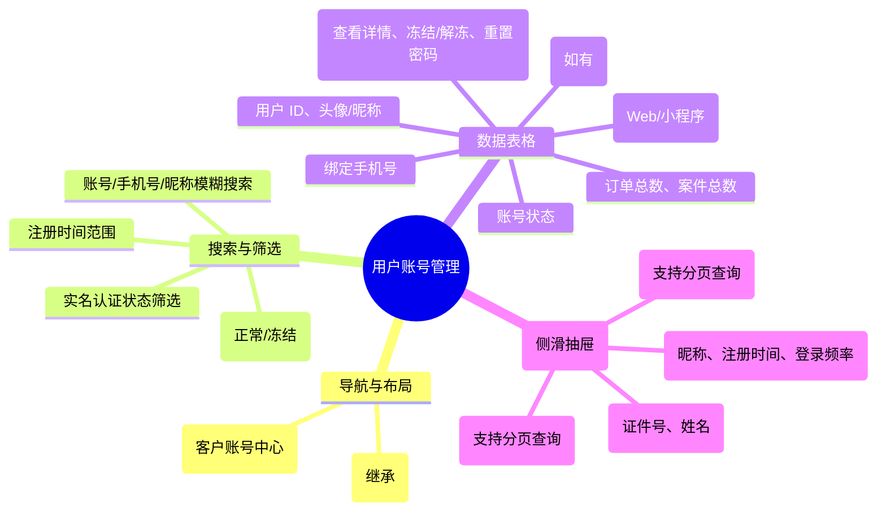

# 用户账号管理

## 0. 页面文档状态

- 文档版本：Release
- 生成日期：2026-05-13
- 来源文件：`product/release/product-sitemap-release.md`
- 页面ID：M-320
- 页面名称：用户账号管理
- 页面类型：列表
- 所属 Surface：后台管理端
- 匹配 Layout：`product-layout-release-admin-web.md` (Layout Key: admin-web)
- 页面模板：TPL-001 (管理端列表页模板)

## 1. 页面目标与上下文

### 1.1 页面目标

- 页面目的：提供对外部注册客户账号的全面管理，包括账户状态控制、基本信息查询及安全重置。
- 用户目标：帮助管理员在客户反馈账号异常（如无法登录、被盗）时进行核查与重置，或对违规账号进行冻结。
- 业务目标：维护用户体系的安全合规，支持客服进行账号相关的基础售后。
- 页面成功标准：账号异常反馈的处理时效。

### 1.2 页面入口与出口

| 类型 | 来源 / 去向 | 触发条件 | 传入 / 传出数据 | 备注 |
|---|---|---|---|---|
| 入口 | 账号管理首页 (M-300) | 点击“客户账号管理” | 无 |  |
| 出口 | 客户详情抽屉 | 点击“查看” | 用户 ID |  |

### 1.3 角色与权限

| 角色 | 是否可访问 | 权限条件 | 不满足时页面表现 |
|---|---|---|---|
| 管理员 / 客服 | 是 | 用户管理权限 | 提示无权限 |

### 1.4 全局页面属性

| 属性 | 类型 | 来源 | 默认值 | 影响元素 / 状态 | 说明 |
|---|---|---|---|---|---|
| filter_auth_status | enum | select | "all" | 列表数据 | 未实名 / 已实名 / 认证中 |

## 2. 页面结构思维导图

## 3. 页面布局与内容区块

| 区块ID | 区块名称 | 区块类型 | 展示条件 | 包含元素ID | 布局 / 样式定义 | 数据来源 |
|---|---|---|---|---|---|---|
| S-001 | 组合检索工具栏 | header | 总是显示 | E-001, E-002 | 多条件水平排列 | - |
| S-002 | 用户数据表格 | content | 总是显示 | E-003, E-004 | 标准中台表格 | API-001 |
| S-003 | 用户详情抽屉 | drawer | 点击查看时 | E-005 | 侧滑展示全量信息，含内嵌列表 | API-002 |

## 4. 页面元素清单

| 元素ID | 元素名称 | 元素类型 | 所属区块 | 是否必需 | 展示条件 | 默认文案 / 内容 | 样式定义 | 数据绑定 |
|---|---|---|---|---|---|---|---|---|
| E-001 | 模糊搜索框 | input | S-001 | 是 | 总是显示 | 搜索昵称/手机号 | - | search_key |
| E-002 | 实名状态筛选 | select | S-001 | 是 | 总是显示 | 全部实名状态 | - | auth_status |
| E-003 | 用户列表表格 | table | S-002 | 是 | 有数据 | - | - | user_list |
| E-004 | 状态管理开关 | switch | S-002 | 是 | 总是显示 | - | - | item.status |
| E-005 | 全量画像视图 | list | S-003 | 是 | 抽屉开启 | - | 包含完整的订单、案件滚动列表 | user_detail |

## 5. 元素状态矩阵

| 元素ID | 状态 | 触发条件 | 状态来源 | 样式定义 | 可执行动作 | 禁止动作 | 提示文案 / 反馈 | 恢复条件 |
|---|---|---|---|---|---|---|---|---|
| E-004 | 处理中 | 点击切换时 | - | loading | - | 重复点击 | 正在变更状态... | 接口成功 |
| E-003 | 实名标记 | is_auth=true | item.is_auth | 绿色徽标 | - | - | 已实名 | - |

## 6. 交互 Action 与执行效果

| ActionID | 触发元素ID | 交互名称 | 用户动作 | 前置条件 | 校验规则 | 执行动作 | 成功结果 | 失败结果 | 页面跳转 / 状态变化 | 埋点事件ID | 埋点事件名称 | 不埋点原因 |
|---|---|---|---|---|---|---|---|---|---|---|---|---|
| ACT-001 | E-003 | 查看详情 | 点击“查看” | - | - | 开启抽屉并调接口 | 抽屉展示数据 | 错误提示 | - | EVT-002 | 用户详情查看 | - |
| ACT-002 | E-004 | 冻结/解冻 | 点击开关 | - | 二次确认弹窗 | 调用状态接口 | 状态更新并提示 | - | - | EVT-003 | 用户状态变更 | - |

## 7. 埋点事件统计设计

### 7.1 埋点事件总表

| 埋点事件ID | 事件名称 | 事件类型 | 关联元素ID / ActionID | 触发时机 | 统计次数口径 | 去重规则 | 上报时机 | 关键属性 | 成功 / 失败归因 | 漏斗阶段 |
|---|---|---|---|---|---|---|---|---|---|---|
| EVT-001 | 用户管理页曝光 | page_view | - | 页面进入 | 每会话 1 次 | sessionId | 实时 | total_count | - | - |
| EVT-002 | 详情查看点击 | click | E-003 | 点击查看 | 每次触发 1 次 | - | 实时 | user_id | - | 客户分析 |
| EVT-003 | 冻结操作行为 | action | ACT-002 | 确认冻结 | 每次触发 1 次 | - | 实时 | user_id, action_type | - | 风险管控 |

## 8. 数据结构与接口定义

### 8.1 页面数据模型

| 数据对象 | 字段 | 类型 | 必填 | 来源 | 默认值 | 使用位置 | 说明 |
|---|---|---|---|---|---|---|---|
| UserItem | id | string | 是 | API | - | - |  |
| UserItem | mobile | string | 是 | API | - | E-003 |  |
| UserItem | nickname | string | 是 | API | - | E-003 |  |
| UserItem | status | boolean | 是 | API | true | E-004 |  |
| UserItem | order_count | number | 是 | API | 0 | E-003 |  |

### 8.2 接口清单

| API ID | 接口名称 | 方法 | 路径 | 触发 ActionID | 请求数据结构 | 返回数据结构 | 成功处理 | 失败处理 |
|---|---|---|---|---|---|---|---|---|
| API-001 | 获取用户列表 | GET | /api/admin/users/list | 页面加载 | {page, limit, auth_status, search} | {list, total} | 渲染表格 | - |
| API-002 | 获取用户全量画像 | GET | /api/admin/users/detail | ACT-001 | {user_id} | {UserDetail} | 渲染抽屉 | - |
| API-003 | 获取用户关联数据 | GET | /api/admin/users/sub-list | 抽屉内翻页 | {user_id, type, page} | {list, total} | 渲染内嵌列表 | - |

## 9. 边界状态与错误处理

| 场景ID | 场景类型 | 触发条件 | 页面表现 | 元素表现 | 用户可执行操作 | 系统处理 | 兜底文案 |
|---|---|---|---|---|---|---|---|
| EDGE-001 | 重置密码提醒 | 管理员触发重置 | 弹窗展示新密码 | - | 复制并告知客户 | - | 密码重置成功，新密码为：{pwd} |

## 10. 多媒体与资源

| 资源ID | 资源类型 | 使用位置 | 说明 |
|---|---|---|---|
| 无 | - | - | - |
