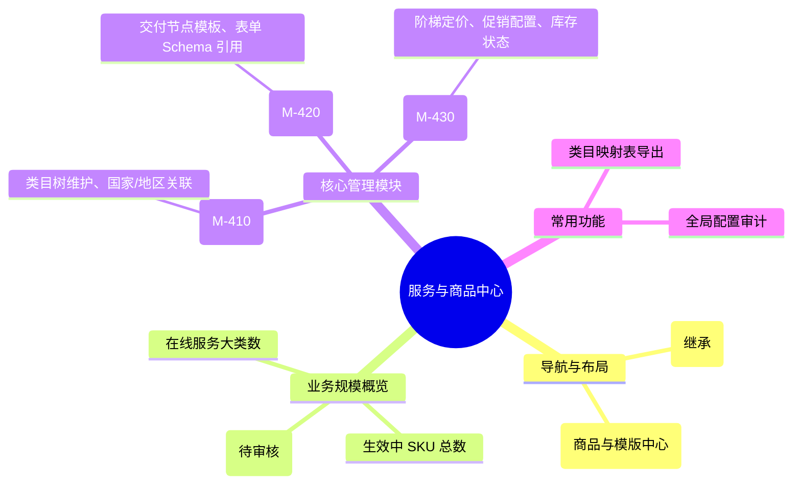

# 服务与商品中心

## 0. 页面文档状态

- 文档版本：Release
- 生成日期：2026-05-13
- 来源文件：`product/release/product-sitemap-release.md`
- 页面ID：M-400
- 页面名称：服务与商品中心
- 页面类型：首页
- 所属 Surface：后台管理端
- 匹配 Layout：`product-layout-release-admin-web.md` (Layout Key: admin-web)
- 页面模板：TPL-005 (管理端工作台/中心页模板)

## 1. 页面目标与上下文

### 1.1 页面目标

- 页面目的：作为平台所有合规服务（商标、专利、合规等）及对应商品 SKU 的管理总枢纽。
- 用户目标：查看当前在线服务类目的覆盖情况，管理服务模板的复用性，并导航至具体的 SKU 价格配置。
- 业务目标：支撑平台业务的快速上新与调价，确保前台服务目录的准确性。
- 页面成功标准：服务上新/调价操作的平均耗时。

### 1.2 页面入口与出口

| 类型 | 来源 / 去向 | 触发条件 | 传入 / 传出数据 | 备注 |
|---|---|---|---|---|
| 入口 | 侧边导航 | 点击“服务与商品” | 无 |  |
| 出口 | 服务目录配置 (M-410) | 点击“目录管理” | 无 |  |
| 出口 | 服务模板编辑器 (M-420) | 点击“模板管理” | 无 |  |
| 出口 | SKU 与定价管理 (M-430) | 点击“定价中心” | 无 |  |

### 1.3 角色与权限

| 角色 | 是否可访问 | 权限条件 | 不满足时页面表现 |
|---|---|---|---|
| 运营管理员 | 是 | 商品管理权限 | 提示无权限 |

### 1.4 全局页面属性

| 属性 | 类型 | 来源 | 默认值 | 影响元素 / 状态 | 说明 |
|---|---|---|---|---|---|
| service_stats | object | API | - | 展示统计数字 |  |

## 2. 页面结构思维导图

## 3. 页面布局与内容区块

| 区块ID | 区块名称 | 区块类型 | 展示条件 | 包含元素ID | 布局 / 样式定义 | 数据来源 |
|---|---|---|---|---|---|---|
| S-001 | 商品运营看板 | header | 总是显示 | E-001 | 3 列统计卡片 | API-001 |
| S-002 | 管理矩阵导航 | content | 总是显示 | E-002, E-003, E-004 | 宫格大卡片 | - |
| S-003 | 最近变更流水 | footer | 总是显示 | E-005 | 简易列表 | API-002 |

## 4. 页面元素清单

| 元素ID | 元素名称 | 元素类型 | 所属区块 | 是否必需 | 展示条件 | 默认文案 / 内容 | 样式定义 | 数据绑定 |
|---|---|---|---|---|---|---|---|---|
| E-001 | 商品规模统计 | list | S-001 | 是 | 总是显示 | 在线服务: {n} ... | 商务绿色 | service_stats |
| E-002 | 目录配置入口 | card | S-002 | 是 | 总是显示 | 服务目录配置 | 图标+描述 | - |
| E-003 | 模板管理入口 | card | S-002 | 是 | 总是显示 | 服务模板管理 | 图标+描述 | - |
| E-004 | 定价中心入口 | card | S-002 | 是 | 总是显示 | SKU 与定价中心 | 图标+描述 | - |
| E-005 | 最近配置变更 | table | S-003 | 是 | 总是显示 | - | 紧凑型列表 | update_logs |

## 5. 元素状态矩阵

| 元素ID | 状态 | 触发条件 | 状态来源 | 样式定义 | 可执行动作 | 禁止动作 | 提示文案 / 反馈 | 恢复条件 |
|---|---|---|---|---|---|---|---|---|
| E-002 | 激活态 | 鼠标悬浮 | - | 边框高亮 | 点击跳转 | - | - | 移出 |

## 6. 交互 Action 与执行效果

| ActionID | 触发元素ID | 交互名称 | 用户动作 | 前置条件 | 校验规则 | 执行动作 | 成功结果 | 失败结果 | 页面跳转 / 状态变化 | 埋点事件ID | 埋点事件名称 | 不埋点原因 |
|---|---|---|---|---|---|---|---|---|---|---|---|---|
| ACT-001 | E-002 | 跳转目录配置 | 点击 | - | - | 导航 | - | - | 跳转 M-410 | - | - | 基础跳转 |
| ACT-002 | E-003 | 跳转模板管理 | 点击 | - | - | 导航 | - | - | 跳转 M-420 | - | - | 基础跳转 |
| ACT-003 | E-004 | 跳转定价中心 | 点击 | - | - | 导航 | - | - | 跳转 M-430 | - | - | 基础跳转 |

## 7. 埋点事件统计设计

### 7.1 埋点事件总表

| 埋点事件ID | 事件名称 | 事件类型 | 关联元素ID / ActionID | 触发时机 | 统计次数口径 | 去重规则 | 上报时机 | 关键属性 | 成功 / 失败归因 | 漏斗阶段 |
|---|---|---|---|---|---|---|---|---|---|---|
| EVT-001 | 服务管理首页曝光 | page_view | - | 页面进入 | 每会话 1 次 | sessionId | 实时 | total_sku_count | - | - |

## 8. 数据结构与接口定义

### 8.1 页面数据模型

| 数据对象 | 字段 | 类型 | 必填 | 来源 | 默认值 | 使用位置 | 说明 |
|---|---|---|---|---|---|---|---|
| ServiceSummary | catalog_count | number | 是 | API | 0 | E-001 |  |
| ServiceSummary | sku_online_count | number | 是 | API | 0 | E-001 |  |
| ServiceSummary | template_count | number | 是 | API | 0 | E-001 |  |

### 8.2 接口清单

| API ID | 接口名称 | 方法 | 路径 | 触发 ActionID | 请求数据结构 | 返回数据结构 | 成功处理 | 失败处理 |
|---|---|---|---|---|---|---|---|---|
| API-001 | 获取商品中心概览 | GET | /api/admin/services/summary | 页面加载 | - | {ServiceSummary} | 渲染看板 | - |

## 9. 边界状态与错误处理

| 场景ID | 场景类型 | 触发条件 | 页面表现 | 元素表现 | 用户可执行操作 | 系统处理 | 兜底文案 |
|---|---|---|---|---|---|---|---|
| EDGE-001 | 数据加载失败 | 接口超时 | 展示重试占位图 | - | 点击重试 | - | 服务统计数据加载失败 |

## 10. 多媒体与资源

| 资源ID | 资源类型 | 使用位置 | 说明 |
|---|---|---|---|
| M-001 | icon | S-002 | 目录、模板、SKU 对应图标 |
